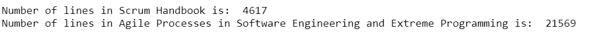
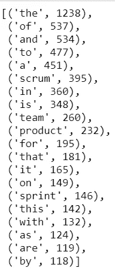
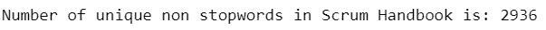
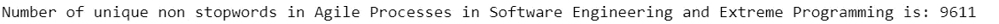
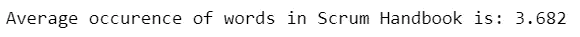
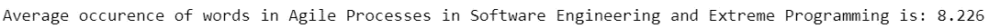
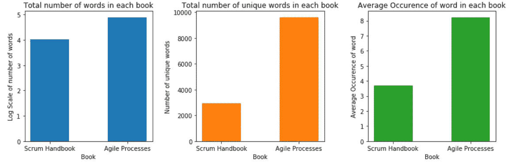
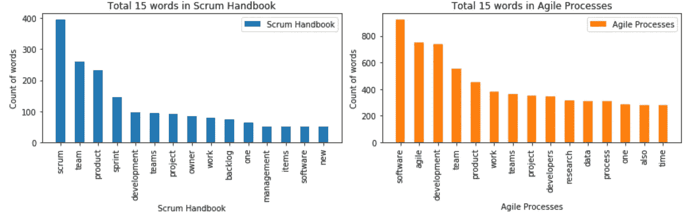

# 用 Pyspark 分析 Scrum 和敏捷的区别

> 原文：<https://towardsdatascience.com/analysing-difference-between-scrum-agile-using-pyspark-c2fc4405217d?source=collection_archive---------56----------------------->


由 [Kelly Sikkema](https://unsplash.com/@kellysikkema?utm_source=medium&utm_medium=referral) 在 [Unsplash](https://unsplash.com?utm_source=medium&utm_medium=referral) 上拍摄的照片

Scrum 和 Agile 是两种现代软件开发方法，大多数科技公司一直在使用这些框架来开发或维护软件应用程序。那么这两者到底有什么区别呢？只需谷歌搜索，你可能会看到大量比较两者差异的文章，但如果我们尝试使用数据科学方法来发现差异，会怎么样呢？

# 资料组

那么我们从哪里开始呢？在这两个框架引起科技公司的注意之前，人们已经写了很多关于这两个框架的书，让我们来分析一下这些书吧！这是我们将要分析的两本书:

*   软件工程和极限编程中的敏捷过程
*   Scrum 手册(杰夫·萨瑟兰)

# 正在初始化 Pyspark

Pyspark 是向 Python 公开 spark 编程模型的 Spark Python API。Sparkcontext 是 Spark 功能的主要入口点，它将在我们启动一个新应用程序时创建。这个 sparkcontext 向 master 请求一些内核来进行处理，这些内核将被搁置起来，不会用于其他应用程序。

我们将首先从 pyspark 创建一个 SparkContext `sc`，通过设置`master = local[*]`使用机器上所有可用的内核。然后，我们使用 SparkConf 对象中设置的配置创建 SparkContext 对象中提供的 SparkSession 对象`spark`。

```
# create entry points to spark
from pyspark import SparkContext, SparkConf # Spark
from pyspark.sql import SparkSession # Spark SQL# create or use existing spark context
sc = SparkContext.getOrCreate()# If there is no existing spark context, we now create a new context using all local processors
if (sc is None):
    sc = SparkContext(master="local[*]", appName="Agile Scrum comparison")
spark = SparkSession(sparkContext=sc)
```

# 创建弹性分布式数据集(rdd)

弹性分布式数据集(RDDs)是 Spark 的基本数据结构，我们将为集群上的每本书创建两个。

```
# read in first txt file
scrum_txt = sc.textFile('./Scrum Handbook.txt')
# print number of lines
print("Number of lines in Scrum Handbook is: ", str(scrum_txt.count()))# read in second txt file
agile_txt = sc.textFile('./Agile Processes  in Software Engineering  and Extreme Programming.txt')
# print number of lines
print("Number of lines in Agile Processes in Software Engineering and Extreme Programming is: ",\
      str(agile_txt.count()))
```



我们看到软件工程和极限编程中的*敏捷过程*有 **21569** 行，大约是有 **4617** 行的 *Scrum 手册*的 5 倍。

# 数据清理

在此步骤中，我们执行以下文本清理和操作步骤:

1.  使用`split`和`flatMap`将这些行拆分成单个单词(即，标记化)
2.  使用正则表达式`[A-Za-z\s]`删除除空格以外的所有非字母字符
3.  使用`lower`和`map`将所有单词转换成小写
4.  使用`strip`和`map`删除所有前导或尾随空格

```
# import re for regular expression
import re# function to do the 3 text cleaning and manipulating steps
def cleantext(rdd):
    # split the lines into individual words
    words = rdd.flatMap(lambda x: x.split(' '))
    # remove all characters which are not alphabets except spaces
    alpha_words = words.filter(lambda x: re.findall('[A-Za-z\s]+',x))
    # replace all characters which are not alphabets or spaces with ''
    alpha_words_cleaned = alpha_words.map(lambda x: re.sub('[^A-Za-z\s]+','',x))
    # change all to lower case
    lower_alpha_words = alpha_words_cleaned.map(lambda x: x.lower())
    # remove all leading or trailing spaces
    cleaned_words = lower_alpha_words.map(lambda x: x.strip())
    # return the result
    return cleaned_words# apply cleantext function to scrum_txt 
scrum_txt_cleaned = cleantext(scrum_txt)# apply cleantext function to agile_txt 
agile_txt_cleaned = cleantext(agile_txt)
```

# 数数单词

在这一步中，我们执行一个转换步骤，首先使用`map`为每个值为 1 的单词创建一个单词对，然后使用`reduceByKey`对每个单词的频率求和。然后我们使用带有选项`-1`的`sortBy`按照单词出现的频率对单词进行排序，以表示降序。

```
# function to transform the data and count the words
def count_words(rdd):
    # transformation to convert each word to a key/value pair of (word, 1)
    pairs = rdd.map(lambda x: (x,1))
    # transformation to sum the frequency of each word
    word_count = pairs.reduceByKey(lambda x,y: x+y)
    # sort the words by frequency in descending order
    sorted_word_count = word_count.sortBy(lambda x: -x[1])
    # output
    return sorted_word_count
```

我们将`count_word`应用于 Scrum，并使用`take(20)`显示前 20 个最常用的单词

```
# apply count_words function to scrum_txt_cleaned and display top 20 most frequent words
scrum_txt_wordcount = count_words(scrum_txt_cleaned)
scrum_txt_wordcount.take(20)
```



我们将`count_word`应用于敏捷，并使用`take(20)`显示前 20 个最常用的单词

```
# apply count_words function to agile_txt_cleaned and display top 20 most frequent words
agile_txt_wordcount = count_words(agile_txt_cleaned)
agile_txt_wordcount.take(20)
```


根据每本书中的频率比较前 20 个词，它们大多是停用词，如 **the，of 和**。我们应该在下一步中删除它，以便更好地分析书籍。

# 删除停用词

在计算中，停用词是在处理自然语言数据之前或之后过滤掉的词。在自然语言处理中，无用词(数据)被称为停用词，它在文本分析中几乎不提供上下文。我们将从`nltk.corpus`包中获取停用词列表，并使用函数`filter`删除两本书中的停用词。最后，我们显示每本书中独特单词的数量。

```
# import nltk package and stopwords
import nltk
from nltk.corpus import stopwords
# get the english stopwords since there are 16 languages available
eng_stopwords = set(stopwords.words('english'))# filter off those words in scrum_txt_wordcount that are in eng_stopwords list
scrum_txt_no_stopwords = scrum_txt_wordcount.filter(lambda x: x[0] not in eng_stopwords)
# get the number of unique words of each text after removal of stopwords
print("Number of unique non stopwords in Scrum Handbook is:",str(scrum_txt_no_stopwords.count()))
```



```
# filter off those words in agile_txt_wordcount that are in eng_stopwords list
agile_txt_no_stopwords = agile_txt_wordcount.filter(lambda x: x[0] not in eng_stopwords)
# get the number of unique words of each text after removal of stopwords
print("Number of unique non stopwords in Agile Processes in Software Engineering and Extreme Programming is:",\
      str(agile_txt_no_stopwords.count()))
```



# 一个词的平均出现次数

在这一步，我们先用`sum`和`map`求出每本书的总字数，然后用这个值除以唯一字的数量，从而求出一个字的平均出现次数。

```
# get total number of words in scrum_txt_no_stopwords
total_scrum_words = scrum_txt_no_stopwords.map(lambda x: x[1]).sum()
# find avg occurence of the words and return result in 3 decimal place
print("Average occurence of words in Scrum Handbook is:",\
      round(total_scrum_words/scrum_txt_no_stopwords.count(),3))
```



```
# get total number of words in agile_txt_no_stopwords
total_agile_words = agile_txt_no_stopwords.map(lambda x: x[1]).sum()
# find avg occurence of the words and return result in 3 decimal place
print("Average occurence of words in Agile Processes in Software Engineering and Extreme Programming is:",\
      round(total_agile_words/agile_txt_no_stopwords.count(),3))
```



# 单词分布

我们可以使用可视化`matplotlib.pyplot`来分析单词的分布，方法是绘制每本书中的单词总数，然后绘制每本书中单词的平均出现次数。

```
# import the standard python plotting library and numpy for easy data manipulation
import matplotlib.pyplot as plt
import numpy as np
import math
# to show plot in jupyter notebook
%matplotlib inline# create three subplots
f, (ax1, ax2, ax3) = plt.subplots(1, 3, figsize=(12,4), tight_layout=True)# Plot 1 - Total number of words
# prepare the data
y_axis_1 = [math.log10(total_scrum_words), math.log10(total_agile_words)]
x_axis = ('Scrum Handbook', 'Agile Processes')
bar_width = 0.5
# plot
ax1.bar(x_axis, y_axis_1, bar_width, align='center', color='C0')
ax1.set_xlabel('Book')
ax1.set_ylabel('Log Scale of number of words')
ax1.set_title('Total number of words in each book')# Plot 2 - Total number of unique words
# prepare the data
y_axis_2 = [scrum_txt_no_stopwords.count(), agile_txt_no_stopwords.count()]
x_axis = ('Scrum Handbook', 'Agile Processes')
bar_width = 0.5
# plot
ax2.bar(x_axis, y_axis_2, bar_width, align='center', color='C1')
ax2.set_xlabel('Book')
ax2.set_ylabel('Number of unique words')
ax2.set_title('Total number of unique words in each book')# Plot 3 -Average Occurence of word
# prepare the data
y_axis_3 = [total_scrum_words/scrum_txt_no_stopwords.count(), total_agile_words/agile_txt_no_stopwords.count()]
bar_width = 0.5
# plot
ax3.bar(x_axis, y_axis_3, bar_width, align='center', color='C2')
ax3.set_xlabel('Book')
ax3.set_ylabel('Average Occurence of word')
ax3.set_title('Average Occurence of word in each book')plt.show()
```



作者图片— matplotlib 绘制单词分布图

从图中可以清楚地看出,*软件工程和极限编程中的敏捷过程*是一本比 *Scrum 手册*更长的书，在去除了停用词和文本处理之后，在 log10 的标度上有 **1.25** 倍多的单词， **3** 倍多的独特单词，并且前者中的每个单词比后者出现**两次**多。

# 最常见的单词

现在让我们比较一下每本书中最常见的 15 个单词。

```
# create two subplots
f, (ax1, ax2) = plt.subplots(1, 2, figsize=(12,4), tight_layout=True)# Plot 1 - Top 15 of scrum handbook
# prepare the data
top15_scrum_word = scrum_txt_no_stopwords.map(lambda x: x[0])
top15_scrum_word = top15_scrum_word.take(15)
top15_scrum_value = scrum_txt_no_stopwords.map(lambda x: x[1])
top15_scrum_value = top15_scrum_value.take(15)
# plot
bar_width = 0.5
ax1.bar(top15_scrum_word, top15_scrum_value, bar_width, align='center', color='C0',label='Scrum Handbook')
plt.setp(ax1.get_xticklabels(), rotation=90)
ax1.set_xlabel('Scrum Handbook')
ax1.set_ylabel('Count of words')
ax1.set_title('Total 15 words in Scrum Handbook')
ax1.legend()# Plot 2 - Top 15 of agile processes
# prepare the data
top15_agile_word = agile_txt_no_stopwords.map(lambda x: x[0])
top15_agile_word = top15_agile_word.take(15)
top15_agile_value = agile_txt_no_stopwords.map(lambda x: x[1])
top15_agile_value = top15_agile_value.take(15)
# plot
bar_width = 0.5
ax2.bar(top15_agile_word, top15_agile_value, bar_width, align='center', color='C1',label='Agile Processes')
plt.setp(ax2.get_xticklabels(), rotation=90)
ax2.set_xlabel('Agile Processes')
ax2.set_ylabel('Count of words')
ax2.set_title('Total 15 words in Agile Processes')
ax2.legend()plt.show()
```



按作者分类的图像— matplotlib 在最常用的单词上绘图

对比两本书的前 15 名，两本书的内容非常相似，都围绕着**产品**、**团队**、**开发**和**软件**。

# 摘要

基于这篇我在 Google 上找到的关于敏捷和 Scrum 的区别的文章，敏捷是一种项目管理哲学，它利用了一套核心的价值观或原则，而 Scrum 是一种特定的敏捷方法，用于促进项目。

基于我们对这两本书的分析，我们发现了一个相似的发现，即 *Scrum Handbook* 关注团队开发，这是项目经理促进项目的一种方式，而*软件工程和极限编程中的敏捷过程*更关注一般的软件开发。

这就对了，希望这种数据分析方法可以给你另一个角度来比较差异，而不是依赖我们最可靠的合作伙伴，谷歌！

[](https://www.buymeacoffee.com/tankahwang)