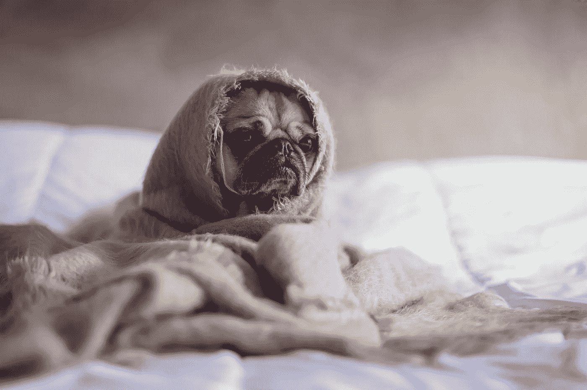
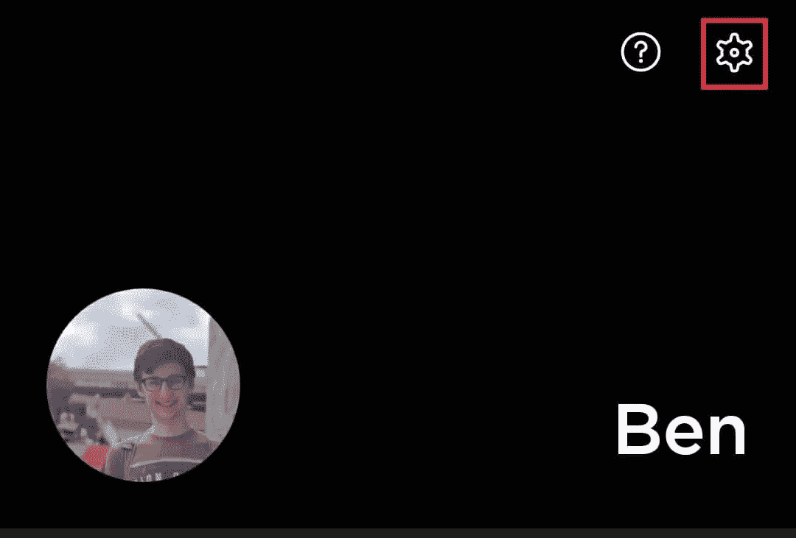
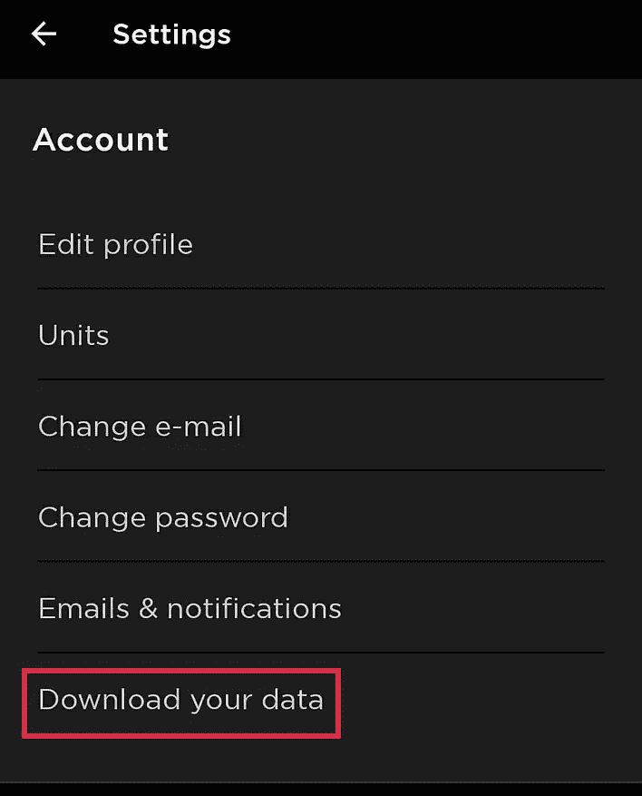
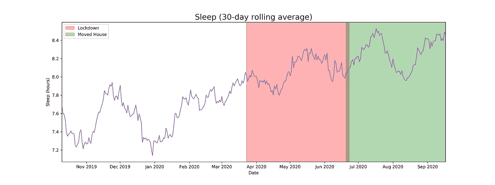
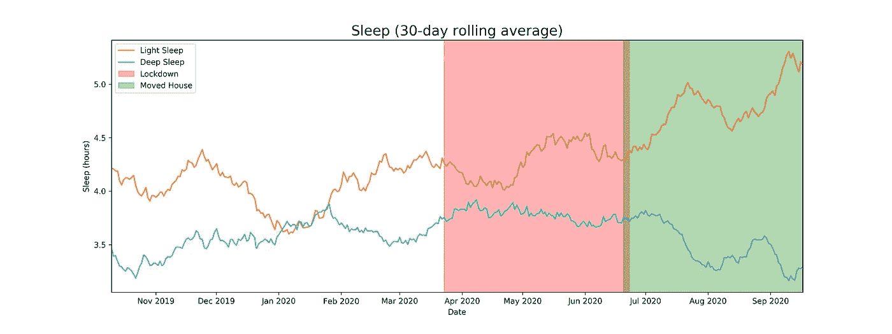
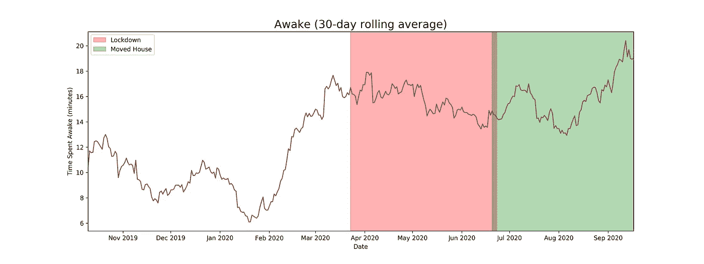

# 分析我的锁定睡眠数据

> 原文：<https://towardsdatascience.com/analysing-my-lockdown-sleep-data-3480a0cff6b7?source=collection_archive---------48----------------------->

## 过去的几个月对我们大多数人来说都是动荡不安的时期，不管是以这样还是那样的形式，但是我们的睡眠是变好了还是变坏了呢？

[马太·亨利](https://unsplash.com/@matthewhenry?utm_source=unsplash&utm_medium=referral&utm_content=creditCopyText)在 [Unsplash](https://unsplash.com/?utm_source=unsplash&utm_medium=referral&utm_content=creditCopyText) 上拍照

过去的几个月对我们大多数人来说都是一段动荡的时期，无论形式如何。无论这种动荡是来自生活方式的彻底改变，还是更简单的事情，比如与你的公寓“伙伴们”全天候关在一起。

就我个人而言，我经历过:

*   完全可变的工作时间表
*   由于搬家，完全不同的社会环境
*   对当前和未来计划的新看法

因此，我问自己的一个问题是，这种生活方式的改变在多大程度上改变了影响我健康的关键因素:睡眠、锻炼和饮食。不幸的是，我还没有记录任何关于我饮食的数据，然而，我很幸运地在去年 9 月投资了一个[健康穿戴设备](https://www.withings.com/uk/en/withings-move)，允许我访问我在锁定前、锁定后和锁定中的睡眠和运动数据。以下是我的发现…

## 一年的睡眠数据

几周前，我在健身应用程序的设置中翻找，该应用程序允许我检查我的睡眠和健身数据(通过我的手表检测的运动来跟踪)，我注意到了以下选项:

[Withings](https://www.withings.com/uk/en/) [健康伴侣应用](https://www.withings.com/uk/en/health-mate) —截图

一个下载按钮！

在意识到我可以请求方便的 CSV 文件，包含我的数据的简化视图后，我知道我必须这样做。这将允许我执行任何我希望的分析，消除应用程序的所有限制(即，现在我可以比较更长时间内的数据，而不是滚动查看每周的平均值)。

通过少量的 Python 代码，我现在有能力可视化一整年的健康数据。想到的第一个分析指标是什么？每晚总睡眠时间。

因此，为了避免看到不可读、参差不齐的混乱，我选择了 30 天滚动平均值，加上一些颜色，瞧:

作者图片

很高兴看到我每晚的平均睡眠时间持续超过 7 小时。除此之外，随着国家进入封锁期，我们可以看到总睡眠时间明显增加，在我搬家后，这种情况还会继续(如果不是又一次增加的话)。

表面上看，这很棒。但是我们至少应该带着一些怀疑的态度来看待它(也许你已经是了)。更多的睡眠不一定意味着更好的睡眠。有趣的是，我们可以深入研究，看看睡眠是如何分为浅睡眠和深睡眠的:

作者图片

没想到啊！随着我的总睡眠时间在禁闭期间开始增加，深度睡眠没有明显的变化；但是，当我们进入八月时，价格明显下降。今年年初，我的浅睡和深睡比例接近 50:50(这实际上是标准应用程序指标所建议的)，但当我进入一个新环境和新房子时，一个非常明显的差异出现了。

最后，我的手表还测量我晚上醒着的时间:

作者图片

另一个有趣的情节是，由于在任何特定点的总清醒时间从来没有那么高(谢天谢地)，然而，随着我们从 2 月到 3 月，以及最终的锁定，仍然有明显的增加。也许是新冠肺炎时代前后矛盾的结果？

这就是我们对睡眠的长达一年的回顾，涵盖了全球疫情、全国禁闭和本地重新安置。总结一下:

*   当我们进入一级防范禁闭状态时，我的总平均睡眠时间似乎增加了，在我搬家后又增加了。
*   尽管浅睡眠遵循相似的趋势，但深睡眠看起来是负相关的。
*   在一月份，我的浅度睡眠和深度睡眠的平均时间大致相等，但是最近，在一级防范禁闭后，这种情况迅速逆转。
*   我醒着的时间也越来越长。这不是一个好的趋势，尽管实际金额仍然相对较低。

我对未来的最后想法是:

*   饮食也是分析封锁前/后/中期变化的有趣领域。感觉好像我已经养成了一些新习惯。特别是重复相同的食物组合。
*   想知道我在数据中发现的趋势对大多数人来说是否是共同的，这将是一件有趣的事情。或者其他人在禁闭期间有过相反的经历？
*   总的来说，这些实验提供了非常有用的见解，我愿意继续实验。具体来说，如果锁定导致我的总睡眠时间增加，但我的睡眠质量下降，那么可以隔离导致这些影响的锁定组件，从而使它们可以在锁定之外帮助增加睡眠和睡眠质量吗..？

> 如果您喜欢这篇文章，您可能也会喜欢我在锁定期间对我的活动数据所做的类似分析🏃🏼‍♂️即将上映…