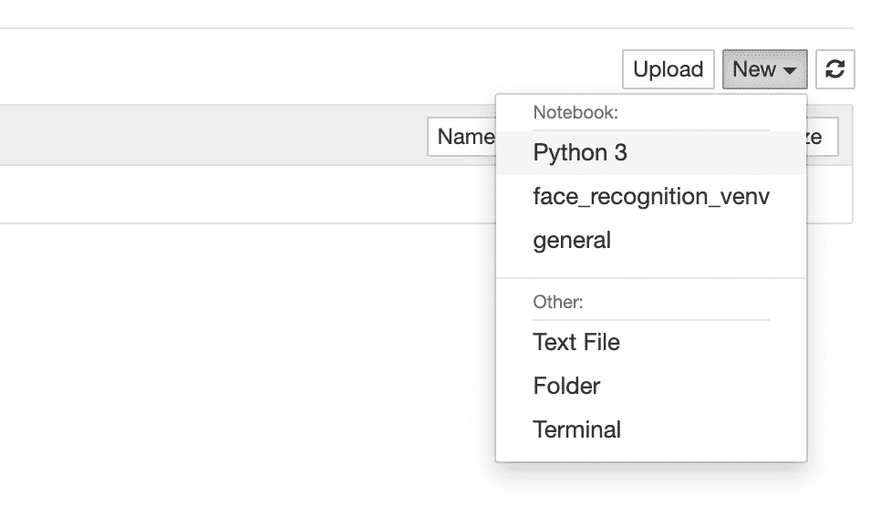

# 用 Python 分析药品销售数据

> 原文：<https://towardsdatascience.com/analysing-pharmaceutical-sales-data-in-python-6ce74da818ab?source=collection_archive---------23----------------------->

## 如何使用 Python、Pandas、Matplotlib 和回归模型分析药品销售数据


[斯科特·格雷厄姆](https://unsplash.com/@sctgrhm?utm_source=medium&utm_medium=referral)在 [Unsplash](https://unsplash.com?utm_source=medium&utm_medium=referral) 上拍照

# 介绍

这个项目的目的是分析药品销售数据。分析销售数据并根据历史数据预测未来销售是一项非常常见的数据科学任务。这是开始研究数据科学的好方法。

# 你会学到什么？

在本项目中，您将学习将数据集从文本文件加载到 Pandas，这是最流行的数据操作和数据分析 Python 库，并在不同的销售数据集中查找特定信息，如特定药物最常何时销售。除此之外，我们还将根据现有数据，使用线性回归、多项式回归和简单向量回归来预测未来的销售额。我们将做一些数据预处理和标准化。为了获得更好的结果，我们还将学习一种重要而有用的数据科学技术——集成学习。

您还将学习如何使用 Matplotlib 测试模型和绘制结果。

让我们开始吧。

# 问题定义

以下是我们将在本练习中回答的具体问题:

1.  第二种药物(M01AE)最常在一周的哪一天售出？
2.  2015 年 1 月，2016 年 7 月，2017 年 9 月哪三种药销量最高？
3.  2017 年周一哪种药卖得最多？
4.  2020 年 1 月可能有哪些药品销售？(我们的数据集仅包含 2014 年 1 月至 2019 年 10 月的销售信息)

# 逐步解决方案

## **创建项目文件夹**

在电脑上为一个名为“分析-制药-销售-数据”的项目创建一个文件夹

## **从这个 Kaggle 项目下载数据集:**

[https://www.kaggle.com/milanzdravkovic/pharma-sales-data](https://www.kaggle.com/milanzdravkovic/pharma-sales-data)

将这些数据集放在项目文件夹中名为“data”的文件夹中。

> 如果你从未在电脑上使用过 Python 或 Jupyter Notebook，请阅读我的文章[如何为数据科学设置你的电脑](https://medium.com/@pjarz/how-to-set-up-your-computer-for-data-science-9b880118ead)以检查你是否拥有在电脑上运行以下分析所需的一切。

## **开始新的笔记本**

在终端/命令提示符下键入命令，启动 Jupyter Notebook:

```
$ jupyter notebook
```

点击右上角的新建，选择 Python 3。



作者图片

这将在您的浏览器中打开一个新的 Jupyter 笔记本。将未命名的项目名称重命名为您的项目名称，您就可以开始了。


作者图片

如果您的计算机上安装了 Anaconda，那么您的计算机上已经安装了这个项目所需的所有库。

如果你用的是 Google Colab，打开一个新的笔记本。

## **加载库和设置**

在新笔记本中，我们通常做的第一件事是添加我们在项目中需要使用的不同库。

现在我们准备解决我们的第一个问题。

# **第二种药物(M01AE)最常于一周的哪一天售出？**

一旦我们加载了所有的库，通常我们下一步要做的就是加载数据集。因为我们需要找出一周中的哪一天是第二种最常销售的药物，所以我们需要加载每日数据。我们正在加载此数据集，以便进一步探索熊猫数据框。

这是我们数据的样子。


作者图片

这将显示数据集中的前几行，这样我们就可以看到数据的结构和内容。

为了找出第二种药物(M01AE)在一周中的哪一天最常被卖出，我们需要将所有结果相加

因为 Python Pandas 非常强大，我们可以使用一行代码来完成这些事情中的大部分。

上面的命令将按工作日名称对所有销售额求和，然后进行排序，因此药品销售最多的那一天将出现在第一行。


作者图片

现在我们只需要从第一行中获取工作日的名称和值。

我们现在需要做的就是打印结果。

如果您正确完成了任务，屏幕上的结果应该是这样的。

*第二种药物 M01AE 在周日的销量最高，为 1384.94 英镑*

我们鼓励您也找出其他药物在一周中的哪一天最常出售。

现在我们来看第二个问题。

# 【2015 年 1 月、2016 年 7 月、2017 年 9 月哪三种药销量最高

对于这个任务，我们需要将每月的销售数据加载到 Pandas 数据框架中，让我们看看我们的数据是什么样子的。


作者图片

因为我们将对不同的年份和月份重复计算，所以最好定义一个将月份和年份作为参数的函数。

该函数将如下所示。

一旦定义了函数，我们就可以对一个月和一年的不同整数值运行该函数。

如果您正确完成了任务，您应该会收到以下结果。

【2015 年 1 月销售额排名前三的药物

*   产品:N02BE，销量:1044.24
*   产品编号:N05B，销量:463.0
*   产品:R03，销量:177.25

**2016 年 7 月销售额排名前三的药物**

*   产品:N02BE，销量:652.36
*   产品编号:N05B，销量:240.0
*   产品:M01AB，销量:203.97

**2017 年 9 月销量前三的药品**

*   产品:N02BE，销量:863.75
*   产品:N05B，销量:223.0
*   产品:R03，销量:139.0

这是我们完成的第二项任务。让我们看看第三项任务。

# **2017 年周一哪种药卖得最多？**

为了回答这个问题，我们需要加载一个每日销售数据集。

这就是我们熊猫数据框的样子。


作者图片

现在，我们需要过滤销售额，以便只获得 2017 年星期一的销售额。

我们现在需要按照工作日名称和总和值对结果进行分组。

现在我们需要对这些值进行水平排序，以获得左边的最大值。水平排序类似于更常用的垂直排序，但水平滚动不是按列排序，而是按行排序。

现在，我们将在左起第一列中获得 2017 年周一销售最频繁的药物。


作者图片

我们唯一需要做的就是获取这个值并打印出结果。

```
The drug most often sold on Mondays in 2017 is N02BE
with the volume of 1160.56
```

在上述练习中，我们将数据集加载到 Pandas 数据框中，并使用分组、排序和汇总等功能寻找特定信息。这些是练习这些类型的数据操作的很好的练习，我们将在接下来的练习中经常使用它们。

# 【2020 年 1 月可能有哪些药品销售？

我们现在来看看回归，这是一项非常常见的数据科学任务。回归的思想是根据一个或多个自变量的值来预测因变量的值。使用不同的回归方法和过去的数据，我们可以尝试预测未来的值。

在本练习中，我们将针对 2014 年至 2019 年间记录的数据，尝试预测未来几个月的销量。

## **预处理**

查看数据集，我们可以看到数据质量良好，但有些记录中至少有一组药物的销售额为 0。这通常是我们在运行任何机器学习模型之前需要注意的事情。在这种情况下，我们有几个选择；我们可以删除至少一组药物的记录销售值为 0 的行，或者我们也可以用该组的平均值或中值替换 0 值。为简单起见，我们将删除至少一组药物的记录销售额为 0 的所有记录，但我们建议您再次重复此练习，并用该组的平均值或中值替换 0 值，以查看您是否会获得更好的结果。

数据的另一个重要特征是，它包含了 2019 年不完整的销售数据。记录的最后一天是 10 月 8 日，这意味着 10 月份的销售数据不完整。因为对于本练习中的回归方法，我们仅使用月度销售数据，所以我们从分析中排除了 2019 年 10 月的数据。

## **车型和技术**

我们将使用 Pandas 来读取 CSV 数据文件和数据预处理，并使用 Scikit-learn Python 库来学习回归模型。

对于数据可视化，我们将使用 Matplotlib Python 库。

我们将使用以下回归模型:

*   线性回归
*   多项式回归
*   简单向量回归

Scikit-learn 库包括所有上述模型的实现。

我们已经在笔记本的开头加载了所有需要的 Scikit-learn 库。

我们将分割数据，我们将使用 70%的数据训练模型，30%的数据进行测试。

我们将使用投票回归器来组合不同的机器学习回归器，并返回平均预测值。我们这样做是为了平衡个体回归者的弱点。

## **计算和绘图**

我们将显示所有回归和投票回归变量的单个结果，并将所有回归绘制在图表上，以直观地评估数据如何分散以及回归如何在数据集值之间绘制。

因为我们正在处理一个相对较大的项目，所以使用函数来组织代码是一个好主意。

让我们从将我们的训练和测试数据分散在图表上的函数开始。

现在，我们将创建线性回归、多项式回归和 SVR 预测函数。这些函数将训练和测试值作为参数，计算回归并显示 2020 年 1 月的预测值以及计算的精度和误差值，以便我们可以看到模型的有效性。

**线性回归预测函数。**

**多项式回归预测函数。**

**简单向量回归(SVR)预测函数。**

在下一个 Jupyter 笔记本单元中，我们可以编写使用上述函数的代码，显示预测值，并使用 Matplotlib 可视化我们的训练和测试数据以及不同的回归模型。

对于计算，我们将再次使用第二个产品(M01AE)，但我们鼓励您也对其他产品进行类似的计算。

我们需要用产品名定义我们的产品变量，我们将为其计算回归。接下来，我们将定义 Pandas 数据框，我们将在其中存储我们的回归结果。然后我们将定义 *predictFor* 变量，它是值序列中的一个月的数字，用于预测相关销售额。因为我们有 2019 年 10 月之前的数据，而不是 2019 年 12 月，我们预测未来 3 个月。


作者图片


作者图片

```
Predictions for the product N02BA sales in January 2020
```

**执行并保存线性回归的结果。**


作者图片

**执行并保存多项式回归的结果。**


作者图片

**执行并保存简单向量回归(SVR)的结果。**

为了获得更好的结果，我们将使用投票回归器，这是一种集成技术，它使用几个模型，然后对单个预测进行平均，并返回最终预测。

```
Voting Regressor January 2020 predicted value: 98.0
```

显示所有结果

```
regResults
```


作者图片

## **总结**

在本练习中，我们学习了使用 Python Pandas，这是数据科学中最流行的数据操作和分析库。对于初学数据科学家来说，使用 Pandas 加载数据集并执行统计分析是最重要的元素之一。

接下来，我们看了回归，这是数据科学的另一个非常重要的元素。线性回归、多项式回归和支持向量回归是回归的基本模型。

为了巩固你的知识，考虑从头开始完成任务，不要看书中的代码示例，看看你会得到什么结果。这是巩固你的知识的一件极好的事情。

Jupyter 笔记本的完整 Python 代码可在 GitHub 上获得:
[https://GitHub . com/pj online/Basic-Data-Science-Projects/tree/master/1-analyzing-Pharmaceutical-Sales-Data](https://github.com/pjonline/Basic-Data-Science-Projects/tree/master/1-Analysing-Pharmaceutical-Sales-Data)

编码快乐！

还没有订阅媒体？考虑[报名](https://pjwebdev.medium.com/membership)成为中等会员。每月只需 5 美元，你就可以无限制地阅读媒体上的所有报道。[订阅 Medium](https://pjwebdev.medium.com/membership) 支持我和其他作家在 Medium 上。