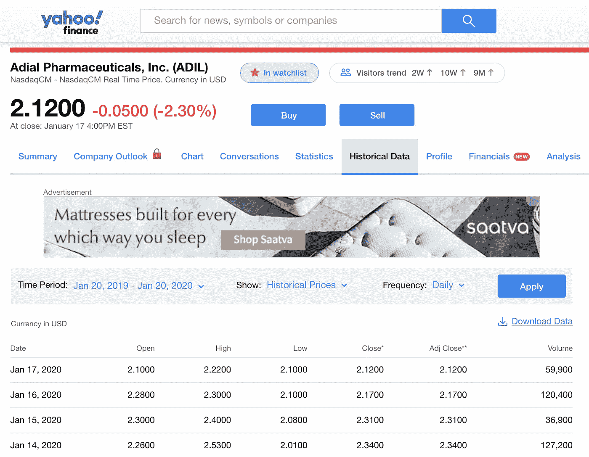
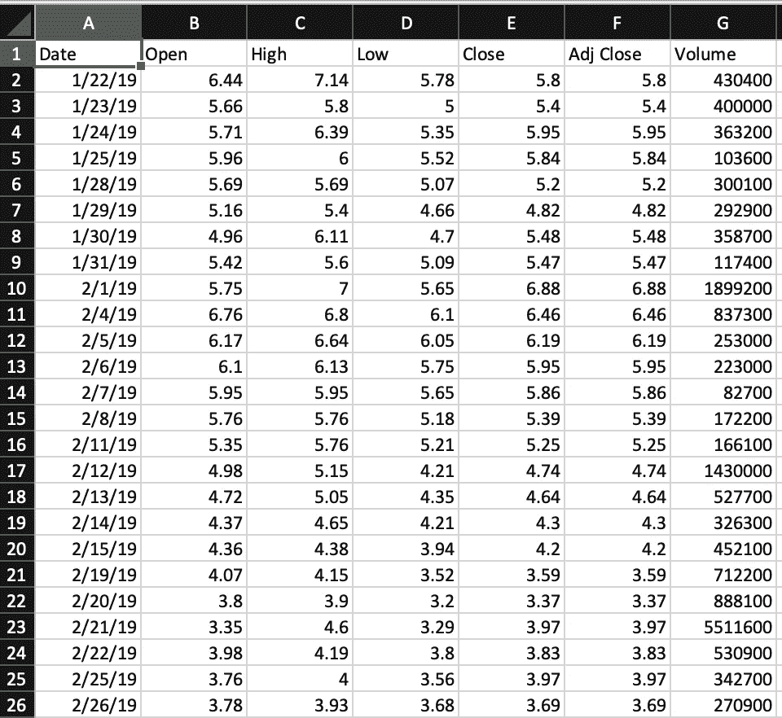
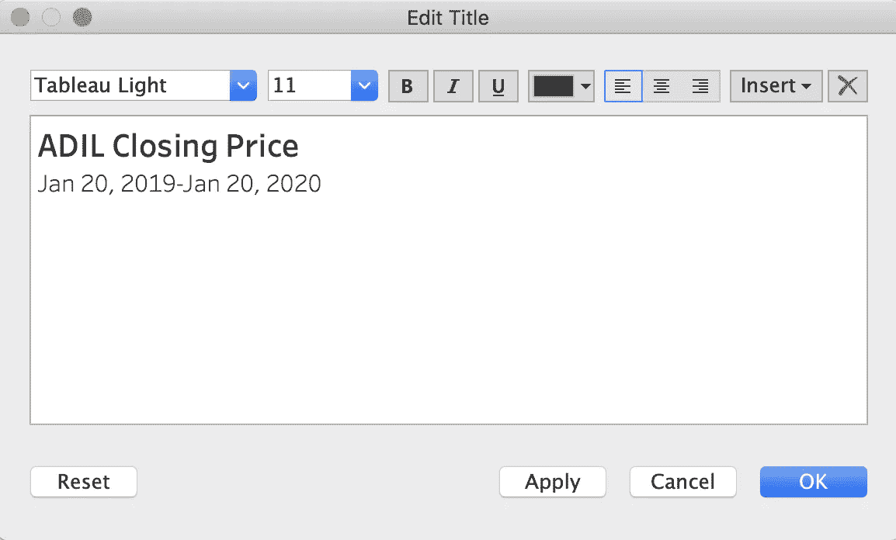
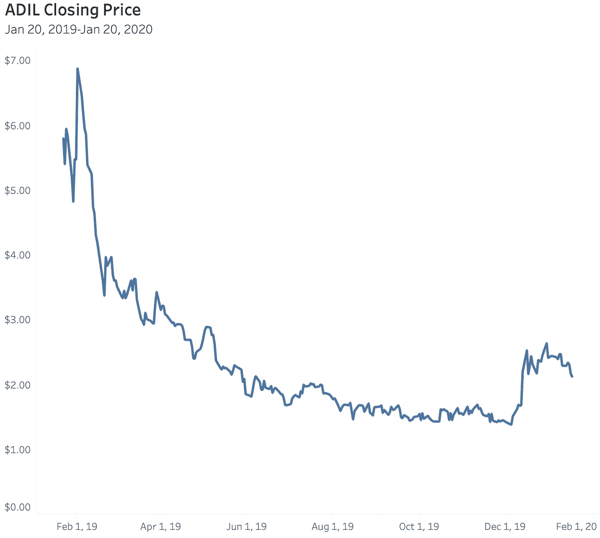
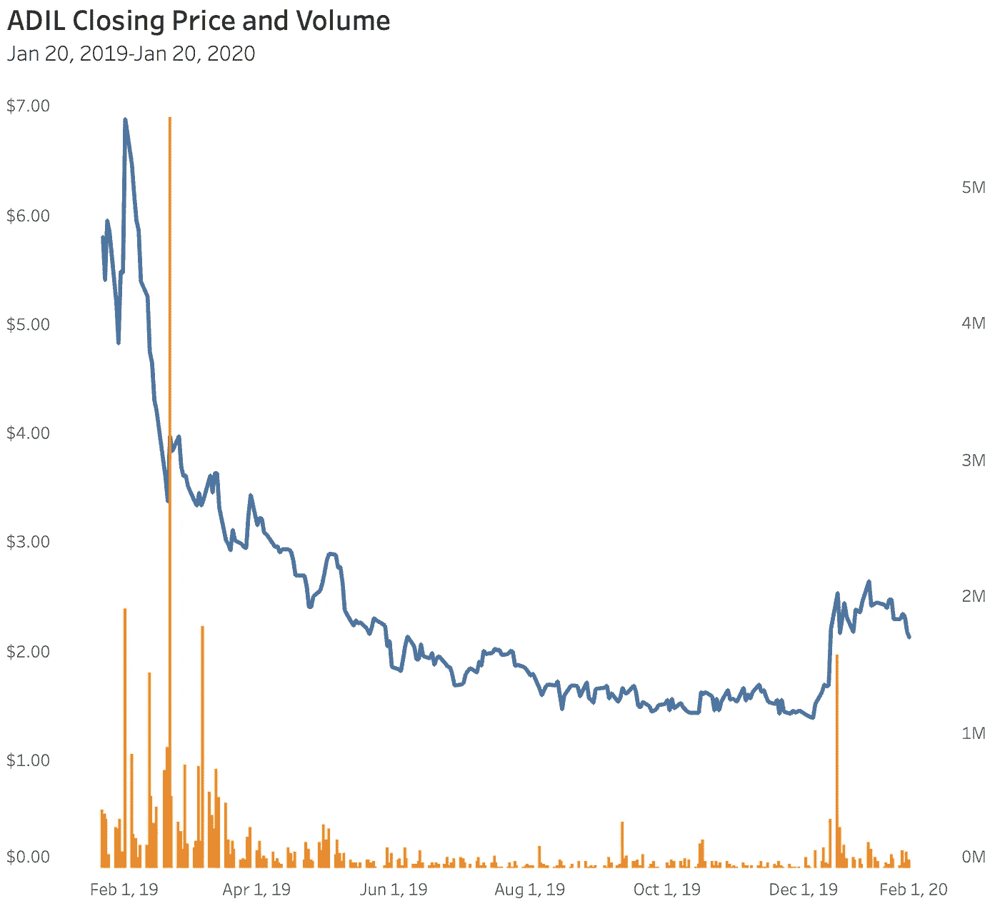
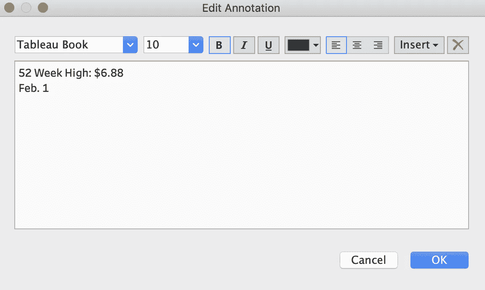
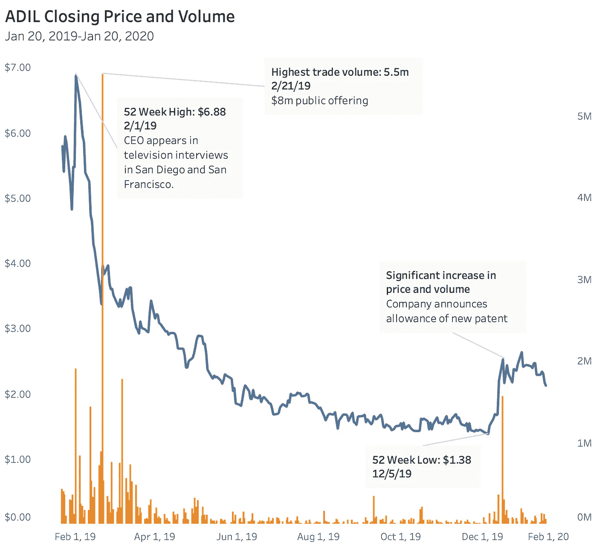

# 使用 tableau 分析(ADIL)股票

> 原文：<https://towardsdatascience.com/analysing-stock-using-tableau-c7a07ec18891?source=collection_archive---------64----------------------->

“作者提供的图像”

你在学习如何摆拍吗？厌倦了使用默认的超级商店数据，想尝试一些更实用的东西吗？试试这个分析股票的快速指南，看看它会带你去哪里！

# 收集您的数据

1.  去[雅虎财经](https://finance.yahoo.com/)查一只股票。真的，什么股票都行。如果是你碰巧持有的股票就更好了！
2.  在股票的摘要页面上，转到标签为历史数据的选项卡。
3.  将视图更改为所需的时间段(默认为一年)。
4.  单击“下载数据”链接下载 CSV 文件。

**请注意，在示例的剩余部分，我将使用 CSV 显示该股票在以下时间段的数据:2019 年 1 月 20 日-2020 年 1 月 20 日。**

“作者提供的图像”

ADIL 雅虎财务历史数据

# 准备您的数据

数据准备始终是将原始数据引入 Tableau 的第一步。在这种情况下，我们的数据已经相对干净和简单。但为了以防万一，我们需要检查一下。

要准备数据，请在 Excel 或 Google Sheets 中打开它。检查一下格式。如果您愿意，可以更改任何列的默认标题。在这些情况下，我们很可能不会改变什么。

“作者提供的图像”

# 在 Tableau 中可视化您的数据

如果需要，在 Excel 中保存对 CSV 文件的任何更改，然后关闭它。然后，我们开始 Tableau 吧！

# 在 Tableau 中打开 CSV 文件

1.  打开 Tableau 桌面。
2.  在“连接”下，查找“到文件”，然后选择“更多…”
3.  浏览到 CSV 文件的位置并打开它。现在我们看到了 Tableau 数据源视图。
4.  单击“工作表 1”选项卡打开工作簿视图。现在我们准备开始可视化！

请注意左侧的数据窗格。这里，我们有维度和度量。由于这些数据大多包含可衡量的数字，如开盘价、收盘价和调整后收盘价以及成交量，因此需要衡量的项目要多得多。

# 构建工作簿—可视化每日收盘价

1.  **双击‘日期’维度**。这将自动将其带到工作簿的列区域。
2.  **点击并拖动“调整接近”指标到工作簿的行区域**。请注意，我们使用的是调整后的收盘价，而不是收盘价，因为这更准确。[如果你想知道原因，请点击这里](https://finance.zacks.com/adjusted-closing-price-vs-closing-price-9991.html)阅读更多内容。
    现在我们有了一个基本的线图，向我们展示了……到底是什么？绝对不是我们要找的。所以，我们需要进一步分解。
    注意到标有年份(日期)的列区域中的药丸了吗？当我们双击日期维度时，它出现了。这表明我们目前只查看了数据中的年份— 2019 年和 2020 年的前几周。我们的可视化显示，我们的股票价格在 2019 年至 2020 年期间下跌。它还把今年所有的收盘价加起来，这也肯定不是我们想要的。
    这是因为我们的日期目前是离散的，这意味着它添加了整个相应年度的每个调整后收盘价。由于我们的例子中 2019 年大约有 49 周，2020 年有 3 周，当然 2019 年的价格更高。
3.  **将鼠标悬停在月份(日期)药丸上，直到您看到右侧有一个朝下的三角形。点击三角形调出菜单**。
    注意，菜单显示了两个看起来相同的日期选项，顶部的**年份**选项被选中。还要注意选择了**离散**。边注，我们也可以看出这个维度是离散的，因为药丸是蓝色的。如果它是绿色的，它将是连续的。
4.  **在菜单中，从第二组日期选项中选择“日”。**注意药丸现在是绿色的，可视化看起来像我们需要的！我们现在正在查看一个线形图，显示 CSV 文件中整个日期期间每天调整后的收盘价。

“作者提供的图像”

*我们的第一次股票价格可视化！*

# 设置工作簿的格式

让我们清理一些东西，使这个东西看起来更专业一点。

**格式化标题**

1.  双击工作簿的标题(当前为“工作表 1”)。
2.  将名称改为描述性的名称，例如“ADIL 收盘价”,并在下面加上副标题和日期范围。调整字体大小，让标题比副标题更有影响力。

“作者提供的图像”

**格式化 Y 轴**

1.  在 Y 轴(垂直轴)旁边，双击标题“Adj Close”
2.  在对话框中，在轴标题下，让我们继续清除标题。假设我们已经将图表命名为 ADIL 收盘价，那么 Y 轴表示收盘价应该是很直观的。完成后关闭对话框。
3.  右键单击(或在 Mac 上按住 control 键单击)Y 轴数字上的任意位置，然后选择“格式”
4.  在“比例”下，选择“数字”旁边的箭头，然后选择“货币(标准)”现在我们的观众肯定知道这是收盘价的范围。
5.  既然我们在这里，让我们继续将“Ticks”更改为“None”

**X 轴格式** 对于 X 轴(水平轴)，我们真的不需要标题，因为我们知道那些是日期。

1.  双击“日期”，在“轴标题”下，简单地删除标题。
    看起来已经好多了！但是还有一件事我们可以做，让这个看起来更专业——删除那些网格线！
2.  转到格式>工作簿。
3.  在现在出现在左侧的“工作簿格式”选项下，转到“线条”并选择“网格线”旁边的向下三角形。把它从自动改为关闭。

“作者提供的图像”

现在我们看起来不错！

但是等等，我们还可以添加更多！还记得我们的 CSV 文件有一个显示容量的列吗？这是某一天交易的股票数量。你可以[在这里](https://www.investopedia.com/terms/v/volumeoftrade.asp)阅读更多关于交易量的信息，但是添加这个会让这个可视化看起来特别专业。我们有两个选择。

# 添加第二个度量值作为颜色

这个很简单。我们希望更改图表中线条的颜色，以指示交易量较高的区域。只需将“音量”从测量区域拖放到“标记”下的“颜色”框中

注意这条线在某些区域改变了颜色——较暗的区域是股票交易量较高的地方。你能把这些和股价的涨跌联系起来吗？

# 添加第二个度量作为双轴

如果你想看起来更高级更专业一点(你当然想)，试试这个！

1.  如果需要，通过将药丸从标记拖到下面的空白区域来删除上一部分的测量颜色。(将任何药丸拖到此区域会将其从工作簿中删除。)
2.  将“Volume”从度量区域一直拖到工作簿的最右侧，直到它显示一个垂直矩形。在这里释放。现在，左边的 Y 轴显示了我们的收盘价范围，右边的 Y 轴显示了我们的成交量范围。现在，让我们格式化一下。
3.  在“Marks”下，您现在应该会看到三个可折叠的部分——All、SUM(Adj Close)和 SUM(Volume)。展开最后一个，SUM(体积)。
4.  使用下拉菜单，将其从线条更改为条形。
5.  同样在标记>总和(体积)下，单击标记为“大小”的框，将其从“固定”更改为“手动”
6.  让我们继续更改工作簿的标题，这样我们就可以完成新 Y 轴的格式化。双击标题，并将其更改为 ADIL 收盘价和成交量。单击“确定”退出对话框。
7.  双击右侧的 Y 轴；删除标题。
8.  在同一对话框中，选择“刻度”标签。将“主要刻度线”从“自动”更改为“固定”关闭对话。
9.  最后一点家务——让我们去掉剩下的线。右键单击(或按住 command 键单击)左侧的 Y 轴，然后选择“格式”
10.  在左侧“格式”面板的顶部，选择“边框”选项(看起来像方形窗格)。
11.  在行分隔线>窗格下，选择无。
12.  在列分隔符>窗格下，选择无。关闭“格式”面板。

“作者提供的图像”

嘿，你都快成职业选手了！

我们还没完呢！想解决股票分析和研究的基本介绍？你当然知道！

# 研究发现

看你的练习册。看到什么突出的东西了吗？

**注解一下！**

让我们从两个明显的点开始——52 周高点和 52 周低点。这些应该很容易在你的练习册中找到。你甚至可以将光标放在该点上，Tableau 会告诉你日期和价格。让我们这样注释它们。

1.  右键单击(或按住 command 键单击)高点，然后选择“批注”>“点”。
2.  清除对话中的默认值。将 justification 设置为 left，并输入一些内容来帮助我们理解这里发生的事情，如“52 周高点:6.88 美元，2 月 1 日。”

“作者提供的图像”

注释对话

对 52 周低点重复这些步骤。然后，对交易量中的主要异常值做类似的事情。在我们的例子中，我们可以在 2 月 21 日看到一个主要的异常值。让我们在 12 月 16 日标记今年晚些时候的另一个异常值。称之为“主要交易量:550 万，2 月 21 日。”使用与 52 周最高价和最低价相同的格式。

**研究一下吧！**

现在真正有趣的部分来了——看看我们是否能找出这些事件发生的原因。你能通过查看公司的投资者关系页面回答以下问题吗？提示:所有上市公司的网站上都有这一部分。

*   为什么该股在 2 月 1 日创下历史新高？
*   为什么股票在 12 月 5 日跌到了历史最低点？
*   为什么该股在 2 月 21 日出现如此高的交易量？
*   为什么 12 月 16 日会出现随机的高成交量？
*   季度业绩是什么时候公布的？(找到这些日期时，请注明)

在公司的[投资者关系](https://ir.adialpharma.com/)页面，从新闻稿开始。你的基本答案一般都在这里。就我们使用的股票而言，我们可以发现:

*   这位首席执行官出现在 2 月 1 日的两个新闻节目中，其中一个是在湾区…也是众所周知的充满风险资本和投资者的地区。请注意，这与同一天的高交易量(近 190 万)相关。
*   2 月 21 日，该公司公开发行 800 万美元股票，试图筹集更多资金。这与交易量的大幅上升相关，但也与股价的螺旋式下降相一致，因为这可能会稀释价值。
*   季度业绩分别于 5 月 13 日、8 月 13 日和 11 月 14 日发布。这些都与图上任何未完成的活动无关。然而，这种结果往往与交易量的上升和价格的上涨或下跌相关，这取决于消息的好坏。
*   最后，在 12 月 16 日，该公司宣布了一项额外专利的许可，这与更大的交易量和收盘价的大幅上升相关。

# 结论

在注释完你发现的重要的东西后，看看你可能会有什么！一张漂亮的信息图，有股票的基本分析。

“作者提供的图像”

**你学到了什么:**

*   如何在雅虎财经上查找一只股票并下载其一年的历史数据？
*   检查数据，以确保为 Tableau 做好准备。
*   将 CSV 导入 Tableau。
*   创建带有折线图、双轴折线图和条形图的工作簿。
*   研究和分析股票的基本历史活动。

最后说明:如果你想下载并玩它，这在 [Tableau Public](https://public.tableau.com/profile/alex.ashton#!/vizhome/StockMarketAnalyzationDualAxisandColor/ADILDualAxis?publish=yes) 上。祝你的舞台和股市之旅好运！