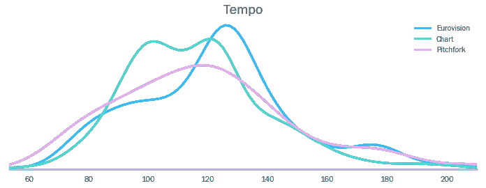
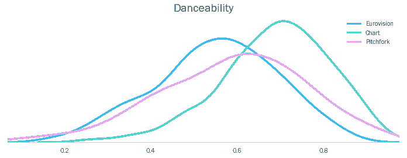
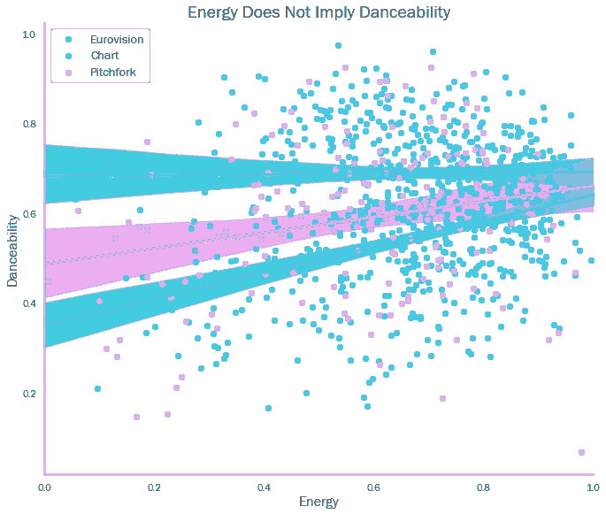
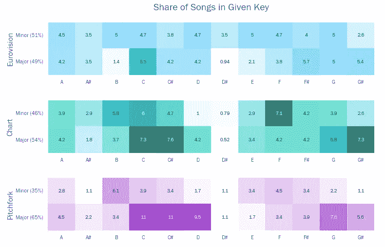
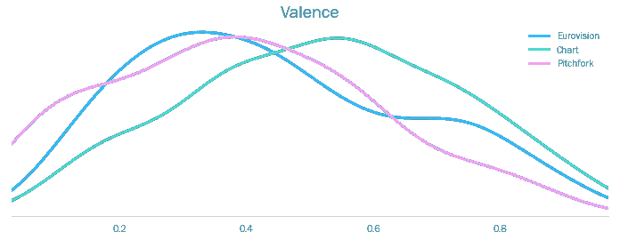
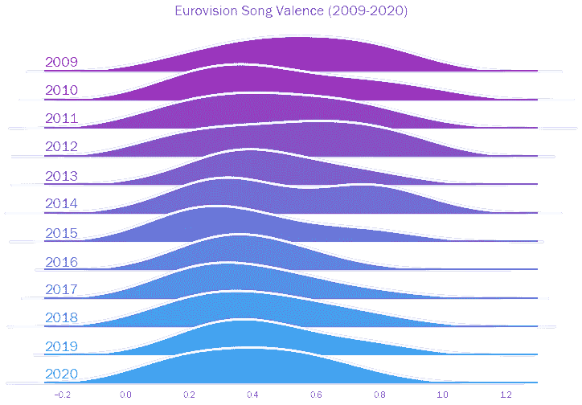

# 欧洲电视网变得不那么俗气了，我们可以从数学上证明这一点

> 原文：<https://towardsdatascience.com/analysing-the-greatest-show-on-earth-e234f611e110?source=collection_archive---------49----------------------->

## [数字音乐](https://towardsdatascience.com/tagged/music-by-numbers)

## 借助 Spotify 公共 API 的一点点帮助

有一项年度电视赛事，全球观众约有两亿人(大约是超级碗的两倍)收看 T2 的比赛。它的 [YouTube 频道](https://www.youtube.com/user/eurovision)号称有超过 43 亿*的浏览量。没有它，不管是好是坏，你都不会听说过 ABBA。或者是史诗萨克斯手。*

2019 年欧洲电视网歌曲大赛的获奖表演

# “像凤凰一样崛起”

欧洲电视歌曲大赛于 1956 年由欧洲广播联盟创立，旨在将饱受战争蹂躏的欧洲大陆聚集在一个“轻松娱乐节目”的周围。尽管自成立以来技术细节已经发生了变化，但欧洲电视网的主要前提依然如故。每个参赛国都会送出一首原创歌曲，作为一个晚间电视节目的一部分。

在节目的最后，每个人都会根据全国听众来电的结果和音乐专业人士组成的“全国评审团”的意见，给其他国家的歌曲打分。哪首歌得分最高，哪首歌就获胜，获胜的国家将获得举办明年比赛的“荣誉”。

欧洲电视网以不敬和印花棉布闻名。精心制作的舞台表演、烟火表演和华丽的服装比比皆是(这场比赛在 LGBT 群体中拥有狂热的追随者[。然而，许多人对真正的音乐的看法被 90 年代和 00 年代的记忆所模糊，在那个时期，大多数国家都不幸地倾向于非常令人震惊的流行音乐。对于英国的许多人来说，欧洲电视网仍然是吉娜·G 1996 年参赛作品的同义词，“哦，啊…就一点点](https://www.independent.co.uk/arts-entertainment/music/features/eurovision-2018-lgbt-song-contest-saara-aalto-conchita-wurst-fans-gay-audience-a8335116.html)”，一大块严重老化的音乐奶酪，最好被丢弃在时间的迷雾中。

如何看待欧洲电视网在过去十年里已经“长大”的说法？乌克兰在 2016 年以一首关于约瑟夫·斯大林驱逐克里米亚鞑靼人的歌曲赢得了比赛，这表明自吉娜·g 时代以来，一些事情确实发生了变化。

贾马拉为乌克兰赢得 2016 年世界杯

然而，由于 Spotify 的一些非常聪明的数据科学工作，我们甚至可以超越歌曲的抒情主题，而是通过音频特征来分析歌曲。为此，我们可以将欧洲电视网过去十年的歌曲与其他曲目的对照组进行比较，看看这场比赛的负面内涵是否仍然值得(未来的博客也将使用这些“音频”数据来预测哪首歌会赢得 2020 年的比赛，这场比赛在新冠肺炎之后不可避免地被取消)。

# “这就是你如何写一首歌”

Spotify 的公共 API 允许用户访问平台上任何歌曲的信息。这些范围从显而易见的(歌名、作曲家、发行日期等。)到更奇特的，包括由音轨音频文件的[波形](https://en.wikipedia.org/wiki/Waveform)直接推断出来的指标。

> 注意——Spotify 的 API 可以通过使用“ [Spotipy](https://spotipy.readthedocs.io/en/2.11.2/) ”库用 Python 访问。观看 Ian Annase 的[系列视频](https://www.youtube.com/playlist?list=PLqgOPibB_QnzzcaOFYmY2cQjs35y0is9N)以获得对此的完整介绍，或者深入研究这个项目的 [GitHub repo。](https://github.com/calbal91/spotify)

要获得这些信息，我们只需将惟一的 track ID 输入 API。正如人们所希望的那样，获取数百首歌曲的 id 是一项可以由 Spotipy 自动完成的任务——只需创建所需歌曲的播放列表，然后调用一个方法来获取这些播放列表的信息。这将返回简洁的 JSON 文件，其中包含每个播放列表轨道的基本数据，包括其唯一的 ID。

芒斯·塞默洛为瑞典赢得 2015 年世界杯

除了 2009 年以来的欧洲电视网歌曲库，本博客还分析了另外两个“控制”歌曲列表:

*   **“图表”:** 382 首曲目摘自 Spotify 自 2015 年以来英国最热门歌曲的年度“热门曲目”播放列表(注意——非整数是因为删除了多年播放列表中出现的重复曲目)。这包括商业上超级成功的艺术家，如艾德·希兰、德雷克、贾斯汀比伯等。
*   **“Pitchfork”:**400 首选自 Pitchfork 的 [200 首最佳歌曲](https://pitchfork.com/features/lists-and-guides/the-200-best-songs-of-the-2010s/)，以及[十年来的 200 张最佳专辑](https://pitchfork.com/features/lists-and-guides/the-200-best-albums-of-the-2010s/)。这个播放列表代表了广受好评的“高质量”音乐(在之前的博客中，我们发现 Pitchfork 通常可以很好地判断一张唱片的内在质量)。

# “玩数字”

让我们依次看看不同的音频特征，看看欧洲电视网过去十年与这两个对照组相比如何。

**节奏。**简单来说，每首歌每分钟多少拍(BPM)？

我们注意到欧洲电视集团紧紧围绕 120–125 BPM 范围。这可能是因为欧洲电视网的歌曲不能超过三分钟(比赛的乐趣之一是，如果你不喜欢一首歌，你永远不必等待它结束)。

一首典型的歌曲每小节有四个节拍。两个 16 小节的韵文、三个 16 小节的合唱、一个中 8 小节和四个引子和结尾小节(现代音乐的主要结构，全部在内)总共有 360 个节拍，当以 120BPM 播放时，正好需要三分钟。

我们应该注意到，图表音乐也有大约 100 和 120BPM 的峰值。这可能是出于类似的考虑(期望大量广播播放的歌曲将致力于 3 到 3.5 分钟的持续时间)。广受好评的 Pitchfork 播放列表上的歌曲对时长的限制更少，因此没有那么紧密地捆绑在一起。

**能量。**这是 Spotify 第一个更主观的指标。根据 API 文件:

> 能量代表强度和活动的感知度量。通常，高能轨道感觉起来很快，很响，很嘈杂。例如，死亡金属具有高能量，而巴赫前奏曲在音阶上得分较低。

我们可以看到所有三个歌曲组都向右倾斜(根据 Spotify 的说法，与人口分布一致)。然而，欧洲电视网的轨道特别有活力。我们预料到了这一点——欧洲电视网的参赛作品必须在漫长的表演之夜与 20 多首其他歌曲争夺关注。低能量的歌曲迷失在混音中，除非有惊人的声音转折。

**可跳舞性。**根据 Spotify:

> 可跳舞性描述了基于音乐元素(包括速度、节奏稳定性、节拍强度和整体规律性)的组合，一首曲目适合跳舞的程度。

不出所料，高度流动的排行榜音乐似乎非常适合跳舞。正如我们所料，Pitchfork 播放列表的范围要广得多——舞蹈和好评没有明显的相关性。也许出乎意料的是，尽管欧洲电视网的音乐是所有三个组合中最有活力的，但平均来说却不太适合跳舞(事实上，分布相当正常)。

Spotify 没有给出任何关于“danceability”背后的精确计算的进一步细节，但我们可以在下图的右下方找到线索:

可跳舞性最低的歌曲(Japandroids 的《Younger Us》)恰好是所有被分析歌曲中能量第二高的。曲目节奏非常快，由摇滚吉他和鼓带动。这听起来很有活力。然而，这首歌中有一些地方明显有损于它的可跳舞性——乐器在大约 30 秒钟内被完全切断，歌曲最后几个和弦的演奏不合拍(如果你试图跟着它们跳舞，你会看起来非常奇怪)。

**键。**不用过多钻研音乐理论，歌曲的“调”决定了演奏时使用的音符。最常见的键族是“大调”和“小调”。一般来说，大调听起来是快乐的，小调听起来是悲伤的。这不是一个听众通常会注意的事情，尽管你会注意到一首熟悉的歌曲的音调是错误的——听村民用小调唱[“基督教青年会”是一种真正痛苦的经历。](https://www.youtube.com/watch?v=rGflu3TbREo)

我们看到，欧洲电视网的小调音比例最高(49%)。同时，c 大调、C#大调和 D 大调是所有播放列表中特别常见的调。

**价。**这是 Spotify 得出的最有趣的指标之一:

> 描述音轨所传达的音乐积极性的量度。高价曲目听起来更积极(例如，快乐、愉快、欣快)，而低价曲目听起来更消极(例如，悲伤、沮丧、愤怒)。

我们看到排行榜音乐更倾向于正面。这并不奇怪——自从有史以来，排行榜音乐一直是快乐和乐观的。然而，我们看到欧洲电视网实际上是所有组中最负向倾斜的，这表明它有更高浓度的情绪负面歌曲。

小调歌曲的较高比例将对此有所贡献，尽管 Pitchfork 组有类似的配价分布(尽管有更多的大调歌曲)，但这可能不是整个故事。

# “告别昨天”

从音乐上来说，我们已经看到欧洲电视网的歌曲占据了现代流行音乐和更小众、广受好评的音乐之间的一个有趣的中间地带。它乐观而充满活力，但也更情绪化，更可能是小调。

萨尔瓦多·索布拉尔(Salvador Sobral)为葡萄牙赢得了 2017 年欧洲电视网(Eurovision)近十年来最没有活力的歌曲

事实上，如果我们以年为基础绘制欧洲电视网条目的分布(kde)，我们可以看到明显的趋势——歌曲变得越来越没有活力，它们的效价(或音乐“快乐”)比过去低得多。

我们可以将这两个指标绘制在一起，并显示欧洲电视网的歌曲是如何从右上角的高能量、快乐(俗气)的角落向左下角的低能量、悲伤(不那么俗气)的角落移动的。

给定年份欧洲电视网歌曲的平均价和能量值

在 2014 年的比赛之后，参赛作品的音乐性质发生了特别明显的变化(不管是不是巧合，一首能量和效价评级特别低的歌曲赢得了比赛——尽管声乐表演非常出色)。

肯奇塔·沃斯特为澳大利亚赢得 2014 年世界杯

这一趋势看起来似乎将持续到 2020 年——在整个取消之前，博彩公司最看好的是保加利亚。维多利亚的歌曲“眼泪变得清醒”的效价评分为 0.26，能量评分仅为 0.18——在整个欧洲电视网数据集中排名第二低。

“哦，啊…就一点点”，不是的。

> 这是我的“ [Music By Numbers](https://towardsdatascience.com/tagged/music-by-numbers) ”专栏中的最新博客，它使用数据来讲述关于音乐的故事。在接下来的博客中，我们将看到如何在机器学习环境中使用上述音频特征。我也很乐意听到对以上分析的任何评论——欢迎在下面留言，或者通过 [LinkedIn](https://www.linkedin.com/in/callum-ballard/) 联系我！