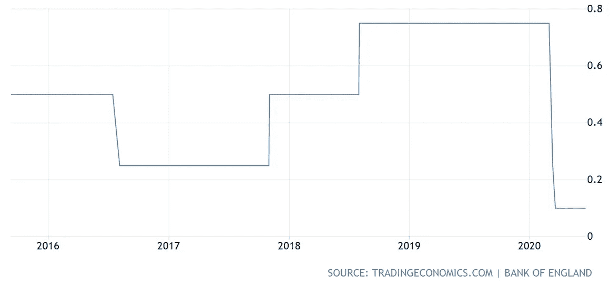
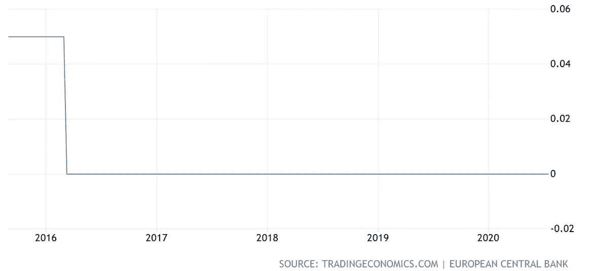
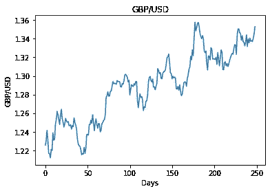
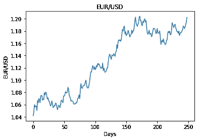
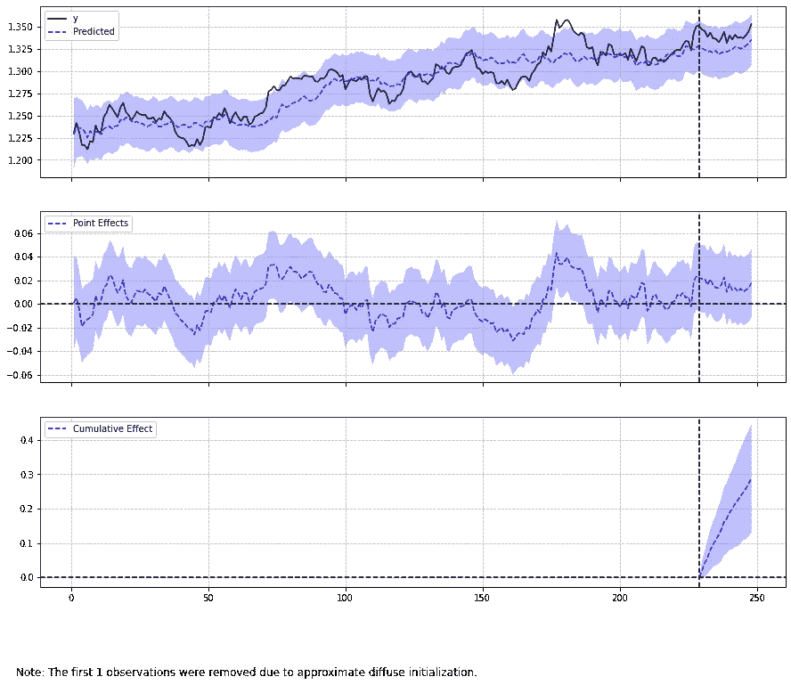
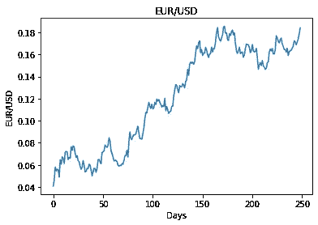
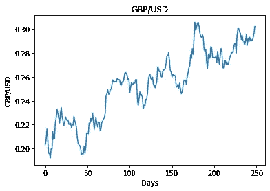
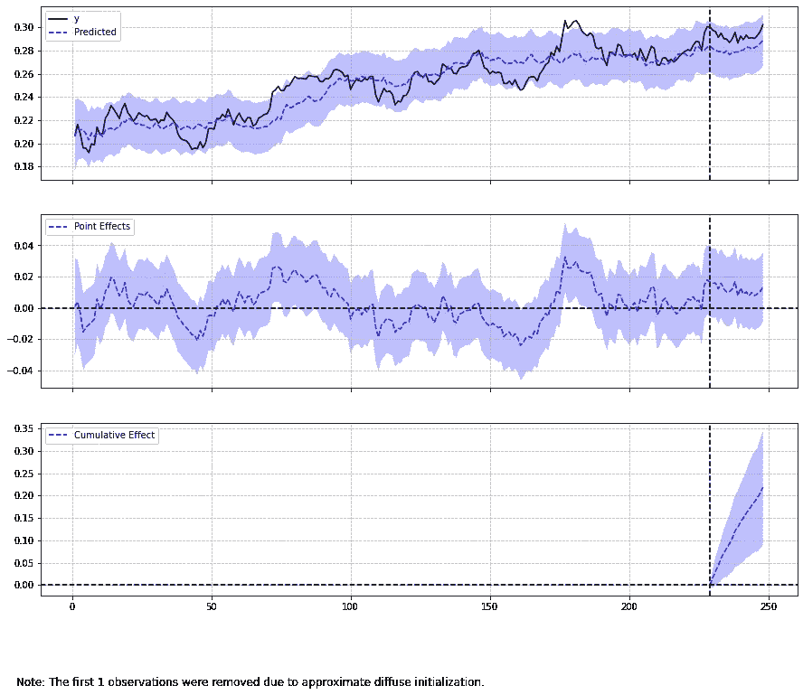

# 分析具有因果影响的时间序列干预:货币波动

> 原文：<https://towardsdatascience.com/analysing-time-series-interventions-with-causalimpact-currency-fluctuations-e6ab14a30768?source=collection_archive---------34----------------------->

## 我们如何解释时间序列中的干预？

*免责声明:本文是在“原样”的基础上编写的，没有任何担保。它旨在提供数据科学概念的概述，不应被解释为投资建议或任何其他类型的专业建议。*

当检查一个时间序列时，有一个**干预**在一个特定的点上影响该序列是很常见的。

这方面的一些例子可能是:

*   导致销售显著变化的广告活动
*   交通政策的积极变化降低了交通事故的死亡率
*   影响资产价格的经济政策变化

分析干预效果的问题是，如果没有干预，人们就无法检查该序列的趋势。

例如，假设一家公司实施了一项广告活动，目的是促进销售。虽然可以在干预后记录销售数据，但如果没有干预，很难说**的销售额**会是多少。

# 我们的例子

对于这个例子，让我们考虑一下利率变化对货币波动的影响。

当中央银行操纵利率时——这被假设为对一种货币有重大影响，因为它影响了该货币相对于市场上其他货币的感知价值。

然而，如果我们希望量化这种影响，该怎么办呢？让我们看看这是如何与**因果影响**包一起工作的。这个包最初是由 Google 为 R 开发的，但是在这个例子中我们将使用 Python 版本(pycasualimpact)。

让我们考虑 2017 年英镑/美元的波动。

2017 年 11 月，英国央行决定加息。



资料来源:tradingeconomics.com

我们将使用因果影响来尝试调查:

1.  如果没有这种干预，英镑对美元的预测汇率会是多少
2.  这种干预是否重要，是否影响了货币水平

为了确定这种干预是否对时间序列有显著影响，我们必须使用合适的协变量(X)。这个协变量不能受到干预的影响。

例如，我们可以看到，2017 年，欧洲央行维持利率不变(此后一直如此):



资料来源:tradingeconomics.com

考虑到这一点，欧元/美元将被用作本例的协变量。

```
X = eurusd
y = gbpusd
```

虽然假设货币会受到美元波动以及许多其他宏观经济条件的影响，但假设英格兰银行的干预不会影响欧元/美元。

# 分析

使用 Quandl 从 FRED 数据库下载相关的货币对:

```
>>> eurusd = quandl.get("FRED/DEXUSEU", start_date='2017-01-01', end_date='2018-01-01', api_key='enter_api_key')>>> gbpusd = quandl.get("FRED/DEXUSUK", start_date='2017-01-01', end_date='2018-01-01', api_key='enter_api_key')
gbpusd
```

这是两种货币对的图表:

## 英镑/美元



资料来源:美联储经济数据

## 欧元/美元



资料来源:美联储经济数据

随着英国央行在 2017 年 11 月 2 日做出利率决定， *t = 0 至 229* 被定义为前期(干预前)，而 *t = 230 至 248* 被定义为后期(干预后)。

```
data = pd.DataFrame({'y': y, 'X': X}, columns=['y', 'X'])
pre_period = [0, 229]
post_period = [230, 248]
```

根据这个软件包的官方 GitHub，这个模型“使用经典的卡尔曼滤波方法来求解状态空间方程”。

后验推断可以如下产生:

```
>>> ci = CausalImpact(data, pre_period, post_period)
>>> print(ci.summary())
>>> print(ci.summary(output='report'))
>>> ci.plot()
```

下面是生成的输出:

```
Posterior Inference {Causal Impact}
                          Average            Cumulative
Actual                    1.34               25.46
Prediction (s.d.)         1.32 (0.0)         25.17 (0.08)
95% CI                    [1.32, 1.33]       [25.01, 25.33]

Absolute effect (s.d.)    0.02 (0.0)         0.29 (0.08)
95% CI                    [0.01, 0.02]       [0.13, 0.45]

Relative effect (s.d.)    1.15% (0.32%)      1.15% (0.32%)
95% CI                    [0.52%, 1.77%]     [0.52%, 1.77%]

Posterior tail-area probability p: 0.0
Posterior prob. of a causal effect: 100.0%
```

根据上述发现，英镑/美元的实际汇率为 **1.34** ，而在没有干预的情况下，该汇率将为 **1.32** 。

此外，该模型表明，有一个 100%的因果关系的后验概率。

在分析更详细的报告时，输出还指出:

> 偶然获得这个效果的概率很小
> (贝叶斯单侧尾区概率 p = 0.0)。
> 这意味着因果关系可以被认为是统计上
> 显著的。

从这个角度来看，有证据表明英镑/美元的走势比没有加息的情况下更高。以下是实际比率与预测比率的概述:



来源:Jupyter 笔记本输出

如前所述，Python 使用了一种不同于 R 的方法来生成预测，无需干预——后者更依赖于强调用户先验知识的贝叶斯方法。事实上，人们可以尝试这两种方法来验证生成的预测是否一致。

# 关于对数变换的一个注记

在处理资产价格数据时，通常的做法是将数据转换成对数格式。

这样做有两个原因:

1.  能够比较不同价格范围的资产，例如，比较 200 美元股票和 2000 美元股票的变动
2.  考虑百分比方面的波动

在上面的例子中，两种货币具有相似的标度，因为它们都以美元为基准。在这方面，没有使用对数变换。

此外，在我们试图分析的干预背景下，货币价格比股票价格相距更近的事实将使价格变化难以察觉。

但是，如果将这种转换应用到数据上会怎么样呢？是否仍然观察到统计上显著的因果影响？

以下是以对数形式表示的两个时间序列:

**欧元/美元**



来源:Jupyter 笔记本输出

**英镑/美元**



来源:Jupyter 笔记本输出

对经过对数转换的数据运行时，输出结果如下:

```
Posterior Inference {Causal Impact}
                          Average            Cumulative
Actual                    0.29               5.56
Prediction (s.d.)         0.28 (0.0)         5.34 (0.07)
95% CI                    [0.27, 0.29]       [5.21, 5.47]

Absolute effect (s.d.)    0.01 (0.0)         0.22 (0.07)
95% CI                    [0.0, 0.02]        [0.09, 0.35]

Relative effect (s.d.)    4.1% (1.22%)       4.1% (1.22%)
95% CI                    [1.68%, 6.47%]     [1.68%, 6.47%]

Posterior tail-area probability p: 0.0
Posterior prob. of a causal effect: 100.0%
```

用对数表示，如果没有干预，英镑/美元的自然对数应该是 0.28。然而，实际结果是 0.29。



来源:Jupyter 笔记本输出

因此，即使进行了对数变换，干预仍会显示为改变了时间序列的轨迹。这两种货币的比例仍然有很大的不同，在这种情况下是否需要对数变换仍有争议(这种变换通常对比例偏差较大的大值最有效)。

然而，证据表明，干预导致了有关时间序列的变化。

# 结论

这是对**因果影响**库的一个介绍性示例，以及如何在一个时间序列中检查干预的效果。

非常感谢您的时间，任何问题或反馈都非常欢迎。

# 参考

*   [GitHub:dafi ti/causal impact](https://github.com/dafiti/causalimpact)
*   [凯·布罗德森利用因果关系推断事件的影响](https://www.youtube.com/watch?v=GTgZfCltMm8)
*   [investing.com:英国利率决定](https://www.investing.com/economic-calendar/interest-rate-decision-170)