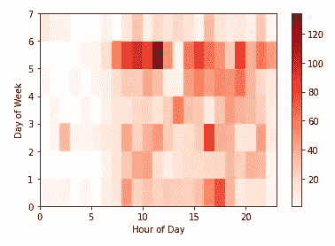

# 使用 Python 分析 WhatsApp 群组消息

> 原文：<https://towardsdatascience.com/analysing-whatsapp-group-messages-using-python-a17306d3ccad?source=collection_archive---------8----------------------->

谁发的信息最多？最常用的词是什么？最常用的表情符号有哪些？人们什么时候最常发信息？如果你曾经想知道你和你的朋友们在 WhatsApp 上的这些事情，那么这篇文章就是给你的。用一些(相对)简单的 Python 来了解一下吧！

我相对来说是 Python 的新手，但是这个项目给了我一个很好的 Python 数据争论入门，因为我必须在这里使用许多不同的技术，并试图探索最好的一种。

卡斯帕·卡米尔·鲁宾在 [Unsplash](https://unsplash.com?utm_source=medium&utm_medium=referral) 上的照片

# 获取数据

比我想象的更简单，我从来没有意识到你可以在 WhatsApp 上得到这个。在你的手机上，进入 WhatsApp 群组，点击右上角的点点点。然后进入“更多”和“导出聊天”。然后，您可以选择保存该文件的位置。我选择了 Google Drive，并把它放在我将要创建 Jupyter 笔记本的地方。

## 设置

只是对我的设置做一点小小的评论。我用了一个 Jupyter 笔记本来进行这种分析，这种分析是在小部件中完成的，我认为它可以很好地执行每个单元。这里有几个技巧和一些在 Jupyter 中有用的特殊函数。

我已经在评论中解释了它们的作用，但是为了解释为什么:Jupyter 限制了每个单元格显示的输出数量。因此，如果您想在一个单元格中输出一些数据的图形以及一个支持表，那么您需要运行第一个命令。后两个我用来控制输出多少。我不喜欢它默认如此少的行数/列数，尤其是当您可以使用像。head()取而代之，所以我没有限制。但是在查看数据的时候一定要小心，当你需要的时候你会限制它。

# 争论数据

我在这里做了一些笔记。我喜欢有两组数据，留下一组作为原始数据，可以与争论的数据集进行比较，因此有了 *raw_data_csv* 和 *data* 。

不幸的是，WhatsApp 的这种数据导出并不完美，当一条消息包含多行/换行符时，很难将其归因于正确的消息细节。我尝试了一些方法，但是找不到任何简单的方法。为了这个分析的目的，我已经把它们去掉了，因为没有它们我们仍然可以得到足够好的洞察力。这就是日期时间列上的 dropna 正在做的事情。

text_message 的第二个缺点是去掉了一些系统消息，比如当人们被添加到组中时。

实际上，我在 Jupyter 的不同单元格中运行了这些部分，并在每个点运行 head、tail 和 info，以了解每个点的数据情况。

# 分析数据

## 一些 WhatsApp 群上下文

所以接下来的几个部分的一些背景，我用的 WhatsApp 群是我的(场)曲棍球队，所以主要谈论训练，比赛和我们度过的夜晚。但是你很快就会看到这个！

## 最受欢迎的消息时间

我认为热图可以最好地显示一天中的小时和一周中的天。这是我最感兴趣的，因为其他事情是显而易见的，比如曲棍球赛季开始的月份。因此，我的构建方法是为这两个数据点创建新列，然后用这些维度的分组计数创建一个新的数据框。

作者图片

你能猜出我们在哪个晚上训练吗？周一和周三晚上，是的。这将是消息说，人们是在，外出，或迟到的会议。我们的比赛显然是在周六，这是我们大部分信息的来源，将主要谈论前往比赛，然后是赛后的滑稽动作。

## 按发件人排列的邮件

接下来是发件人邮件数，我选择用条形图显示，如下所示:

作者图片

显示为条形图可以让您直观地看到数字的差异，而不仅仅是一个数字表。亚历克斯是队长，所以他会发送很多管理信息，而我是社交安全专员，当他们显然不想出去的时候，我会试图组织一群人出去做些有趣的事情。甚至我也很惊讶亚历克斯和我比其他人多发了多少信息，但我们经常得不到任何回应，所以这很有意义。

## 最流行的词

现在谈谈流行词，这确实需要相当多的操作和运行时间。希望这些评论能解释大部分正在发生的事情。

最难的部分，也可能是最大的警告是如何定义*非 _ 词*，最终我只是使用了那些我在分析中根本不关心的词，但我可能在这里可以走得更远，因此我们作为一个整体有一些非常无趣的顶级词:

作者图片

所以我想可能更有趣的是挑选单词，看看它们的排名有多高，就像这样:

健身搭售啤酒是一个有趣的“巧合”…作者图片

我认为另一件有趣的事情是发件人的字数统计。不幸的是，我们没有大量的信息/文字，所以除了 Alex S 和我之外，对任何人进行细分实际上只能提供很少的数据，但不管怎样，我们还是要这样做:

作者图片

## 最流行的表情符号

我想补充的最后一点是表情符号的使用。现在我们并不是表情符号用户中最疯狂的，所以也没有太多的数据，也很难定义/细分表情符号到底是什么，所以这里有一些奇怪的表情符号，我认为它们对应着与表情符号相关的性别和肤色，但我们开始了:

作者图片

好吧，那就结束了。对于这个数据集，我想不出更多可以分析的东西，但我很想听到一些建议。此外，如果任何人对代码有任何建议，请告诉我，因为我对 Python 还很陌生，所以我觉得肯定有更好的方法来完成某些部分。

享受吧。