# 多尺度 CNN 特征图的分析与应用

> 原文：<https://towardsdatascience.com/analysis-and-applications-of-multi-scale-cnn-feature-maps-a6804bbac8?source=collection_archive---------23----------------------->

# 摘要

在这篇博文中，我们提出了卷积层感受域的正式处理方法，并使用一个衍生的数学框架描述了多尺度卷积特征图的特征。使用开发的数学框架，我们计算了不同卷积和汇集操作下的特征图的感受野和空间尺度。我们展示了汇集操作的重要性，以确保要素地图的空间比例作为图层深度的函数呈指数增长。此外，我们观察到，如果没有嵌入到 CNN 中的池化操作，要素地图空间比例只会随着图层深度的增加而线性增长。我们引入*空间尺度轮廓*作为 CNN 的分层空间尺度表征，其可用于评估特征图与训练数据集中对象维度直方图的兼容性。通过计算 ResNet-50 的空间比例剖面图来说明这一使用案例。此外，我们解释了特征金字塔模块如何生成多尺度特征地图丰富了增强语义表示。最后，与常规卷积滤波器相比，虽然扩展卷积滤波器保留了特征图的空间维度，但它们保持了更大的空间尺度指数增长率。

***阅读这篇博文，你会更深入地了解最近提出的用于各种视觉任务的 CNN 架构中多尺度卷积特征图用例背后的直觉。因此，这篇博客帖子可以被视为一个教程，以了解不同类型的图层如何影响要素地图的空间比例和感受域。此外，这篇博客文章面向那些参与设计 CNN 架构的工程师和研究人员，他们厌倦了从 CNN 主干中选择哪些特征图来提高其模型的性能的盲目试验和错误，相反，他们更喜欢在设计过程的早期阶段将特征图的空间比例轮廓与训练数据集中的对象维度进行匹配。为了方便这样的用例，我们在 https://github.com/rezasanatkar/cnn_spatial_scale******公开了我们的代码库。***

# 介绍

一般的假设和理解是，由 CNN 的早期卷积层生成的特征图编码基本的语义表示，例如边和角，而更深的卷积层在其输出特征图中编码更复杂的语义表示，例如复杂的几何形状。细胞神经网络生成多语义层特征图的这一特性是其基于多层深层结构的分层表征学习能力的结果。具有不同语义级别的特征图对于 CNN 是至关重要的，因为以下两个原因:(1)复杂语义特征图建立在基本语义特征图之上，作为它们的构建块(2)许多视觉任务如实例和语义分割受益于基本和复杂语义特征图。基于视觉 CNN 的架构将图像作为输入，并将其通过几个卷积层，目的是生成对应于输入图像的语义表示。具体而言，每个卷积层输出一个特征图，其中该特征图中编码语义的程度取决于该卷积层及其先前卷积层的代表性学习能力。

## CNN 特征图是空间方差

***CNN 特征图的一个重要特征是它们是空间方差的，这意味着 CNN 特征图具有空间维度，并且由给定特征图编码的特征可能仅对特征图的空间区域的子集变得活跃。*** 为了更好的理解 CNN 特征图的空间方差性质，首先我们需要理解为什么全连通图层生成的特征图不是空间方差。由于全连接层的每个神经元都连接到全连接层的所有输入单元，因此由全连接层生成的特征图(可以将给定全连接层的神经元的激活视为其输出特征图)不具有空间维度。因此，不可能定义和考虑神经元激活输出的空间方面。

另一方面，CNN 特征图的每次激活仅连接到几个输入单元，这些输入单元在彼此的空间邻域中。CNN 特征图的这一特性导致了其空间方差特性，这是卷积滤波器的空间局部结构及其空间受限感受野的结果。下图显示了全连接图层和卷积图层之间的差异，这种差异会导致一个图层的空间不变性和另一个图层的空间变化，其中输入图像由绿色矩形表示，棕色矩形表示卷积要素地图。此外，具有两个输出神经元的全连接层由两个蓝色和灰色圆圈表示。如你所见，全连接层的每个神经元受到所有图像像素的影响，而特征图的每个条目只受到输入像素的局部邻域的影响。

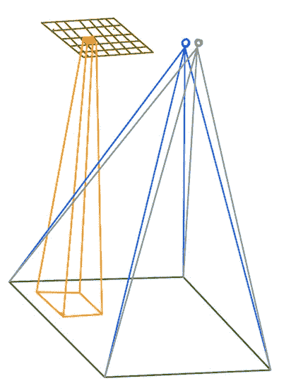

此图说明了为什么全连接图层生成的要素不是空间差异，而卷积图层生成的是空间差异要素地图。绿色矩形表示输入图像，棕色矩形表示由 CNN 的卷积层生成的尺寸为 5×7×1 的特征图。另一方面，两个蓝色和灰色圆圈表示具有两个输出神经元的全连接层的激活输出。假设如果输入图像中有自行车，则全连接层的蓝色神经元(特征)将变为活动的，而如果输入图像中有汽车，则灰色神经元(特征)将变为活动的。换句话说，蓝色神经元是自行车特征，而灰色神经元是汽车特征。由于全连接层的性质，即每个神经元的输出受所有输入图像像素的影响，全连接层生成的特征不能编码任何现成的定位信息，以便告诉我们如果输入图像中有自行车，则自行车在输入图像中的位置。另一方面，由卷积层生成的特征图是空间变化的，因此，除了对象的存在信息之外，它们还编码了定位信息。特别地，由卷积层生成的 which 维的特征图包含 C 个不同特征的存在信息(每个通道，特征图的第三维，编码唯一特征的存在信息),其中特征的空间维度 W×H 告诉我们对于输入图像的哪个位置，该特征被激活。在这个例子中，布朗卷积特征映射只编码一个特征，因为它只有一个通道(它的第三维等于 1)。假设这个棕色特征图是自行车特征图，那么只有在输入图像中的该条目的感受域中有自行车时，该特征图的条目才变为活动的。换句话说，如果在输入图像中有一辆自行车，但在其特定的感受域中没有，则该条目不会被激活。卷积特征图的这种特性使得它们不仅能够编码关于输入图像中物体存在的信息，而且能够编码物体的定位信息。

## CNN 特征图的空间比例和空间重叠

在本节中，我们正式定义了 CNN 特征地图的空间比例。CNN 特征图具有空间维度，它们的空间比例用于计算它们的条目和输入图像区域之间的空间映射。 ***特别地，给定 CNN 特征图的条目的空间尺度被定义为影响该特征图条目的值的输入图像的矩形子区域的像素大小*** *。*最简单的情况是计算第一层的空间尺度。例如，如果 CNN 的第一层是 3×3 卷积层，那么第一层特征地图的条目的空间尺度是输入图像的 3×3 像素子区域。计算较深 CNN 图层的输出要素地图的空间比例需要知道其输入要素地图的空间比例和空间重叠。在后面的章节中，我们将根据输入要素地图的空间比例和空间重叠，推导出不同卷积和汇集图层的输出要素地图的空间比例和重叠公式。

***这里，空间重叠被定义为两个相邻特征地图条目的空间尺度之间的重叠百分比*。**在下图中，我们绘制了两个相邻特征地图条目的空间比例和重叠，其中绿色矩形表示输入图像，棕色矩形表示由 CNN 的一个卷积层生成的特征地图。橙色要素地图条目的空间比例是输入图像上的橙色阴影区域，蓝色要素地图条目的空间比例是输入图像上的蓝色阴影区域。相邻蓝色和橙色条目之间的空间重叠是输入图像上两个空间尺度区域之间的重叠区域。

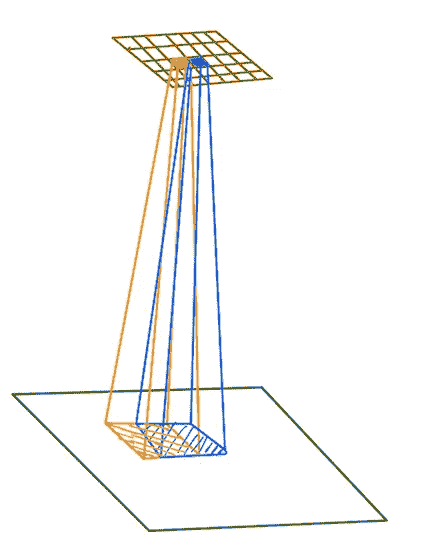

绿色矩形表示输入图像，而棕色矩形表示由 CNN 网络的一个卷积层生成的尺寸为 5×7×1 的 CNN 特征图。在该图中，该特征图的两个相邻条目用橙色和蓝色标记。橙色要素地图条目的空间比例在输入图像上绘制为橙色阴影区域，而蓝色要素地图的空间比例在输入图像上绘制为蓝色阴影区域。如您所见，蓝色和橙色的空间比例矩形大小相同，并且相互重叠。这两个相邻空间尺度矩形之间的重叠区域的大小与空间尺度区域的大小的比率被定义为空间重叠。

作为计算空间重叠的例子，假设 CNN 的第一层是跨度为 1 的 3×3 卷积层。然后，第一层生成的特征地图将具有 3×3 的空间比例和 9 个像素中的 6 个像素的空间重叠，这是大约 67%的空间重叠。这个重叠百分比是因为选择步幅等于 1。如果步幅选择为 2，则空间重叠将等于 33%，而步幅 3 导致 0%的空间重叠。 ***一般来说，我们应该避免非常高的空间重叠百分比，因为特征映射条目最终会以计算和存储资源的代价对冗余信息进行编码。另一方面，非常低的空间重叠百分比会导致生成的特征地图条目中的混叠效应。***

# 汇集操作确保要素地图的空间比例呈指数级增长

在本节中，我们将讨论 CNN 如何依靠池化操作来确保要素地图空间比例的指数增长率作为图层深度的函数。首先，我们证明了在 CNN 中不嵌入池操作并且仅依赖于步长为 1 的卷积层导致了特征地图的空间尺度的线性增长率。然后，显示合并图层以实现要素地图空间比例的指数级增长。最后，给出了有和没有汇集操作的两种细胞神经网络变体的案例研究，以说明使用汇集操作对特征地图的空间尺度增长率的影响。

在这里，我们表明，仅由 3×3 卷积层组成的步幅为 1 的 CNN 只能显示特征地图空间比例的线性增长率。仅仅由于输入图像上的 3×3 感受野，第一层特征图的空间比例将是 3×3。步长为 1 的第二层 3×3 卷积的特征映射输出的空间比例将等于 5×5。这是因为第二层特征图的感受野相对于第一层特征图是 3×3，而第一层特征图的感受野也是 3×3，但是相对于输入图像。因此，如果您顺序组合这两个 3×3 感受野，并考虑第一层特征图的相邻条目的感受野的空间重叠，您可以计算出第二层特征图相对于输入图像的空间比例是 5×5。下图显示了这一点，为简化起见，假设输入图像是一维的，卷积层假设为 1 x 3，步长为 1。可以观察到，第二层特征地图的蓝色条目相对于输入图像的空间比例是 1×5。

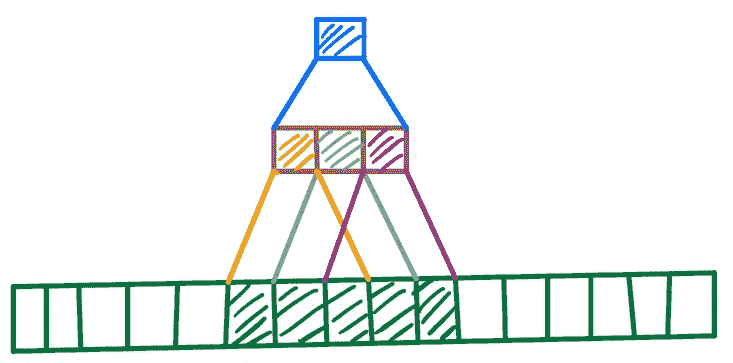

在该图中，我们展示了 1 x 3 卷积层生成的特征图的空间比例，在 1 维输入图像上应用了步长 1。绿色矩形表示一维输入图像，其中棕色矩形示出了第一卷积层输出的三个相邻特征映射条目，蓝色矩形示出了第二卷积层生成的单个特征映射条目。如您所见，第一层要素地图条目的空间比例为 1 x 3，而第二层要素地图条目的空间比例为 1 x 5。

基于上述示例和归纳，可以表明，以步长 1 添加每个 3×3 卷积层，将沿着每个维度将特征地图的空间比例增加 2 个像素。让 S(n)表示第 n 层要素地图的空间比例。然后，我们可以写出 S(n) = (3 + 2 * (n-1)) x (3 + 2 * (n-1))，这表明空间尺度增长率相对于层深度是线性的。空间比例的这种线性增长率主要是因为相邻要素地图条目的显著空间重叠。如果使用该网络的视觉任务需要相对较大的空间比例特征地图，则空间比例的线性增长率将是一个问题。例如，为了将最终特征图(由网络的最后一个 CNN 层生成的特征图)的空间比例增加到输入图像的 40×40 像素，那么 CNN 网络需要大约 20 个 3×3 的 CNN 层。由于在训练和推断期间卷积层的计算成本，在大多数情况下，我们宁愿避免仅仅为了满足特征地图的空间比例要求而增加越来越多的卷积层。

## 联营业务

在大多数 CNN 架构中，卷积层与池操作交错，以通过减少特征地图条目之间的空间重叠来增加特征地图的空间尺度的增长率。将空间尺度的增长率提高到超过线性增长率，使我们能够节省仅仅为了更大的空间尺度而增加更多的卷积层。我们可以通过显式池层或选择大于 1 的卷积滤波器步长来实现池操作。最常见的池层是跨度为 2 的 2 x 2 最大池层。该池图层将要素地图的空间维度减半，这意味着它将大小为 W x H x C (W x H 表示要素地图的空间维度，C 表示要素地图的通道数)的输入要素地图转换为大小为 W/2 x H/2 x C 的输出要素地图。将要素地图的空间维度减半的主要动机是减少相邻要素地图条目之间的空间重叠。

## 跨度为 2 的 2 x 2 池图层的空间比例和重叠

在本节中，我们将根据输入要素地图的空间比例和重叠程度，推导出跨距为 2 的 2 x 2 池图层的输出要素地图的空间比例和重叠公式。让 S 和 P 分别表示输入特征地图的空间比例和空间重叠。此外，s '和 p '表示最大池图层的输出要素地图的空间比例和空间重叠。我们可以计算 S`(S，P)= S+2(1-P)S+(1-P)S =(2-P)S。S `等式是基于以下事实得出的:由最大池化图层生成的要素地图条目的空间比例将等于其 4 个相应输入相邻要素地图条目的空间比例的总和，其中(1-P)和(1-P)因子确保 4 个输入条目的联合空间比例的每个子区域仅计数一次。

为了进一步阐明 2 x 2 池化图层的空间比例公式的推导过程，我们在下图中演示了其背后的推理过程。绿色矩形表示输入影像，而棕色矩形表示池图层的输入要素地图(尺寸为 5 x 7 x 1)，蓝色矩形表示池图层的输出要素地图(尺寸为 3 x 4 x 1)。为了说明 s’的推导，我们考虑输出特征图的单个条目(用灰色标记)。灰色条目的空间比例取决于其 4 个相应输入要素地图条目的空间比例和重叠，如下图所示。不失一般性，我们可以假设 S` = S + 2(1-P)S + (1-P) S 中的第一项 S 对应于输入要素的橙色条目的空间比例。此外，第二项 2(1-P)考虑了输入要素地图的蓝色和紫色条目的空间比例，其中因子(1-P)用于确保它们不会与橙色条目的空间比例重叠。最后，项(1-P) S 对应于输入要素地图的黑色条目，其中因子(1-P)用于确保黑色条目的有效空间比例不会与橙色、蓝色和紫色条目的已计数空间比例重叠。

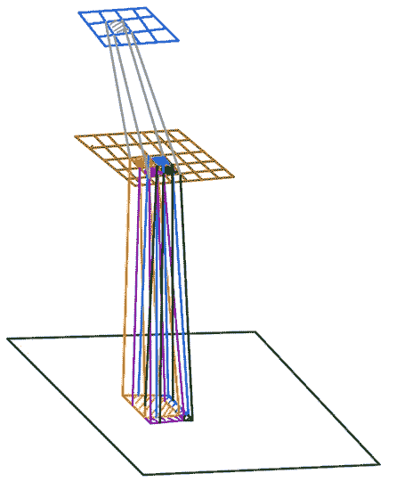

2 x 2 汇集图层空间比例公式推导演示。绿色矩形表示输入图像；棕色矩形表示稍后池化的输入要素地图，蓝色矩形表示池化图层的输出要素地图。橙色输出条目的空间比例是输入影像上标记的 4 个区域的联合，这 4 个区域对应于 4 个相邻输入要素地图条目的空间比例。

另一方面，在应用 2×2 最大汇集之后，每两个相邻条目之间的空间重叠的绝对值将等于 2PS-P S=P(2-P)S，其中 2PS 来自于两个相邻输出条目的 2×2 感受域通过两对输入条目相邻的事实。最后，我们需要减去 P S 以避免重复计算重叠的子区域。

下图说明了计算跨度为 2 的 2 x 2 最大合并图层的绝对空间重叠的上述推理，其中绿色矩形表示输入影像，棕色矩形表示合并图层的输入要素地图，蓝色矩形表示合并图层的输出要素地图。在此图中，不失一般性，我们关注用灰色和橙色标记的两个输出相邻条目的空间重叠。注意，由于步幅 2，这两个条目的感受野没有明显的重叠。但是，基于它们的输入相邻对，它们在空间尺度上具有有效的重叠。特别地，灰色输出条目的蓝色输入条目与橙色输出条目的绿色输入条目相邻，而灰色输出条目的黑色输入条目与橙色输出条目的红色输入条目相邻。2PS-P S 的绝对重叠被标记为输入图像上的紫色虚线区域。每个相邻对(蓝、绿)和(黑、红)在绝对空间尺度的最终值中贡献一个 P S 项，而减去 PS 是为了确保我们不会对重叠的空间尺度计数两次。

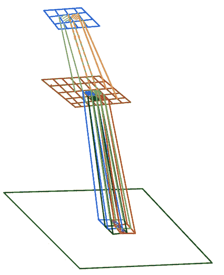

演示步幅为 2 的 2 x 2 池层的空间重叠推导。绿色矩形表示输入图像，而棕色矩形表示输入特征图，蓝色矩形表示输出特征图。相邻灰色和橙色输出条目之间的绝对空间重叠在输入图像上显示为紫色虚线区域。

空间重叠 P′等于绝对空间重叠 P(2-P)S 除以 S′。所以我们有 P`(S，P) = P(2-P)S/((2-P) S)=P/(2-P)。这个结果是有意义的，因为它表明 P’总是小于 P，这表明跨距为 2 的 2×2 汇集层将总是减少相邻特征地图条目之间的空间重叠。例如，如果在应用合并操作之前，空间重叠为 2/3，那么在应用合并操作之后，空间重叠将减少到 2/4。

## 跨度为 1 的 3×3 卷积层的空间比例和重叠

这里，我们依靠与上一节中讨论的相同的推理路线，来推导步长为 1 的 3×3 卷积层的空间比例和重叠公式。让 S 和 P 表示输入要素地图条目的空间比例和重叠。此外，让 s′和 p′表示在步长为 1 的 3×3 卷积滤波器输出端的特征映射入口的空间比例和空间重叠。然后，我们可以将 3 x 3 卷积层的空间比例计算为 S`(S，P) = S + 4(1-P)S + 4(1-P) S。接下来，我们重点计算空间重叠。特别是，计算步长为 1 的 3 x 3 卷积滤波器的输出要素地图的绝对空间重叠比计算步长为 2 的 2 x 2 合并图层的空间重叠更简单，如下图所示。

在下图中，绿色矩形表示输入图像，而棕色和蓝色矩形表示步长为 1 的 3 x 3 卷积层的输入和输出特征图。注意，步长 1 导致特征图的空间维度不变，因此输入和输出特征图的空间维度都是 4 x 6 x 1。在此，不失一般性，我们着重于计算相邻灰色和橙色输出要素地图条目之间的空间重叠。由于步幅 1，这两个输出条目在输入特征图上的重叠感受野是 3×2，并由棕色输入特征图上的紫色阴影区域表示。

这个 3×2 的显式重叠区域简化了计算灰色和橙色输出条目之间的空间重叠的绝对值。特别是，它们的绝对空间重叠等于属于 3 x 2 紫色重叠区域的输入要素地图条目的聚合空间比例。可以看出，绝对空间重叠等于 S + 3(1-P)S + 2(1-P) S。在该示例中，在输入图像上被标记为蓝色阴影区域的项 S 对应于紫色阴影区域的第二行第一列上的条目。此外，3 个术语(1-P)在输入图像上用黑色、红色和绿色区域标记，并且相对于第二行和第一列上的条目对应于顶部、右侧和底部条目。最后，2 个术语(1-P)在输入图像上被标记为棕色区域，并且对应于紫色重叠区域的右上和右下条目。因此，空间重叠 P`(S，P)=(S+3(1-P)S+2(1-P)S)/S `=(1+(1-P)(5–2P))/(1+4(1-P)(2-P))。

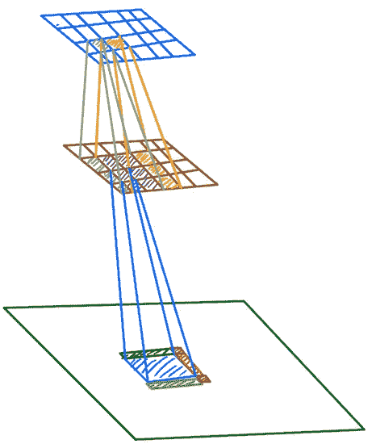

演示步长为 1 的 3 x 3 卷积层输出特征图的空间重叠计算。绿色矩形表示输入图像，而棕色矩形表示到 3×3 卷积层的输入特征映射，蓝色矩形表示 3×3 卷积层的输出特征映射。输入棕色特征图上方的紫色阴影区域表示两个相邻输出特征图条目灰色和橙色的感受野的 3×2 重叠区域。这两个相邻输出条目之间的绝对空间重叠被标记为输入图像上 6 个区域(蓝色、黑色、红色、绿色、棕色和棕色)的并集。

## 案例研究-具有 20 个 3 x 3 卷积层的 CNN

通过使用步长为 1 的 3 x 3 卷积图层和步长为 2 的 2 x 2 最大合并的派生空间比例和重叠公式，我们展示了应用合并图层以增加要素地图条目的有效空间比例的重要性。对于我们的示例，我们考虑 20 层 CNN 的以下两种变化:(1)20 层 CNN，具有 20 个 3×3 CNN 层，跨度为 1，没有池层，下图中的蓝色曲线(2)20 层 CNN，具有 20 个 3×3 CNN 层，跨度为 1，与 2×2 最大池层交错，跨度为 2，每 4 个 CNN 层，下图中的红色曲线。

在下面绘制的曲线中，x 轴是图层深度，y 轴是由 CNN 图层在 x 轴指定的深度生成的要素地图条目的空间比例宽度(空间比例的宽度等于空间比例的平方根)。如您所见，在这两种情况下，要素地图条目的空间比例都会随着图层深度的增加而增加。然而，具有汇集层的 CNN(红色曲线)的空间比例增长率是指数的，而没有汇集层的 CNN(蓝色曲线)的空间比例增长率是线性的。具有合并图层的 CNN 的空间比例的指数增长率导致其最终要素地图条目具有 243 x 243 的空间比例，而没有合并图层的 CNN 的最终要素地图条目的空间比例仅增长到 50 x 50。这意味着由具有汇集层的 CNN 生成的特征地图可以编码在输入图像中捕获的大到 243 x 243 像素的对象，而没有汇集层的 CNN 只能编码大到 50 x 50 像素的对象。

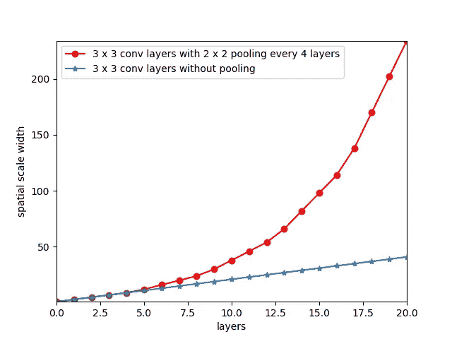

两个都具有 20 个 3x3 CNN 层的 CNN 的空间尺度的比较；红色曲线:每 4 个 3x3 CN 层 2x2 最大池化；蓝色曲线:只有 3x3 CNN 层，没有池。x 轴:层深；y 轴:特定于图层的空间比例宽度。具有汇集的 CNN 的空间尺度增长率是指数的，而没有汇集的 CNN 的空间尺度增长率是线性的。

# 空间比例剖面

在设计 CNN 架构时，有必要聚集训练数据集中的对象维度的统计，并检查所设计的 CNN 架构的特征图是否提供了跨越对象维度直方图的所有主要模式的空间尺度。 ***我们称 CNN 的逐层空间尺度，为其空间尺度轮廓。作为最佳实践，有必要首先基于训练数据集的对象维度直方图来设计空间尺度轮廓，然后根据空间尺度轮廓要求来设计 CNN 架构。***

例如，在这里，我们计算 ResNet-50 (50 层)的空间比例剖面。如前所述，CNN 架构中的池化操作可以通过使用显式池化层或选择大于 1 的卷积滤波器步长来实现。对于 resnet([用于图像识别的深度残差学习](https://arxiv.org/abs/1512.03385))，跨距大于 1 的 CNN 卷积滤波器和显式池层都用于减少相邻特征地图整体之间的空间重叠。在[用于图像识别的深度残差学习](https://arxiv.org/abs/1512.03385)中给出的 5 种 ResNet 架构(下表所示的 18 层、34 层、50 层、101 层和 152 层)中，我们导出了 ResNet-50 的空间尺度轮廓。然而，给出的结果可以很容易地扩展到其他 4 个配置。在 ResNet50 中，使用了三种类型的池操作:(1)步长为 2 的 7×7 卷积滤波器(2)步长为 2 的 3×3 最大池层(3)步长为 2 的 1×1 卷积滤波器。

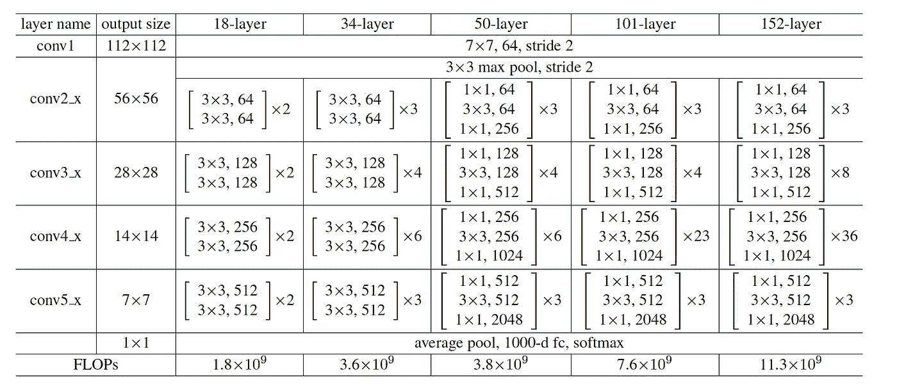

ResNet-18、ResNet-34、ResNet-50、ResNet-101 和 ResNet-152 配置。对于 ResNet-50，下采样按以下顺序执行:第一层(跨度为 2 的 7x7 卷积层)、第二层(跨度为 2 的 3x3 最大池层)和跨度为 2 的 1x1 卷积层，作为 conv3_1、conv4_1 和 conv5_1 块的第一层。

跨距为 2 的 7×7 卷积层仅被用作 ResNet-50 的第一层。因此，可以简化其输出空间比例和重叠计算。特别地，7×7 卷积滤波器的每个特征映射入口输出的空间尺度是 7×7，因为它们直接应用于输入图像。此外，相邻要素地图条目之间的绝对空间重叠等于 7 x 5。因此，其相应的空间重叠将等于(7×5)/(7×7)= 5/7。

跨距为 2 的 3 x 3 最大池层仅用作 ResNet-50 的第二层。让 S 和 P 分别表示输入特征地图条目的空间比例和重叠，S’和 P’表示输出特征地图条目的空间比例和空间重叠。3 x 3 汇集图层的空间比例等于 3 x 3 卷积图层的空间比例。因此，我们得到 S`(S，P) = S + 4(1-P)S + 4(1-P) S。另一方面，我们需要使用我们已经针对其他图层讨论过的相同技术，推导出跨度为 2 的 3 x 3 池图层的空间重叠。我们可以将空间重叠计算为:P`(S，P) = (1+ 2(1-P)) / (1+4(1-P)(2-P))。

在 ResNet-50 的不同深度使用了跨度为 2 的 1 x 1 卷积层作为主要汇集操作，以减少相邻要素地图条目之间的空间重叠，并确保要素地图条目的空间比例呈指数增长。接收域为 1×1 的 1×1 卷积滤波器在应用于特征地图时不会改变特征地图条目的空间比例。但是，跨距为 2 时，它们会修改要素地图条目的空间重叠。设 P 和 P’分别表示应用步长为 2 的 1×1 卷积层之前和之后的特征映射条目的空间重叠。然后，我们可以计算 P`(S，P) = 2 max(P - 0.5，0)。这意味着，如果输入特征映射表项的空间重叠小于 0.5，则输出特征映射表项的空间重叠将为零，因为 1×1 卷积滤波器的感受域仅为 1×1，并且步长 2 确保它们相邻的输出表项没有重叠的感受域。因此，为了具有非零的空间重叠，必须从网络的前几层进行。

下图绘制了 ResNet-50 的空间比例剖面图，其中 x 轴横跨 ResNet-50 的各层，y 轴表示 ResNet-50 各层的空间比例宽度(空间比例宽度等于空间比例的平方根)。可以看出，ResNet-50 中使用的汇集操作导致 ResNet-50 的空间规模以指数速度增长，这是层深度的函数。特别地，由 ResNet-50 生成的最终特征图具有 483×483 像素的空间比例，这意味着其特征图条目对嵌入在输入图像中的大至 483×483 像素的对象的表示进行编码。此外，我们观察到 ResNet-50 的空间尺度是分段常数，这是由主要在 ResNet-50 中使用的步长为 1 的 1×1 卷积层引起的，以对特征图进行通道维度缩减。

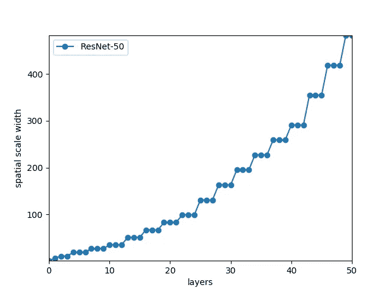

ResNet-50 的空间比例剖面图，其中 x 轴横跨 ResNet-50 的各层，y 轴表示 ResNet-50 各层的空间比例。ResNet-50 的空间尺度剖面显示，作为层深的函数，逐层空间尺度呈指数增长。

# 多比例特征地图

在本节中，我们将讨论为什么针对不同视觉任务的大多数 CNN 架构依赖多尺度特征图来提高其检测、分类和回归性能。答案相当简单明了。在自然图像中捕获的对象以各种像素维度来表现它们自己。例如，如果一辆汽车距离摄像机 5 米远，那么与它距离摄像机 50 米远的情况相比，它在图像中显得更大。因此，对于这个示例，我们需要两个具有不同空间比例的特征地图，其中一个适用于汽车距离摄像机 5 米的情况，另一个适用于汽车距离摄像机 50 米的情况。注意，即使具有较大空间比例的特征地图(当它离摄像机 5 米远时匹配汽车图像)也能够封装当它离摄像机 50 米远时的汽车图像，但是它不能为 50 米远的汽车提供准确的表示，因为它在图像汽车周围的空间比例不够紧密，并且包含来自场景中其他物体的大量信息泄漏。

在具有不同像素维度的图像中出现的对象的问题被称为图像的*，并且连同遮挡和相机视点变化一起，使基于视觉的检测系统变得复杂。设计用于解决图像比例模糊的最著名的非基于 ML 的方法是[比例不变特征变换](https://en.wikipedia.org/wiki/Scale-invariant_feature_transform) (SIFT)。可以说，SIFT 一直是深度学习多尺度特征地图图像编码器的主要灵感。SIFT 依靠图像金字塔(将输入图像调整到不同的比例，并在处理输入图像的每个比例版本后聚合检测到的关键点)和具有不同σ的高斯平滑滤波器来检测不同比例的斑点，作为输入图像的关键点。当自然图像中存在尺度模糊时，检测具有不同尺度的斑点使得 SIFT 生成可靠的图像编码。*

*由对应于输入图像的给定 CNN 生成的语义表示是由 CNN 的每个卷积层生成的所有特征图的联合，而不仅仅是最终特征图。依靠几幅特征图提供不同空间尺度的网络。*

## *用于目标检测模型的多尺度特征图*

*可以肯定地说，在基于 CNN 的视觉模型领域，多尺度特征图的优势最初表现在 2d 对象检测模型上。特别是 [SSD:单次多盒探测器](https://arxiv.org/abs/1512.02325)依靠 [VGG-16](https://arxiv.org/abs/1409.1556) 作为骨干网络(特征生成器)，通过 6 个不同空间尺度的特征图对输入图像进行编码。特征图的不同空间尺度允许 SSD 检测嵌入在输入图像中的具有不同像素维度的对象。*

*再如，[用于目标检测的特征金字塔网络](https://arxiv.org/abs/1612.03144) (FPN)使用 ResNet-50 和 ResNet-101 作为主干网络来生成多尺度特征地图。在 ResNet-50 的情况下，选择 conv2_3(第 11 层)、conv3_4(第 23 层)、conv4_6(第 41 层)和 conv5_3(第 50 层)的特征地图输出，以提供不同空间比例的特征地图。使用我们在上一节中介绍的 ResNet-50 的空间比例配置文件，我们可以将 conv2_3、conv3_4、conv4_6 和 conv5_3 的输出要素地图的空间比例分别计算为 35 x 35、99 x 99、291 x 291 和 483 x 483。因此，所选择的特征图可以表示输入图像中出现的不同大小的对象。*

****然而，FPN 的主要贡献是利用深层特征图中编码的语义信息，增强了浅层特征图的语义表示能力。*** 浅层生成的特征图的主要弱点是语义不如深层生成的特征图丰富。是因为输入图像的语义编码到特征图的过程是一个层次化的过程，意味着基本语义出现在早期的层特征图中，而更复杂的语义出现在更深层的特征图中。*

*为了更好地理解为什么这将是对象检测模型的一个问题，考虑以下以 ResNet-50 作为主干网络的例子。假设一辆汽车距离摄像机 50 米，它是通过一个 35×35 像素的方框在输入图像中捕获的，因此由 conv2_3(第 11 层)生成的特征图是对其进行编码的最佳候选。此外，假设第二辆汽车距离摄像机 5 米远，并且其在输入图像中的对应框具有 480×480 像素的尺寸，因此 conv5_4(第 50 层)最适合对其进行编码。有理由假设这两辆车具有相似的语义复杂度，与它们在输入图像中的大小无关。但是，我们知道 ResNet-50 的第 11 层在语义上不如 ResNet-50 的第 50 层丰富。*

*FPN 使用自上而下的路径来解决这个问题，该路径经由最近邻上采样操作将由较深层编码的语义传送到较浅层，以确保传送的较深特征地图的空间维度与较浅特征地图的空间维度相匹配(较浅层特征地图具有更大的空间维度，其特征在于较深层的地图)。下图演示了这一过程。来自较深层和较浅层的语义的合并通过在 1×1 横向卷积层下较深层的上采样特征图和较浅层特征图的变换版本的逐元素相加来实现。最后，为了确保由这些元素相加操作生成的特征图不会受到混叠效应的影响，它们使用 3×3 卷积层进行过滤。*

*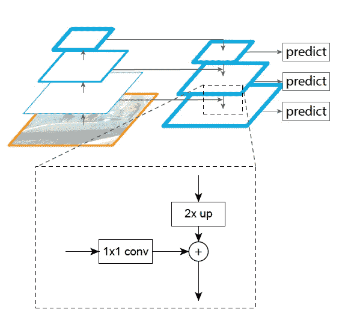*

*FPN 模块，通过右侧自上而下的分支将较深层的丰富语义转移到较浅层。*

# *扩张的回旋*

*在本节中，我们将重点介绍 2016 年首次推出的扩张卷积层([通过扩张卷积进行多尺度上下文聚合](https://arxiv.org/abs/1511.07122))。与常规卷积滤波器不同，扩展卷积滤波器对输入特征图进行稀疏采样，以增加输出特征图的空间比例。因此，您可以将它们视为跨距大于 1 的池图层和卷积图层的替代方案，以增加 CNN 要素地图的空间比例。扩展卷积滤波器基于嵌入在它们的卷积滤波器中的孔来执行输入特征图的稀疏采样，这不同于没有孔并且依赖于输入特征图的密集局部采样的常规卷积滤波器。*

*为了更好地理解如何将膨胀卷积滤波器应用于输入要素地图，在下图中，我们在左侧(红色标记)显示了常规 3 x 3 卷积滤波器的卷积运算，在右侧(蓝色标记)显示了膨胀率为 2 的膨胀 3 x 3 卷积滤波器的卷积运算。如您所见，扩展卷积滤波器通过跳过(跳过被称为孔洞)每个维度中的每隔一个输入条目来对其输入要素图执行稀疏采样。换句话说，膨胀率为 2 意味着卷积滤波器对输入特征图的每个 2 x 2 区域只采样一个条目。因此，一般来说，n 的膨胀率相当于对输入特征图的每个 n×n 区域采样一个条目。注意，常规卷积滤波器是膨胀率为 1 的膨胀卷积滤波器的特例。*

*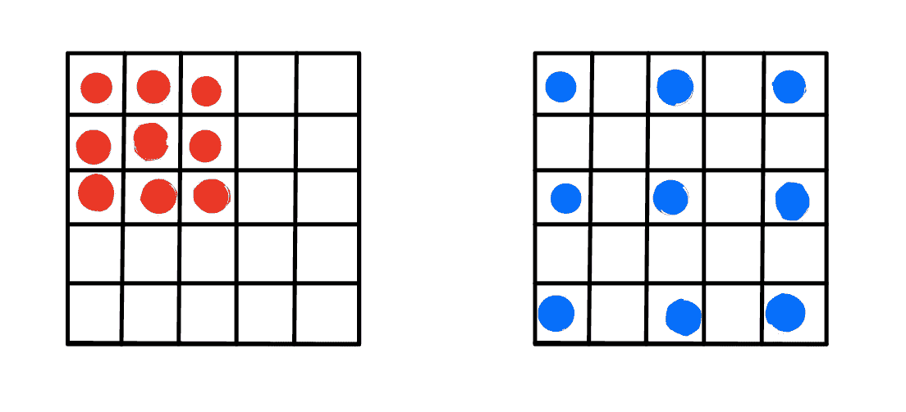*

*左:常规 3 x 3 卷积滤波器，右:膨胀率为 2 的膨胀 3 x 3 卷积滤波器*

*扩张卷积依赖于其感受野中的孔来增加其输出特征地图条目的空间比例。具体而言，扩展卷积滤波器的感受域中的空洞(跳跃)减少了采样的输入特征映射表条目之间的空间重叠，这导致输出特征映射表条目的空间比例增加。在上面的例子中，扩张率为 2 的扩张卷积滤波器在每两个连续的采样条目之间跳过一个特征映射条目，这导致采样特征映射条目之间的空间重叠减少。如果相邻输入要素地图条目之间存在非零空间重叠，则扩展卷积滤波器的有效空间比例将大于常规卷积滤波器的空间比例。*

*在这里，首先，我们推导出计算步长为 1、扩展速率为 2 的扩展的 3×3 卷积滤波器的空间尺度和重叠的公式，然后，我们将它们的空间尺度的增长率与步长为 1 和 2 的常规 3×3 卷积滤波器的增长率进行比较。让 S 和 P 分别表示输入要素地图的空间比例和重叠。此外，让 s’和 p’分别表示跨距为 1 和扩张率为 2 的扩张的 3×3 卷积滤波器的输出特征图的空间比例和重叠。然后，对于 P < 0.5, then S` will be equal to 9 times of the input spatial scale S, which is the maximum increase in spatial scale that we can expect from dilated 3 x 3 convolution filters with dilation rate of 2\. In order to compute P`, two formulas are derived based on whether P < 0.5 or P > 0.5 的特殊情况，我们可以计算出 S`(S，P) = 9S - 24Max(P - 0.5，0)S .如果 P < 0.5, then P`(S,P) = 15P / [9 — 24Max(P — 0.5, 0)] and if P > 0.5，那么 P`(S，P)=[6+3(1-P)-(14+4(1-P))Max(P-0.5，0)]/[9–24 Max(P-0.5，0)]。*

*接下来，我们比较了步长为 1 和扩张率为 2 的扩张型 3×3 卷积滤波器与步长为 1 和 2 的常规 3×3 卷积滤波器的空间尺度增长率。在下图中，我们根据图层深度绘制了对比图。蓝色曲线指的是一个 5 层卷积网络，其中所有 5 层都是步长为 1、膨胀率为 2 的膨胀卷积层。红色曲线是由 5 个步长为 2 的规则 3×3 卷积层组成的 5 层卷积网络，绿色曲线对应的是由 5 个步长为 1 的规则 3×3 卷积层组成的 5 层 CNN 网络。y 轴表示分层空间尺度宽度，其中空间尺度宽度等于空间尺度的平方根。*

*正如可以观察到的，具有步距 1 和扩张率 2 的扩张的 3×3 卷积层和具有步距 2 的常规 3×3 卷积层都显示了作为层深度的函数的空间尺度的指数增长率，而具有步距 1 的常规 3×3 卷积层的增长率是线性的。也就是说，扩张的 3×3 卷积层的空间尺度增长率大于步长为 2 的常规 3×3 卷积层的空间尺度增长率。特别地，扩展卷积层的最终特征图的空间比例是 243×243 像素，而跨度为 2 和 1 的 3×3 卷积层的最终特征图的空间比例分别等于 63×63 和 11×11。*

*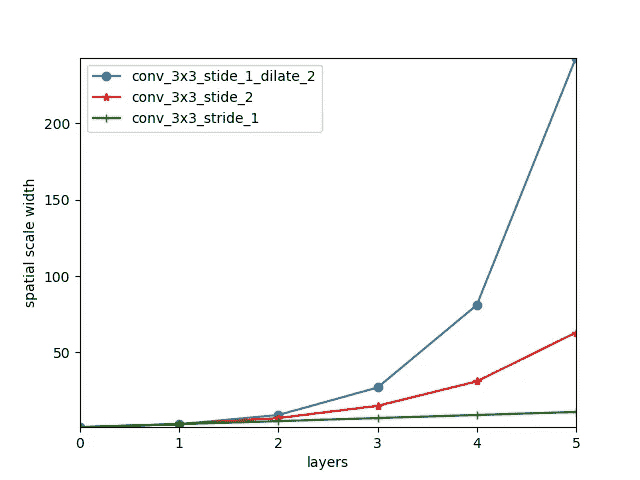*

*步长为 1 且扩张率为 2 的扩张的 3×3 卷积层、步长为 2 的常规 3×3 卷积层和步长为 1 的常规 3×3 卷积层的逐层空间尺度宽度的比较。x 轴表示层深度，而 y 轴表示对应于每个层的空间尺度宽度。虽然步长为 1 且扩张率为 2 的扩张的 3×3 卷积层和步长为 2 的常规 3×3 卷积层都显示了作为层深度的函数的空间尺度的指数增长率，但是步长为 1 的常规 3×3 卷积层仅显示了空间尺度的线性增长率。*

*尽管步长为 2 的常规 3×3 卷积滤波器显示了与扩展卷积滤波器相似的空间尺度的指数增长率，但是步长为 2 的常规卷积滤波器在每次将特征地图应用于特征地图时都会导致特征地图的空间维度(宽度和高度)减半。如前所述，合并操作(如跨距大于 1 的显式合并层和跨距大于 1 的卷积层)依赖于降低要素地图的空间维度，以增加要素地图条目的空间比例。另一方面，扩张卷积滤波器基于它们的步幅 1 保持特征图的空间维度。 ***保持特征图的空间维度，同时通过扩张卷积滤波器以指数增长率增加其空间尺度，使其能够兼容具有密集预测的视觉任务。****

*具有密集预测的视觉任务的例子是语义分割、实例分割、深度估计和光流。例如，在语义分割的情况下，目标是对每个输入图像像素的类别进行预测。换句话说，如果输入图像是 W×H 像素，那么为语义分割设计的 CNN 预计会为像素类生成 W×H 预测。与执行像图像分类这样的稀疏检测任务的 CNN 相比，针对这种密集预测的 CNN 需要具有更高分辨率(更大空间维度)的特征图。对于像图像分类这样的稀疏预测视觉任务，CNN 只需要为整个输入图像输出单个预测，因此高分辨率特征图不像密集预测任务那样重要。*

****对于密集预测视觉任务，每个像素对应的预测既要基于嵌入在该像素局部邻域的信息，也要基于称为图像上下文的全局信息*** 。例如，考虑单目(单个相机)深度估计任务，像像素是建筑物的一部分这样的全局信息向网络提供像素深度的粗略估计，而像纹理这样的局部特征帮助网络进一步改进其对像素深度的估计。 ***保持特征图中像素的局部邻域信息需要卷积层保持特征图的空间维度，这就是为什么步长为 1 的扩张卷积滤波器对于密集预测视觉任务是必不可少的。****

*步长为 1 的扩展卷积滤波器保持了特征图的空间维度，这不足以确保由这些卷积滤波器生成的特征图准确地编码了像素的局部邻域信息。特别是，我们需要步长为 1 的扩展卷积滤波器将它们的空间比例限制在局部邻域内。也就是说，具有显著的空间尺度指数增长率的扩张卷积滤波器也适用于编码全局图像上下文信息。 ***事实上，一个设计良好的 CNN 网络受益于并行的具有一系列不同膨胀率的膨胀卷积滤波器，以编码一组具有一系列不同空间尺度的特征图，从而同时表示局部和全局信息。*** 这种思想被用在下面的论文中。*

*在[用于单目深度估计的深度有序回归网络](https://arxiv.org/abs/1806.02446)中，他们使用三个平行的膨胀卷积层(下图中称为 ASPP 模块)生成不同空间尺度的特征图，其核大小为 3×3，膨胀率为 6、12 和 18。这三个具有不同膨胀率的卷积层被应用步长 1 和零填充，以确保它们的输出特征图具有相同的空间维度，以便沿着它们的信道维度被连接。由这 3 个扩展卷积层生成的特征图的逐通道级联的统一特征图结果是具有 3 个不同空间尺度的多尺度特征图，其对特征图的每个条目的局部和全局信息进行编码。*

*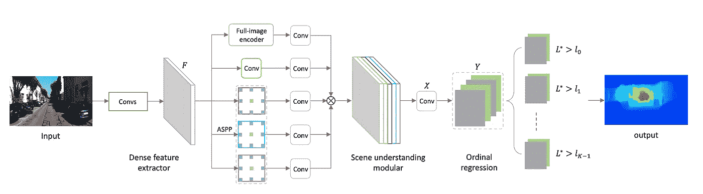*

*由 ASPP 表示的三个平行分支是 3×3 的扩张卷积层，扩张率为 6、12 和 18。*

# *下一步*

*该项目的下一步是为更多数量的卷积和汇集层变体导出空间比例和重叠公式，并将它们添加到代码库中。*