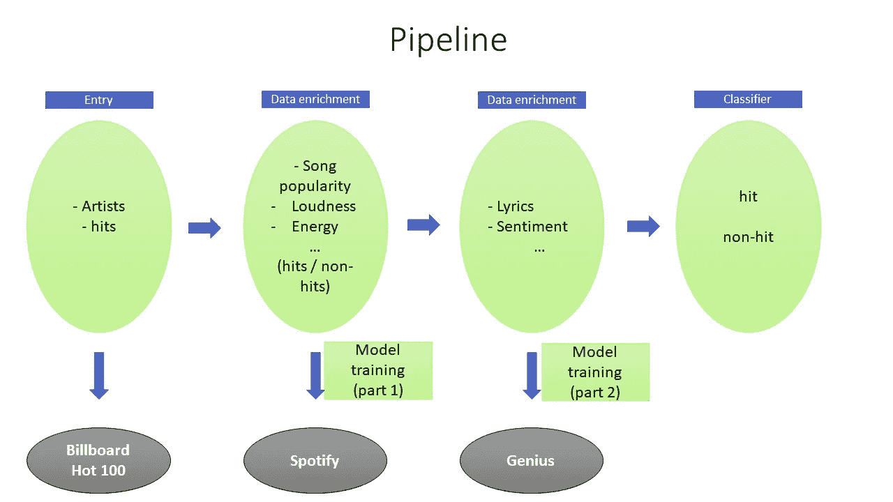
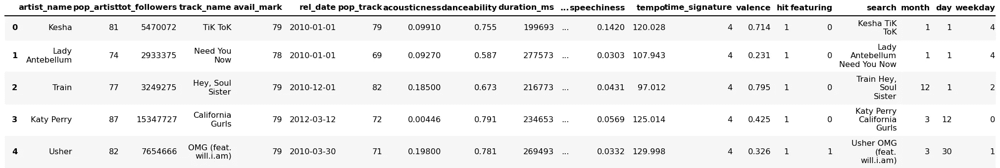
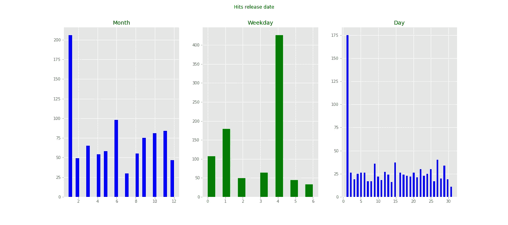
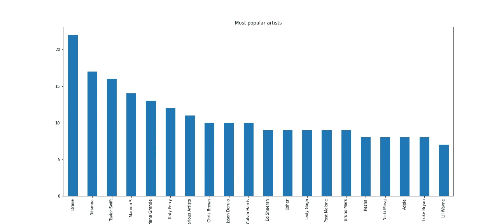
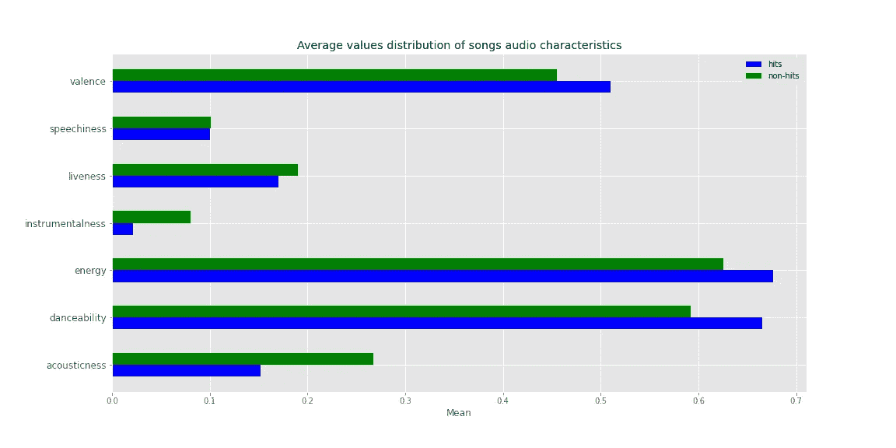
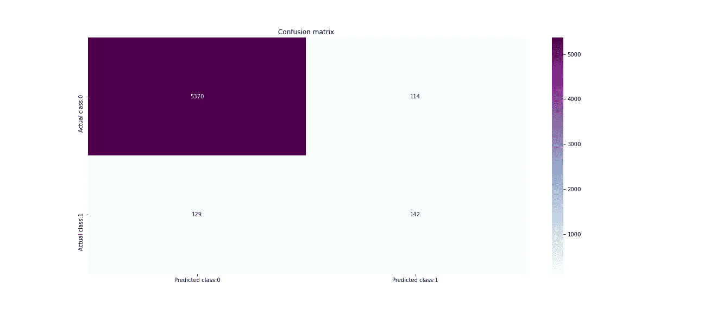
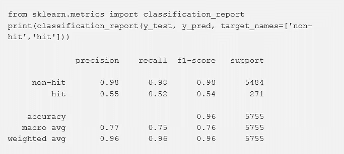

# Billboard 下一首热门歌曲的分析与预测(上)

> 原文：<https://towardsdatascience.com/analysis-and-prediction-of-billboards-next-hit-songs-part-1-6eb1062077cc?source=collection_archive---------34----------------------->

利用 Spotify 和 Billboard 的数据来理解是什么让一首歌成为热门。

图片来自[https://www . max pixel . net/Circle-Structure-Music-Points-Clef-Pattern-Heart-1790837](https://www.maxpixel.net/Circle-Structure-Music-Points-Clef-Pattern-Heart-1790837)

每年有成千上万的歌曲在世界各地发行。有些在音乐界非常成功；其他人不太喜欢。事实上，在这个行业取得成功仍然是一项艰巨的任务。投资制作一首歌需要各种活动，会消耗大量资源。很少有唱片公司会资助研究，以发现他们即将发行的歌曲在多大程度上可能成为音乐热门。

我对音乐的好奇心促使我花一些时间研究这个课题。对许多人来说，德雷克近年来成功的秘诀是他作为艺术家的风格；对其他人来说，这主要是因为他的恶名。一般来说，在解释为什么一首歌很受欢迎，而另一首却不是的时候，观点并不是单向的；或者一个艺术家在创作一首歌的时候应该优先考虑什么，如果他想让这首歌红起来的话。

这篇由两部分组成的文章是我在过去几周一直从事的项目的快照。我使用数据科学技术来了解流行歌曲的特征，更准确地说，如何可能仅根据歌曲的音频特征和歌手的个人资料来预测歌曲的流行程度。我建立了一个机器学习模型，可以将一首歌归类为热门与否。

虽然社会因素，如歌曲播放的背景，听众的人口统计数据，以及营销活动的有效性，也可能在它的病毒式传播中发挥重要作用，但我假设歌曲的固有特征，如演唱它的艺术家的简介，它的持续时间，它的音频特征可能是相关的，也揭示了它的病毒式传播。

作者图片

**我的数据**

我不能从一个单一的来源得到一个包含所有变量的数据集。为了克服这个问题，我借助了数据丰富技术，使用了以下三个数据源:Billboard、Spotify 和 Genius。

先用美人汤收集了 2010-2019 年 [Billboard 年终热门 100 首](https://en.wikipedia.org/wiki/Billboard_Year-End_Hot_100_singles_of_2019)歌曲的列表，以每年 100 首的速度。然后，使用 Spotipy 包来恢复与歌曲音频特征相关的数据，例如可跳舞性、乐器性、活跃度等。，一方面；另一方面，与艺术家的简档相关的那些，例如追随者的数量、受欢迎程度等。对于先前恢复的同一时期的热门歌曲和其他非热门歌曲。

最后， [Genius](https://genius.com/) 将主要用于检索已经收集的所有歌曲的歌词。

在我们的数据集中，如果一首歌在报告期内的任何一年中至少一次出现在 Billboard 年终热门 100 强排行榜上，就被认为是热门歌曲。换句话说，我们的模型的任务是预测一首歌是否会进入 Billboard 的 100 首最受欢迎歌曲名单。

使用的工具:

*   从 [Spotify](https://www.spotify.com/) 音乐平台获取数据的 Spotify 包
*   seaborn 和 matplotlib 用于数据可视化
*   熊猫和 numpy 进行数据分析
*   LightGBM 和 scikit-learn 库，用于构建和评估模型

**特性**

Spotify 是世界上最大的流媒体平台之一。像 Twitter 或脸书一样，它提供了一个 API(应用程序编程接口)，以便开发者可以与它庞大的音乐数据库进行交互。通过这个 API 的端点，我能够收集超过 22，000 首歌曲的数据；每首歌都有二十多个变量。

API 返回的变量信息丰富多样。然而，我只选择了那些被认为与工作相关的。然后，使用特征工程技术对它们进行转换，以便为训练模型准备尽可能好的数据集。在这里，您将找到[中使用的每个变量的描述。一般来说，项目的完整代码可以通过这个链接访问。](https://github.com/JBobyM/Data-Science-Projects)

其中一些变量仅用于分析，其他变量则涉及整个流程的各个阶段。现在让我们看看数据集的前五个观察值是什么样的。

我们数据集的前五个观察值，包含来自 24 个变量的 19 182 个观察值。

**数据可视化**

就在构建模型之前，我想通过可视化来探索一下数据；尽管这项工作的主要目标不是进行全面的探索性分析。

图一

根据上面的图表，一月是发行更多热门歌曲的月份；七月是最少被要求的。我们还注意到，这段时间的大部分点击都发生在一周的第四天；也就是周四。最后，月初一多用来发表一首歌。

基于这一观察，我们可以推断出在 1 月 1 日发表一首歌可能是朝着优化其病毒式传播的机会迈出的一步。我们仍然必须小心:相关性不是因果关系。为了使这一结论更加准确，我们必须进一步分析。

我继续想象，想知道在这段时间里哪些艺术家录制了最多的热门歌曲。不出所料，下图显示，德雷克、蕾哈娜和泰勒·斯威夫特等艺术家在此期间的点击率比其他任何人都高。也就是说，如果一首歌包含这些艺术家之一的声音，它更有可能被广泛传播。

图 2

去理解是什么让一首歌成为热门；而另一个则不然，研究这两个类别的音频相关变量势在必行。这就是我想要得到的，关于这两类变量分布的想法。

图 3

这两个类别中的主要变量是相同的:能量，可舞性和化合价。唯一的区别是，对于热门歌曲类别，这些变量的平均值更高。这证明了热门音乐更快更响亮。他们更适合跳舞，更倾向于激发喜悦、欢乐和兴奋。

**机器学习方法**

到目前为止，我们已经发现了一些关于数据的有趣见解。为了缩短这篇文章，让我们直接进入关于使用的机器学习算法的部分。

我想建立一个模型，根据一组解释变量来预测一首歌最有可能属于哪个类别，热门还是非热门，正如本文开头所解释的那样。

在其原始状态下，收集的数据还不能用于训练机器学习模型。所以我治疗他们；首先，使用 SMOTE 技术，因为与非热门类别相比，热门歌曲类别的代表性不足，然后通过使用其他特征工程技术来标准化数据。

此外，我想要一个性能尽可能好的模型。为此，我训练了几个算法，并根据选定的评估标准比较了结果。结果表明，LightGBM 分类算法在训练时能够更好地检测出解释变量和待预测变量(hit)之间的模式。

**混乱矩阵**

对于模型的第一级性能分析，我们将使用混淆矩阵。混淆矩阵的可视化将允许我们理解我们的分类器与测试子集相比所产生的错误。

这个矩阵衡量一个分类系统的质量。在二元分类中，主对角线代表被模型正确分类的观察值；和次对角线，那些分类不正确的。因此，该模型最常犯的错误是将一首歌曲分类为非热门歌曲，而实际上它是热门歌曲(129 例)，更准确地说是第二类错误。

第一类错误是模型把宋在非命中(误命中)的情况下归类为命中；而第二类错误，则相反；也就是说，它将一首音乐分类为未命中，但它却被命中(假未命中)的情况。如果我们试图理解一个音乐制作人的心理，第一类错误比第二类错误更不可接受。我们不想承担与制作和推广一首歌曲相关的所有费用，因为一个模特已经预测这首歌会很受欢迎，但最终却不会。类型 I 误差的值应该是最小的。

**分类报告**

分类报告显示从混淆矩阵中的数据计算出的统计数据。每个指标描述了分类的不同方面。我们将使用此报告对模型进行二级性能分析。

准确度是 96%,它全面衡量了模型执行的正确分类的百分比。由于测试子集是不平衡的，这个百分比被过度表示的类(在本例中为非命中类)拉伸。所以这个指标不是我们能使用的最好的。

召回衡量模型对每个类别正确分类的事件的百分比。当预测类别与实际类别匹配时，分类是正确的。一方面，从我们用来测试模型的 5484 首非热门歌曲中，98%被正确分类。另一方面，该算法只正确分类了我们提交给它的 271 首热门歌曲中的 52%。你就明白了:算法把一首热播的歌归类为热播(真热播)比把一首非热播的歌归类为非热播(真非热播)更难。

非命中类和命中类的精度级别分别为 0.98 和 0.55。这意味着模型归类为非热门的所有歌曲中的 98%实际上都是非热门的；而且，只有 55%它预测会成功的歌曲是真的。

> 当涉及到非热门歌曲时，我们的模型反应更好。这很可能是因为从一开始这个类就有更多的数据。因变量的非命中模态和其他解释变量之间的模式检测可能因此而受到青睐。

一旦对模型的表现感到满意，我就决心去了解在确定一首给定歌曲的类别时最有影响力的解释变量。这就是为什么我在下面使用了情节重要性。

图 4

我们可以看到，一首歌在 Spotify 上的受欢迎程度是预测它最有可能属于哪个类别的过程中最重要的变量。然后，艺术家在 Spotify 上的受欢迎程度、他的粉丝数量以及这首歌在哪些市场上销售，构成了这一过程中的第二波决定性变量。最后主要是与具有相对相似影响水平的歌曲的音频相关的变量。

这一分析引起了人们对一些重要问题的关注。从本质上来说，如果一首歌在 Spotify 上很受欢迎，由一位在 Spotify 上也很受欢迎并拥有大量粉丝的艺术家演唱，最后，如果这首歌在世界上最大数量的国家都能听到，那么这首歌就是热门歌曲。这个结论似乎是合乎逻辑的，而且……🙂我们的模型也验证了这一点。

为了更好地理解这一结论的相关性，应该记住，Billboard 的年终 100 首音乐排行榜主要基于商业方面。事实上，这个排名忠实地反映了美国的实物和数字销售、广播收听和音乐流媒体；所有直接或间接的创收活动。

这首歌在 Spotify 上越受欢迎，在线收听的次数就越多。；更多的流媒体可以转化为更多的收入，因为在用户听完每首歌曲后，流媒体平台会向艺术家或音乐公司支付费用。这位艺术家在 Spotify 上的受欢迎程度以及他在 Spotify 上的粉丝数量，这些渠道放大了流量和销售额，这将有助于增加他的音乐带来的收入。

音乐产生的收入越多，它就越有可能在年底登上 Billboard 的 100 首音乐排行榜；因此，它也越有可能被我们的模型排名命中，因为根据我们的重要性图，主要决定音乐收入水平的变量在排名过程中最有影响力(逻辑，不是吗😉？).

通常，歌曲还有一个我们还没有考虑到的重要特征:歌词。是否可以通过使用歌词来进一步增加模型的性能？这是我们将在文章的第二部分探讨的内容。

一如既往，我欢迎建设性的批评和反馈。你可以在 Twitter @ [jbobym](https://twitter.com/jbobym) 上找到我。