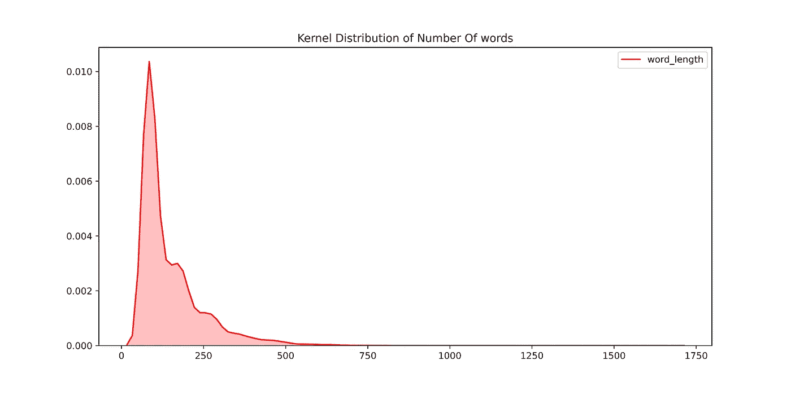
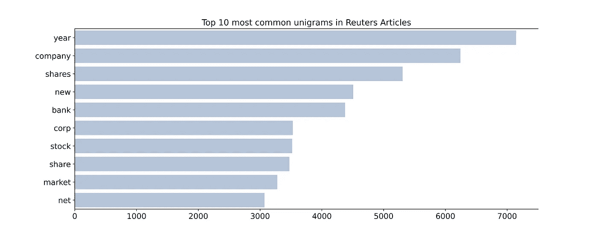
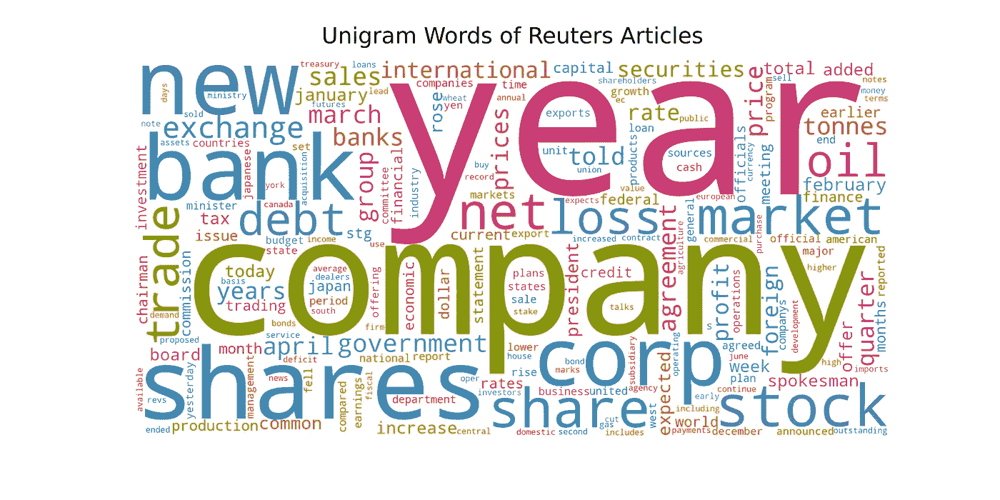
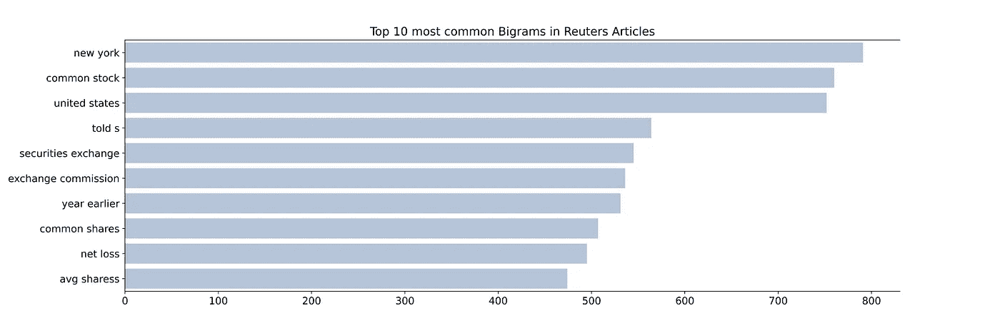
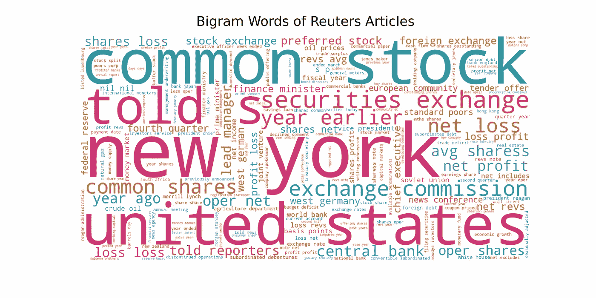
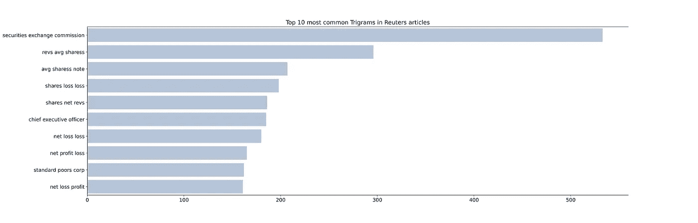
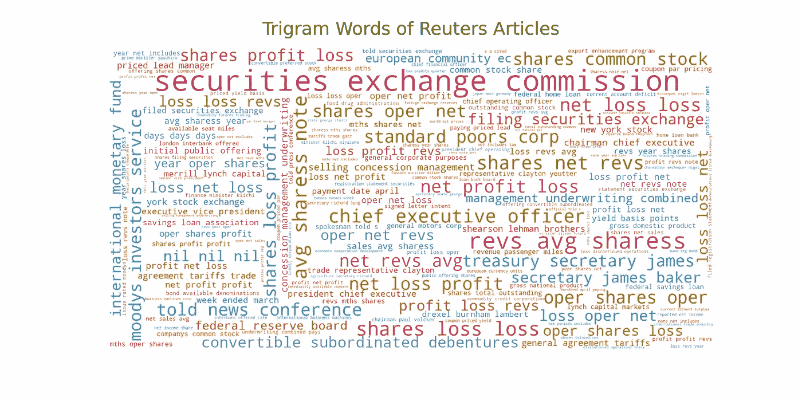
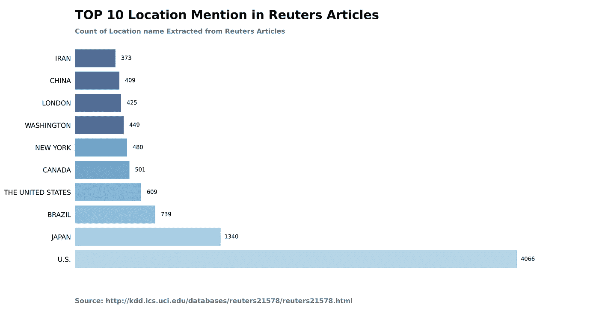
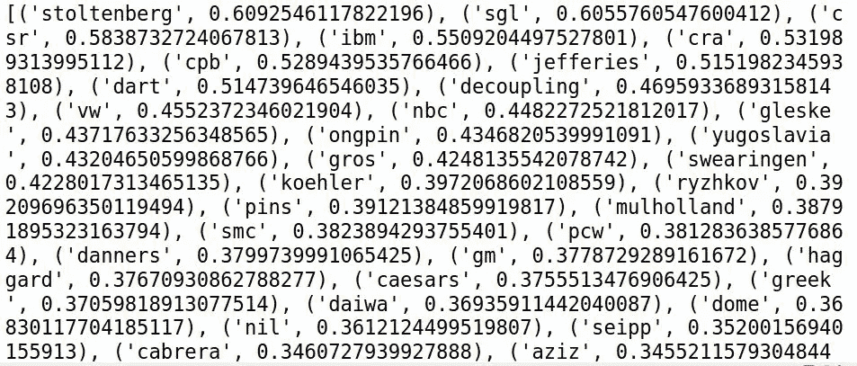

# 路透社文章的文本数据分析和可视化

> 原文：<https://towardsdatascience.com/analysis-and-visualization-of-unstructured-text-data-2de07d9adc84?source=collection_archive---------26----------------------->

## 借助 K-Means、N-gram、Tf-IDF、条形图、单词云、NER 等工具研究路透社的文章。方法

被困在付费墙后面？点击这里阅读这篇文章和我的朋友链接。


资料来源:Jaredd Craig-Unsplash

当我要求你解释文本数据时，你会怎么做？你将采取什么步骤来构建文本可视化的故事？在这里，我不打算解释你如何创建一个可视化的故事。

但是本文将帮助您获得构建可视化故事和解释文本数据所需的信息。

从文本数据中获得的洞察力将帮助我们发现文章之间的联系。它将检测趋势和模式。对文本数据的分析将把噪音放在一边，并揭示以前未知的信息。

这个分析过程也被称为探索性文本分析(ETA)。借助 K-means、Tf-IDF、词频等。方法，我们将分析这些文本数据。此外，ETA 在数据清理过程中也很有用。

我们还使用 Matplotlib、seaborn 和 Plotly 库将结果可视化为图表、单词云和绘图。

在分析文本数据之前，请完成这些预处理任务。

# 从数据源检索数据

有大量的非结构化文本数据可供分析。您可以从以下来源获取数据。

1.来自 Kaggle 的 Twitter 文本数据集。

2.使用 API 的 Reddit 和 twitter 数据集。

3.使用 Beautifulsoup 从网站上抓取文章并请求 python 库。

我将使用 SGML 格式的 [**路透社的文章**](http://kdd.ics.uci.edu/databases/reuters21578/reuters21578.html) 。出于分析目的，我将使用 Beautifulsoup 库从数据文件中获取日期、标题和文章正文。

使用下面的代码从所有数据文件中获取数据，并将输出存储在一个 CSV 文件中。

*1。您还可以使用 Regex 和 OS 库来组合或循环所有数据文件。*

*2。每篇文章的正文以<路透>开头，所以使用 find_all('reuters ')。*

*3。您还可以使用 pickle 模块来保存数据，而不是 CSV。*

# 数据清理过程

在这一节中，我们将删除诸如空值、标点符号、数字等干扰。从文本数据中。首先，我们删除文本列中包含空值的行。然后我们处理其他列的空值。

```
import pandas as pd import rearticles_data = pd.read_csv(‘articles_data.csv’) print(articles_data.apply(lambda x: sum(x.isnull()))) articles_nonNull = articles_data.dropna(subset=[‘text’]) articles_nonNull.reset_index(inplace=True)def clean_text(text):‘’’Make text lowercase, remove text in square brackets,remove \n,remove punctuation and remove words containing numbers.’’’ text = str(text).lower()
    text = re.sub(‘<.*?>+’, ‘’, text)
    text = re.sub(‘[%s]’ % re.escape(string.punctuation), ‘’, text)
    text = re.sub(‘\n’, ‘’, text)
    text = re.sub(‘\w*\d\w*’, ‘’, text)
    return textarticles_nonNull[‘text_clean’]=articles_nonNull[‘text’]\
                                  .apply(lambda x:clean_text(x))
```

*当我们删除文本列中存在的空值时，那么其他列中的空值也会消失。*

*我们已经使用 re 方法去除文本数据中的噪声。*

数据清理过程中采取的步骤可能会根据文本数据增加或减少。因此，请仔细研究您的文本数据，并相应地构建您的 clean_text()方法。

随着预处理任务的完成，我们将继续分析文本数据。

## 先说我们的分析。

# 1.路透社文章的长度

我们知道所有文章的长度是不一样的。因此，我们将考虑那些长度等于或超过一个段落的文章。根据这项研究，一个句子的平均长度是 15-20 个单词。一个段落中应该有四个句子。

```
articles_nonNull[‘word_length’] = articles_nonNull[‘text’].apply(lambda x: len(str(x).split())) print(articles_nonNull.describe())articles_word_limit = articles_nonNull[articles_nonNull[‘word_length’] > 60]plt.figure(figsize=(12,6)) p1=sns.kdeplot(articles_word_limit[‘word_length’], shade=True, color=”r”).set_title(‘Kernel Distribution of Number Of words’)
```



来源:作者图片

我已经删除了那些长度小于 60 字的文章。

*字长分布是右偏的。*

*大部分文章都在 150 字左右。*

包含事实或股票信息的路透社文章字数较少。

# 2.路透社文章中的常用词

在这一部分，我们统计文章中出现的单词并分析结果。我们基于 N-gram 方法分析单词计数。N-gram 是基于其 N 值的单词的出现。

我们将从文本数据中删除停用词。因为停用词是噪音，在分析中没有多大用处。

## 1.最常见的单字单词(N=1)

让我们在条形图和单词云中绘制单词。



来源:作者图片



来源:作者图片

股票，贸易和股票是一些最常见的词，基于股票市场和金融部门的文章。

因此，我们可以说，大多数路透社的文章属于金融和股票类。

## 2.最常见的二元词(N=2)

让我们为 Bigram 单词绘制条形图和单词云。

```
article_bigrams = defaultdict(int)
for tweet in articles_word_limit[‘temp_list_stopw’]:
    for word in generate_ngrams(tweet, n_gram=2):
        article_bigrams[word] += 1df_article_bigrams=pd.DataFrame(sorted(article_bigrams.items(),
                                key=lambda x: x[1])[::-1])N=50# bar graph of top 50 bigram words
fig, axes = plt.subplots(figsize=(18, 50), dpi=100)
plt.tight_layout()
sns.barplot(y=df_article_bigrams[0].values[:N],
            x=df_article_bigrams[1].values[:N], 
            color=’red’)
axes.spines[‘right’].set_visible(False)
axes.set_xlabel(‘’)
axes.set_ylabel(‘’)
axes.tick_params(axis=’x’, labelsize=13)
axes.tick_params(axis=’y’, labelsize=13)
axes.set_title(f’Top {N} most common Bigrams in Reuters Articles’,
               fontsize=15)
plt.show()#Word cloud
wc = WordCloud(width=2000, height=1000, collocations=False,
               background_color=”white”,
               color_func=col_func,
               max_words=200,
               random_state=np.random.randint(1,8))\
               .generate_from_frequencies(article_bigrams)fig, ax = plt.subplots(figsize=(20,10))
ax.imshow(wc, interpolation=’bilinear’)
ax.axis(“off”)
ax.set_title(‘Trigram Words of Reuters Articles’, pad=24,
             fontdict=fd)
plt.show()
```



来源:作者图片



来源:作者图片

Bigram 比 unigram 提供了更多的文本信息和上下文。比如，股票损失 bigram 显示大多数人在股票上赔钱。

## 3.最常见的三元组单词

让我们为 Trigrma 单词绘制条形图和单词云。

```
article_trigrams = defaultdict(int)
for tweet in articles_word_limit[‘temp_list_stopw’]:
    for word in generate_ngrams(tweet, n_gram=3):
        article_trigrams[word] += 1
df_article_trigrams = pd.DataFrame(sorted(article_trigrams.items(),
                                   key=lambda x: x[1])[::-1])N=50# bar graph of top 50 trigram words
fig, axes = plt.subplots(figsize=(18, 50), dpi=100)
plt.tight_layout()
sns.barplot(y=df_article_trigrams[0].values[:N],
            x=df_article_trigrams[1].values[:N], 
            color=’red’)
axes.spines[‘right’].set_visible(False)
axes.set_xlabel(‘’)
axes.set_ylabel(‘’)
axes.tick_params(axis=’x’, labelsize=13)
axes.tick_params(axis=’y’, labelsize=13)
axes.set_title(f’Top {N} most common Trigrams in Reuters articles’,
               fontsize=15)
plt.show()# word cloud
wc = WordCloud(width=2000, height=1000, collocations=False,
background_color=”white”,
color_func=col_func,
max_words=200,
random_state=np.random.randint(1,8)).generate_from_frequencies(article_trigrams)
fig, ax = plt.subplots(figsize=(20,10))
ax.imshow(wc, interpolation=’bilinear’)
ax.axis(“off”)
ax.set_title(‘Trigrams Words of Reuters Articles’, pad=24,
             fontdict=fd)
plt.show()
```



来源:作者图片



来源:作者图片

大多数三元模型类似于二元模型。三元组单词比二元组单词更能帮助我们理解文本。但是不能提供更多的信息。所以这一节到此结束。

# 3.文本数据的命名实体识别(NER)标记

NER 是从文本数据中提取特定信息的过程。在 NER 的帮助下，我们从文本中提取位置、人名、日期、数量和组织实体。点击了解更多关于 [NER 的信息。我们使用](/automate-entity-extraction-of-reddit-subgroup-using-bert-model-336f9edb176e) [Spacy](https://spacy.io/) python 库来完成这项工作。



来源:作者图片

从这个图表中，你可以说大多数文章包含了来自美国、日本、加拿大、伦敦和中国的新闻。

*对美国的高度提及代表了路透社在美国业务的重点。*

*人物变量暗示 1987 年的著名人物是谁。这些信息有助于我们了解那些人。*

*这个组织变量包含了全世界最多提及的组织。*

# 4.文本数据中的唯一单词

我们将使用 TF-IDF 在文章中找到独特的单词。词频(TF)是每篇文章的字数。逆文档频率(IDF)在考虑所有提及的文章时测量单词的重要性。

对于那些在一篇文章中具有高计数而在其他文章中很少或不存在的词，TF-IDF 得分很高。

让我们计算一下 TF-IDF 得分，找出独特的单词。

```
from sklearn.feature_extraction.text import TfidfVectorizertfidf_vectorizer = TfidfVectorizer(use_idf=True)
tfidf_vectorizer_vectors=tfidf_vectorizer.fit_transform(articles_word_limit[‘text_clean’])
tfidf = tfidf_vectorizer_vectors.todense()
tfidf[tfidf == 0] = np.nan#Use nanmean of numpy which will ignore nan while calculating mean
means = np.nanmean(tfidf, axis=0)# convert it into a dictionary for later lookup
Means_words = dict(zip(tfidf_vectorizer.get_feature_names(),
                       means.tolist()[0]))
unique_words=sorted(means_words.items(),
                    key=lambda x: x[1],
                    reverse=True)
print(unique_words)
```



来源:作者图片

# 5.使用 K-Means 聚类文章

K-Means 是一种无监督的机器学习算法。它帮助我们在一个组中收集相同类型的文章。我们可以通过初始化 k 值来决定组或簇的数量。了解更多关于 [K-Means 和我们如何在这里选择 K 值](https://pythonprogramminglanguage.com/kmeans-text-clustering/)。作为参考，我选择 k=4 组成四组。

```
from sklearn.feature_extraction.text import TfidfVectorizer
from sklearn.cluster import KMeans
from sklearn.metrics import adjusted_rand_scorevectorizer = TfidfVectorizer(stop_words=’english’,use_idf=True)
X = vectorizer.fit_transform(articles_word_limit[‘text_clean’])
k = 4
model = KMeans(n_clusters=k, init=’k-means++’,
               max_iter=100, n_init=1)
model.fit(X)
order_centroids = model.cluster_centers_.argsort()[:, ::-1]
terms = vectorizer.get_feature_names()
clusters = model.labels_.tolist()
articles_word_limit.index = clusters
for i in range(k):
    print(“Cluster %d words:” % i, end=’’)for title in articles_word_limit.ix[i
                    [[‘text_clean’,’index’]].values.tolist():
    print(‘ %s,’ % title, end=’’)
```

它帮助我们将文章分类到不同的类别，如体育、货币、金融等等。K-Means 的准确率普遍较低。因此，这在低级分析中是有用的。

# 结论

NER 和 K 均值是我最喜欢的分析方法。其他人可能喜欢 N-gram 和独特的单词方法。在本文中，我介绍了最著名的、闻所未闻的文本可视化和分析方法。本文中的所有这些方法都是独一无二的，可以帮助您进行可视化和分析。

我希望这篇文章能帮助你发现文本数据中的未知。

**作者的其他文章**

1.  [EDA 的第一步:描述性统计分析](https://medium.com/analytics-vidhya/first-step-in-eda-descriptive-statistics-analysis-f49ca309da15)
2.  [为 Reddit Post: TextBlob 和 VADER 自动化情感分析流程](/automate-sentiment-analysis-process-for-reddit-post-textblob-and-vader-8a79c269522f)
3.  [使用罗伯塔模型发现 Reddit 子群的情绪](/discover-the-sentiment-of-reddit-subgroup-using-roberta-model-10ab9a8271b8)