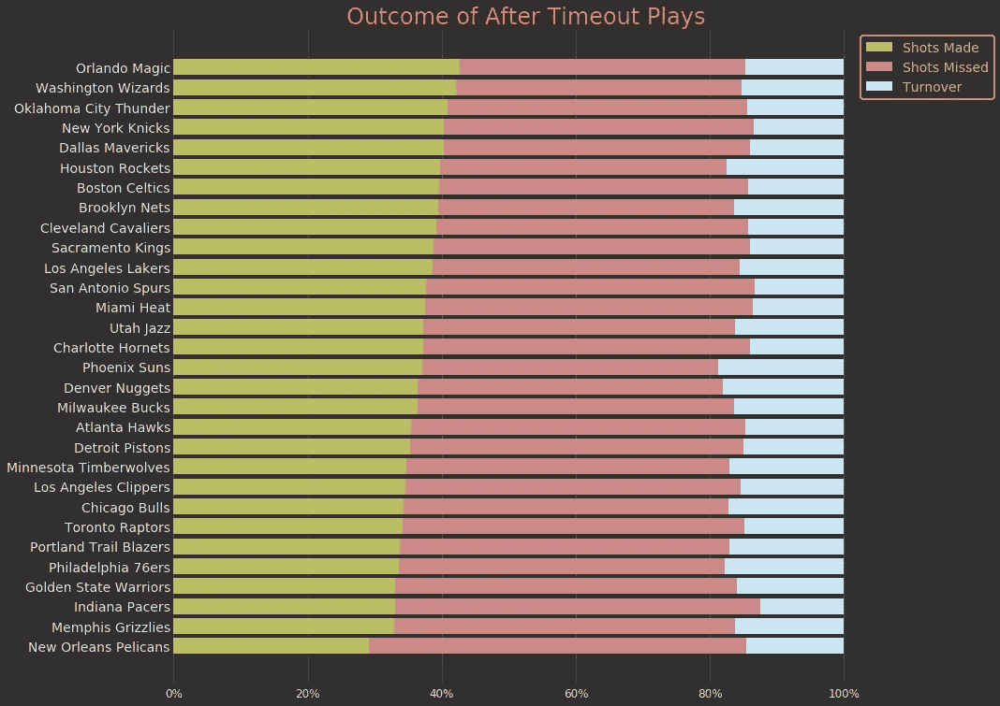
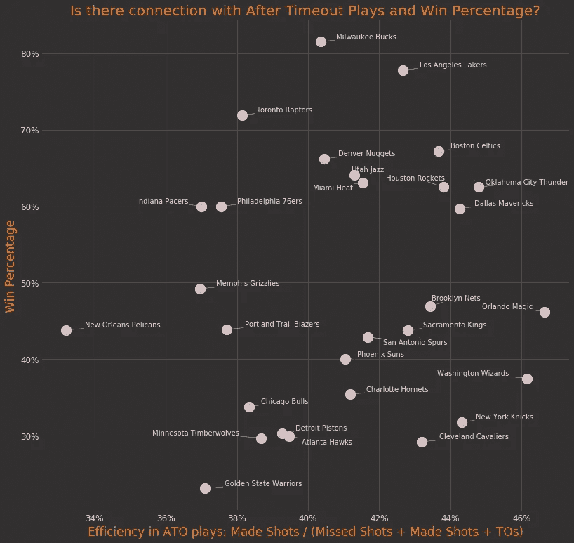
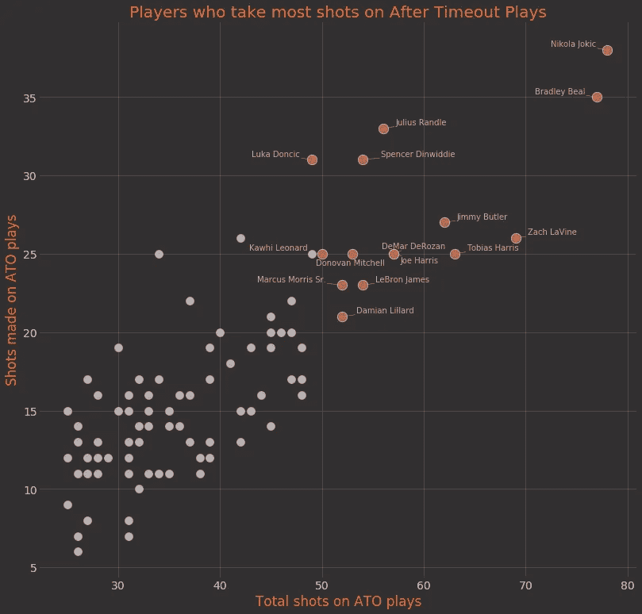
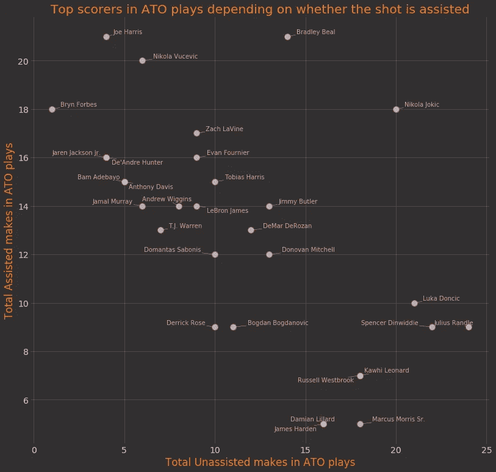

# NBA 暂停后比赛分析

> 原文：<https://towardsdatascience.com/analysis-of-after-timeout-plays-in-nba-f69952f74779?source=collection_archive---------35----------------------->

你经常听到教练因为他们在暂停(ATO)比赛后的平局和执行能力而受到表扬，但是，我们将看看 ATO 比赛的成功实现和球队的胜率之间是否有任何关联。此外，我将看看谁是执行这些相同行动的最成功的玩家。

# 数据

这些数据是通过 NBA 的逐场比赛数据收集的。我找到了今年赛季所有的暂停，总计 10905 次暂停。之后的目标是找到下一个动作。以下是所有发生的“下一步行动”,我过滤掉了替换:

*   错过的镜头:3927
*   投篮次数:3030 次
*   犯规次数:1463 次
*   营业额:1106
*   罚球:1095
*   跳球:100
*   违反次数:71 次
*   超时:53
*   游戏结束:31
*   进攻犯规:29 次

如您所见，这是相当不理想的数据，我们可以在这里过滤掉更多的内容。所以我也跳过了罚球(因为 TO 是在犯规之后/罚球之间被叫的)、暂停、跳球(和罚球一样)、违例(因为那是比赛的某种延迟，不影响动作)，把进攻犯规归为失误(事实就是如此)。我简单地删除了游戏结束的动作，因为我真的不能从它们中分辨出任何东西。其结果如下:

*   错过的镜头:4047
*   投篮次数:3121 次
*   营业额:1307
*   犯规次数:1136 次

# 团队成功

我想看的第一件事是这些团队在这些行动中有多成功。为了做到这一点，我看了看投篮不中/投篮命中和失误，以确定成功与否。我通过一个简单的条形图显示了这些动作的数量，见第一张图片。

作者图片

令我惊讶的是，奥兰多魔术队是迄今为止最成功的，其次是奇才队和雷霆队。排在第四位的尼克斯也相当令人意外。

鹈鹕队几乎是最后一名也让人有点意外。他们明显排在最后。

然而，所有其他数字都相对接近，没有人真正跳出来。

# ATO 的成功会产生“更好的团队”(更好的胜率%)吗？

号码

两者之间没有相关性，实际上，r 值几乎为零，这意味着没有正相关或负相关。

作者图片

第二个图表显示了 ATO 游戏的成功率和获胜百分比。我把 ATO 剧的成功定义为`made shots / (made shots + missed shots + turnovers)`。

到现在为止，你可能已经发现我完全忽略了犯规(除了进攻犯规，我把它归类为 TOs)，原因是推断那场比赛是否成功是相当复杂的，我真的不想探究那么深(我将来可能会……)。

# 看看最成功的球员

暂停后，处理投篮最多的球员是球队的明星和领袖。

作者图片

前面的图表显示了一些投篮次数最多的球员。

对我来说，这个图表中的惊喜是朱利叶斯·兰德尔、马库斯·莫里斯和乔·哈里斯。前两次是在尼克斯队，所以我想他们只是等了一下，然后开车/停车准备投篮。另一方面，乔·哈里斯是一个 3 分专家，所以在视频上检查可能是一件有趣的事情。

don ici、Dinwiddie 和 Randle 再次成为此类行动中效率最高的人。Joki 和 Beal 是在 ATO 剧中拍摄大量镜头的“老黄牛”。

# 无辅助与辅助拍摄

作者图片

最后一个图表解释了为什么兰德尔和莫里斯都有这么多镜头。他们每个人都创造了他们得分的几乎所有投篮机会(我们可以假设他们也创造了自己的投篮失误)。

在光谱的另一端，有乔·哈里斯和布林·福布斯。他们在左上角，在“中心之地”。他们都是三分专家，这个分析显示他们在这方面相当擅长。我看了看为哈里斯准备的剧本，很多都是画动作的。

对他来说是双重掩护，[由中锋掩护，由其他后卫切入/掩护](https://videos.nba.com/nba/pbp/media/2019/10/30/0021900059/252/ec71bc32-d34a-38b4-3fa2-2e87c6d4024e_1280x720.mp4)，这让哈里斯可以拿下三分。

卢卡·东契奇也给我留下了深刻的印象，但他的 ATO 风格与哈里斯相反。他的大部分投篮都是在无人帮助的情况下完成的，他要么奔向篮筐，要么后退一步停下来。他以一种令人印象深刻的方式创造了他的镜头。

# 结论

这只是暂停播放后的一个快速预览，你可以越来越深入，并观看录像带产生一些其他的结论。如果有可能做以下事情之一，那将会非常酷:

*   检查每一个动作的拍摄时间(你不能通过一个接一个的播放来获得，因为动作并不总是在 24 秒开始)
*   检查暂停后的镜头是否比通常的镜头更“开阔”
*   检查一个人在暂停后是否在投篮中带了更多的运球(即使在暂停后，我们也可以假设休斯顿的进攻是哈登/威斯布鲁克的 Iso，但这将证实这一点)
*   还有更多…

如果你想看更多我的东西，请访问我的[网站](https://www.bballytics.co/)、[脸书](https://www.facebook.com/bballytics/)或 [Instagram](https://www.instagram.com/bballytics/) 个人资料。如果你想查看代码，可以在我的 [Github](https://github.com/danchyy/Basketball_Analytics) 中找到。