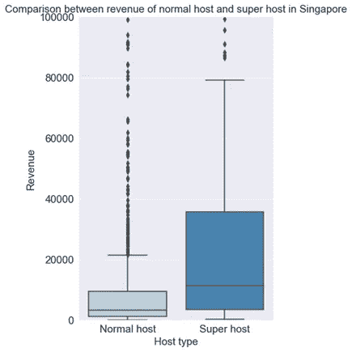

# 新加坡 Airbnb 分析

> 原文：<https://towardsdatascience.com/analysis-of-airbnb-in-singapore-4aa4b2bed82e?source=collection_archive---------41----------------------->

## 做 Airbnb 主持人价格和地点最好？

帕特里克·帕金斯在 [Unsplash](https://unsplash.com/?utm_source=unsplash&utm_medium=referral&utm_content=creditCopyText) 上的照片

随着共享经济中在线市场的兴起，许多人都想成为卖家或服务提供商。我将看看新加坡，新加坡允许普通房主出租部分或全部房屋至少 3 个月**。在受欢迎的酒店网站中，Airbnb 被选中，因为它是可靠的数据提供商。它从他们自己的网站上收集了所有的列表和评论，多达约 90，000 行数据。这将增加结果的可靠性，即使在数据清理之后。此外，还收集了客户的评论数据。**

**Airbnb 的数据可以在这里找到:[http://insideairbnb.com/get-the-data.html](http://insideairbnb.com/get-the-data.html)也可以在你自己国家的 Airbnb 上随意尝试分析一下！**

****为什么看评论？****

**当人们在网上购物或寻找酒店住宿时，他们会转向评论和推荐部分进行参考。以往顾客的评论通常被认为是可靠的，反映了他们对公司商品和服务的满意程度。因此，这引导他们决定是否应该资助一家公司。随着评论的访问变得容易，深入了解评论如何影响企业收入变得重要。在 Airbnb 的案例中，他们还根据审核分数将主机分为普通主机或超级主机。我们还将探讨普通主机与超级主机的主要区别。**

> **U 最后，我们将研究潜在的新主机如何决定价格、位置、服务周期和主机类型，从而在新加坡实现收入最大化。**

****数据清理****

**回想一下，Airbnb 提供了两种不同类型的数据，即房源(包括价格、卧室、位置等)。)以及评论。**

****对于 listings.csv****

**1)删除所有 NaN 值(缺失数据)**

**2)用 1 和 0 替换 host _ is _ superhost 超级主机，0 =普通主机)**

**3)将价格从字符串转换为整数(例如$84 到 84)**

**4)将“id”重命名为“listing_id ”,以匹配 reviews.csv 中的列标题**

****查看评论. csv****

**1)将日期拆分为年、月和日列，只保留年和月，以便进一步选择数据和检查高峰期**

****合并 reviews.csv 和 listings.csv****

**1)仅保留 2019 年的最低住宿<=365, property type either apartment or condominium. This is to fix variables to minimise confounders.**

**2) Calculated revenue based on minimum nights * price and then summing the rows with the same listing id (i.e est_rev=minimum_ nights * price * number of reviews)**

**3) Removed all listings with only 1 review (i.e price*min nights=revenue, which might be pulling down the average)**

**4) Removed year, day, date columns since they are already fixed or are not useful variables**

**The final dataframe looks like this**

****

**Image by Author**

****价格&基于位置**的收入**

**先说 Airbnb 的位置。这对于打算购买租赁物业并需要知道哪个位置将产生最高收入的主机来说是有用的。**

****

**作者图片**

**大多数 Airbnb 都位于主干道附近，或者在南部/商业区。这可能是因为新加坡的 Airbnb 的最短停留时间为 3 个月，Airbnb 的客户预计是来新加坡工作的外籍人士，他们更喜欢住在工作地点附近。**

**让我们看看基于 Airbnb 位置的收入。由于价格和收入的巨大差异，每个待评估区都采用中间值。**

****

**作者图片**

****

**作者图片**

**使用上述每个地区的价格和收入中值，以及新加坡的上市公司，我们可以看到，商业区周围的集群中的价格最高。事实上，离商业区越远，价格中位数就越低。这一趋势也遵循了地区收入的中位数，反映了基于到商业区距离的定价策略的有效性。然而，人们预计商业区的房价也会更高。该成本没有反映在模型中，但仍应予以考虑。**

**为了规避我们不知道的成本问题，另一种方法是记录中值价格低于其他地区但收入中值相对较高的地区。这意味着可能会有更频繁的预订，使位置更有吸引力，同时可能有更低的房地产成本。**

****

**作者图片**

**根据排名值，排名的积极变化反映了该地区的中值价格低于其同行，但中值收入较高。在该图中，Holland Village 的价格和收入变化最大。这将使它成为一个值得注意的地区。**

****基于季节/月份的预订和收入****

**接下来，我们可以看看预订高峰期。这将使主人能够更好地安排他们的时间来维护房子，积极地寻找顾客，或者相应地改变他们的价格。然而，由于可用数据是在进行审查的当月(即客户曾入住 Airbnb，现在正准备离开)，分析将围绕客户结束入住的时期进行。**

****

**作者图片**

**纵观 2019 年，高峰期为 7 月至 9 月。一个可能的理由是，7 月被认为是人们寻找新工作的黄金时期，也是公司财年结束的常见时期。这可能会导致更多的外籍人士结束他们在新加坡的生活，去寻找新的工作，或者因为他们的工作而被重新安置到另一个国家。因此，这将是主人为房子服务的好时期，可能会在 7 月前开始寻找新客户。**

****基于主机类型的收入****

**最后，在确定宿主如何成为超级宿主之前，检查宿主类型的重要性是至关重要的。**

****

**作者图片**

**特别是，超级主机的年平均收入为 11，180 美元，而普通主机的年平均收入为 3，135.50 美元。超级主机和普通主机赚取的收入之比为 3.57 (2dp)，看起来差距巨大。因此，由于潜在的更高收入，这将为主机努力成为超级主机提供有效的理由。**

****普通主机和超级主机的主要区别****

**既然超级宿主的重要性已经确定，那么目标就是找出是什么因素使得宿主成为超级宿主。这是通过对顾客评论的情感分析来完成的。在删除了意义不大或没有意义的单词之后，正常主机和超级主机的结果单词云如下:**

****

**作者图片**

**两个词云看起来都差不多，常用词应该解释为对主机的基本要求。然而，主要的想法是超级主机应该有一些关键词来区别于普通主机。这是通过选择每个词云中的前 10 个关键词并找到区分因素来完成的。这个因素原来就是‘有益’二字。一种解释是，东道主与客户有更大的接触，即使在租赁/合同中没有说明，也可能免费提供帮助。**

****假设和限制:****

**一个假设是在估计收入的计算中。等式是 est _ rev =价格*最低 _ 夜*评论数。每位顾客的停留时间可能不完全是要求的最少住宿时间，也不是每位顾客在停留后都要写点评。这意味着计算出的收入严重低估了实际收入。此外，主办方的主要目标是实现利润最大化，但没有关于房产成本的信息，这使得很难确定在哪个地区购买房产最合适。**

****结论****

**在分析了地点、时期和东道主类型后，主办的最佳地点可能是商业区(收入最大化)或荷兰村(预订量最大化)。他们可以选择使用该地区 Airbnb 的中间价格，以确保更一致的预订。维护和服务的高峰期将在 7 月至 9 月，主机可以在 7 月前寻找新客户。最后，主机状态是收入的一个重要变量，应该是主机的目标。为了实现这一点，主人应该超越提供基本的便利设施，并试图在顾客眼中更“有帮助”。**