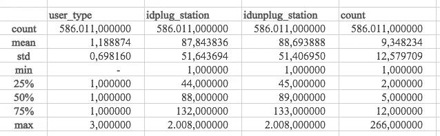
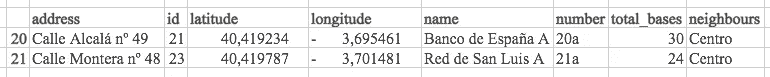
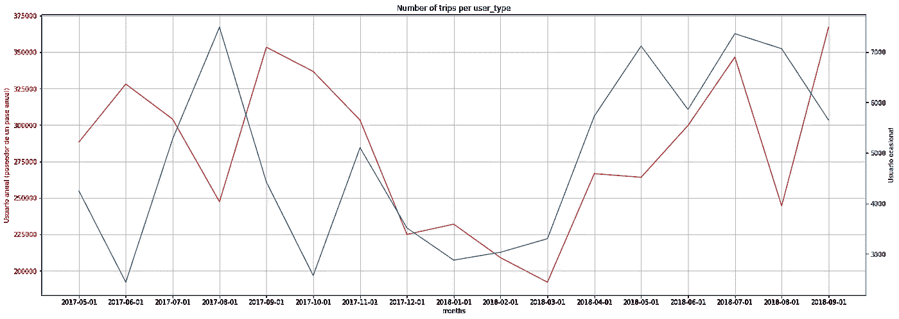
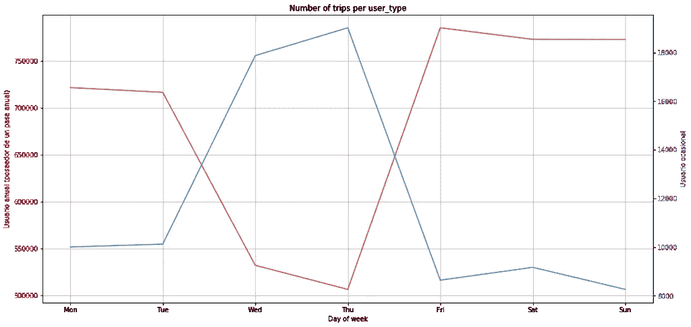
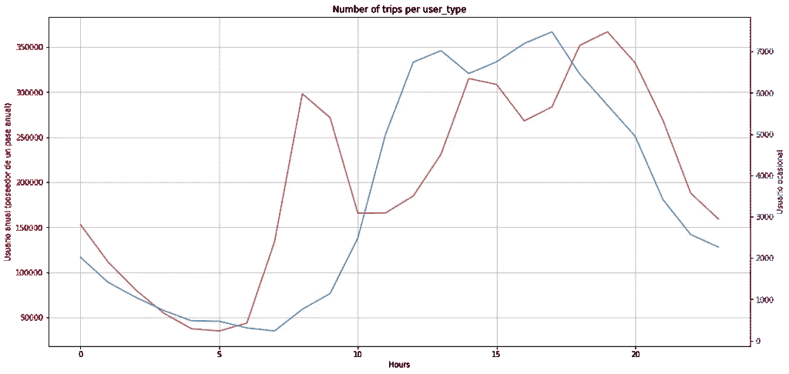
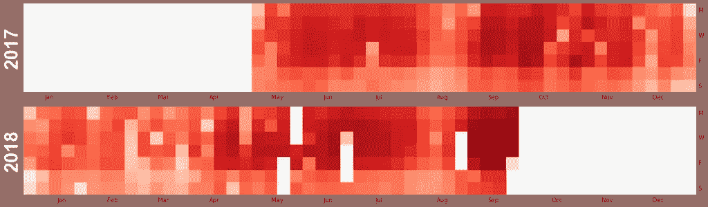
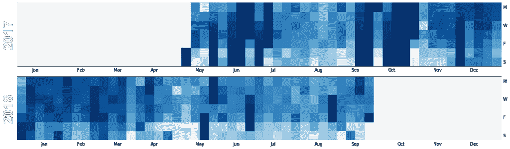
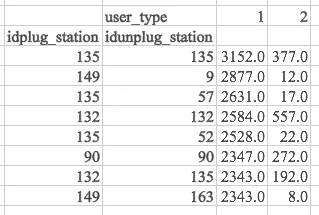
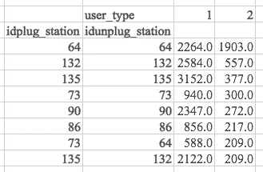

# 双模态出行分析

> 原文：<https://towardsdatascience.com/analysis-of-bicimad-trips-88ee2d0f7cdf?source=collection_archive---------57----------------------->

**在** [**上一篇文章**](/lets-analyze-e-bike-sharing-stations-of-madrid-e06b1c5af596) **中，我分析了 BiciMAD 车站的位置和特征，现在是时候继续分析以了解用户要去哪里以及最受欢迎的路线是什么，根据他们的类别 *user_type* (订户、临时用户……)进行聚类。**

请注意，本文中讨论的图表、数据集、Tableau 报告和 Python 笔记本可以在 [GitHub](https://github.com/simboli/Analysis-of-BiciMAD) 上找到(免费)。

# 资料组

为了对路线进行分析，我使用了马德里市交通局在其开放数据网站上提供的数据。从 2017 年 4 月到 2018 年 9 月，路线数据在 18 个存档中可用，JSON 文件也一样多。该文件的每一行都是一个首尾相连的 JSON，包含每次从底座上移除一辆电动自行车的信息(包括 EMT 雇主何时移除)。
总的来说，这些文件包含了超过 500 万次提款的详细信息，每个存档大小为 500 到 1500 Mb(压缩时)，值得注意的一点是，不幸的是，有 17 个压缩存档和 1 个 RAR 存档，这并不好，因为整个数据集太大，无法解压缩并导入到单个 Pandas 数据帧中。
出于这个原因，我选择走一条不同的路:我确定了一些要提取的信息，然后编程 Python 来提取每个月的 JSON 文件，打开它们并一次保存想要的信息。该脚本一次处理 25，000 行，然后将这些行汇总到几个 CSV 文件中。

EMT 公司还提供了一个简短的指南来理解每个字段的含义，该指南有西班牙语版本，可从[此链接](http://opendata.emtmadrid.es/Documentos/Servicios-y-estructuras-Bicimad-V1-1.aspx)下载。

# 缺失数据

乍一看，我们可以看到两个有趣的字段丢失了:自行车 ID 和用户 ID。缺少用户 ID 很可能是因为隐私原因，但我无法理解自行车缺少唯一标识符的原因。提取站点之间每辆自行车的使用信息(由用户和 EMT 雇主)会非常有趣。

# 分析目标

这项分析的目标是:

*   了解 BiciMAD 用户的习惯，特别是他们何时使用自行车以及出于何种目的；
*   了解用户是否有明显的细分；
*   了解 BiciMAD 用户骑自行车最频繁的旅行。

# 探索性数据分析

首先，我们评估我们所掌握的数据的数量和主要统计参数。

```
5478168
```

之后，我们验证插入和拔出工作站的 id 是否都存在于上一篇文章生成的注册表中。



一个显而易见的方面是，站点的最大值是 2008 年。从上一篇文章中，我们知道这些站是由一个从 1 到 175 的 ID 来标识的，所以 2008 是一个异常值。

## 2008 站

由于数据帧是由我制作的脚本生成的，我检查了 EMT 提供的原始数据中是否有转移到 2008 站的线路，以确保这不是我的错误。我取 2017 年 12 月的月份，因为(作为冬季月份)该文件肯定比其他月份小。
2008 年的值作为站点 ID 也出现在最初提供的数据中，因此它不是与我的数据汇总脚本相关的错误的结果。

直观地说，2008 可能是一个逻辑站的 ID，在那里放置有一些异常的自行车，例如，那些正在维修或被盗的自行车。对我来说，很难证实这一事实，但考虑到这些线只是总数中的几条，我可以将它们从数据框中删除，而不会对最终结果产生明显的伪造影响。

## 22 号站

路线中的另一个车站不在上一篇文章中创建的车站注册表中:车站编号 22。
通过两个简单的查询，我了解到该站可能仅在“2017-05-01”和“2017-12-01”之间活跃，现在它已经不存在了，但是 EMT 提供的关于该站的公开数据仅涵盖 2018 年 7 月至 9 月之间的几个月。

为了解决这个问题，我搜索了一些 BiciMAD 站的 2017 年地图，但没有获得有用的信息，因为地图上的站是用“数字”字段而不是“ID”标识的。

作为最后一次检查，我查看了 ID 为 22 的车站的上下两个车站。



从数据中，我们可以看到有一个站 20a。通常当 EMT 用字母表字母识别一个站时，这是因为至少有两个附近的站，但是在这种情况下，站 20b 丢失了:很可能我正在寻找的 ID=22 站实际上是数字 22b。

这些信息足以限制我的搜索范围:

*   ID=20 之间的一个站
*   它从 2017 年 5 月 1 日到 2017 年 12 月 1 日一直在那里

从谷歌地图上，我终于可以找到 ID=22 的车站，这是 20b 车站，直到几个月前还位于*卡莱阿尔卡兰 49* 。
由于 22 号站确实存在于过去，我决定不从文件中删除它的台词。


# trips 分析

在下图中，颜色**红色**标识年度会员用户，颜色**蓝色**标识临时用户，颜色**绿色**，最终标识 EMT 雇主。

首先，我将 EMT 提供的全部数据以月为粒度绘制在时间轴上，以了解自行车租赁数量是否存在季节性。

结果(如图所示)是这项服务有很大的季节性。我们可以看到，除了 8 月份红线(年度会员用户)下降之外，这两条线路在夏季都有一个高峰，这可能是因为在 8 月份，由于假期，许多办公室的工作量较轻，因此可以证明 *user_type=1* 使用自行车从家到工作场所往返。

从这个图表我们可以得出更多的结论:

*   在冬季，马德里的气温非常寒冷，因此两个用户类型*都喜欢少骑自行车出行，而不喜欢其他交通工具；*
*   从 *user_type=1* 到 *user_type=2* 的行程数之间有巨大的差距:它们是一起绘制的，但是检查 y 轴上左边和右边的刻度…它们有不同的数量级！



该图显示了 EMT 提供的整个月份中一周内每天的行程，因此从 2017 年 5 月到 2018 年 9 月。显然，年度用户在一周的第一个和最后一个工作日有一个使用高峰，而临时用户几乎有一个补充使用。



在这张图表中，我们可以看到一天中几个小时的行程变化。我认为红线支持这样的论点，即每年有很大一部分用户使用 BiciMAD 的电动自行车往返于家和办公室之间，我们可以很容易地看到用户从家通勤到工作场所(上午 7-9 点)，出去吃午饭(下午 2-3 点)，晚上 5-7 点回家。



在一系列的情节之后，我决定更进一步，看看 EMT 提供的整整一年半的时间，看看我是否能了解更多关于用户习惯的信息。出于这个原因，我决定制作 3 张*地图图*来了解工作日和整个时间线上的旅行分布。



这些图表向我展示了一些意想不到的数据，如果可能的话，这将是一个非常有趣的研究，可能会在未来的博客上发布:

*   在五月、六月和八月，有几天几乎没有来自 *user_type=1* (年度订户)的旅行，以及 user_type=2(临时用户)和 user_type=3(雇主)的爆炸式增长。这是非常可疑的！这可能是数据收集过程中的一个错误，或者可能是一些技术问题，阻止了年度用户使用他们的卡来租赁自行车，所以他们不得不作为临时用户进行租赁(许多 EMT 雇主正在努力解决这个问题)。
*   在周末有一个令人惊讶的 EMT 雇主使用自行车的高峰，如果他们在即将开始的一周内维护自行车或移动车队，这将是很有意思的。
*   2017 年 5 月第一周的前几天，没有一个 user_type=2 次出行…对吗？
*   在 2017 年 10 月期间，在 user_type=2 的图表中有深蓝色的日子，这意味着在这段时间内有大量的旅行，比之前和之后的几周都多。了解这一高峰的原因会很有趣，这可能是一些关于 BiciMAD 服务的营销活动。

对于这个分析，我研究的最后一点是总的环行程数。环形旅行是在同一个车站开始和结束的旅行。考虑到租赁自行车的价格，用户不太可能拔掉自行车的插头，例如去超市而不把自行车插到另一个底座上，然后回来，除非这是一个非常快速的差事。在 *user_type=2* 之间进行环形旅行的可能性更大，因为他们可以骑自行车游览马德里市和一些有趣的景点(例如 *Retiro park* )，比步行更快。

```
user_type 
0     5.336718 
1     2.444495 
2    10.882962 
3    31.754358 
Name: count, dtype: float64
```

正如我们可以看到的，组 2 的用户比组 1 的用户有更多的环行程。第三组(EMT 雇主)的环形行程也有令人惊讶的 31%，这可能表明大约 31%的“行程”是为了维护电动自行车，而不仅仅是为了移动车队！

如果我们看看 *user_type=1* 最频繁的旅行



并且*用户类型=2*



我们可以对环形旅行得出同样的结论。