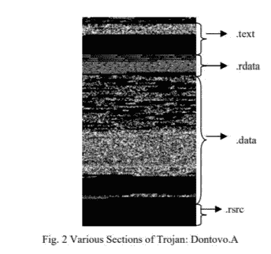
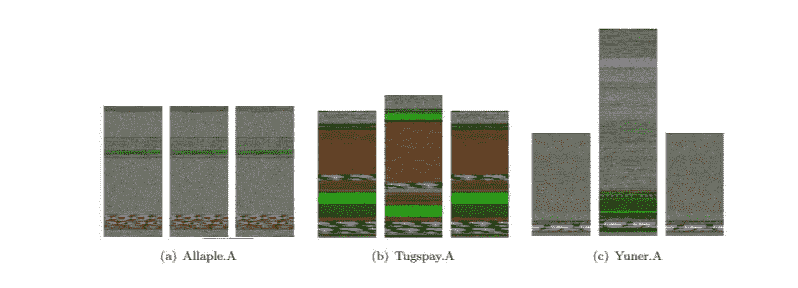
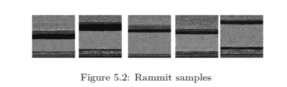
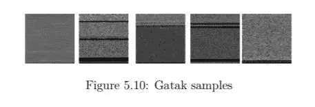

# 恶意软件分类中的计算机视觉技术分析

> 原文：<https://towardsdatascience.com/analysis-of-computer-vision-techniques-in-malware-classification-50b387479a62?source=collection_archive---------33----------------------->

## 恶意软件分类中使用的计算机视觉技术介绍

任何故意设计来对其所在系统造成损害的软件。主要类型有蠕虫、特洛伊木马和广告软件。如今，每年大约产生 350，000 个样本，这对于反病毒公司来说越来越困难，因为只有 50%的新恶意软件被报告，而在这 50%中，只有 20%能被现有的反病毒软件检测到。因此，快速计算会告诉 90%的新恶意软件不会被反病毒软件检测到。

用于对恶意软件进行分类的一些传统方法有

*   **沙盒检测::**在这里，任何可疑软件都在虚拟环境中运行，在虚拟环境中，它的行为可以被监控，并且基于它的行为，它可以反病毒，它将判断该软件是否是恶意的。但是这种方法可以被恶意软件绕过，恶意软件是如此之大以至于不能在虚拟环境中处理，恶意软件文件以不可识别的模糊文件格式保存，等等。沙盒检测属于基于行为的恶意软件检测。
*   **基于签名的检测:**这里反病毒公司为恶意软件创建一个签名，并在其数据库中更新它。因此，反病毒软件会将它扫描的软件的签名与反病毒公司数据库中的签名进行比较。如上所述，现在的问题是每天大约有 350000 个恶意软件被制造出来，公司很难为每个恶意软件创建签名。

来源:Reddit

所以现在反病毒公司正在使用深度学习技术来对抗恶意软件。在这里，我们将深入探究基于 CNN 的分类。

当归类为灰度图像时，特定类别的恶意软件图像的相似性首先见于[恶意软件图像:可视化和自动分类](https://www.researchgate.net/publication/228811247_Malware_Images_Visualization_and_Automatic_Classification)。在本文中，他们展示了特洛伊病毒的样子。

来源:[恶意软件图片:可视化和自动分类](https://www.researchgate.net/publication/228811247_Malware_Images_Visualization_and_Automatic_Classification)

。文本部分包含要执行的代码和。靠近结尾的文本部分是全黑的，表示结尾零填充。的。数据部分包含未初始化的代码和。rsrc 包含模块的所有资源，就像应用程序可能使用的图标一样。

来源:[使用图像表示的恶意软件分类](https://security.cse.iitk.ac.in/node/254)

上面的图片来自论文[使用图像表示法进行恶意软件分类](https://security.cse.iitk.ac.in/node/254)，他们展示了不同家族的恶意软件图片，对于一个家族，我们可以在图片中看到相似性。

在论文[中，针对恶意软件分类的卷积神经网络](https://www.covert.io/research-papers/deep-learning-security/Convolutional%20Neural%20Networks%20for%20Malware%20Classification.pdf)展示了常见恶意软件家族的图片，如 Rammit、Gatak(木马版本)等

来源:[用于恶意软件分类的卷积神经网络](https://www.covert.io/research-papers/deep-learning-security/Convolutional%20Neural%20Networks%20for%20Malware%20Classification.pdf)

来源:[用于恶意软件分类的卷积神经网络](https://www.covert.io/research-papers/deep-learning-security/Convolutional%20Neural%20Networks%20for%20Malware%20Classification.pdf)

# 结果已发布

*   因此，论文[恶意软件图像:可视化和自动分类](https://www.researchgate.net/publication/228811247_Malware_Images_Visualization_and_Automatic_Classification)，他们使用 GIST 来计算纹理特征，并使用欧氏距离的 K-最近邻来对它们进行分类。因此，本文的主旨是利用 Gabor 滤波器对图像进行小波分解。Gabor 滤波器是一种线性滤波器，主要在分析区域的特定方向上分析图像中的频率内容。它们用于边缘检测、纹理分析和特征提取。他们使用了来自 25 个家族的 9458 个恶意软件，准确率达到 98%
*   在论文[用于恶意软件分类的卷积神经网络](https://www.covert.io/research-papers/deep-learning-security/Convolutional%20Neural%20Networks%20for%20Malware%20Classification.pdf)中，他们训练了三个模型。

1.  1.CNN 1C 1D 频道、CNN 1C 2D 频道和 CNN 3C 2D 频道。CNN 1C 1D 由 NxN 像素(N=32)的输入层、卷积层(64 个大小为 11×11 的过滤图)、最大池层、密集连接层(4096 个神经元)、9 个神经元的输出层组成。结果是准确度:0.9857 和交叉熵:0.0968
2.  2.CNN 1C 2D 由 NxN 像素(N=32)的输入层、卷积层(64 个大小为 3×3 的过滤图)、最大池层、卷积层(128 个大小为 3×3 的过滤图)、最大池层、密集连接层(512 个神经元)、输出层组成。9 个神经元。结果是准确度:0.9976 和交叉熵:0.0231
3.  3.CNN 3C 2D 由 NxN 像素(N=32)的输入层、卷积层(64 个大小为 3×3 的过滤图)、最大池层、卷积层(128 个大小为 3×3 的过滤图)、最大池层、卷积层(256 个大小为 3×3 的过滤图)、最大池层、密集连接层(1024 个神经元)、密集连接层(512 个神经元)、输出层组成。9 个神经元。结果是准确度:0.9938 和交叉熵:0.0257

*   在论文[使用图像表示的恶意软件分类](https://security.cse.iitk.ac.in/node/254)中，他们使用了 2 个模型，一个 CNN 模型有 4 层(2 个卷积层和 2 个密集层)和一个 Resnet18。正常 CNN 的准确率为 95.24%，Resnet 的准确率为 98.206 %。

# 结论

如你所见，这些论文发布的结果显示，大约 95–98%的恶意软件被检测到，这表明计算机视觉技术比传统方法好得多。[使用图像表示的恶意软件分类](https://security.cse.iitk.ac.in/node/254)也显示了一个使用 CNN 和单词嵌入的模型，准确率约为 99.5%。

不仅是计算机视觉，一些研究人员也发表了一篇论文，使用了强化学习、自然语言处理等。

这些天来，攻击者也开始使用自动化，反病毒很难用过时的方法来保护我们的系统。

麦肯锡全球研究所的研究估计，人工智能和机器学习等技术驱动的自动化可以在未来半个世纪内以每年 0.8%至 1.4%的速度提高生产率。麦肯锡还估计，9 万亿至 21 万亿美元的全球经济价值创造取决于网络安全环境的稳健性。

深度学习能够实现非常好的准确性，而且与传统方法相比，它占用的硬件更少。所以也许这就是未来。

我希望这是一个很好的介绍，并将很快张贴我在这一领域的想法

再见，soon✌

> **参考:**
> 
> [1] *Ajay Singh* ，[使用图像表示的恶意软件分类](https://security.cse.iitk.ac.in/node/254) (2017)，*关键基础设施网络安全和网络防御跨学科中心*
> 
> [2]丹尼尔·吉尔伯特，[用于恶意软件分类的卷积神经网络](https://www.covert.io/research-papers/deep-learning-security/Convolutional%20Neural%20Networks%20for%20Malware%20Classification.pdf) (2016)， *IEEE*
> 
> [3] *L. Nataraj，S. Karthikeyan，G. Jacob，B. S. Manjunath* [恶意软件图像:可视化和自动分类](https://www.researchgate.net/publication/228811247_Malware_Images_Visualization_and_Automatic_Classification) (2011)， *Vison 研究实验室*
> 
> [https://www . welive security . com/WP-content/uploads/2018/08/Can _ AI _ Power _ Future _ malware . pdf](https://www.welivesecurity.com/wp-content/uploads/2018/08/Can_AI_Power_Future_Malware.pdf)
> 
> [https://techbeacon . com/security/anti virus-dead-how-ai-machine-learning-will-drive-cyber security](https://techbeacon.com/security/antivirus-dead-how-ai-machine-learning-will-drive-cybersecurity)
> 
> **务必查看我的个人资料:**
> 
> [https://github.com/rajanarasimhan](https://github.com/rajanarasimhan)
> 
> [https://www.linkedin.com/in/raja-narasimhan-645329171/](https://www.linkedin.com/in/raja-narasimhan-645329171/)
> 
> [https://rajanarasimhan . github . io ./](https://rajanarasimhan.github.io./)