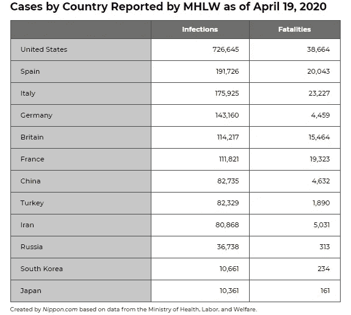
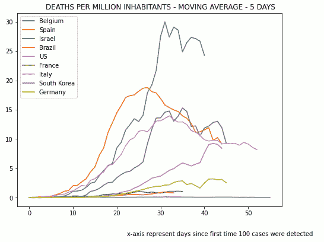
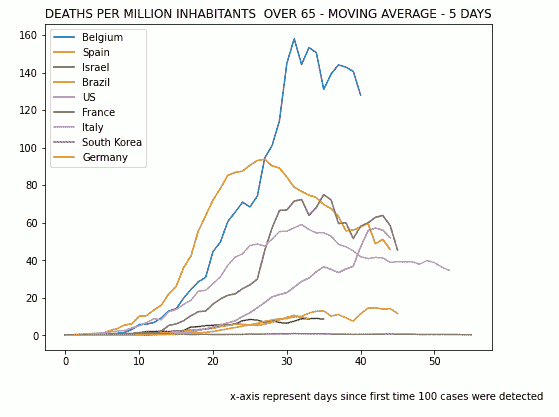
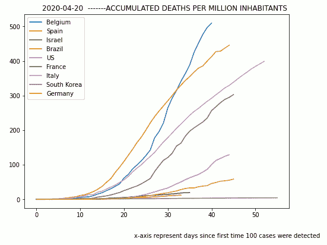
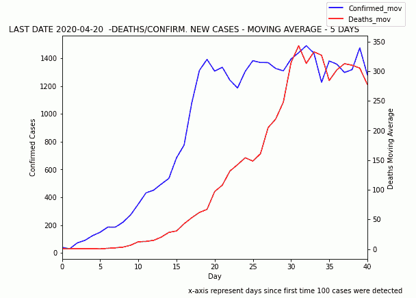
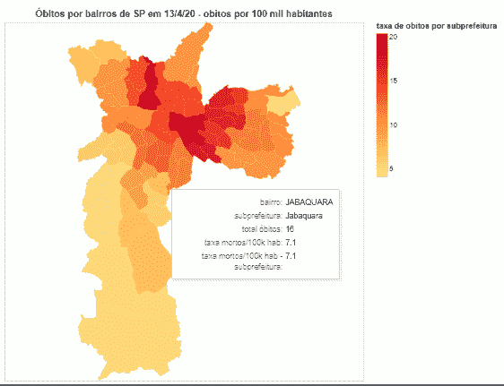

# 利用人均数据分析新冠肺炎

> 原文：<https://towardsdatascience.com/analysis-of-covid-19-using-per-capita-data-f8f9a31a2c4d?source=collection_archive---------37----------------------->

## 媒体报道通常不提供每百万居民的病例数，这改变了一切！

我们每天都被关于新冠肺炎病毒传播的表格、图表和文章轰炸；下表是一个典型的例子。

然而，简单地显示感染和死亡的总数并不能给我们提供太多的信息，因为我们是在比较完全不同的人群规模。中国人口是法国人口的 20 多倍。

如果我们想比较不同国家的行动，我们需要按照每百万居民的病例数来考虑疾病的传播。这个事实似乎是显而易见的，但是，它几乎从来没有被媒体或官方组织所应用。

此外，由于 80%以上的死者年龄在 65 岁以上，我们需要更进一步，检查每百万 65 岁以上居民的病例/死亡人数。当比较不同的国家，或者在同一个城市的不同社区时，这是正确的。

值得注意的是，还有其他一些问题难以彻底理解新冠肺炎传播。主要是，我们在获取可靠数据方面存在许多问题:

*   许多病例是无症状的，所以即使我们能检测所有的病人，我们也不能得到真实病例的可靠数字。
*   许多国家未能对所有患者进行检测，并且在获得结果方面存在滞后。因此，这些结果应追溯报告。
*   死亡人数没有同等统计，因为许多国家，如英国，只报告在医院的死亡人数

由于各国之间的数据质量差异很大，为了进一步改进我们的比较，有必要:

*   对一段时间内的数据进行平均，以减少数据中的噪音
*   在相同的时间基础上绘制数据，例如时间零点是检测到 100 个病例的时间。

我现在描述我用一些简单的数据工具得到的结果。数据最后更新于 2020 年 4 月 20 日；但是，您可以运行下面提到的笔记本来获取更新的图表。

图 1:每百万居民的平均死亡人数

最后一天 2020 年 4 月 20 日

我被图 1 的图表震惊了，它显示了 5 天内平均每天的死亡人数。比利时的死亡率最高，但你甚至不会在当地媒体上读到它。您可以访问[https://www . statista . com/statistics/1104709/coronavirus-deaths-world wide-per-million-residents/](https://www.statista.com/statistics/1104709/coronavirus-deaths-worldwide-per-million-inhabitants/)来确认我的结果

图 2:65 岁以上每百万居民的平均死亡人数

最后一天 2020 年 4 月 20 日

图 2 显示了与图 1 相同的数据；然而，它只考虑 65 岁以上的人口。在这种情况下，我们可以看到意大利的老年人死亡率比西班牙低，尽管他们的人口中老年人的比例更高——正如媒体几周前试图解释意大利的死亡率一样。

图 3:每百万居民累计死亡人数

最后一天 2020 年 4 月 20 日

在图 3 中，我们可以看到比利时仍然处于糟糕的状态，尽管降低了增长率。

图 4:比利时:平均每日死亡/确诊病例数

比利时

在图 4 中，我们重点关注比利时的确诊病例和死亡病例。我们看到每天的死亡人数已经停止增加。请注意，这些图表是基于 5 天的移动平均线。

图 5:圣保罗市:每 10 万居民的死亡人数

在我看来，最重要的分析是在地方层面。

图 5 是巴西圣保罗市的街区地图，显示了每 10 万居民的死亡人数。这里我们可以看到，在地方一级，受影响的地区有很大的可变性。如果邻近地区的死亡率与其他因素相关，如卫生设施的可及性、人口密度和收入水平，我们可以更好地理解疾病传播的原因以及如何遏制它。

不幸的是，这张图表所依据的详细数据并未公开。它是向 Sistema eletronico de Informa ao cidado e-SIC 申请的，并且只给了我一次。

您可以通过访问[https://rubens mau . github . io/Sao Paulo _ deaths _ neighborhood . html](https://rubensmau.github.io/saopaulo_deaths_neighborhood.html)来访问此交互式图表

# 结论

我希望这篇文章能帮助媒体和其他组织理解报道每百万居民病例的必要性，从而提高他们的报道质量。此外，这种类型的分析可能对地方和国家一级的未来政策具有重要价值。不仅要提供图像，还要提供这些报告所依据的数据，这一点非常重要。

您可以访问生成这些图表的两个笔记本。它们可以通过 Kaggle 访问，您可以在线运行它们(参见下面的说明)并访问数据。不需要编程技能。

https://www.kaggle.com/rubensmau/covid-19-deaths-per-capita

[https://www . ka ggle . com/rubens mau/新冠肺炎圣保罗城市数据](https://www.kaggle.com/rubensmau/sao-paulo-city-data-on-covid-19)

**如何运行 KAGGLE 笔记本**

1.  在[https://www.kaggle.com/account/login](https://www.kaggle.com/account/login)免费注册
2.  点击以上链接
3.  点击页面右上角的“复制和编辑”按钮
4.  点击“全部运行”运行笔记本
5.  您可以通过单击页面右侧的数据选项卡来访问数据。

使用 https://matplotlib.org 的[和 https://altair-viz.github.io/的](https://matplotlib.org/#)[制作的图表](https://altair-viz.github.io/)