# 美国数据科学和 ML 职位空缺分析:EDA

> 原文：<https://towardsdatascience.com/analysis-of-data-science-and-ml-job-openings-in-usa-eda-e9191dddef15?source=collection_archive---------73----------------------->

## 在这篇文章中，我们将探索美国与数据科学和机器学习相关的工作。

# **简介:**

对于那些在美国积极寻找工作的人来说，这篇文章是一个很好的概述。不幸的是，本文探讨的数据是基于 2018 年 8 月。但我认为，为特定角色招聘员工的公司不会随着时间的推移而发生显著变化。为了帮助求职者，我决定对这个数据集进行探索性数据分析。数据集可以从[的**这里**的](https://www.kaggle.com/sl6149/data-scientist-job-market-in-the-us)进入。


Trent Szmolnik 在 [Unsplash](https://unsplash.com?utm_source=medium&utm_medium=referral) 上拍摄的照片

在这篇文章中，我分析了每个州、公司和所需技能的主要职位(数据科学家、数据工程师、机器学习工程师、数据分析师等)的职位空缺数量。此外，我根据四个主要角色对数据集进行了划分，并分析了每个州中这些特定工作的职位数量。此外，根据这些工作的工作描述，我分析了对于特定的角色，哪些编程语言应该是最受关注的。

# **1-导入相关库:**

# **2-数据清理和处理:**

首先，我们将读取数据集并查看它的外观。仔细观察数据集后，它的列“positon，company，description”的 Nan 值很少，只有 11 个，所以可以删除这些行。对于评论栏，它有大量遗漏的评论，大多是针对初创公司的。这意味着这些公司刚刚成立，因此用 0 替换这些缺失值是合理的。

```
df=pd.read_csv("alldata.csv")
df.head()
```

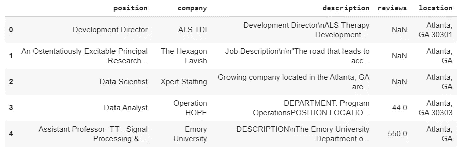

```
df[df["reviews"].isnull()].head()
```

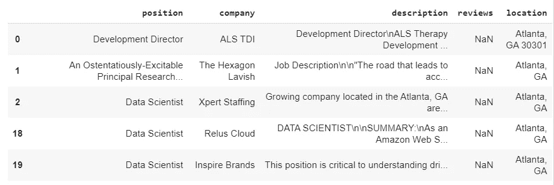

```
print(df.company.isnull().value_counts())
print(df.reviews.isnull().value_counts())
print(df.location.isnull().value_counts())
print(df.reviews.isnull().value_counts())
```

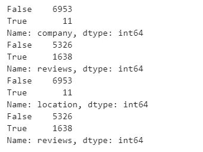

同样对于 location 列，我提取了一个表示美国各州的新列。在清理数据集并遵循下面给出的步骤后，我们得到了这些数据。

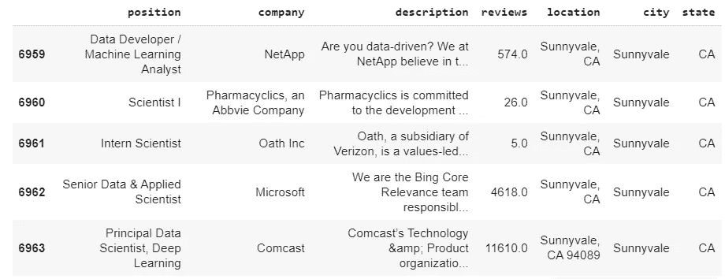

**已清理数据**

# **2-数据可视化:**

## **职位空缺最多的公司:**

在这一部分，我根据美国各州 2018 年 8 月的数据，筛选出了职位空缺数量最多的公司。

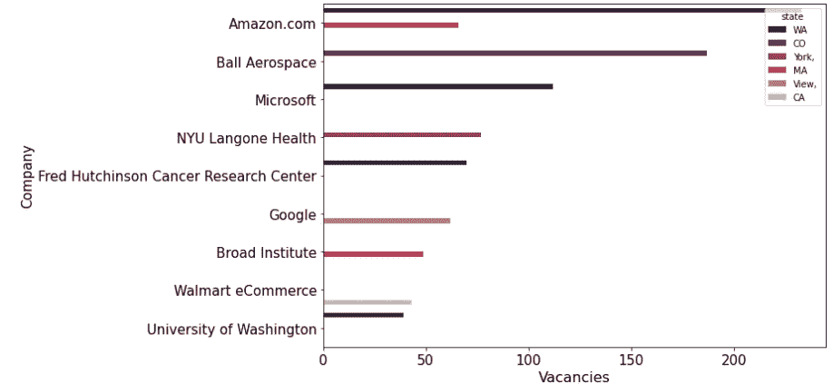

我们可以看到，华盛顿拥有亚马逊和微软等公司提供的最多职位空缺。而谷歌的大部分职位空缺都在山景城。谷歌在其他州也有职位空缺，但在这个图中，我显示了某个特定公司的最大职位空缺数。

## **空缺人数最多的职业:**

在本部分中，我们可以看到空缺职位数量最多的是数据科学家职位，占总职位数的 60%。

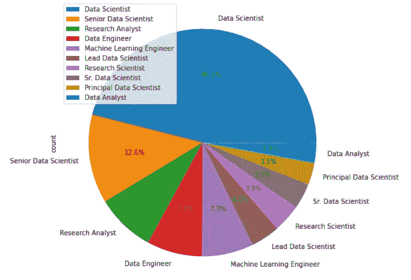

此外，如果我们将这些职位的职位空缺与美国不同的州分开，我们可以看到纽约的数据科学家和分析师职位空缺数量最多。注意:这里我只显示了空缺数量最多的职位(前 20 名)

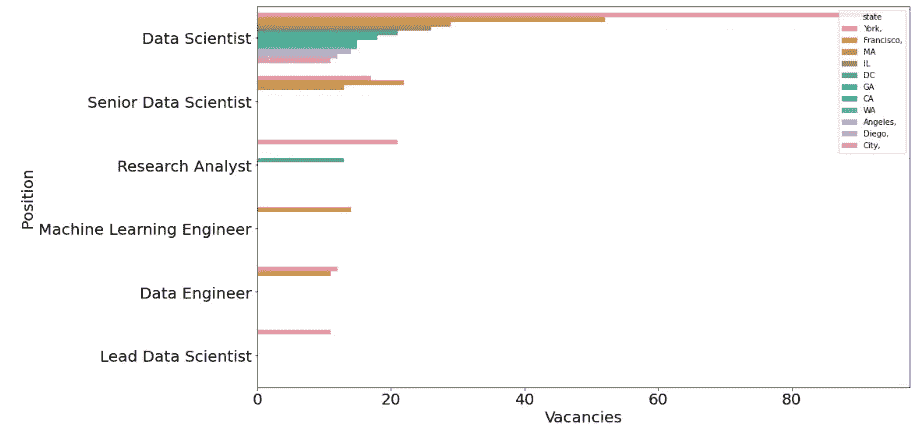

在下一节中，我们将把工作分为四类——数据科学家、数据工程师、机器学习工程师、数据分析师，我们将根据公司、地点和所需技能对他们进行单独分析。

# 数据科学家:

在这一部分，我们将首先筛选出与数据科学家相关的所有工作，如下所示:

```
Data_scientists=df[(df["position"]=='Data Scientist')|(df["position"]=='Senior Data Scientist')|(df["position"]=='Lead Data Scientist')|(df["position"]=='Sr. Data Scientist')]
Data_scientists.head()
```

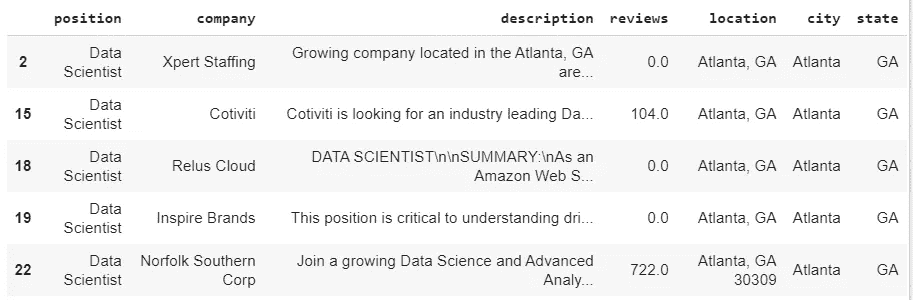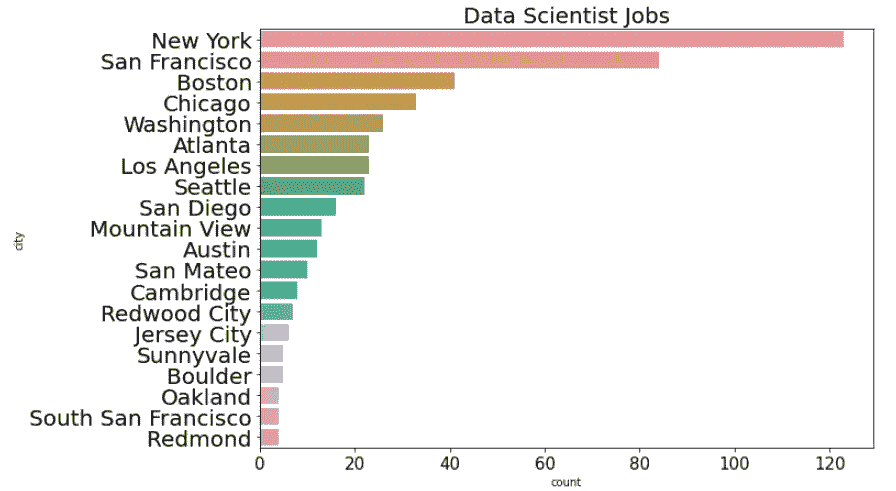

```
df5=Data_scientists.groupby(by="city").size().reset_index(name="count").sort_values(by="count",ascending=False)
df5.head(10)
plt.figure(figsize=(10,7))
plt.yticks(size=20)
sb.barplot(y="city",x="count",data=df5.head(20))
plt.title("Data Scientist Jobs",size=20)
plt.xticks(size=15)
```

我们可以推断，纽约和旧金山的数据科学家职位空缺最多。接下来，我们将绘制单词 cloud 来描述为数据科学家发布的工作，并进一步评估这些工作所需的技能，主要是所需的编程语言。

首先，我们将创建一个函数，将这些描述的所有单词合并到一个列表中。然后这个列表将用于制作单词云图

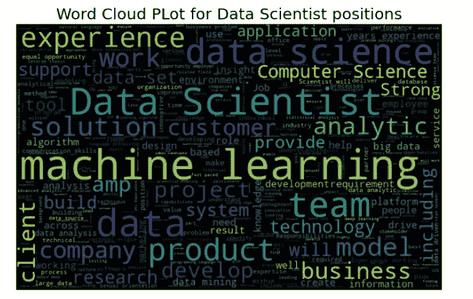

我们可以看到，机器学习是数据科学岗位最需要的技能之一。现在，我们将发现大多数招聘职位要求的编程语言类型如下:

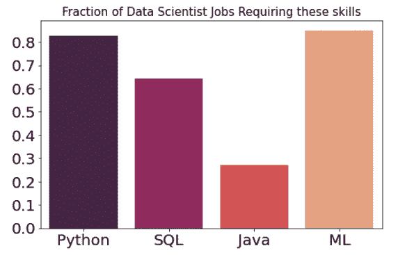

我们可以看到，几乎 90%的职位空缺都将 python 和 ML 列为最主要的技能，其次是 SQL，这在 70%的职位发布中出现。

# 机器学习工程师:

在本节中，我们将首先筛选出与机器学习工程师相关的所有工作，如下所示:

```
ML_engineer=df[(df["position"]=='Machine Learning Engineer')]ML_engineer.head()
```

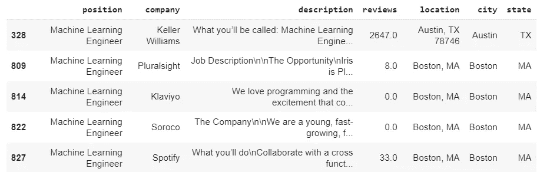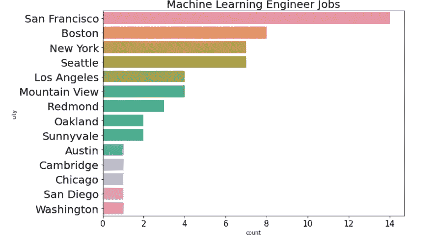

我们可以看到大部分的 ML 工程师工作在旧金山和波士顿，其次是纽约和西雅图，与此形成对比的是数据科学工作主要在纽约。

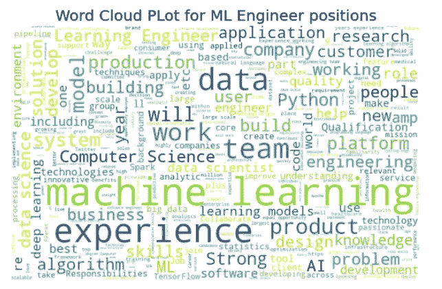

我们可以看到大多数人工智能工程师工作需要的技能的区别，如计算机科学、人工智能、人工智能、算法和深度学习。这就是数据科学家不同于机器学习工程师的地方。

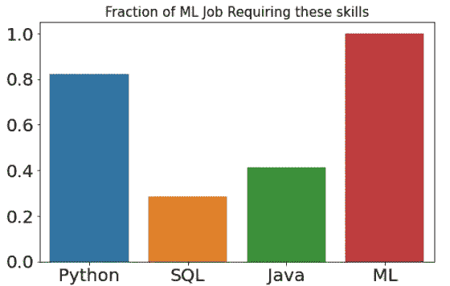

就所需技能而言，ML 和 python 是最主要的技能。我们不需要任何 ML 工程师职位的 SQL，但需要更深入的 ML 知识，因为它出现在所有的招聘信息中。

# 数据工程师:

在本节中，我们将首先筛选出所有与数据工程职位相关的工作，如下所示:

```
Data_engineer=df[(df["position"]=='Data Engineer')]Data_engineer.head()
```

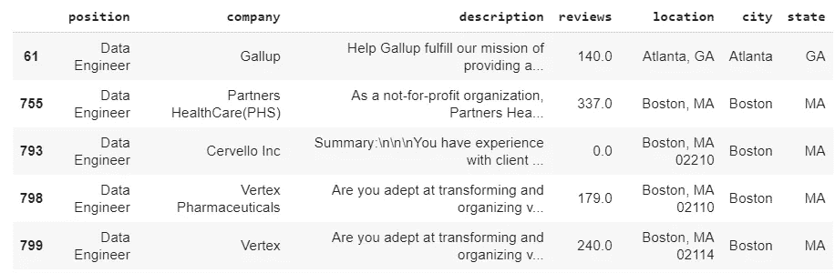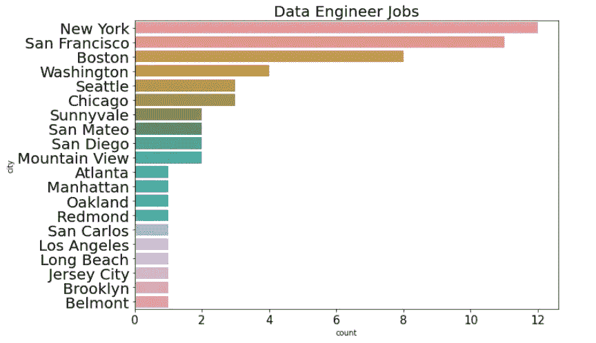

我们可以看到，大多数数据工程工作都在纽约和旧金山，其次是波士顿。

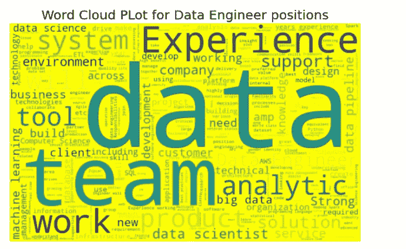

对于数据工程师的招聘信息，我们可以看到出现频率最高的词是大数据、数据、开发、经验等。这意味着我们不需要任何机器学习知识来从事数据工程工作。

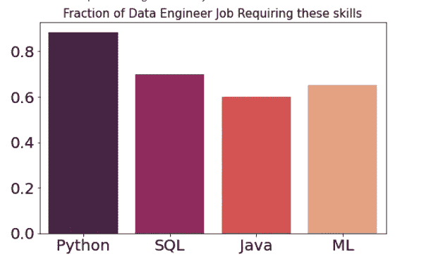

对于数据工程工作，我们可以推断 Python、SQL 和 Java 是最主要的编程语言。对这些工作略知一二就足够了。

# 数据分析师:

在这一部分，我们将筛选出与数据分析师职位相关的职位发布，如下所示:

```
data_analyst=df[(df["position"]=='Data Analyst')]
data_analyst.head()
```

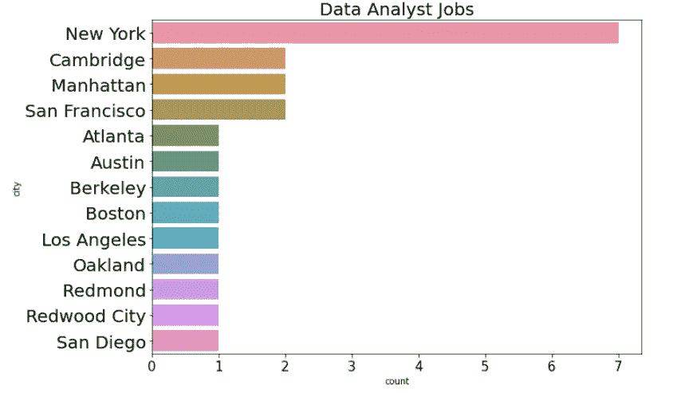

我们可以推断，大多数数据分析师的工作都在纽约和剑桥提供。由于缺乏数据，这一数字相当小，但这仍然为 2018 年 8 月的职位发布提供了一个基本概念。

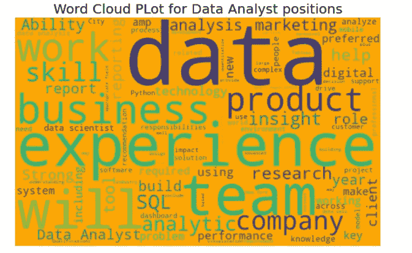

我们可以看到出现频率最高的关键词是——团队、SQL、经验、技能、业务。因此，我们可以得出结论，数据分析师的工作不需要太多的编程和机器学习技能，而是更注重团队管理和业务技能。

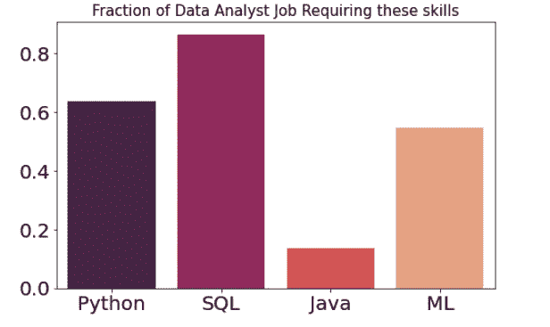

对于数据分析师职位，我们可以得出结论，最主要的语言是 SQL，其次是 python。ML 知识不是主要要求。

# 结论:

我们可以得出结论，美国的大部分职位空缺都是数据科学家的职位，而且大多在纽约和旧金山。在顶尖技能中，python 和机器学习知识是数据科学家和机器学习工程师最重要的要求。另一方面，SQL 是数据工程师和数据分析师职位最需要的编程语言。

## 完整代码可在[这里](https://github.com/Saket-Uoft/Data-Science-jobs/blob/master/Data_Science_Jobs_USA.ipynb)获得。

# 参考资料:

[https://www . ka ggle . com/sl 6149/data-scientist-job-market-in-the-us](https://www.kaggle.com/sl6149/data-scientist-job-market-in-the-us)

# 感谢您的阅读！！！！

如果你喜欢我的工作并想支持我:

支持我的最好方式就是跟随我上 [**中级**](https://medium.com/@saketthavananilindan) **。**

2-在[**LinkedIn**](https://www.linkedin.com/in/saket-thavanani-b1a149a0/)**上关注我。**