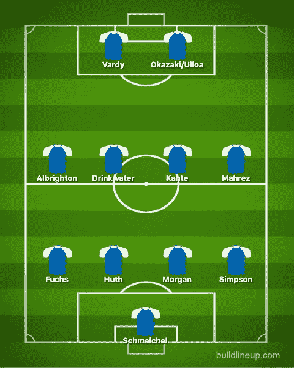

# 英超数据分析

> 原文：<https://towardsdatascience.com/analysis-of-premier-league-data-7d62fccbd65?source=collection_archive---------17----------------------->

> “在英超联赛中很难做出预测，因为不可预测的事情会发生，我很清楚这一点:我以一种疯狂的方式赢得了冠军，却意外地失去了一个。”——乔·哈特

由[乔罗诺](https://pixabay.com/users/jorono-1966666/)通过 [Pixabay](https://pixabay.com/photos/footballs-football-premier-league-3597192/) 获得的图像

英超是迄今为止世界上最有趣的联赛之一。他们有一些最好的经理、球员和球迷！但是，使它真正有趣的是纯粹的不可预测性。有 6 支同样令人惊叹的球队，每个赛季都有不同的球队捧起奖杯。不仅如此，联盟还见证了前 6 名以外球队的胜利。所以，让我们来分析一些例子。

你可以在这里找到整个 jupyter 笔记本

# 数据收集

对于数据集，可以参考这个 [Kaggle 链接](https://www.kaggle.com/krishanthbarkav/english-premier-leagueepl-player-statistics)。它包含了从 2015/16 赛季到 2019/20 赛季在英超比赛的每一名球员的详细信息。对于每个球员，有 54 个属性，其中一些是— *名字，进球，助攻，创造的重大机会，拦截，盖帽，清道夫解围，出拳，*等。

现在，我们不会在此数据集中寻找 NaN 值并消除它们，因为 NaN 值有其用途。例如，*扑救、清道夫解围、出拳、*等属性是守门员特有的。因此，前锋的这些属性的值将为 NaN。

接下来，我们将使用 *read_csv* 方法将每个季节的数据读取到单独的数据帧中。然后，我们用。concat()方法。

# 莱斯特城

由 [jorono](https://pixabay.com/users/jorono-1966666/) 通过 [Pixabay](https://pixabay.com/photos/football-international-england-3566688/) 获得的图像

莱斯特城最终在 2015/16 赛季赢得了冠军，当时几乎没有人预料到这一点。他们在 2015/16 赛季开始时夺冠的赔率是 ***5000/1*** 。从这个数字来看，莱斯特城赢得联赛冠军的几率比圣雄甘地还活着的几率还要低！

然而，尽管所有人都相信，它还是发生了。让我们看看一些数字，评估一下他们是如何做到这一点的。

但是，在此之前，我认为了解球员是很重要的，因为他们的名字会在文章中反复出现。

[来源](https://medium.com/@andrewlawlor/how-leicester-rebuilt-d6eb6aeba6ad)

现在，让我们从查看数据集及其属性开始分析。

开始分析的最好方法是查看最明显的属性——进球和助攻。

让我们从联赛最佳射手开始。

现在，类似地，让我们看看顶级组织者(助攻提供者)

从这两份名单中，我们可以看到莱斯特城队的两个名字——*里亚德·马赫雷斯*和*杰米·瓦尔迪*。

现在，我们可以看到*里亚德·马赫雷斯*在*最佳得分手*和*最佳组织者*名单中。显然，他是莱斯特城获胜的基础。从更大的角度来看，让我们看看进球情况(助攻+进球)。

*杰米·瓦尔迪*有 30 个进球，其次是*里亚德·马赫雷斯*有 28 个。这揭示了莱斯特城赢得英超冠军的一大原因。

但是，仅仅进球并不能为你赢得冠军。例如，在同一个赛季，曼城取得了惊人的 71 个进球，而莱斯特为 68 个，但最终以第四名结束。显然，还有更多。

让我们来看看一些数字作为辩护。我们将从另一个野兽般的球员开始——恩戈洛·坎特

从上面的输出可以看出，Kanté是

*   *拦截次数联盟第一*
*   *铲球*联赛第一
*   第二名在*决斗中获胜*

这是防守型中场的一些令人难以置信的数据。他的贡献由此可见一斑。

现在，让我们来看看防守队员

我们可以只看干净的床单，但它可能不会告诉我们整个故事。虽然更多的零失球确实意味着强大的防守表现，但它不会给你其他比赛中有多少失球的细节。比赛中失球多反映了防守差。

因此，我把“每场比赛的失球数”作为我的第一统计数据。但是，重要的是要确保后卫有足够的出场机会。例如，一个有 2 次出场 0 次失球的后卫将会有一个很大的“每场失球数”。不过这个后卫还没有打够比赛，不在考虑范围内。

上面的情节揭示了这些后卫的恒星性能。气泡的宽度表示干净纸张的数量。所以，我们可以看到克里斯蒂安·福赫斯和罗伯特·胡思在莱切斯特城的防守中起到了至关重要的作用，因为他们场均失球更少，并且保持了更多的零失球。

注意耶稣·纳瓦斯是如何丢了很少的球，却没有很多不失球记录的。尽管如此，这仍然是很好的防守。

现在，我们来简单看看莱斯特城的门将*卡斯帕·舒梅切尔*

我们可以看到他有 38 次出场。让我们把他和其他有着相似外貌的守门员进行比较。

很明显，舒梅切尔比其他人更胜一筹。虽然乌戈·洛里斯少丢了 2 个球，但他也少打了一场比赛。此外，除了少了一次出场，他也少了两次不失球。

因此，我们可以得出这样的结论:主教练*克劳迪奥·拉涅利*，凭借他令人难以置信的平衡和稳定的阵容，给了莱切斯特城他们的首个英超冠军，战胜了所有的困难！

# 利物浦的冠军之路！

由 [jorono](https://pixabay.com/users/jorono-1966666/) 通过 [Pixabay](https://pixabay.com/photos/football-soccer-europe-uefa-2698969/) 获得的图像

任何英超球迷都可以证明自从尤尔根·克洛普到来后利物浦的表现有所改善。他们慢慢地，但是持续地进步，并且连续赢得了冠军联赛和英超联赛。让我们看看历年的一些数字，分析一下他们 2019/20 赛季的英超夺冠之路。

## 平衡攻击

利物浦队显然是进攻方。在克洛普的领导下，他们将压力提升到了一个不同的水平。像萨迪奥·马内、默罕默德·萨拉赫和罗伯托·菲尔米诺这样出色的攻击手在进球和助攻方面贡献巨大。但是，据说他们真正的冠军机会是在他们开始攻击‘聪明’之后才开始的。让我们利用我们掌握的数据来看看发生了什么变化。

我们将分析利物浦的“前锋 3”的数据，他们是进球的主要贡献者。

我们可以清楚地看到，进球数量在逐渐下降。仅仅两个赛季，他们的进球数就从 57 个增加到 46 个。然而，他们在这两年中上升了 3 个位置赢得了冠军。

据说这是因为利物浦在 2017/18 赛季后选择采用的平衡方法。

## 防御力量

2018 年 1 月，利物浦以 7500 万英镑的价格签下了维吉尔·范迪克，这使他成为当时世界上最昂贵的后卫。利物浦最近的成功很大一部分与他的转会有关，因为据说他极大地改变了利物浦的防守。与他一起，利物浦以阿利松·贝克尔的名义购买了一名门将，他最终结束了利物浦多年来的门将困境。让我们来看看分析他们表现的一些数字

利物浦的守门员

2016/17 — *洛里斯·卡里乌斯西蒙·米尼奥莱*

2017/18 — *洛里斯·卡里乌斯西蒙·米尼奥莱*

2018/19 — *阿利松·贝克尔*

2019/20 — *阿利松·贝克尔阿德里安*

上面的泡泡剧情讲述了《goal》中阿里森冲击的故事。在利物浦的第一个赛季，他有 21 场比赛没有失球，只丢了 22 个球！他也因此获得了金手套奖。

来到他的第二个赛季，他在 29 次出场中丢了 23 个球。阿德里安当守门员时，其余的球都被丢了。下面将进一步解释。

范迪克的进攻、传球、进球也在 2018 年加盟利物浦后有了明显的提升。然而，这并没有导致他的防守表现下降，他们始终保持一致。

从下面的数字可以明显看出 2017/18 赛季下半段本身(签下范迪克后)防守数字的提升。下半赛季的守门员是洛里斯·卡里乌斯，他比守门员西蒙·米尼奥莱少丢 10 个球，多 3 场不失球。

至于 2019/20 赛季，阿里森受伤了一段时间，利物浦的第二选择阿德里安不得不顶替他。这是大量失球的主要原因。每个人都会同意，在球门阿德里安是没有阿里森有效。事实上，在 2020 年 10 月 4 日，利物浦 2 比 7 输给了阿斯顿维拉。那天守门的是阿德里安。

# 结论

莱斯特城和利物浦赢得联赛冠军看起来令人惊讶，但对单个球员表现的分析让故事变得清晰。莱斯特城队在场上的每个位置都有强大的球员，他们的状态令人难以置信，他们的人数明显高于其他球队，而利物浦队在进攻心理上的变化以及他们新签下的维吉尔·范·迪克和阿利松·贝克尔慢慢地扭转了对他们有利的趋势。

# 问题

谁在所有 5 个赛季中进球和助攻数最高？

**目标**

**助攻**

**Ans:最高得分手—** 沙治·奥阿古路(102 球)，**最高助攻—** 凯文·德布劳内(65 球)

**2)哪个赛季的进球数最高，或者哪个赛季的得分最高？**

**Ans:**2016/17 赛季进球数最高(983 球)

# 参考

1.  **Kaggle 数据集**—[https://www . ka ggle . com/krishanthbarkav/English-premier-league EPL-player-statistics](https://jovian.ml/outlink?url=https%3A%2F%2Fwww.kaggle.com%2Fkrishanthbarkav%2Fenglish-premier-leagueepl-player-statistics)
2.  [**Jovian.ml**](https://jovian.ml/outlink?url=http%3A%2F%2FJovian.ml) **【零到熊猫】课程**—[https://jovian . ml/learn/data-analysis-with-python-零到熊猫](https://jovian.ml/learn/data-analysis-with-python-zero-to-pandas)
3.  **NumPy 文档**——[https://numpy.org/devdocs/user/quickstart.html](https://jovian.ml/outlink?url=https%3A%2F%2Fnumpy.org%2Fdevdocs%2Fuser%2Fquickstart.html)
4.  **Seaborn 图书馆信息**——[https://seaborn.pydata.org/](https://jovian.ml/outlink?url=https%3A%2F%2Fseaborn.pydata.org%2F)

就这样，我们到了文章的结尾。非常感谢你的阅读，我真诚地希望你喜欢它！请随时留下反馈或使用下面的链接与我联系。

# 联系我

[推特](https://twitter.com/j_tambad) | [Instagram](https://www.instagram.com/amogh_damnbad/) | [脸书](https://www.facebook.com/amogh.tambad) | [LinkedIn](https://www.linkedin.com/in/amogh-tambad-58ba731a5/)