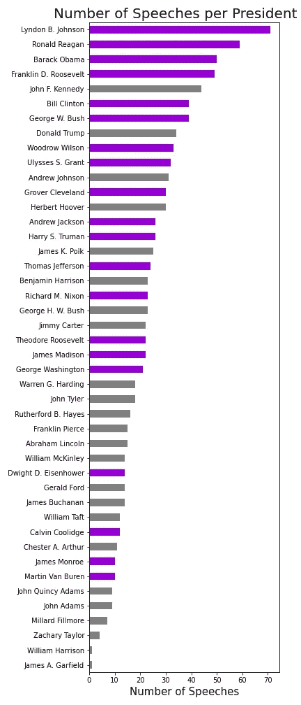
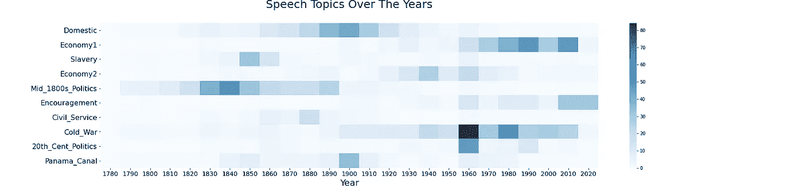
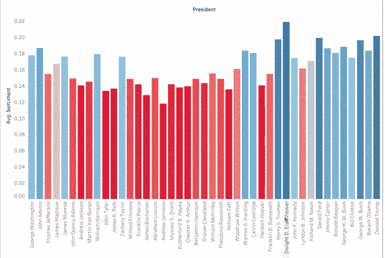
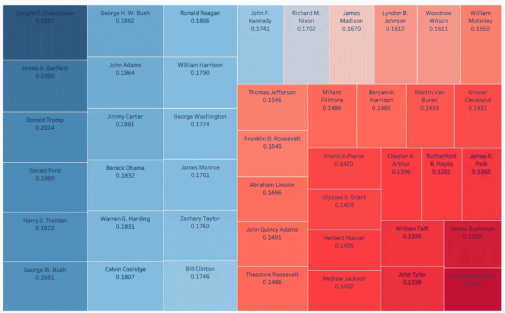
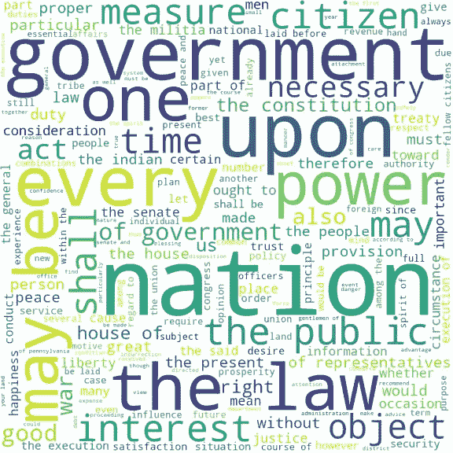

# 美国历史上总统演讲的分析

> 原文：<https://towardsdatascience.com/analysis-of-presidential-speeches-throughout-american-history-bb088d36d7dd?source=collection_archive---------49----------------------->

自然语言处理从一开始就引起了我的兴趣。我第一次听说它是在一次基于单词模式的作者预测演示会上。后来用几十年的歌词解释给我听。所以我也试图从历史的角度来使用它。我在哪里可以得到大量的数据？总统:他们喜欢交谈！或者至少大部分是这样。所以我创建了一个关于美国历史上总统演讲的 NLP 项目。它包括了从乔治·华盛顿 1789 年的第一次就职典礼到 2020 年 4 月底关于冠状病毒的演讲的所有 44 位总统。是的，我说过像格罗弗·克利夫兰这样的 44 位总统有两个独立的任期。在你阅读的时候，给你一个合理的警告:我主修美国研究，教了 13 年历史。所以，不要介意我在介绍数据科学知识的同时，也介绍一些总统知识。尽情享受吧！

# 言语组织

我的大部分演讲都是从弗吉尼亚大学米勒中心获得的。他们收集的演讲和其他原始资料被认为是一流的，甚至被哈佛的数据库引用。当我开始整理和分析我的数据时，我意识到一些总统应该有比这本集子里更多的演讲。我可以从 NLTK 的语料库中添加杜鲁门和艾森豪威尔遗漏的国情咨文演讲来解决这个问题。这本文集里的每一位总统的演讲都已经被米勒中心收藏了。我的分析总共包括 1018 篇演讲，大约 2380 万字。我的数学方面确实需要看一些数字和统计数据。最短的演讲来自乔治·华盛顿的第二次就职演说，有 787 个单词。另一方面，最长的演讲是哈里·杜鲁门在 1946 年发表的国情咨文，演讲人数接近 17 万。他不得不讨论诸如战后经济、保护退伍军人、创建联合国、共产主义问题等历史性话题……而这还不到前半部分！



这些数据，每一个都是完整的演讲，有可以理解的不对称性。我可以从其他来源检索其他演讲，但这将使它极度偏向现代。像收音机和电视这样的技术导致了更多的演讲而不是写信。数据集中已经有这样的例子，包括对全国的电视讲话和罗斯福的炉边谈话。

我用颜色标记了我的条形图，来代表任职超过一届的总统和任职不超过四届的总统。林登·约翰逊(Lyndon Johnson)有很多历史事件要处理，比如民权法案和越南战争。另一方面，只有一篇演讲稿的两位总统在任期几个月后去世了。威廉·亨利·哈里森死得很特别，因为他在暴风雪中没穿外套就发表了两个小时的就职演说。

# 主题建模

我首先把每一篇演讲分开，检查所有单词的出现频率。在这里，我可以列出自己的停用词列表，为计数矢量化做准备。有些词我发现并不奇怪，比如“united”、“states”和“america”。一个让我措手不及但有意义的词是“谢谢”和“你”。想想有多少演讲是以这句话开始的，或者是在后来感谢人们的成就。另外两个值得注意的词是“掌声”和“文字记录”。这只是展示了演讲是如何被历史记录的，以及总统和他们的演讲稿撰写人是如何在演讲中做笔记的。

我用最大 df 为 40%的计数矢量化处理了数据。这使得许多随机的主题可以从我的主题建模中过滤掉。另一方面，我将 NLTK 的停用词与我的十几个单词列表结合起来，过滤掉出现过多的单词。我决定用非负矩阵分解(NMF)来建模。我试验了各种主题建模器和矢量器。利用我的历史知识，我不喜欢任何关于 LDA 发布的东西。在 NMF，TDIF 矢量创建了不匹配的主题。它有两个基于越南战争的不同类别，但错过了我在最终结果中发现的主要主题，我将在下面讨论。我还尝试了关注多少话题。NLP 的这一部分真的很像金发女孩和三只熊。我试了 5 次，太少了。我试了 15 次，太多了。我最初运行的 10 个最终是完美的数量。

当我第一次运行它时，我开始欣赏 NLP 全部功能。前两个话题是与国内和经济事务有关的词。好吧，有道理。然后我看了第 3 题。我意识到所有的词语都与奴隶制和内战前的妥协有关。我欣喜若狂。NMF 应该更适合短文本文档。然而，它的好处却大放异彩。NMF 通过直接分解术语-文档矩阵来学习主题，它降低维度来找到演讲的主要主题。在这里，它听取了所有的演讲，并意识到奴隶制是一个不仅笼罩了我们国家几十年导致内战的话题，而且在废除奴隶制几十年后仍是总统们讨论的话题。

我开始寻找与所有 10 个主题的相关性。主题建模让我看到了一些我不会想到的主题，比如公务员编制。我过去常常用大约 20 分钟来教这个，但是这表明老师应该更加重视这个。此外，还有一个我最喜欢的题目叫做“鼓励”。有些总统的竞选口号是积极的，这使他们成为总统，但这种情况已经持续了多年。这个话题在 20 世纪 50 年代随着电视的出现而出现，并证明电视对总统职位的塑造可能超过任何发明。有几个话题，不管我怎么修修补补，我都惊讶地从未作为主要话题出现过。我找不到与两次世界大战或新修正案的产生有关的词汇或话题。

我是一名视觉学习者，创建热图教会了我更多。总结每个主题的单词，你可以跨时间观察它们。

```
doc_topic_nmf = pd.DataFrame(doc_topic.round(3),
 index =df.Year.astype(int), 
 columns = [“Domestic”,”Economy1",   “Slavery”,”Economy2",”Mid_1800s_Politics”, 
 “Encouragement”,”Civil_Service”, “Cold_War”,”20th_Cent_Politics”, “Panama_Canal”])
dtn = doc_topic_nmf.groupby(doc_topic_nmf.index).sum()dtn.reset_index(level = 0, inplace = True)
graph_topics = dtn.groupby(dtn.Year // 10 * 10).sum()
graph_topics.drop([‘Year’], axis=1, inplace = True) 
plt.figure(figsize = (25, 6))
sns.heatmap(graph_topics.T, annot=False, cbar=True, cmap=”Blues”)
plt.xlabel(‘Year’, fontsize = 20)
plt.xticks(fontsize = 14)
plt.yticks(fontsize = 16)
plt.title(‘Speech Topics Over The Years\n’, fontsize=25)
```

下图中最暗的方框属于 20 世纪 60 年代的冷战。这个时期无论是好的(太空竞赛)还是坏的(古巴导弹危机)都在许多方面包围着美国。19 世纪政治中的黑暗时期展示了这是一个不应该被缩短的时期。围绕国家银行的政治争论已持续多年。此外，美墨战争以及天定命运思想塑造了我们国家的形状和土地。



# 情感分析

我做的第二个主要分析是情绪分析。我小心翼翼地研究这个问题，因为我知道我的数据是预先写好的演讲稿。有一半的时间，它们不是由总统本人写的，而是由一组演讲稿撰写人写的。如果你想要真实的感受，去 YouTube 上听 LBJ 的磁带。或者你在推特上关注唐纳德·特朗普。然而，最终，我看到了与我们许多总统相匹配的情感结果。我利用了 NLTK 的 VADER 情感强度分析器和它的基本情感分析器。这些工具可以让你看到消极和积极的评价，但我决定关注他们的积极得分。在这两个方面，分数都很低，这是意料之中的。这些演讲是基于内容的，这是一件好事。即使当一位总统传达一些负面的东西，比如 20 世纪 50 年代的共产主义，情绪分析也不会注意到这一点。另一方面，看看著名的葛底斯堡演说的优美语言:

八十七年前，我们的先辈在这个大陆上创建了一个新国家，它孕育于自由之中，奉行人人生而平等的原则

也许现在你正在热情而模糊地读着那句经典的台词。是的，像“新”和“相等”这样的词会得到分数。但总的来说，这涉及到许多中性语言，当串在一起时，有着非常不同的含义。但这就是情绪分析的神奇之处。它能捕捉到细微的差别。此外，VADER 是专门为处理特定领域语言而设计的。

为了分解每个总统的情绪，我创建了以下函数:

```
def sentiment_analysis_graph(president):
 filter1 = df.President.str.contains(president)
 func_df = df.loc[filter1]
 text = ‘’.join(str(func_df.Split[:]))
 score = SentimentIntensityAnalyzer().polarity_scores(text)
 return score[‘pos’]
```

然后我把他们的积极得分加到我的数据框中，这样我就可以用表格来描绘它了。如下图所示，德怀特·艾森豪威尔拥有最高的乐观情绪。这可以用 20 世纪 50 年代的繁荣、文化和良好的经济来解释。在过去的半个世纪里，这一数字总体上较高，这与“鼓励”的主题建模相关。令我惊讶的是，在大萧条、越南战争或其他战争的艰难时期，人们的积极性并没有降低。在我的负面情绪分析中，那个点也没有见顶。我想这又回到了美国总统在艰难时期使用的鼓励词汇，集会呐喊和安慰的语言。



总统积极情绪

有一个更好的方法来可视化这些信息。由于这些数值非常相似，所以条形图实际上并不适用于比较多位总统。很容易把艾森豪威尔看作是最积极的，或者把安德鲁·约翰逊看作是最不积极的，但是有太多的总统之间存在着千分之一的差异。然而，树形图显示了从最积极到最不积极的明显转变。为了创建树形图，我没有编写任何 Python 代码。我根据总统的情绪得分创建了一个 CSV 文件。然后我把这个和我的主要演讲一起上传到 Tableau。我喜欢这个可视化工具如何帮助组织数据，是交互式的，并让我对特性进行颜色编码。

我想指出的是，有两位总统排在了最积极的前十位。在我的美国历史课堂上，约翰·亚当斯被我戏称为“反弹总统”。他追随乔治·华盛顿，但却永远无法达到他的水平。这再加上 XYZ 事件，使他成为唯一一位只任职一届的开国元勋。这张树状图表明他是一位伟大的演说家。很久以后，在我们的历史上，你有吉米·卡特，另一个挣扎着当总统的人。我曾经听一位非常保守的大学教授说，卡特是最适合当总统的人。他的演讲体现了那种善意。



总统积极性树形图

然而右下角是最不积极的总统。使用内容知识，这与历史相关。安德鲁·约翰逊是第一个被弹劾的总统。他与国会激进的共和党人相处不好。他们通过了《任期法案》,该法案要求参议院批准任何文职官员的免职，但他很快就违反了该法案。这些关于重建计划的争论和分歧导致了较低的情绪得分。詹姆斯·布坎南和约翰·泰勒都被认为是最糟糕的总统。你认为唐纳德·川普治下的员工留任很糟糕……约翰·泰勒的整个内阁在他当选总统几个月后就辞职了！威廉·塔夫特不想当总统。塔夫脱从来不想处于唯一的权力位置。然而，他的妻子和泰迪·罗斯福对他有政治野心，这让他顺从了。这些数据显示了他的不快和他对最终最高法院首席大法官职位的渴望。

# 单词云



我做的最后一个 NLP 分析是比较不同总统使用的热门词汇。我使用了单词云来突出显示使用频率较高的单词。我不打算对所有 44 位总统都这样做，但我选择了华盛顿和林肯这样明显的人以及一些个人最喜欢的人。这些单词云中有许多词汇提到了政府及其特征，如参议院或宪法。我也观察了两位我个人认为不具备演讲技巧的总统。为了保持公正，我不想指名这些额外的主席。果然，数据显示个人观点并不总是正确的，因为其中一个人有一个词云，可以与我选择的“伟人”相媲美。另一个……无话可说。

# 告别演说

我希望你喜欢阅读我的项目，就像我喜欢创建它一样。我试图在整个项目中保持平衡。我没有包括基于一个政党的比较或分组演讲的分析，主要有两个原因。第一，我不想增加分裂文化。其次，共和党和民主党并非一直都在。像联邦党人这样的政党只存在了这个国家的前 50 年。我不想在计算中将老党派归入“其他”一类，因为这些党派的观点截然不同。我在一个我的政治信仰与我所教的家庭不匹配的地区教了很多年的历史。对学生来说，我最大的收获就是试图让他们看到事物的两面性。如果你有兴趣查看这个项目的代码和资料，请查看我的 Github:

[](https://github.com/nicolesemerano/Metis-Project-4-Presidential-Speeches-NLP) [## nicolesemerano/Metis-Project-4-总统演讲-NLP

### 此存储库仍在更新中。现在，看看我的代码，关于我使用…

github.com](https://github.com/nicolesemerano/Metis-Project-4-Presidential-Speeches-NLP) 

我在 https://nicolesemerano.github.io/还有其他作品。

我把乔治·华盛顿在他的告别演说中的想法留给你们。他对自己总统任期的看法与我对这个项目的看法一致。

“我的感情不允许我中止深深的感谢……因为我从那时起就享受到了机会，通过忠诚和坚持不懈的服务来表达我不可侵犯的感情，尽管它的用处与我的热情不相称。”