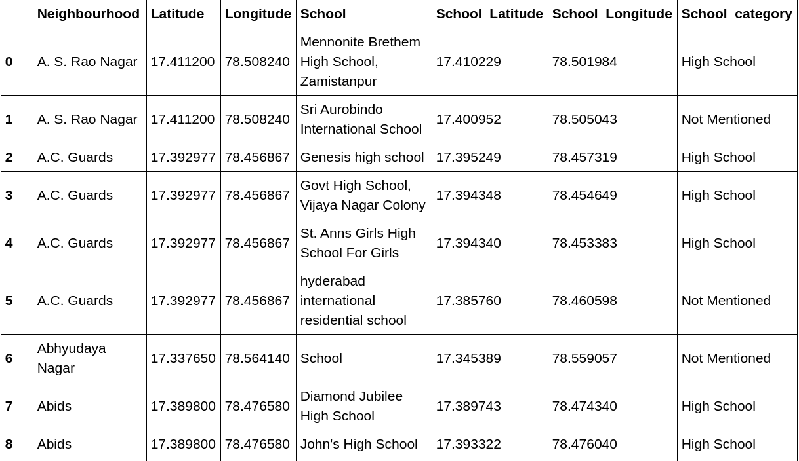
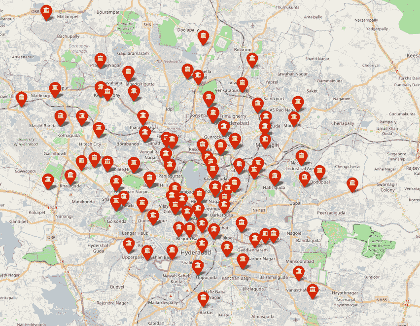
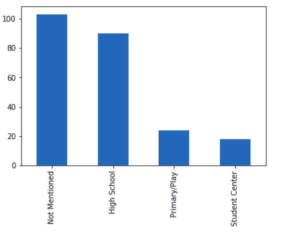
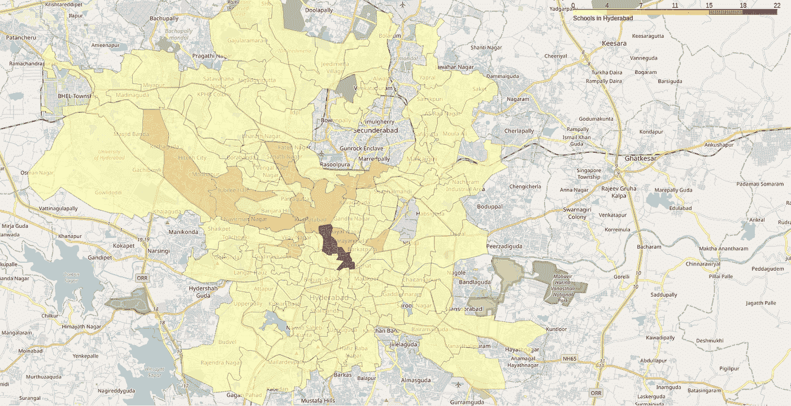
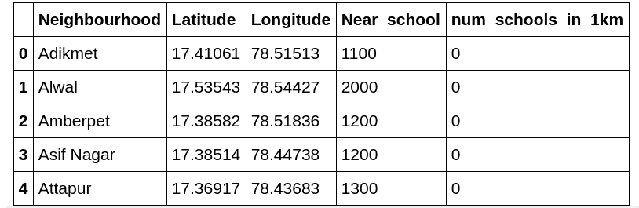
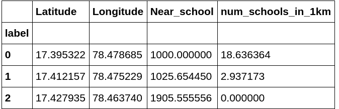
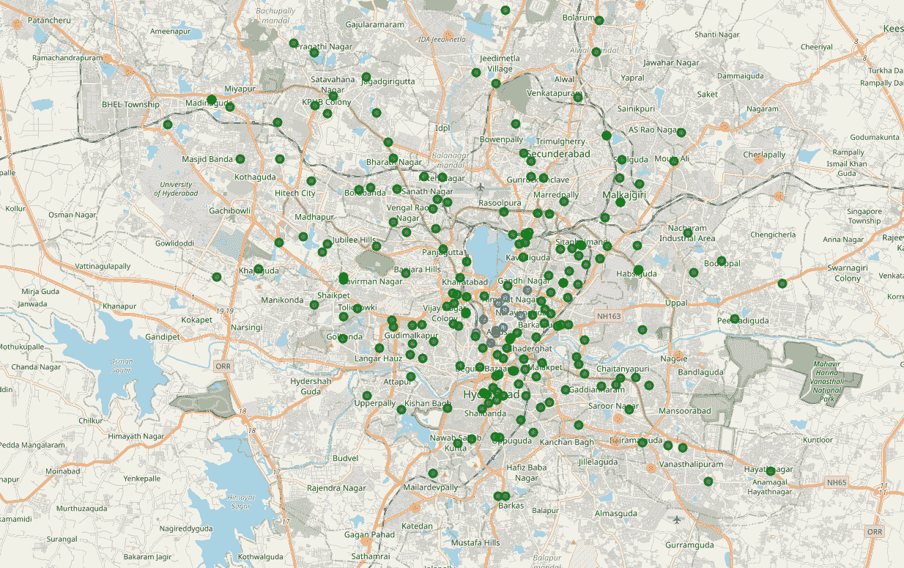

# 海德拉巴的学校分析

> 原文：<https://towardsdatascience.com/analysis-of-schools-in-hyderabad-db921b392956?source=collection_archive---------61----------------------->

## 数据科学顶点项目

来源:罗恩·汉森在 [Unsplash](https://unsplash.com/s/photos/hyderabad?utm_source=unsplash&utm_medium=referral&utm_content=creditCopyText) 上拍摄的照片

作为我在 IBM 关于 Coursera.org 的[应用数据科学顶点](https://www.coursera.org/learn/applied-data-science-capstone/)课程的一部分，我使用 FourSquare API 分析了海德拉巴的学校分布。在本文中，我将讨论我分析数据并从中提取有意义信息的方法。

 [## milindkesar/Coursera_Capstone

### 应用数据科学。通过创建……为 milindkesar/Coursera_Capstone 开发做出贡献

github.com](https://github.com/milindkesar/Coursera_Capstone) 

# **简介**

在这篇文章中，我分析了海德拉巴市的学校分布。这对于确定学校基础设施需要发展的领域具有重要意义。

为了获取海得拉巴的学校分布，我用过 **FourSquare API。**

## **背景**

每个人都有机会在学校接受优质教育，这一点至关重要。这是教育的基础。海得拉巴有很多好学校，但是它们都集中在某些街区。

海得拉巴的几个街区缺乏学校等基础设施。为城市的发展确定这些区域并为每个人提供方便的受教育机会是很重要的。

## **问题**

政府需要发展学校基础设施，要么在这些地区建造学校，要么支持在这些地区发展私立学校，以便向所有人提供容易获得的优质教育。然而，为了做到这一点，有必要确定这些街区。所以在这篇文章中，我分析了海得拉巴的学校分布，并确定了这些街区。

当人们搬到城市并打算买房或租房居住时，这些信息也很有用，因为他们肯定希望选择一个交通便利的街区，并为他们的孩子提供许多好学校。

## 世卫组织会感兴趣吗？

正如我先前解释的那样，目标受众将是希望建设学校基础设施的政府机构、希望在具有良好潜力的地区建设学校的私营部门机构，以及在不同社区寻找房屋以确定哪些房屋更接近好学校的人。

# 数据:采集和清理

## **数据来源**

我用漂亮的汤刮过海德拉巴的各个街区，从这个[来源](https://en.wikipedia.org/wiki/Category:Neighbourhoods_in_Hyderabad,_India)。

然后我用 Python 中的**地理编码器**库获得了这些街区的纬度和经度。

然后，我使用 FourSquare API 获取每个街区各种学校的位置，将每个街区的限制设置为 100 个，半径为 1 公里。

为了绘制 **choropleth** 地图，我从这个[源](https://raw.githubusercontent.com/datameet/Municipal_Spatial_Data/master/Hyderabad/ghmc-wards.geojson)获得了海得拉巴的 geojson 文件。

## **数据预处理**

我已经丢弃了数据集中一些不需要的条目。存在数据重复的情况，因为一所学校可能距离每个居民区不到 1000 米，因此，同一纬度和经度可能在这两个居民区出现两次。我已经删除了此类副本，并保留了此类数据的第一份副本。

## **所用数据的最终形式**

这是所用数据帧的前 9 个条目的图像。

每行对应于一所特定的学校及其信息，即它所属的街区、类别、名称和位置。

数据帧中共有 **235 个条目**。

利用这些数据，我分析了海德拉巴的学校分布。

海德拉巴的学校

可以看出，学校更多地集中在市中心，这是可以预料的。

# **方法论**

首先，如前所述，数据已经被检索和清理。数据包括每个街区半径 1 公里内的学校，限制为 100 所。

接下来，我们通过探索学校所属的各种类别来分析数据。

在此之后，我们使用可视化的 choropleth 图以更具解释性的方式探索每个邻域中的分布。这让我们对学校的分布有了一个很好的了解。

然后，对于那些没有学校的街区，我们通过在每次迭代中增加 100 米的半径来找到到最近学校的距离，直到使用叶找到一所学校。

在获得这些精确的数据后，包括每个街区到最近学校的距离和每个街区的学校数量，我们使用 **K-Means** 对这些数据进行聚类。这有助于我们确定哪些地区需要改善，哪些社区拥有良好的学校设施。

最后，我们将讨论和总结哪些社区需要改善学校设施，哪些地区拥有非常好的设施。

# **分析**

基于从关于学校的叶获得的数据，我探索了学校所属的类别。

## **类别**

各类学校如下:

正如我们所看到的，大多数学校都“没有提到”他们的类别。有趣的是，这些学校提供从幼儿园到高中的教育。因此，发现只有少数学校只提供小学/游戏水平的教育并不奇怪，因为大学校已经涵盖了这一点。此外，“学生中心”分类学校提供从幼儿园到高中的教育。

## **街区学校分布**

使用地图，我们可以很好地了解学校的分布。

(注:这张地图不包括塞康德拉巴德的街区，因为我只能获得 GHMC 所覆盖的那些街区的地理空间数据。)

从地图上可以清楚地看到，大多数学校都集中在市中心，特别是在 Abids、Himayath Nagar、Basheerbagh 地区附近。事实上，这些街区有很多好学校，而且彼此距离很近。

从地图上可以清楚地看出，越靠近市郊，学校的密度越低。这是意料之中的，因为市中心附近的街区比郊区更拥挤。

此外，这些都是老地区，郊区正在开发。

## **聚集邻居**

我们现在将使用 K-Means 聚类算法根据到最近学校的距离和每个街区的学校数量将街区聚类成 3 个聚类。

这些特征为确定需要改善的街区奠定了良好的基础。

离学校最近的距离在半径 1 公里到 2 公里之间。

数据帧的前 5 个元素

接下来，我们研究不同的集群。每个集群的平均特性如下。

每个聚类的平均值

显然，纬度和经度的平均值在这种情况下没有任何意义。

很明显，标记为 0 的街区不仅有 1 公里内的学校**(让我提醒你这是最近距离的起点，不能再好了)而且有许多学校可供选择，平均 **18.63** 。因此，就学校水平而言，这些社区有机会获得优秀的教育设施。该集群中的一些街区是 Abids、Himayath Nagar 和 Basheerbagh，所有这些街区都靠近市中心。**

**标记为 1 的街区在半径**近 1 公里**范围内也可以方便地获得良好的学校教育设施，平均每个街区大约有 **3 所学校**。大多数居民区都属于这一类。**

**标记为 2 的街区是那些需要改善的**，因为到最近学校的平均距离接近**2 公里**，而该街区 1 公里内没有学校。这些大多出现在城市的郊区。这一地区的一些街区有阿尔瓦尔、吉代梅特拉、切拉帕里、帕坦切鲁、ECIL X 路等。****

********

****蓝色圆圈对应标签 0，绿色圆圈对应标签 1，红色圆圈对应标签 2。****

# ******结果和讨论******

****我们观察了海得拉巴学校所属的各种类别，其中大多数是提供从幼儿园到 12 年级教育的普通学校。****

****此外，我们注意到，仅提供初级教育的学校相对较少，这是意料之中的。****

****接下来，我们观察了学校的分布，发现大多数学校都集中在市中心，在郊区不太密集。这一点在 Choropleth 地图上很明显。****

****因此，当有人想找一个交通便利、设施完善的社区时，他们应该选择离市中心更近的社区。****

****最后，我们将居民区分为 3 组，并观察到大多数居民区属于标签 1 的类别，即这些居民区到最近学校的平均距离为 1025 米，这些居民区平均约有 3 所学校。****

****这些地区包括私营部门可以在其中建学校的潜在街区，因为他们没有很多学校，但同时会有很多人住在这些街区，因为他们可以使用良好的设施。****

****我们还确定了需要改善的社区，这也是本次分析的目的。****

****这些街区的学校到最近学校的平均半径接近 2km，这是为到最近学校要素的距离设置的上限。这一地区的一些街区有阿尔瓦尔、吉代梅特拉、切拉帕里、帕坦切鲁、ECIL X 路等。****

****这些都是需要在学校一级改善的领域。政府应该把注意力集中在这些领域。****

****在我附上的 jupyter 笔记本中可以找到每一个集群的完整列表。****

# ******结论******

****在这项分析中，分析了海得拉巴的学校分布。此外，各社区根据其对学校设施的访问情况进行了分组。已经确定了需要改善的街区以及那些有可能开办有利可图的学校的街区。此外，还观察了各类学校。****