# 斯里兰卡犯罪分析——第一部分(入室盗窃)

> 原文：<https://towardsdatascience.com/analysis-of-sri-lanka-crimes-part-i-house-breaking-and-theft-4b1a608eefa1?source=collection_archive---------23----------------------->

## 作为这个分析系列的第一篇文章，我正在分析 2010-2018 年期间斯里兰卡的整体犯罪率变化、入室盗窃和盗窃。


图片由[皮克斯拜](https://pixabay.com/?utm_source=link-attribution&amp;utm_medium=referral&amp;utm_campaign=image&amp;utm_content=2167968)的 Gerd Altmann 提供

# 数据收集和清理

我从斯里兰卡警方官方网站收集了过去 8 年的犯罪数据:[警方犯罪统计](https://www.police.lk/index.php/item/138-crime-statistics)

由于所有的数据都是 PDF 格式，它被转换成 CSV 使用 python Tabula 库。然后，在 PDF 到 CSV 的转换过程中丢失的数据和损坏的单元格值被 excel 修复。

```
from tabula import convert_intoconvert_into("distribution_of_grave_crime_abstract_for_the_year_2014.pdf",        "distribution_of_grave_crime_abstract_for_the_year_2014.csv", pages="all")
```

# 整体犯罪率

尽管斯里兰卡的人口增加了 7.278 %，但过去 8 年斯里兰卡的总体犯罪率下降了 36.8398%。对所有斯里兰卡公民来说，这是个好消息。向斯里兰卡人民和警察部门致敬。

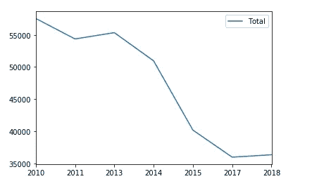

犯罪总数与年度。资料来源——vit Hulan

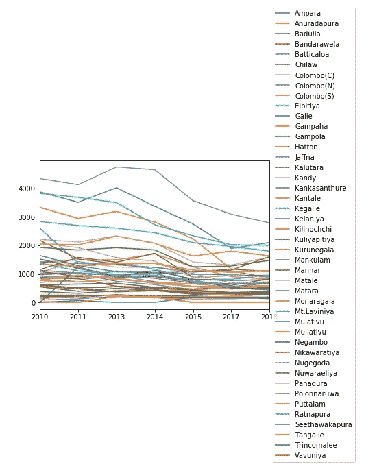

年对警察部门犯罪。资料来源——vit Hulan

## 你需要担心的城市

与所有其他警察部门相比，以下城市的犯罪率高于 95 %!

1.  努格戈达
2.  凯拉尼亚
3.  拉维尼娅山
4.  拉特纳普拉
5.  甘帕哈

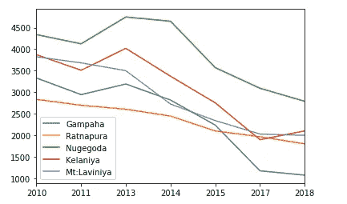

犯罪数量与年份。资料来源——vit Hulan

## 你不用担心就能放松的城市

与所有其他警察部门相比，以下城市的犯罪率低于第 10 个百分点！

*   哈顿
*   坎塔莱
*   基利诺奇
*   曼库勒姆
*   穆莱蒂武
*   Kankasanthure
*   马纳尔岛

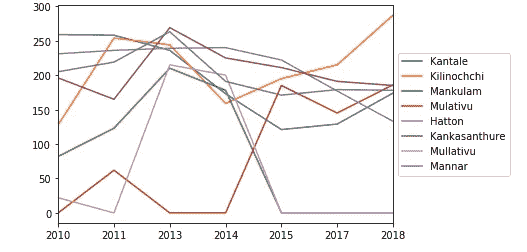

犯罪数量与年份。资料来源——vit Hulan

# 入室盗窃

> 入室行窃是指强行进入他人住宅的犯罪行为，例如打破门锁或窗户，以窃取他人财物。

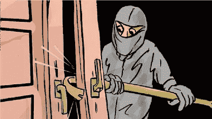

[来源](https://www.dnaindia.com/mumbai/report-employee-steals-silver-worth-rs-90-lakh-from-zaveri-bazaar-2367407)

我想到了分析破门而入和盗窃类别，因为与其他犯罪相比，这是斯里兰卡最严重的犯罪之一。2010 年，大约 32%的犯罪 是入室盗窃。

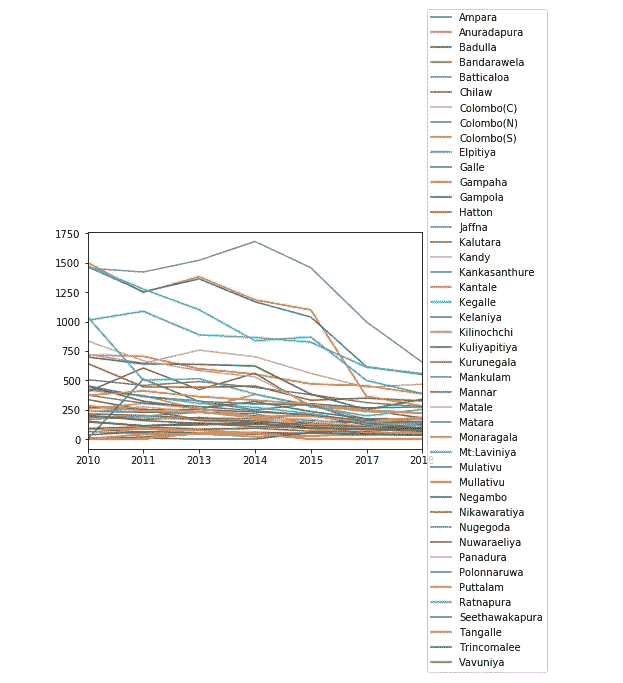

入室盗窃犯罪数量与年份。资料来源——vit Hulan

全岛平均每年发生 13818 起入室盗窃事件。那就是**每天 38 次入室抢劫**！😱

## 如果你住在下列城市之一，可以考虑买一只高德狗

以下城市的房屋破裂数量高于百分之 90！

*   努格戈达
*   凯拉尼亚
*   甘帕哈
*   拉特纳普拉
*   拉维尼娅山
*   康提
*   阿奴拉达普拉

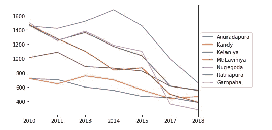

一年中家庭破裂的次数。资料来源——vit Hulan

好奇的人们，
你可以在这里查看 Nugegoda、Mt.Laviniya、Gampaha 和 Kelaniya 警察局管辖的城市[，在这里](https://www.police.lk/index.php/item/372-telephone-directory-western-province?fbclid=IwAR3Q-seD9SiR4-uew9xK_4cClJJpiyh9OC2q3VDODibMIggYUDsluMJv1lc)查看康提警察局管辖的城市[。](https://www.police.lk/index.php/item/366-telephone-directory-central-province?fbclid=IwAR2k0qta82b_3SB00zsyW2mL5EF1epaIrT45G1smm2_iL7H1X-AtrB5WBSU)

## 离开家后，你可能不用太担心城市

与所有其他警察部门相比，以下城市的入室盗窃事件数量低于第 15 个百分点。换句话说，下面这些城市的房子被砸的概率很低。

*   坎塔莱
*   基利诺奇
*   曼库勒姆
*   瓦武尼亚
*   哈顿
*   Kankasanthure
*   穆拉蒂武
*   马纳尔岛

是的，他们中的大多数都被列入了犯罪较少的城市名单！

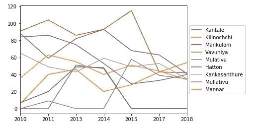

一年中家庭破裂的次数。资料来源——vit Hulan

## 我们可以开心的事情

尽管 Nugegoda 在警方犯罪排行榜上名列前茅，但今年的犯罪数量呈下降趋势！不仅如此，Nugegoda 是犯罪率较高的城市。Weldone Nugegoda 警察！👏

Nugegoda 的犯罪率梯度为负 87.34，这意味着每年大约减少 87 起犯罪。

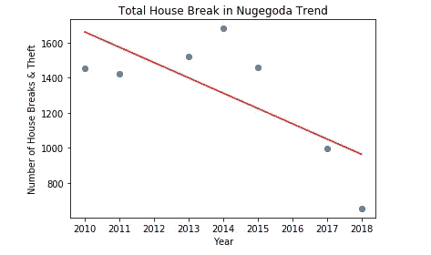

Nugegoda 的入室盗窃次数。资料来源——vit Hulan

## 令人担忧的城市

所有其他警察局的犯罪率都随着时间的推移而下降，但是下列警察局的犯罪率却在上升😱

*   基利诺奇
*   穆莱蒂武

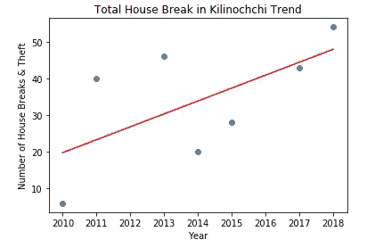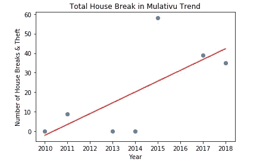

Kilinochchi 和 Mullaitivu 的破屋数量趋势。资料来源——vit Hulan

所以我决定给穆莱蒂武和基利诺奇画一条线性回归线。Mullaitivu 的正梯度为 5.53，这意味着每年大约有 6 起新的犯罪，Kilinochchi 的正梯度为 3.5，这意味着每年大约有 4 起新的犯罪。

尽管基里诺奇和穆莱蒂武的犯罪和入室盗窃数量较少，但趋势图显示，犯罪率正在随着时间的推移而上升。为了避免未来的混乱，必须在上述城市采取某种预防措施！

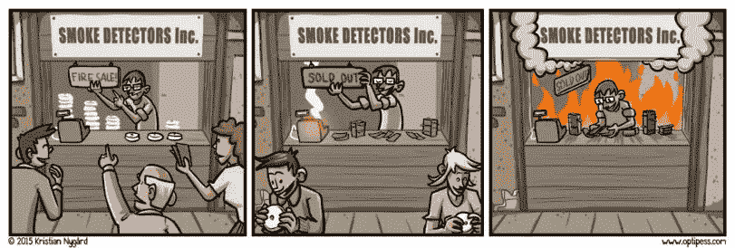

预防胜于治疗— [来源](https://www.optipess.com/comic/fire-sale/)

# 该分析的信息图

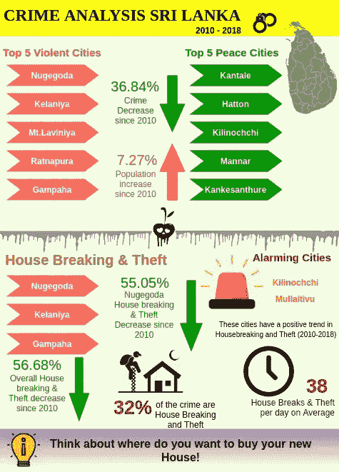

斯里兰卡犯罪分析——入室盗窃。资料来源——vit Hulan

感谢您的阅读。请随意分享你对这个分析的看法。让我们在本系列的第二部分继续讨论。

编码快乐！🍻