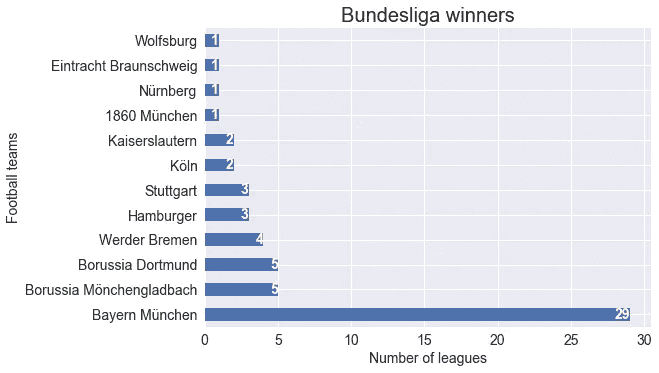
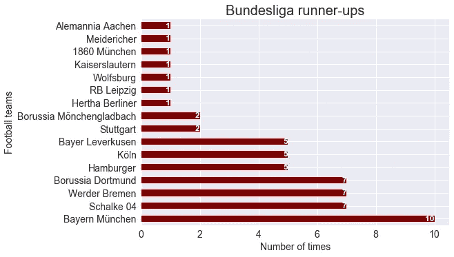
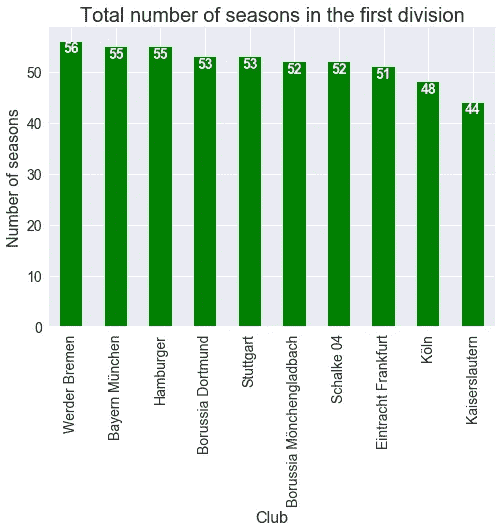
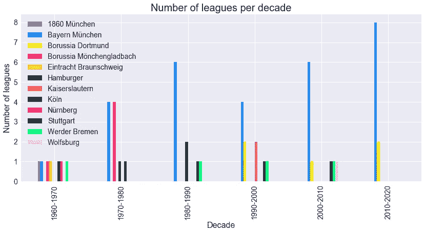
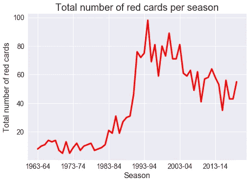
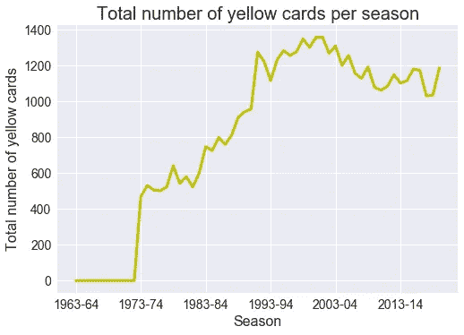
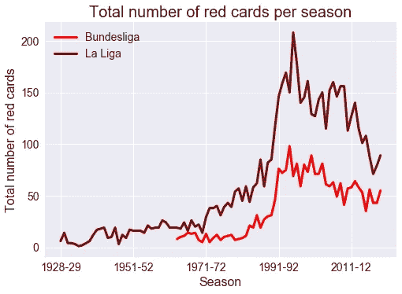
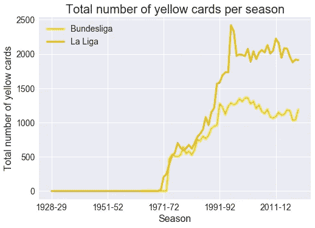
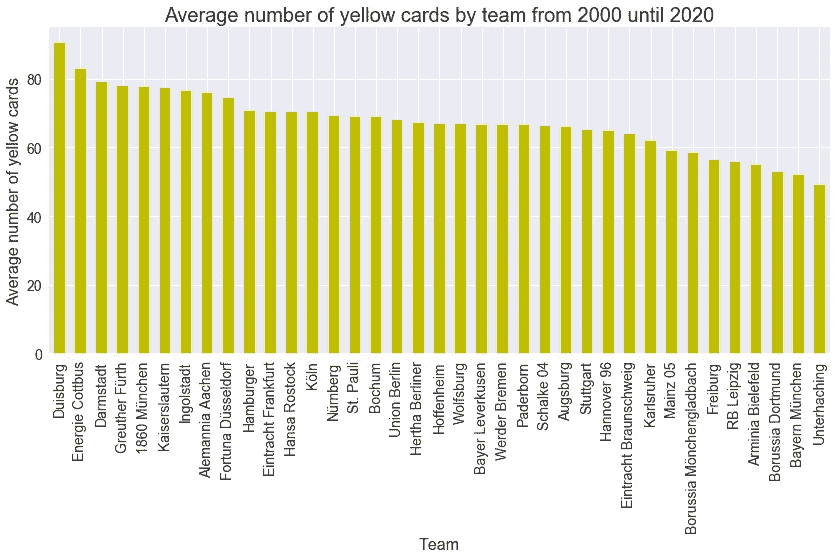
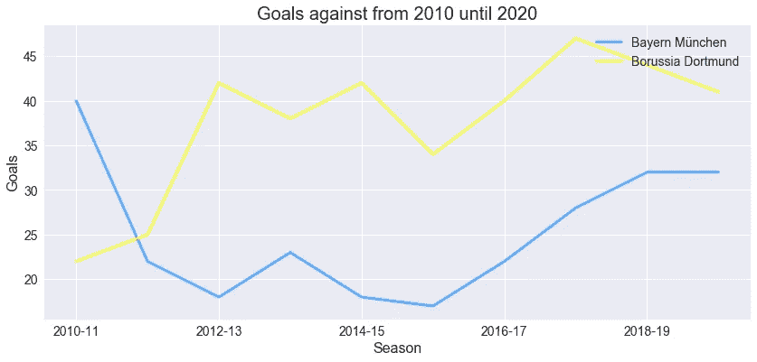

# 德国足球联赛分析

> 原文：<https://towardsdatascience.com/analysis-of-the-german-football-league-bundesliga-35b8ee28765d?source=collection_archive---------30----------------------->

## 使用 Pandas、Plotly 和 Matplotlib 进行数据分析

这篇文章是对德甲历史的一次旅行。分析历史数据(从 1963 年到 2020 年的所有分类)，我们将能够回答很多关于德国联赛的问题。德国联赛有哪些球队夺冠？哪些球队差点赢得德甲冠军？拜仁的霸权是从什么时候开始的？哪些球队罚的比较多？…还有更多！继续读▶️

马里奥·克拉森在 [Unsplash](https://unsplash.com/?utm_source=medium&utm_medium=referral) 上的照片

# 介绍

下面给没听说过德国联赛的人简单介绍一下。🙌

德国足球联赛通常被称为德甲联赛，是德国第一个国家足球联赛，是世界上最受欢迎的职业体育联赛之一。它成立于 1963 年，由西德的五个地区联赛合并而成，最初由 16 支球队组成。

在一场比赛结束时，获胜的队得到三分(在 1995-96 赛季之前得到两分)，失败的队得零分。在平局的情况下，两个队都得 1 分。

在许多欧洲联赛中，倒数三名的球队自动降级到乙级联赛。相反，在德甲联赛中，只有倒数两名直接降级到德甲 2 强。德甲联赛第 16 名和德甲联赛第 3 名为争夺甲级联赛的一个席位进行了两回合的附加赛。

介绍做好了！现在，我们准备分析❤️的数据

# Web 数据抽取

德甲联赛(从 1963 年到 2020 年)的历史数据是从 Bdfutbol.com 刮来的。该网站包含欧洲最佳联赛的足球排名。

 [## 历史时间。西甲，英超，意甲，德甲，法甲，西甲…

### 1928 年的 BBVA 甲级联赛，1928-29 年的西班牙甲级联赛，1977-78 年的西班牙乙级联赛…

www.bdfutbol.com](https://www.bdfutbol.com/es/t/t.html#ger) 

为了收集数据，我们使用了 BeautifulSoup，这是一个流行的 Python 库，用于从 HTML 页面中提取信息。在获得所有数据后，我们将它存储在一个 Pandas 数据框中以供进一步处理。

此处提供了分析中使用的编程代码。你可以边看文章边看。

 [## amandaiglesiasmoreno/德甲

### permalink dissolve GitHub 是超过 5000 万开发人员的家园，他们一起工作来托管和审查代码，管理…

github.com](https://github.com/amandaiglesiasmoreno/bundesliga/blob/master/Bundesliga.ipynb) 

# 数据清理

数据清理是将原始数据转换为标准化形式的过程，这种标准化形式可以很容易地用数据分析工具进行分析。在这个特殊的例子中，在使用 Pandas 分析数据之前，我们执行一些清理操作。首先，我们删除不必要的列，并使用英语术语重命名剩余的列(请记住，这些数据是从一个西班牙语网站上搜集来的)。然后，我们修改错误的数据类型。由于星号的存在，列点数(球队在特定赛季中获得的点数)的数据类型是 object 而不是 integer。这些星号用于指网页底部的解释，它们与本分析无关。事实上，由于该列的某些条目中存在这些星号，数据类型没有被正确导入。因此，在将列指针转换为整数数据类型之前，我们必须删除它们。

在清理数据之后，我们获得了一个 Pandas 数据框架，可以很容易地对其进行处理以提取结论。如下图所示，数据框包含了从 1963 年到 2020 年参加德甲联赛的所有球队的胜、平、负场次、黄牌和红牌数量、积分以及排名等信息。

# 德国联赛冠军

德甲联赛在其 57 年的历史中(截至 2019-20 赛季)，已经有 57 个不同的俱乐部参加过比赛；然而，他们中只有 12 个人拿到了奖杯。以下情节显示了从 1963-64 赛季到 2019-20 赛季的德国联赛冠军。

如上图，拜仁慕尼黑是德甲历史上最成功的俱乐部，拥有 29 个冠军，代表了超过 50%的联赛。接下来最成功的球队是门兴格拉德巴赫和五次获得德甲冠军的多特蒙德。除了他们，其他球队如云达不莱梅、汉堡、斯图加特、科隆和凯泽斯劳滕也多次举起德甲奖杯。

# 德国联赛亚军

有 6 支足球队从未赢得过联赛冠军，但他们在一个或多个场合获得亚军:阿亚琛，勒沃库森，柏林赫塔，梅德里奇，莱比锡和沙尔克 04。如下图所示，沙尔克 04 和勒沃库森特别倒霉，分别 7 次和 5 次获得德甲亚军。此外，我们还可以观察到拜仁慕尼黑是更多次获得德甲亚军的俱乐部(10 次)。

在 2016-17 赛季，RB Leipzig 在德甲联赛中获得第二名。该俱乐部成立于 2009 年，目前是德国领先的车队之一，这主要是因为红牛公司的重大投资。

# 甲级联赛总赛季数(前 10 名)

云达不莱梅保持着参加德国联赛赛季最多的记录。他们在德甲 57 个赛季中踢了 56 个赛季，只有一次被降级到乙级。拜仁慕尼黑从 1965 年开始不间断地在德甲踢球，汉堡从 1963 年到 2018 年，两人一共踢了 55 个赛季。除了前面提到的俱乐部，多特蒙德、斯图加特、门兴格拉德巴赫、沙尔克 04、法兰克福 Eintracht 也参加了 50 多个赛季的德国联赛。

在上个赛季(2019–20)，上图中除了汉堡、斯图加特、凯泽斯劳滕之外的所有球队都在德甲打过球。

# 每个赛季德国联赛的球队数量

1963 年德甲联赛开始时有 16 支球队，1965 年扩大到 18 支。从那以后，除了 1991-92 赛季之外，德甲俱乐部的数量一直保持不变。在那个赛季，联盟被临时扩大(20 支球队)以容纳来自前东德的俱乐部。

目前，德国联赛有 18 支球队参赛。参加西甲联赛(葡萄牙)和荷甲联赛(荷兰)的球队数量相同。相反，有 20 支球队参加意甲(意大利)、西甲(西班牙)、法甲(法国)和英超(英格兰)。如今，人们仍在争论是否应该将两支球队纳入德甲联赛，以符合最重要的欧洲联赛。

# 联赛数量的演变

在整个德甲历史上，拜仁慕尼黑队明显占据了主导地位，赢得了超过一半的联赛冠军。自 2000 年以来，拜仁慕尼黑赢得了 20 场联赛中的 14 场，对于其他球队来说几乎不可能与红军竞争。但是德甲一直都是拜仁慕尼黑称霸的吗？拜仁的霸主地位是从什么时候开始的？让我们用一个简单的情节来澄清所有的问题。

下面的交互折线图展示了各队联赛数量的演变。为了正确地可视化结果，您可以停用一些跟踪，只可视化那些您感兴趣的跟踪。您可以通过单击相关的图例项来显示或隐藏轨迹。此外，您可以通过将鼠标悬停在数据点上来获取关于该数据点的信息(赛季和联赛数)。

德甲联赛的前七个赛季由七支球队赢得:科隆(1963-64)、云达不莱梅(1964-65)、1860 年慕尼黑(1965-66)、德国布伦瑞克(1966-67)、纽伦堡(1967-68)、拜仁慕尼黑(1968-69)和门兴格拉德巴赫(1969-70)。

在 70 年代，德国联赛由两家俱乐部主导，它们都不是 1963 年德甲联赛的创始成员:门兴格拉德巴赫和拜仁慕尼黑。从 1969 年到 1977 年，只有这两家俱乐部有幸举起了德甲冠军奖杯。

门兴格拉德巴赫的辉煌时期是在七十年代。在汉斯·维斯维勒(1964-1975)和乌多·拉特克(1975-1979)的执教下，小马驹乐队赢得了五座德甲冠军奖杯，两座联盟杯，甚至在 1977 年打进了冠军联赛决赛，但他们输给了利物浦。

从 80 年代中期开始，拜仁慕尼黑队完全统治了德甲联赛。到目前为止，他们赢得的冠军比所有其他队加起来还多。然而此后拜仁的霸主地位被数次打破。90 年代，凯泽斯劳滕两次捧起奖杯(1990-91 年和 1997-98 年)，在从德甲 2 级升级后赢得了第二个联赛冠军。2008 年，在以 2 分之差击败拜耳后，沃尔夫斯堡赢得了他们的第一个德甲联赛冠军，并有史以来第一次获得了欧冠资格。上一支挑战拜仁霸权的球队是 2012 年在尤尔根·克洛普的魅力指导下的多特蒙德队，那是德甲联赛中最后一个不是拜仁的冠军。此后，拜仁慕尼黑连续八次获得德甲冠军。如今，拜仁慕尼黑是德国在国内和欧洲最成功的足球俱乐部。

所有上述情况也可以在下面的图表中观察到，该图表显示了球队和十年的联赛数量。

# 团队的历史表现

下面的互动图显示了所有在德甲比赛的球队的历史表现(历年排名)。要显示历史数据，我们必须使用位于左上角的下拉列表选择团队。我们会注意到，在一些赛季中没有可用的数据，这意味着被选中的球队在该特定年份没有参加过甲级联赛。请随意检查您更感兴趣的团队的表现💚

# 德甲联赛中的黄牌和红牌

有一样东西是全世界大多数足球迷认为理所当然的:使用卡。然而，直到 1970 年墨西哥世界杯，才在足球界首次使用了黄红卡制度。这个系统是由英国裁判肯·阿斯顿在 1966 年发明的，他注意到很多时候足球运动员不理解或者只是忽视裁判的警告，而这些警告在当时是口头传达的。然后，受交通灯颜色(红色和黄色)及其含义的启发，阿斯顿创造了一种颜色编码方案，以清楚地表明足球运动员已被警告或驱逐。

在 1970-71 赛季的德甲联赛中，使用了黄牌和红牌。几年后的 1991 年，德国联赛引入了黄/红牌。球员在同一场比赛中得到第二张黄牌后得到一张黄/红牌，这意味着他必须离开比赛，并被排除在下一场比赛之外。相反，当直接收到红牌时，该球员将被禁止参加比赛更长时间。此外，如果一名球员累积五张黄牌，我们也将被排除在下一场比赛之外。

下图显示了每个赛季的红牌总数。正如我之前说过的，在 1971 年之前，裁判口头向球员宣布他的罚款。在下图中，1971 年之前，红牌代表的是在比赛中仅用言语(不使用卡片)驱逐的足球运动员。在使用卡牌之前，玩家往往得不到惩罚。只有在特殊情况下(真的很强的犯规)，足球运动员才被驱逐出场。

我们观察到一种增长趋势(特别是在 80 年代快速增长)直到 90 年代中期。从那一刻开始，红牌总数就在随着时间慢慢减少。

同样，下图显示了每个赛季的黄牌总数。

从 1971 年到 90 年代，每个赛季的黄牌总数一直在稳步增长。从这个时候起，卡片的数量几乎保持不变，每季大约 1200 张。

在之前的一篇文章中，我们已经分析过西班牙联赛([链接此处！](/analysis-of-the-spanish-football-league-la-liga-7c636a9317b3))。对比结果后，我们可以观察到，在这两个联赛中，多年来红牌和黄牌数量的演变遵循相同的模式，如下所示。然而，西班牙联赛的球员比德甲联赛的球员收到的卡要多得多(尽管他们只多踢两场比赛)。

现在，也许你想知道:在过去的几个赛季中，哪些球队收到了更多的卡片？

下面的图表显示了从 2000 年到 2020 年球队的平均红牌和黄牌数量。如下图所示，拜仁慕尼黑是平均每个赛季收到较少卡片的球队之一。正如我们在以前的文章中分析的那样，西班牙的皇家马德里和巴塞罗那也是如此。

# 过去 10 年的表现(拜仁慕尼黑 vs 多特蒙德)

拜仁慕尼黑在过去的 10 年里完全统治了德甲联赛，连续赢得了 8 个冠军。那段时间，唯一挑战过拜仁霸主地位的球队一直是多特蒙德；然而，拜仁慕尼黑展示了比直接对手更强的防守技巧。

下面的图表显示了两个团队从 2010 年到 2020 年的目标。在多特蒙德夺冠的两个赛季(2010-11 和 2011-12)，黑黄军团的防守和红军一样好，2011 赛季甚至好得多。然而，从那以后，拜仁慕尼黑在进攻和防守方面表现出了更大的平衡，这解释了它在过去八个赛季中的成功。

# 多分析！

如果你喜欢读这篇文章，并且想知道更多关于其他联赛的信息😃，看一眼西班牙联赛的分析:)

 [## 西班牙足球联赛分析

### 数据分析📝+历史记录🌐

towardsdatascience.com](/analysis-of-the-spanish-football-league-la-liga-7c636a9317b3) 

感谢你阅读❤️

阿曼达