# 使用 R Shiny 对肯尼亚 2019 年人口普查的分析。

> 原文：<https://towardsdatascience.com/analysis-of-the-kenya-2019-census-using-r-shiny-25ea763da5a3?source=collection_archive---------21----------------------->

## 该项目为肯尼亚 2019 年住房和人口普查提供了可操作的见解。

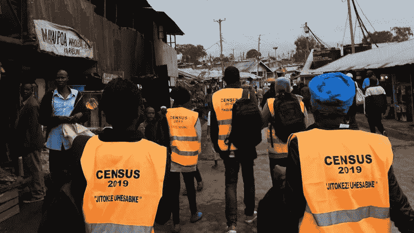

肯尼亚一个选区的人口普查员。

**引言。**

独立后的第一次人口普查于 1969 年进行，对 1，090 万肯尼亚人进行了统计。此后，该国在 8 月 24 日/25 日午夜进行了十年一次的人口和住房普查。

使用 R Shiny [应用程序](https://brianmwangy.shinyapps.io/Kenya_census/)对 2019 年肯尼亚人口和住房普查[第一卷报告](https://www.knbs.or.ke/?wpdmpro=2019-kenya-population-and-housing-census-volume-i-population-by-county-and-sub-county)进行的分析，提供了关于国家和县一级按性别、家庭数量、平均家庭规模分列的枚举人口分布的有用、可操作的见解。政府可以很容易地获得这些见解，并将其用于资源分配、政策制定、规划和预算，以提供基本的政府服务。

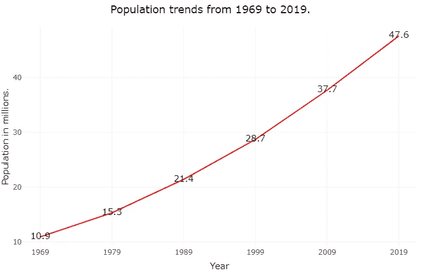

肯尼亚国家统计局(KNBS)是负责收集、分析和传播统计数据的政府机构。2019 年肯尼亚人口和住房普查于 2019 年 8 月进行，信息包括人口的人口统计和社会经济特征。人口普查的主题是“*统计我们的人口以促进可持续发展和服务转移*”。

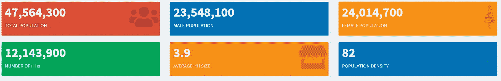

国家一级普查统计概览。

**R 闪亮概述。**

[Shiny](https://shiny.rstudio.com/) 是一个真正强大的数据讲述工具，它结合了 R 的计算能力和现代网络的交互性，用于创建漂亮、有洞察力的应用程序。R shiny 有广泛的应用，包括在学术界作为统计概念的教学工具；数据分析师为高级分析创建指标仪表板。

对于初学者来说，一个很好的指南是 Hadley Wickham 的闪亮 R 工作室网站和掌握闪亮。

**普查分析与洞察。**

**数据。**

2019 年肯尼亚人口普查数据包括人口统计数据，如按性别分列的人口、家庭数量、平均家庭规模、人口密度、国家、县和县以下各级的土地面积。

数据可以从[这里](https://www.knbs.or.ke/?wpdmpro=2019-kenya-population-and-housing-census-volume-i-population-by-county-and-sub-county)获取，pdf 格式。我分析过县级的数据；县级以下的数据仍在清理中。

这个互动的 [R 闪亮的应用程序](https://brianmwangy.shinyapps.io/Kenya_census/)使人们能够与人口普查数据互动，并获得明智决策的洞察力。

**人口。**

据统计，全国总人口为 47，564，300 人，其中男性人口为 23，548，100 人，女性人口为 24，014，700 人，阴阳人人口为 1，500 人。

**各县人口。**

下面的地图显示了每个县的人口分布。显而易见，内罗毕、基安布和纳库鲁等县的人口较多，而拉穆等县的人口只有 143，920 人。

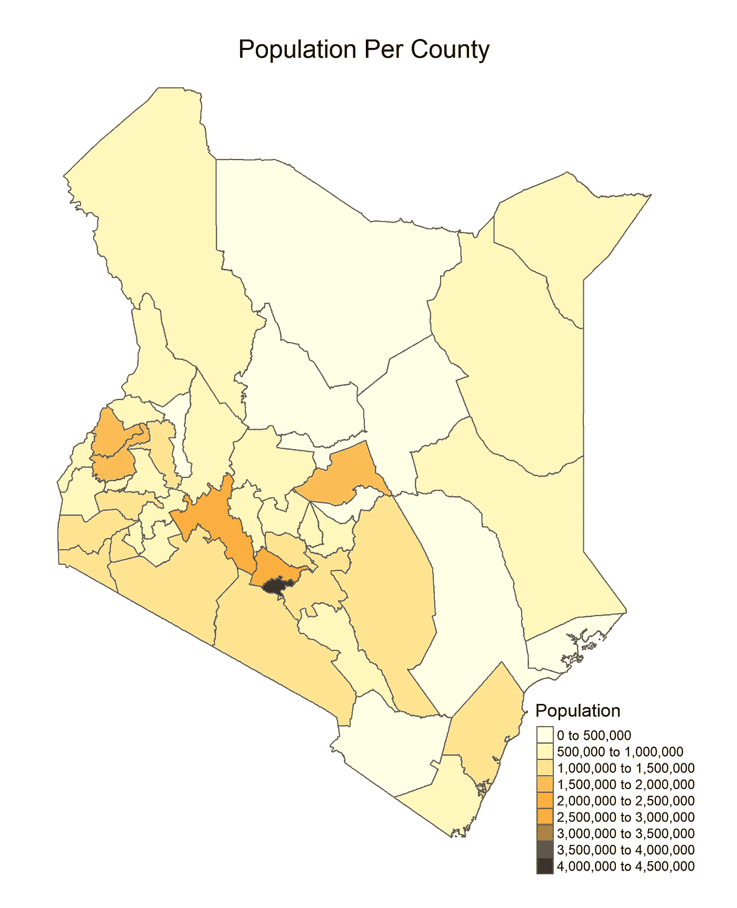

按人口分组的前 5 个县的条形图

**男性人口。**

内罗毕、基安布和纳库鲁的男性人口最多，而伊索洛等县的男性人口只有 139510 人。

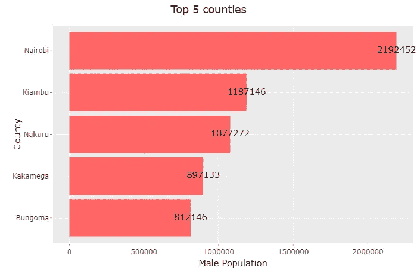

按男性人口分组的前 5 个县的条形图

**女性人口。**

统计数字仍然相同，内罗毕、纳库鲁和基安布的女性人口最多。

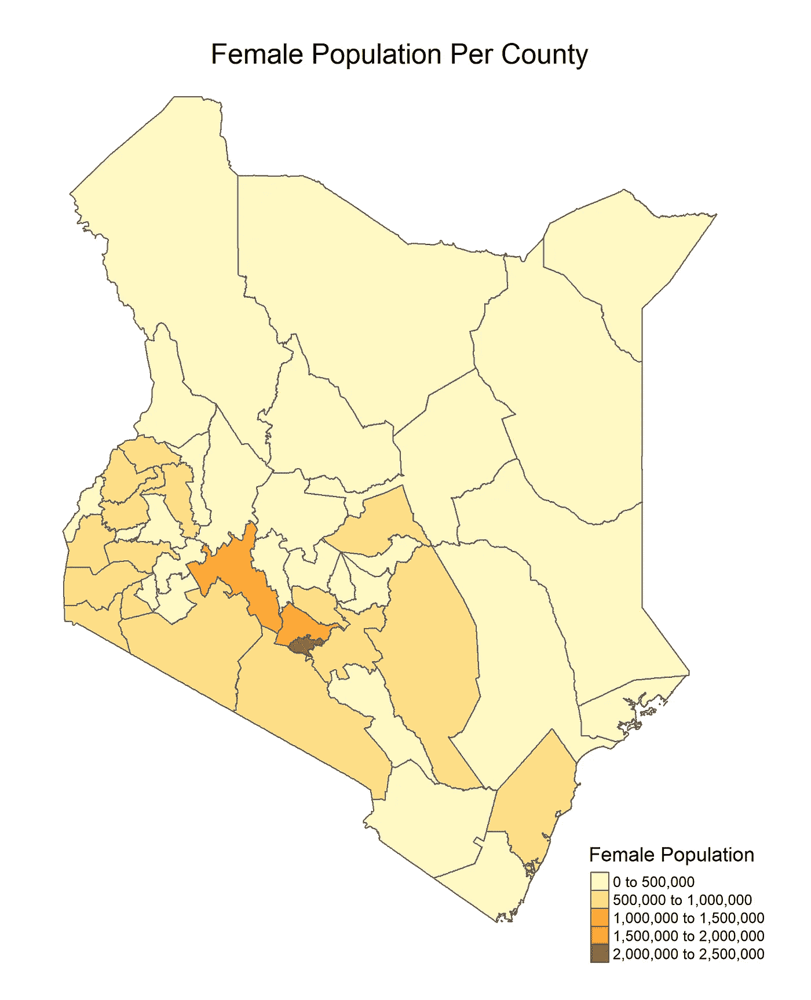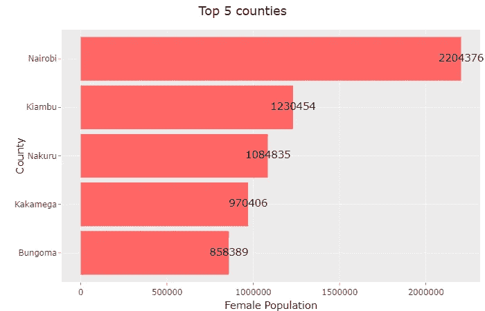

按女性人口分组的前 5 个县的条形图

**户数。**

家庭数量最多的主要县包括内罗毕、基安布、纳库鲁、卡卡梅加和梅鲁。

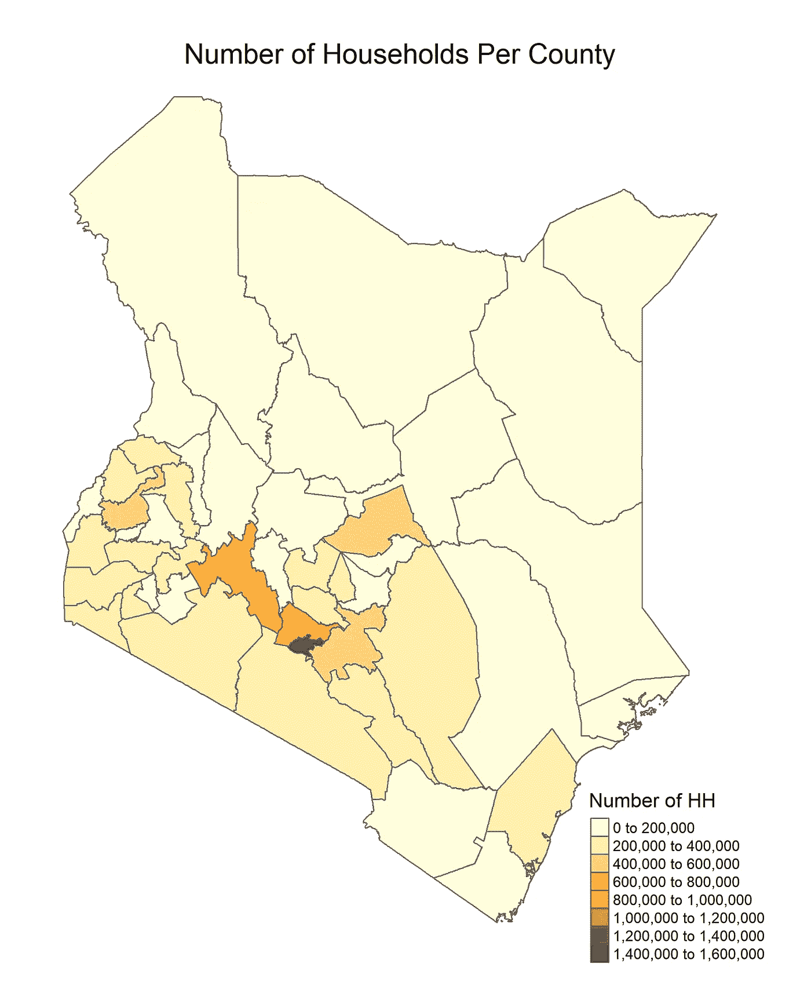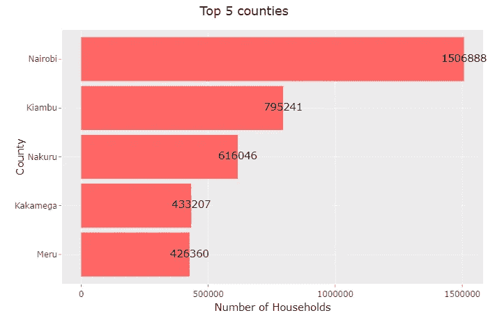

按家庭数量分组的前 5 个县的条形图

**平均家庭规模。**

曼德拉、瓦吉尔、加里萨、马萨比特和图尔卡纳等北部大多数县的平均家庭规模较大。内罗毕，

Kiambu 和 Kirinyaga 的平均家庭规模最小。

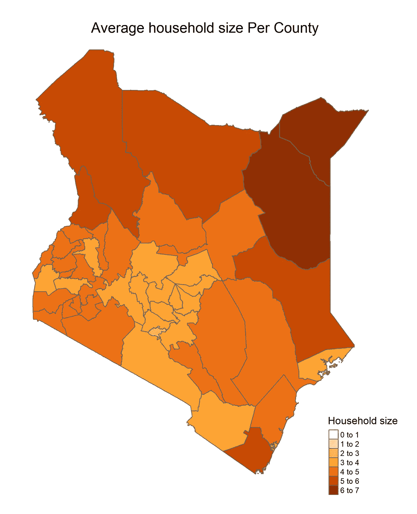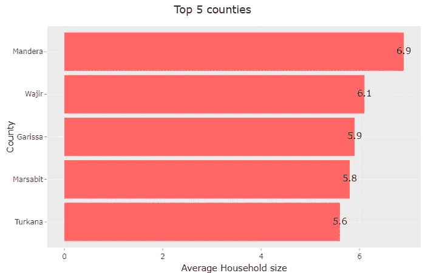

按平均家庭规模分组的前 5 个县的条形图

**互动地图。**

[**R 闪亮 app**](https://brianmwangy.shinyapps.io/Kenya_census/)**|**[**Github**](https://github.com/brynmwangy/2019-Kenya-Census-App)****

****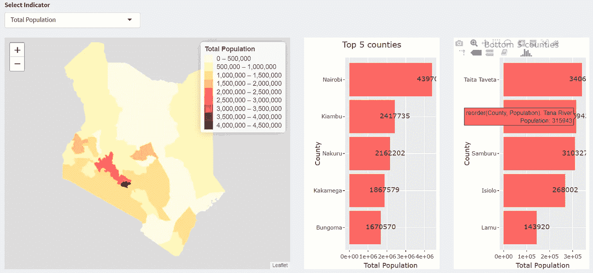****

****闪亮互动应用概述****

****在 [shiny app](https://brianmwangy.shinyapps.io/Kenya_census/) 上可以找到轻松显示上述地图的互动地图。闪亮应用的代码在我的 [Github](https://github.com/brynmwangy/2019-Kenya-Census-App) 上。请随意浏览地图，了解更多关于肯尼亚人口普查的信息。****

******下一步。******

****I)添加县级以下的人口普查数据(仍在清理数据)。****

****ii)用肯尼亚国家统计局发布的新数据更新应用程序(第 2 卷报告)。****

****iii)优化应用程序代码以获得更好的性能。****

******结论。******

****R shiny 是一款非常棒的工具，可以用来讲述数据故事和制作信息丰富的仪表盘。您已经能够获得对肯尼亚 2019 年人口普查的宝贵见解。快乐的 R 闪耀！更多讨论，我们可以通过 [Linkedln](https://www.linkedin.com/in/brianmwangi/) 连线。****