# 西班牙足球联赛分析

> 原文：<https://towardsdatascience.com/analysis-of-the-spanish-football-league-la-liga-7c636a9317b3?source=collection_archive---------38----------------------->

## 数据分析📝+历史记录🌐

西班牙足球联赛俗称西甲，是西班牙第一个国家足球联赛，是世界上最受欢迎的职业体育联赛之一。它成立于 1929 年，除了西班牙内战期间(1936-1939)之外，每年都举行。在他的基金会，只有 10 个团队。目前，它由 20 支球队组成，分布在全国各地，但主要来自最发达的地区:马德里、巴塞罗那和巴斯克地区。排名前四的球队有资格参加冠军联赛，而排名最低的三支球队(排名 18-20)被降级到乙级。像在大多数欧洲国家一样，比赛的获胜者得到三分，如果平局，两个队都得 1 分。

这篇文章介绍了西班牙联赛的历史。分析历史数据(从 1929 年到 2020 年的所有分类)，我们将能够回答很多关于西甲的问题。有哪些球队差点拿到西甲冠军？裁判偏向皇马和巴萨吗？西甲是不是变得太软了？巴萨和皇马的争霸是从什么时候开始的？巴塞罗那什么时候开始追赶皇马了？

我们开始吧💜

韦斯利·廷吉在 [Unsplash](https://unsplash.com/?utm_source=medium&utm_medium=referral) 上拍摄的照片

# Web 数据抽取

西甲联赛(从 1929 年到 2020 年)的历史数据是从 Bdfutbol.com 刮来的。这个网站包含国家和国际足球排名。

 [## 历史时间。西甲，英超，意甲，德甲，法甲，西甲…

### 1928 年的 BBVA 甲级联赛，1930-31 年的荷兰甲级联赛，1978-79 年的荷兰乙级联赛…

www.bdfutbol.com](https://www.bdfutbol.com/es/t/t.html) 

为了收集数据，我们使用了 BeautifulSoup，这是一个流行的 Python 库，用于从 HTML 页面中提取信息。在获得所有数据后，我们将它存储在一个 Pandas 数据框中以供进一步处理。

此处提供了分析中使用的编程代码。你可以边看文章边看。

 [## amandaiglesiasmoreno/西班牙联赛

### permalink dissolve GitHub 是超过 5000 万开发人员的家园，他们一起工作来托管和审查代码，管理…

github.com](https://github.com/amandaiglesiasmoreno/Spanish-League/blob/master/Spanish%20League.ipynb) 

# **数据清理**

数据清理是将原始数据转换为标准化形式的过程，这种标准化形式可以很容易地用数据分析工具进行分析。在这个特殊的例子中，在使用 Pandas 分析数据之前，我们已经执行了多次清理操作。我们已经删除了不必要的列，并使用英语术语重命名了剩余的列(请记住，数据是从一个西班牙语网站上搜集来的)。在探索性数据分析过程中，我们注意到在某些情况下，同一个足球队被用了多个名字。多年来，一些足球队已经改变了他们的名字，在大多数情况下是由法律规定的。例如，在西班牙第二共和国时期(1931-1939)，不允许使用皇家标志。因此，许多足球队修改了包含“皇家”一词的名称，以避免因赞美君主政体而被定罪。皇家马德里不仅改名为公正的马德里，而且还失去了他的盾冠。随后，在佛朗哥政权期间，他们恢复了“Real”这个词，但一项新的法律影响了其他球队的名称。独裁政权从 1941 年到 1972 年禁止使用外来语。因此，竞技俱乐部、桑坦德竞技和希洪竞技等球队被迫将 30 年来的历史名称改为毕尔巴鄂竞技、桑坦德和皇家希洪。

在清理数据之后，我们获得了一个 Pandas 数据框架，可以很容易地对其进行处理以提取结论。如下图所示，数据框包含了从 1929 年到 2020 年参加西甲联赛的所有球队的胜、平、负场次、黄牌和红牌数、积分数以及在排名中的位置等信息。

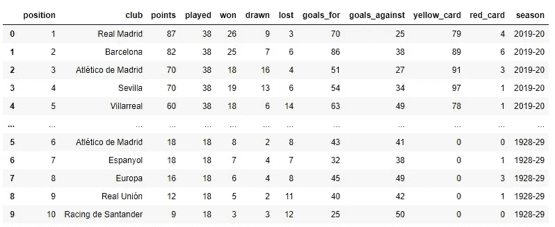

现在，我们准备分析数据！:)

# 西班牙联赛冠军

西班牙联赛由 60 多个不同的俱乐部参加；然而，他们中只有 9 个人拿到了奖杯。以下情节显示了从 1928-29 赛季到 2019-20 赛季的西班牙联赛冠军。

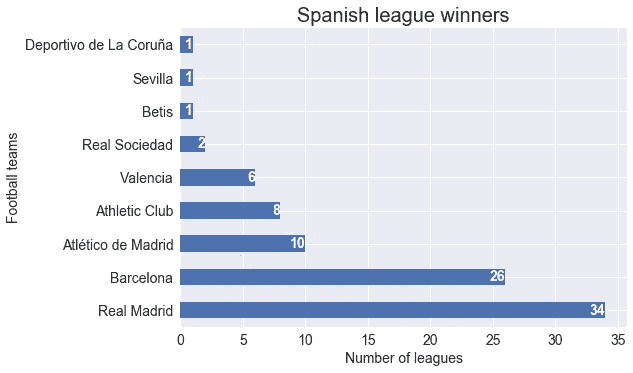

如上图所示，皇马是西甲历史上最成功的俱乐部，拥有 34 个冠军，其次是巴塞罗那，拥有 26 个联赛冠军。然而，正如我们将在后面看到的，巴塞罗那正在迎头赶上。除了这两家俱乐部，西班牙甲级联赛还被其他 7 家俱乐部夺得，包括马德里竞技(10)，竞技俱乐部(8)，瓦伦西亚(6)，皇家社会(2)，贝蒂斯(1)，塞维利亚(1)，拉科鲁尼亚(1)。

# 西班牙联赛亚军

成为亚军是令人心碎的。对于皇家马德里和巴塞罗那来说，第二名是一个可耻的失败，很容易以解雇教练或下赛季签下多个千万富翁而告终。对于其他团队来说，只是一个几乎成真的梦想，但绝对不是失败。毕竟，失败只是期望的问题。

如下图所示，有 5 支足球队从未赢得过联赛冠军，但他们曾经获得过亚军:桑坦德竞技队(1930-31)、拉斯帕尔马斯队(1968-69)、萨拉戈萨队(1974-75)、希洪竞技队(1978-79)和比利亚雷亚尔队(2007-08)。

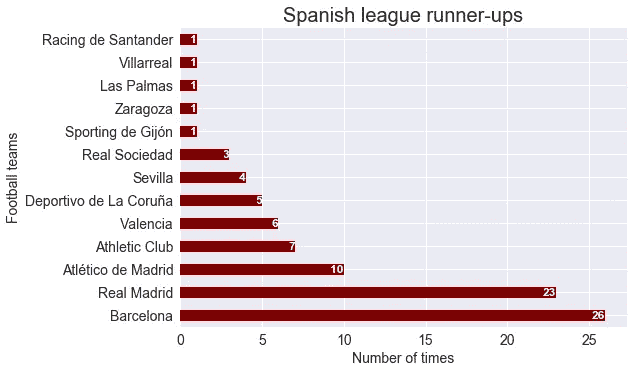

此外，我们还可以观察到，巴塞罗那在西甲联赛中获得亚军的次数比皇家马德里多。

# 甲级联赛总赛季数(前 10 名)

只有三支足球队从未降级到乙级:竞技俱乐部、巴塞罗那和皇家马德里。西班牙人和瓦伦西亚在乙级联赛踢了 4 个赛季，马德里竞技踢了 6 个赛季。

上图中的所有球队目前都在甲级，除了萨拉戈萨(自 2012 年以来-13 年在乙级)。

# 每个赛季西班牙联赛的球队数量

除了 1995-1996 和 1996-1997 赛季有 22 支球队参赛之外，西甲联赛的球队数量从 10 支稳步增长到 20 支。

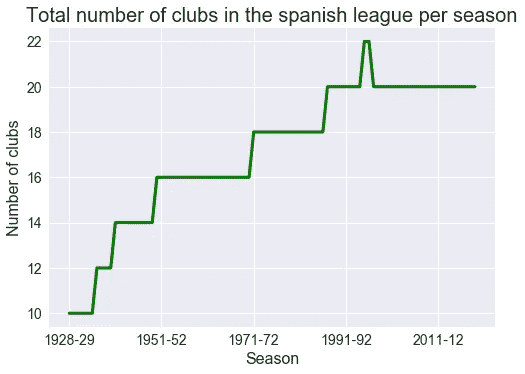

目前，有 20 支球队参加西班牙联赛。同样数量的球队参加意甲(意大利)、法甲(法国)和英超(英格兰)。相反，有 18 支球队参加了德甲(德国)、西甲(葡萄牙)和荷甲(荷兰)。联赛数量的演变

# 联赛数量的演变

据说在西班牙，西甲由两支球队踢，剩下的就是装饰，在我看来，这是完全正确的😢。自 2000 年以来，皇家马德里和巴塞罗那赢得了 20 场联赛中的 17 场，其他球队几乎不可能与之竞争。但是西班牙联赛一直都那么无聊吗？一直以来都是马德里还是巴萨在主导？皇马和巴萨的争霸是从什么时候开始的？让我们用一个简单的情节来澄清所有的问题。

下面的图显示了球队的联赛数量的演变。

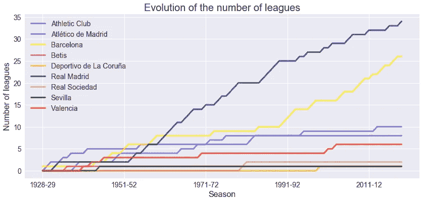

如剧情所示，在联赛的最初几年，虽然我们可以观察到竞技俱乐部的轻微突出，但西甲并不像现在这样一家独大，也没有被任何俱乐部明显主导。在 50 年代后期，随着迪斯蒂法诺的签约，我们开始看到皇家马德里统治地位的开始。这位阿根廷人彻底改变了皇马的命运，当时皇马只是一支普通球队，已经 20 年没有赢得联赛冠军了。

从 20 世纪 60 年代开始，皇家马德里控制了联赛，在短短 20 年内赢得了 14 个冠军。当时，“El Clásico”是马德里竞技队和皇家马德里队之间的比赛，因为马德里竞技队是梅林格队在 1960 年至 1980 年期间赢得 4 个联赛冠军的唯一强劲对手。

从 90 年代开始，巴塞罗那一直统治着西班牙联赛，赢得了 16 个冠军。在 20 世纪 90 年代，在约翰·克鲁伊夫(1988-1996)的管理下，巴萨在最后几年结束了对皇马的压倒性统治。约翰·克鲁伊夫创造了一种以控球为基础的足球风格，这种风格被巴萨后来的教练路易斯·范加尔、弗兰克·里杰卡尔德，尤其是瓜迪奥拉所模仿。从 2000 年开始，本土球员如梅西、伊涅斯塔、哈维、布斯克茨、普约尔或皮克继续称霸巴塞罗那。

所有上述情况也可以在下面的图表中观察到，该图表显示了球队和十年的联赛数量。

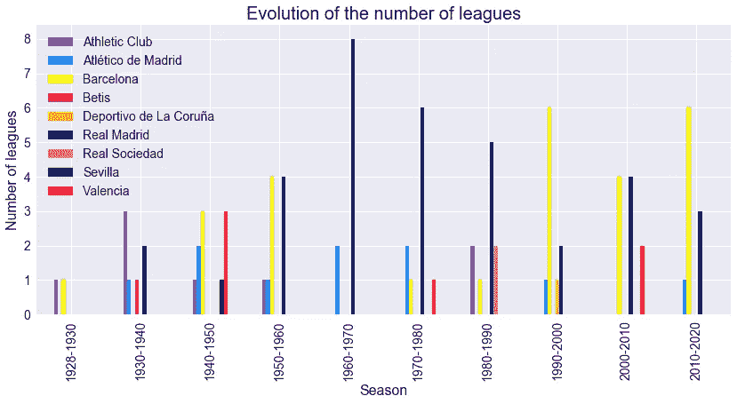

# **皇马和巴萨的联赛差异**

下面的剧情展示了一段时间内皇马和巴萨的联赛差异。如下图所示，对巴塞罗那有利的最大差异出现在 1952-1953 赛季。当时巴萨比皇马多 4 个联赛。然而，在五十年代中期，皇马的运气即将改变。从这个时候到 90 年代，皇家马德里队明显统治了西甲，布兰科队和巴塞罗那队之间的联赛差距随着时间的推移不断扩大，在 1989-90 赛季达到最大值(15 个联赛)。从 20 世纪 90 年代开始，我们观察到由于巴塞罗那的霸权，联赛中的差异是如何随着时间的推移而减少的。目前皇马比巴萨多 8 个联赛。

# 西甲联赛中的黄牌和红牌

有一样东西是全世界大多数足球迷认为理所当然的:使用卡。然而，直到 1970 年墨西哥世界杯，才在足球界首次使用了黄红卡制度。这个系统是由英国裁判肯·阿斯顿在 1966 年发明的，他注意到很多时候足球运动员不理解或者只是忽视了当时口头传达的裁判的警告。然后，受交通灯颜色(红色和黄色)及其含义的启发，阿斯顿创造了一种颜色编码方案，以清楚地表明足球运动员已被警告或驱逐。

但正如海明威所说，西班牙是不同的。西班牙国家队没有参加 1970 年在墨西哥举行的世界杯，在那里首次使用了信用卡系统。西班牙足球联合会认为黄牌实际上是白色的，所以那是他们在当时黑白电视中的样子。1971 年 1 月，红白卡被引入西班牙联赛，直到 1976 年，罗卡最终取代了白卡。

下图显示了每个赛季的红牌总数。正如我之前说过的，在 1971 年之前，裁判口头向球员宣布他的罚款。在下图中，1971 年之前，红牌代表的是在比赛中仅用言语(不使用卡片)驱逐的足球运动员。

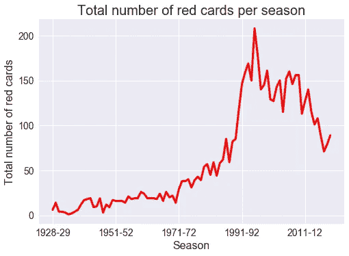

我们观察到一种增长的趋势，直到 90 年代中期。从那一刻起，红牌总数随着时间稳步下降。

同样，下图显示了每个赛季黄牌(包括白牌)的总数。

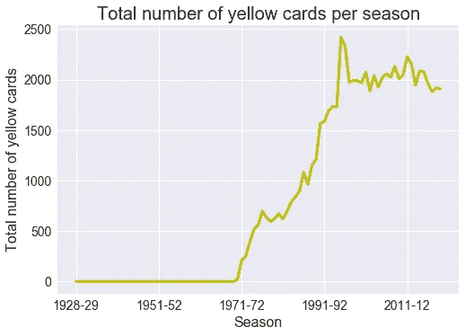

从 1971 年到 90 年代中期，每个赛季的黄牌总数一直在稳步增长。从那时起，卡的数量几乎保持不变，每季大约 2000 张。

在使用卡牌之前，玩家往往得不到惩罚。只有在特殊情况下(真的很强的犯规)，足球运动员才被驱逐出场。

在西班牙，据说最近几年裁判偏向皇马和巴萨。但真的是这样吗？让我们看看数字:)

下面的图显示了从 1990 年到 2020 年球队的红黄牌平均数量。如上所述，皇家马德里和巴塞罗那平均收到的卡片比其他强队如马德里竞技、瓦伦西亚、塞维利亚或竞技俱乐部要少。也许他们的成功不仅仅是金钱和优秀球员的结合，还有一点点帮助😆

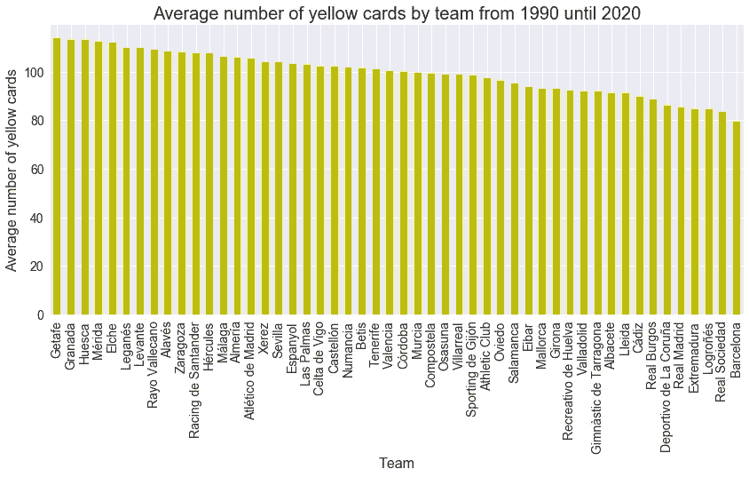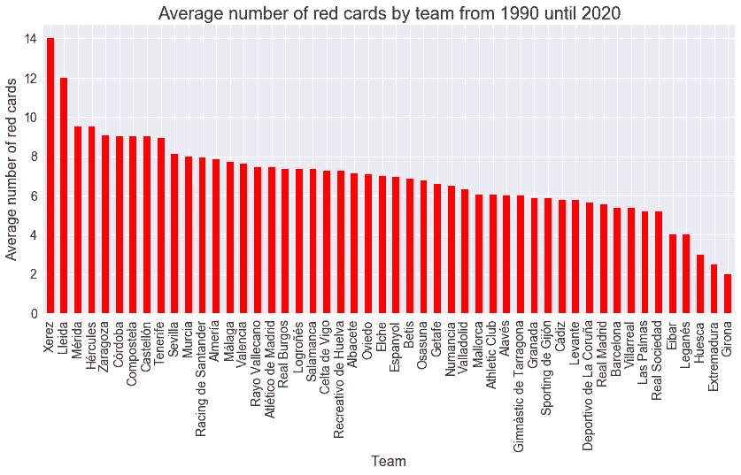

# 过去 10 年的业绩

以下图表显示了瓦伦西亚、皇家马德里、巴塞罗那、马德里竞技和竞技俱乐部在过去 10 年中的表现。如下图所示，皇家马德里和巴塞罗那的平均进球数比其他球队多。

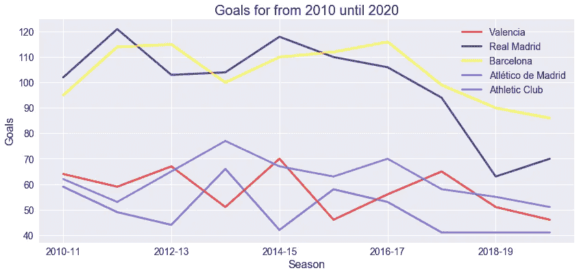

然而，如果我们分析对手的进球，我们会发现马德里竞技是防守最强的球队，甚至比巴萨还要好，而这一切的罪魁祸首就是迭戈·西蒙尼。

这位阿根廷人自 2011 年 12 月以来一直是马德里竞技的经理。在他的指导下，马德里竞技在强大的防守风格基础上形成了鲜明的特征。在迭戈·西蒙尼的执教下，马德里竞技赢得了西甲冠军、国王杯冠军、两次欧联杯冠军、两次欧洲超级杯冠军，目前是皇马和巴萨唯一的劲敌。

# 摘要

长期以来，西班牙联赛明显由皇马和巴萨主导。一开始，这个联盟并不像今天这样具有霸权地位，也没有任何俱乐部明显地控制着它。从五十年代中期开始，皇家马德里队控制了联赛，成为他唯一的劲敌。在 1989-90 赛季，皇家马德里比巴塞罗那多 15 个联赛。然而，在 90 年代，在约翰·克鲁伊夫的监督下，巴萨以皇马的压倒性优势而告终。从那个时候开始，他们之间的联赛差距就在逐渐缩小。如今，皇家马德里，尤其是巴塞罗那，显然统治着西甲，其他球队很难与之竞争。

一个更多元化的联盟也会更有趣。然而，在我看来，这种情况不太可能很快改变。西班牙联赛高度货币化，人们对皇家马德里-巴塞罗那的霸权特别感兴趣，因为他们是产生最大利益的球队。

# 感谢

虽然我喜欢足球，但我从来不是它的狂热爱好者。我选择这个题目几乎是偶然的，没有想到会发现这么多有趣的东西。我希望你喜欢读这篇文章，就像我喜欢写它一样。

最后，我要感谢我的父母对我的支持。如果没有和他们关于足球的长时间交谈，就不可能写出这篇文章。谢谢你😊。是的，我们都支持❤️竞技

阿曼达🍀