# 用熊猫分析 1976-2010 年美国大选

> 原文：<https://towardsdatascience.com/analysis-of-us-elections-from-1976-to-2010-with-pandas-6654cf69849d?source=collection_archive---------39----------------------->

## 实践熊猫，同时提供对过去选举的宝贵见解。


由 [Unsplash](https://unsplash.com/s/photos/election?utm_source=unsplash&utm_medium=referral&utm_content=creditCopyText) 上的 [Element5 数码](https://unsplash.com/@element5digital?utm_source=unsplash&utm_medium=referral&utm_content=creditCopyText)拍摄

我最近在 Kaggle 上偶然发现了[美国选举数据集](https://www.kaggle.com/tunguz/us-elections-dataset)。由于我们正处于对 2020 年选举的激烈讨论中，我认为对历届美国总统选举进行分析是一个好主意。

该数据集包含从 1976 年到 2020 年的选举。我将从各种不同的角度处理这些数据，并试图对人们的投票方式有所了解。

我将使用 Pandas 库进行数据分析和可视化，因此使用 Pandas 的功能和方法也是一个很好的实践。

让我们从导入库和将数据集读入 Pandas 数据帧开始。

```
import numpy as np
import pandas as pdpresident = pd.read_csv("/content/president-1976-2016.csv")
```

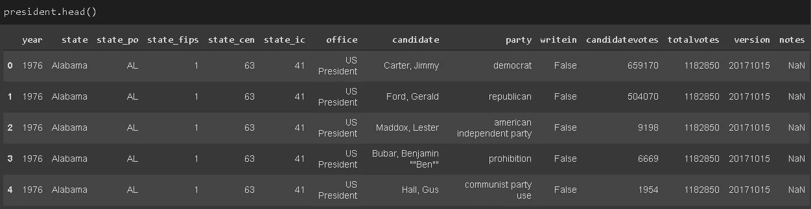

有一些用于分析的冗余列。我不确定 state_fips、state_cen 和 state_ic 代表什么，但它们可能是一个状态的指示器或唯一值。

我们可以通过检查和比较这些列中的值来确认。这三列有 51 个唯一值(每个州一个)。

```
president.state_fips.nunique()
51
```

对于特定的状态，这些列中的值是相同的:

```
president[president.state == 'Alabama'][['state_fips','state_cen','state_ic']].value_counts()state_fips  state_cen  state_ic 
1           63         41          63 
dtype: int64
```

由于数据集已经包含状态信息，这些列在分析中是多余的，因此可以删除。

office 列只表明这是总统选举，因此它包含一个唯一的值(美国总统)。版本和注释列也没有用。

我们可以使用 Pandas 的 drop 功能来删除这些列。

```
president.drop(['state_po', 'state_fips', 'state_cen', 'state_ic',
'office', 'version', 'notes'], axis=1, inplace=True)
```

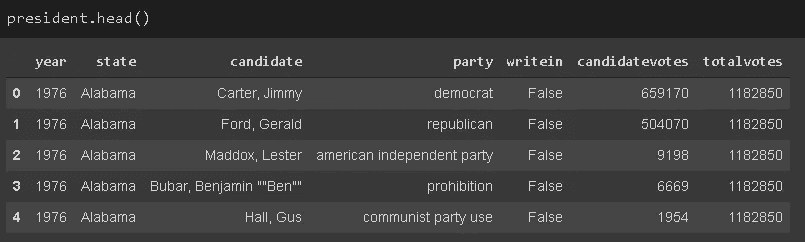

我们准备开始分析，我将分析分为三个部分:

1.  一段时间内的投票总数
2.  每位获胜者的得票率
3.  各缔约方的国别比较

# **一段时间内的投票总数**

我们首先要检查的是每次选举的票数。“totalvotes”列显示特定州的投票总数。因此，下面的代码将创建一个 dataframe，其中包含每个州每次选举的总票数。

```
yearly_votes = president[['year','state','totalvotes']]\
.groupby(['year','state']).mean().reset_index()yearly_votes.head()
```

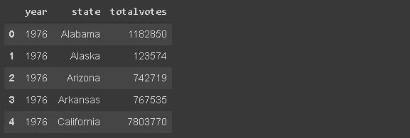

我们可以对“year”列应用 groupby 函数，并对“totalvotes”列中的值求和，这将给出每次选举的总票数。

```
yearly_votes.groupby('year').sum()\
.plot(figsize=(10,6), legend=False,title='Total Number of Votes in US Presendial Elections')
```

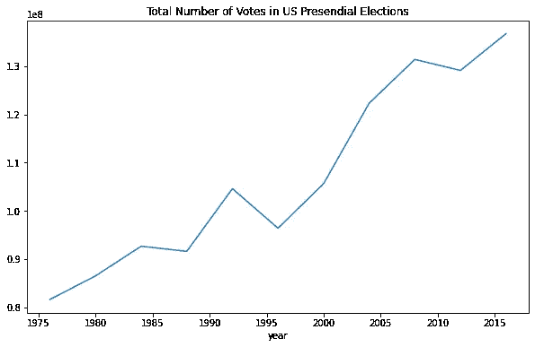

我使用了熊猫的绘图工具来绘制结果。它比使用 Matplotlib 的 pyplot 接口简单，但是对绘图的控制较少。

除了 1996 年和 2012 年，参加投票的人数一直在稳步增加。这很可能是由于人口增长，因此更好的衡量标准是每百万人口的投票数(有资格投票)。粗略比较一下，从 1970 年(2.03 亿)到 2010 年(3.08 亿)，人口增长了约 50%。因此，多年来，投票人数的比例大致保持不变。

# **每位获胜者的得票率**

有些选举非常接近，获胜者以微弱优势获胜。也有一些选举中获胜者以较大优势获胜。

我们可以计算出每个获胜者的得票率。我们将首先向我们的数据框架添加一个“winner”列。

[这个](https://en.wikipedia.org/wiki/List_of_presidents_of_the_United_States)维基百科页面包含了美国总统的名单。使用 read_html 函数可以很容易地将这些表读入 pandas 数据框架。它将网页中的表格转换成数据帧列表。

```
dfs = pd.read_html("https://en.wikipedia.org/wiki/List_of_presidents_of_the_United_States")winners = dfs[1][['Election','President.1']]
winners.head()
```


第二个数据帧包含美国总统的名单。我们只需要 1976 年到 2016 年的选举数据。

```
winners = winners.iloc[-12:-1, :]
winners.Election = winners.Election.astype('int64')
winners.rename(columns={'President.1':'winner'}, inplace=True)winners
```

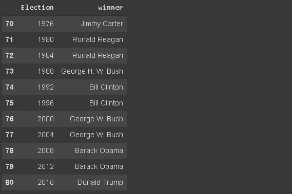

我们需要和总统数据框中相同格式的名字。“吉米·卡特”需要格式化为“卡特，吉米”。我将使用 pandas 字符串操作来完成这项任务:

```
first_name = winners.winner.str.rsplit(' ', n=1, expand=True)[0]
last_name = winners.winner.str.rsplit(' ', n=1, expand=True)[1]
winners.winner = last_name + ', ' + first_namewinners
```

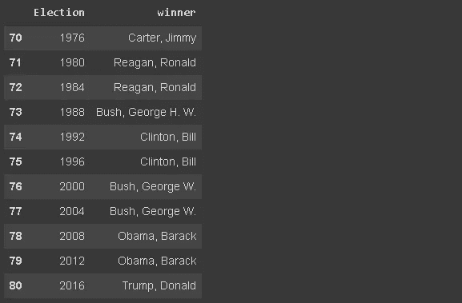

我们需要一些小的调整，以便总统的名字完全匹配。

```
winners.winner[73] = 'Bush, George H.W.'
winners.winner[78] = 'Obama, Barack H.'
winners.winner[79] = 'Obama, Barack H.'
winners.winner[80] = 'Trump, Donald J.'
```

我还将选举日期转换为整数，以便能够在下一步中使用 merge 函数。

我们现在可以根据选举年份合并“总统”和“获胜者”数据帧。

```
president = pd.merge(president, winners, left_on='year', right_on='Election')
```

我们将过滤总统数据帧，只包括获胜者的投票。

```
winner_votes = president[president.candidate == president.winner]winner_votes.head()
```

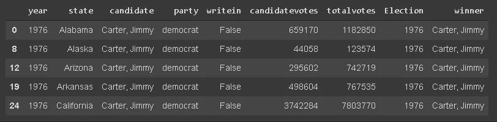

每一行都包含获胜者的票数和特定选举中特定州的总票数。一个简单的 groupby 函数将给出各个国家的值。

```
total_votes = winner_votes[['year','winner','candidatevotes','totalvotes']]\
.groupby(['year','winner']).sum()total_votes
```

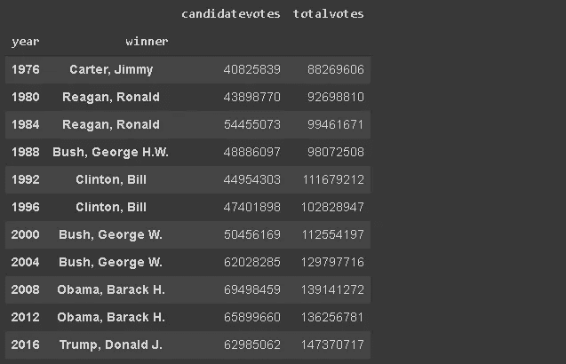

我们可以通过简单的数学运算计算出中奖者的比例，并对结果进行排序。

```
(total_votes.candidatevotes / total_votes.totalvotes)\
.sort_values(ascending=False)
```

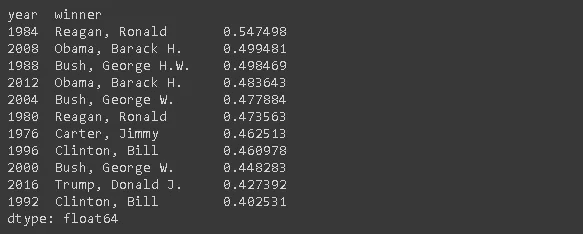

排名第一的是第二任期的罗纳德·里根。

# **各缔约方的国家比较**

如果你对政治感兴趣，你就会知道每个州更可能支持哪个政党。让我们也用数字来核对一下。

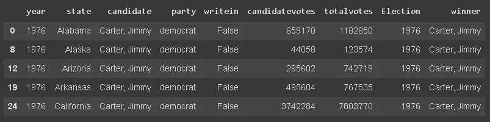

这是获胜者投票数据框。我们将添加一个比率列，即候选人票数除以总票数。

```
winner_votes['ratio'] = winner_votes.candidatevotes / winner_votes.totalvotes
```

我们希望看到民主党和共和党的前十个州。下面的 groupby 操作将根据民主党的最高平均比率返回前十个州。

```
winner_votes[winner_votes.party == 'democrat'][['state','ratio']]\
.groupby('state').mean().sort_values(by='ratio', ascending=False)[:10]
```

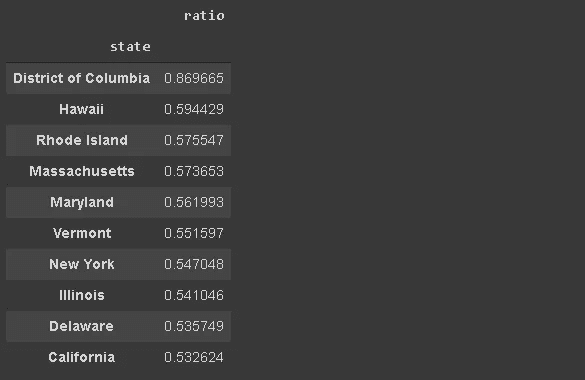

下面是共和党方面同样操作的结果。


> 注:除非另有说明，所有图片均由作者创作。

# **结论**

我们分析了美国总统选举随时间推移的票数，每位总统在选票方面的优势，以及民主党和共和党在各州的选票。结果可能不会让你吃惊，尤其是如果你对政治感兴趣的话。

这篇文章的另一个重点是练习如何在数据分析和操作中使用 Pandas。我们在数据分析和处理方面做了大量的熊猫运算。

感谢您的阅读。如果您有任何反馈，请告诉我。