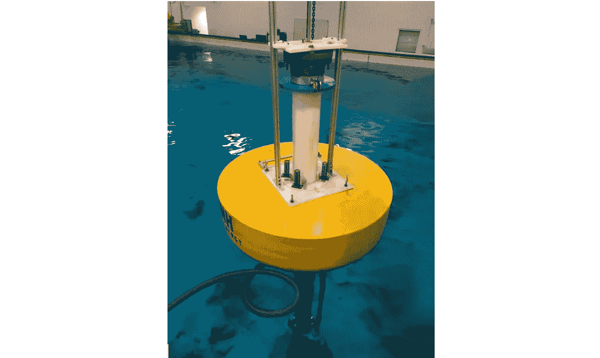
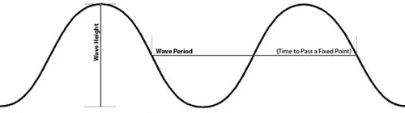
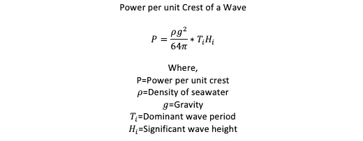
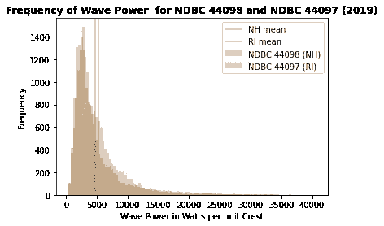
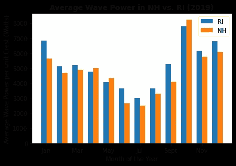
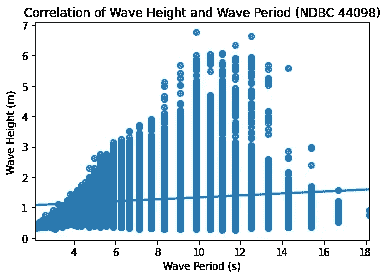

# 波浪能分析

> 原文：<https://towardsdatascience.com/analysis-of-wave-power-679115549ee9?source=collection_archive---------51----------------------->

## 新罕布什尔州和罗德岛州近海浮标记录数据的波能分析。

作者图片

虽然大多数人不认为像新罕布什尔州和罗德岛这样的地方是冲浪的热门目的地，但从国家数据浮标中心获得的波浪能数据显示，有时会有显著的波浪能。这些波浪浮标放置在离海岸线大约 30 海里的地方，记录诸如有效波高、波浪周期和涌浪方向等数据。

作者图片

[https://magicseaweed.com/help/forecast-table/swell](https://magicseaweed.com/help/forecast-table/swell)

浮标记录的信息可以用来计算海浪的能量。这项研究的目标是发现哪个位置，罗德岛或新罕布什尔州，在 2019 年经历了更大的波浪发电。

如下图所示，NDBC 44098 和 NDBC 44097 的波浪功率频率，罗德岛的平均波浪功率略大于新罕布什尔。据计算，2019 年罗德岛每单位波峰的平均波功率约为 5265 瓦，而新罕布什尔州的平均波功率约为 4760 瓦。新罕布什尔州的最大波浪功率约为 40619 瓦，罗德岛州为 36980 瓦。

作者图片

由于地理位置略有不同，我希望根据 2019 年的月份进一步分析每个位置的波浪功率。对于新罕布什尔州和罗德岛州来说，7 月份观察到的海浪能量最低，10 月份观察到的海浪能量最高。九月两个州的波浪力量差异最大。这是典型的飓风季节，因为罗德岛更多的暴露在南方，而新罕布什尔面向东方。这两个州在秋季都显示出持续整个冬季的不断增长的海浪能量。

作者图片

用于推导单位波峰波浪功率的两个关键信息包括有效波高和波浪周期。如下图所示，波高和波周期的相关性(NDBC 44098)，变量波高和波周期之间没有相关性。

这些数据可以用于多种目的。目前正在探索波浪能作为可再生能源的可能来源。如果研究人员将此扩展到更大的波浪浮标选择，他们将能够确定部署波浪能浮标的最可行位置。许多国家使用大型船只作为运输货物的工具。使用历史数据可以帮助确定一年中运输昂贵物品的最安全时间。这些近海浮标也收集海洋温度的数据，这些数据可用于分析全球变暖的影响。

总之，罗德岛决心拥有比新罕布什尔州更大的海浪能。