# 使用 Python 和 TWINT 分析推文

> 原文：<https://towardsdatascience.com/analysis-on-tweets-using-python-and-twint-c7e6ebce8805?source=collection_archive---------29----------------------->

## 情感分析，建立单词云和更多…


照片由[于切尔·莫兰](https://unsplash.com/@yucelmoran?utm_source=medium&utm_medium=referral)在 [Unsplash](https://unsplash.com?utm_source=medium&utm_medium=referral) 上拍摄

听说过 Twint 吗？

Twint 是 Python 中内置的高级 web 抓取工具，它抓取 web，而不是像 tweepy 一样通过 twitter API 收集数据。它是推特智能工具的缩写。您可以通过以下方式下载:

```
pip3 install twint
```

twint 文档可以在[这里](https://github.com/twintproject/twint)找到。

# 收集数据

在本文中，我们将使用唐纳德·特朗普自 2019 年初以来的推文。我们可以在命令行中使用这个简单的命令下载给定用户的 tweets:

```
twint -u realDonaldTrump --since 2019-01-01 -o trump.csv --csv
```

这将把 2019 年以来`@realDonaldTrump`的所有推文下载到一个单独的 csv 文件`trump.csv`中。

这里，为了方便起见，我将 csv 文件转换为 xls 格式。让我们开始吧！

```
df=pd.read_excel('trump.xls')***added columns mentions, hashtags and length***
***added month, year and hour columns***
***added cleaned_tweetsnum_mentionsnum_hashtags***df.head()
```

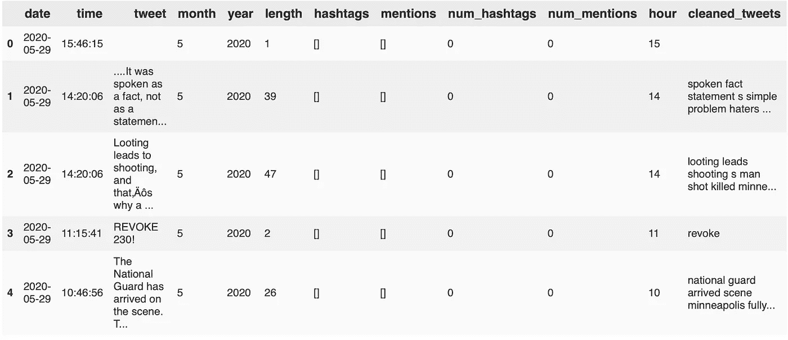

# 一些有趣的分析

*   让我们来看看每小时的平均推文长度。

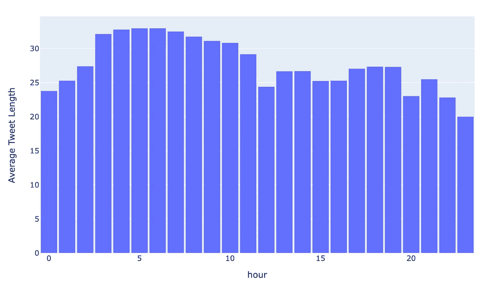

看起来总统的推特在一大早就很长了(凌晨 3 点到 10 点)。

*   每小时的平均提及次数。

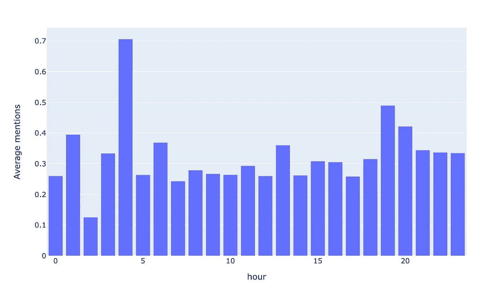

再加上那些推文的情绪又如何呢？(后面显示的情绪计算。)

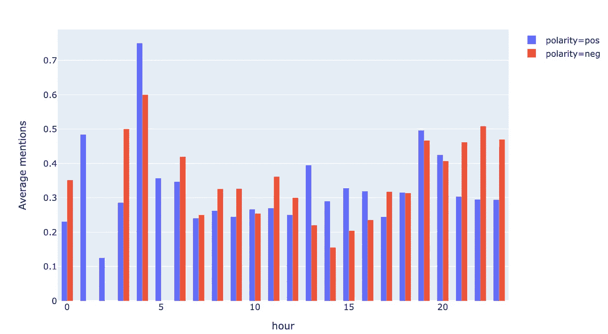

# 文本分析

首先，让我们清理推文。为此，我们将创建两个函数，一个用于删除 URL、提及和标签(将它们存储在单独的列中)，另一个用于清理剩余的文本(删除停用词、标点符号)。

我将使用删除了内容、停用词和标点符号的推文的`cleaned_tweets`列和删除了内容的`tweet`列来计算情绪和主观性。

```
df['cleaned_tweets']=df['tweet'].apply(lambda x: process_text(x))
df['tweet']=df['tweet'].apply(lambda x: remove_content(x))
```

现在让我们建立一个单词云来了解常用短语。

## WordCloud

```
**from** wordcloud **import** WordCloud, STOPWORDS
**import** matplotlib.pyplot as plttemp=' '.join(df['cleaned_tweets'].tolist())
wordcloud = WordCloud(width = 800, height = 500, 
                background_color ='white', 
                min_font_size = 10).generate(temp)plt.figure(figsize **=** (8, 8), facecolor **=** None)
plt.imshow(wordcloud)
plt.axis("off")
plt.tight_layout(pad **=** 0) 
plt.show()
```

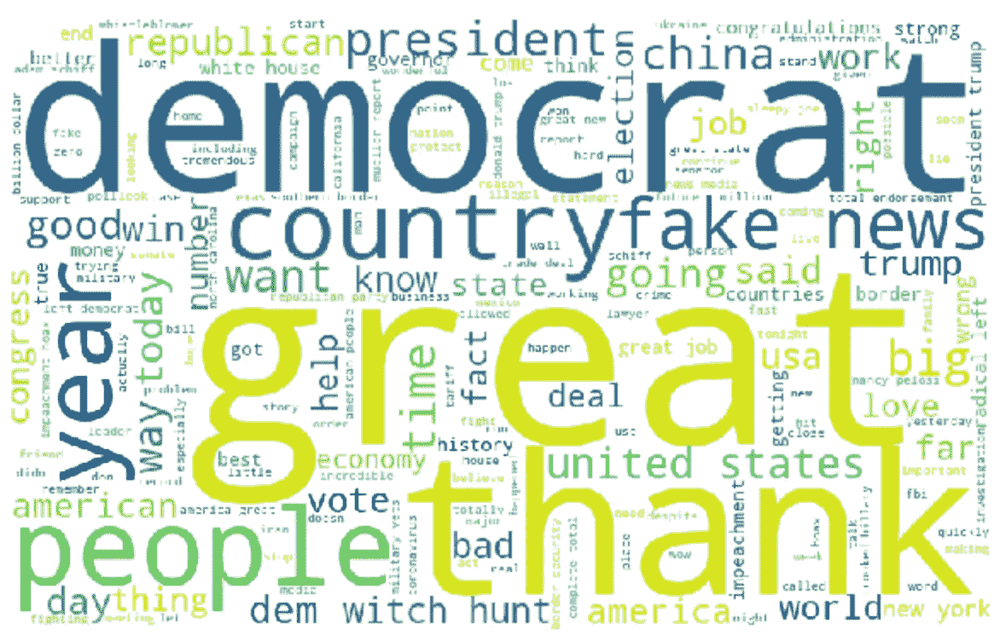

词云

更常用的单词/短语以更大的字体出现。

现在让我们定义一个函数来绘制给定 ngram 范围内出现次数最多的 n 个短语。为此，我们将使用`CountVectorizer`功能。

大部分工作已经完成，现在让我们画出常用短语。

*   **频繁出现的单字**

```
plot_topn(tweet_list, ngram_range=(1,1))
```

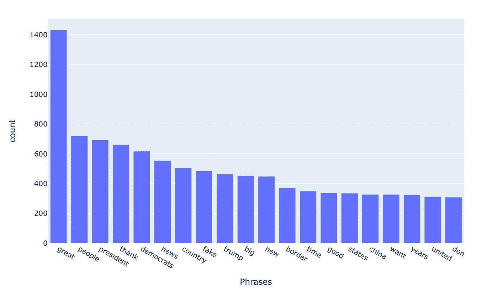

*   **频繁的二元模型**

```
plot_topn(tweet_list, ngram_range=(2,2))
```

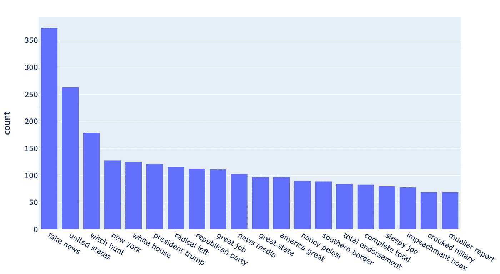

*   **频繁三元模型**

```
plot_topn(tweet_list, ngram_range=(3,3))
```

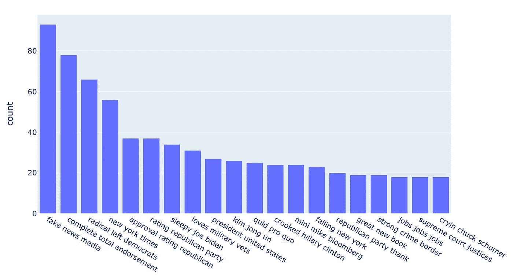

瞌睡虫乔·拜登？真的吗？

# 提及和标签

*   提及最多的用户:

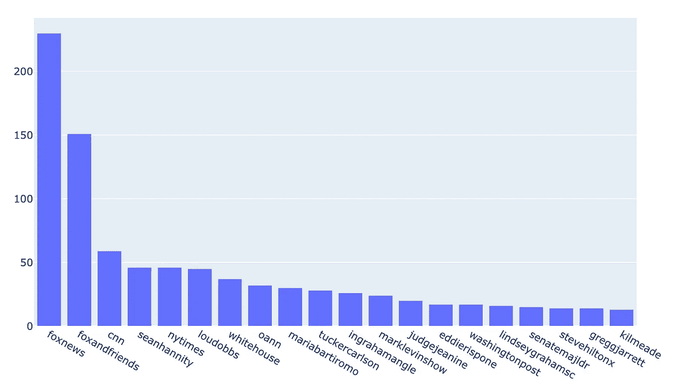

*   最常用的标签:

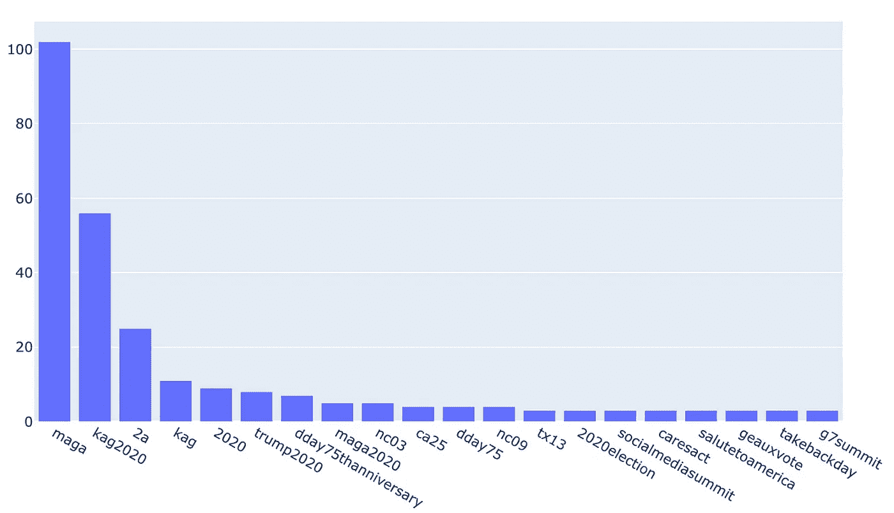

# 情感分析

我们使用推文专栏来分析推文的情绪和主观性。为此，我们将使用`TextBlob`。

给定一个输入句子，TextBlob 输出一个包含两个元素的元组:`(sentiment, subjectivity)`

```
from textblob import TextBlob
df['sentiment']=df['tweet'].apply(lambda x:TextBlob(x).sentiment[0])
df['subject']=df['tweet'].apply(lambda x: TextBlob(x).sentiment[1])
df['polarity']=df['sentiment'].apply(lambda x: 'pos' if x>=0 else 'neg')
```

我们来看看推文的情绪分布

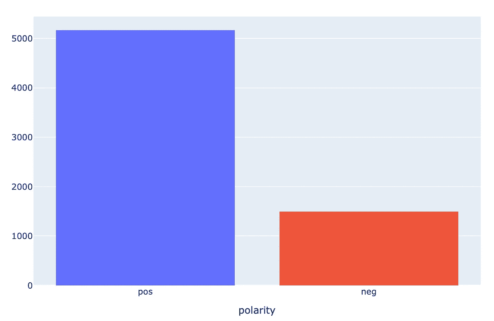

大多数推文可能不是主观的。推文可能是事实，就像坏消息一样。让我们找出主观的推文的情绪分布。为此，让我们过滤掉`subjectivity`大于 0.5 的推文，并绘制分布图。

```
fig=px.histogram(df[df['subject']>0.5], x='polarity', color='polarity')
fig.show()
```

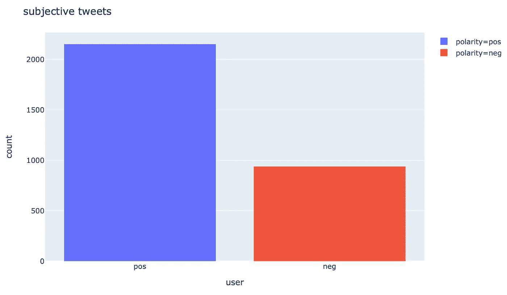

看起来，当只分析主观推文时，负面情绪的比例增加了。

现在让我们来看看 20 个被提及最多的用户的主观推文的极性。

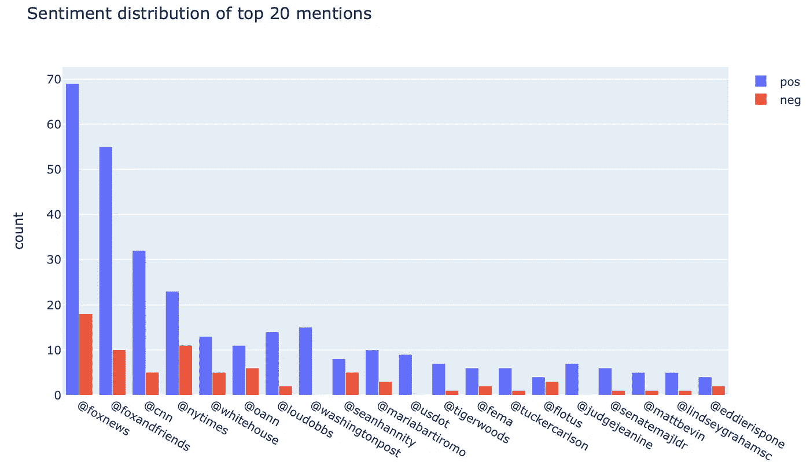

# 主题建模

主题建模是一种自动分析文本数据以确定一组文档的聚类词的机器学习技术。这被称为“无监督”的机器学习，因为它不需要预先定义的标签列表或之前由人类分类的训练数据。

我们将使用 gensim LDA 模型进行主题建模。

```
**#pre-process tweets to BOW**
from gensim import corpora
r = [process_text(x,stem=False).split() for x in df['tweet'].tolist()] 
dictionary = corpora.Dictionary(r)
corpus = [dictionary.doc2bow(rev) for rev in r]**#initialize model and print topics** from gensim import models
model = models.ldamodel.LdaModel(corpus, num_topics=10, id2word=dictionary, passes=15)
topics = model.print_topics(num_words=5)
for topic in topics:
    print(topics[0],process_text(topic[1]))
```

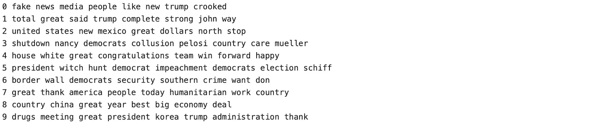

有一些明确的主题，如弹劾审判早期阶段的主题 5，包含与中国贸易协议有关的短语的主题 8，以及关于他修建隔离墙的计划的主题 6。

```
labels=[]
for x in model[corpus]:
    labels.append(sorted(x,key=lambda x: x[1],reverse=True)[0][0])df['topic']=pd.Series(labels)
```

再来看话题分布。

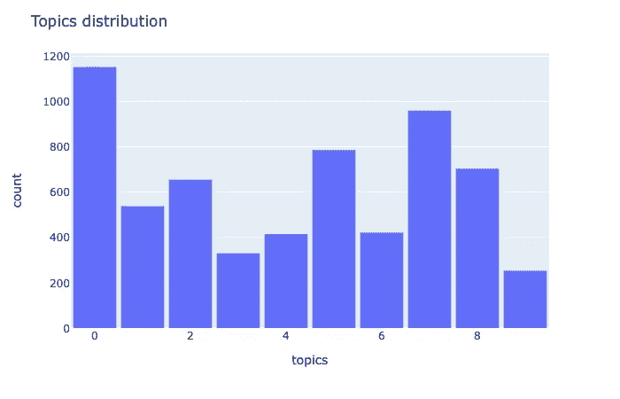

我们来看看话题 5 和话题 6 的分布。

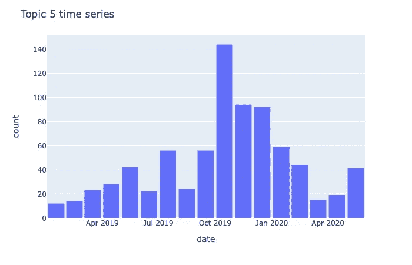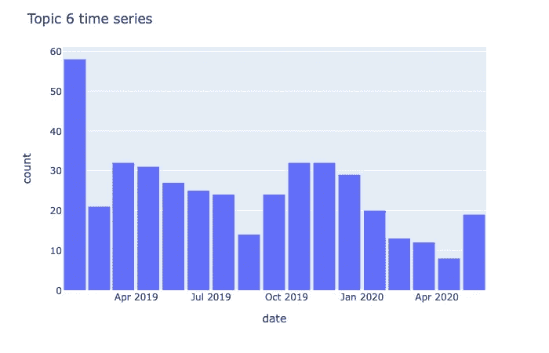

这些情节是有意义的，因为在举报人投诉发布的那个月，话题 5 中的推文显著增加，而在特朗普计划修建隔离墙的 2019 年第一个月，话题 6 中的推文更多。

你可以在这里找到更详细的分析[。](https://github.com/cotraak/Machine-Learning/blob/master/trump_tweet_analysis.ipynb)

如果你喜欢这篇文章，请留下你的掌声。感谢您的阅读！

# 参考

1.  Github Twint 文档:[https://github.com/twintproject/twint](https://github.com/twintproject/twint)
2.  [https://medium . com/big panda-engineering/explorative-data-analysis-for-text-data-29 cf 7 DD 54 EB 8](https://medium.com/bigpanda-engineering/exploratory-data-analysis-for-text-data-29cf7dd54eb8)
3.  [https://medium . com/@ b . terry jack/NLP-预训练-情绪-分析-1eb52a9d742c](https://medium.com/@b.terryjack/nlp-pre-trained-sentiment-analysis-1eb52a9d742c)