# 分析、价格建模和预测:西雅图 AirBnB 数据，2016–17

> 原文：<https://towardsdatascience.com/analysis-price-modeling-and-prediction-airbnb-data-for-seattle-2016-17-152791cbae0a?source=collection_archive---------57----------------------->

本文为技术和非技术受众详细概述了 ***AirBnB 的西雅图数据分析*** 。分析完成后使用 ***CRISP-DM*** 流程、*数据工程* & *机器学习技术。*


图片来自 [Pixabay](https://pixabay.com/?utm_source=link-attribution&utm_medium=referral&utm_campaign=image&utm_content=4234071) 埃里克·帕拉西奥

# 商业理解

对于*西雅图*的所有 AirBnB 用户和主机，我将从以下几个方面分析和回答*商业相关问题*:

*   *价格分析*
*   *清单计数分析*
*   *最忙时间分析*
*   *入住率和点评分析*
*   *价格预测建模*

下面是问题和答案。

# 数据理解

这里我将对 *Kaggle* 上 Airbnb 内 [*提供的数据进行*探索性数据分析*，你可以在这里*](http://insideairbnb.com/) ( *zip 文件*)，zip 文件包含 3 个 csv 文件: *listing.csv* 、 *calendar.csv* 和

## *listing.csv 概述*

*使用 [*熊猫*](https://pandas.pydata.org/) 读取 csv 文件，如下所示:*

```
*#read listing.csv, and its shape
listing_seattle = pd.read_csv(‘listings_seattle.csv’)
print(‘Shape of listing csv is’,listing_seattle.shape)
listing_seattle.sample(5)    #display 5 rows at random*
```

## *基本检查和高级数据分析*

*查看数据并进行一些健全性检查，如每列缺失值的百分比，listing _ ids 在整个数据集中是唯一的吗？，查看汇总的数值列等。*

*   ****每列缺失值的百分比****

*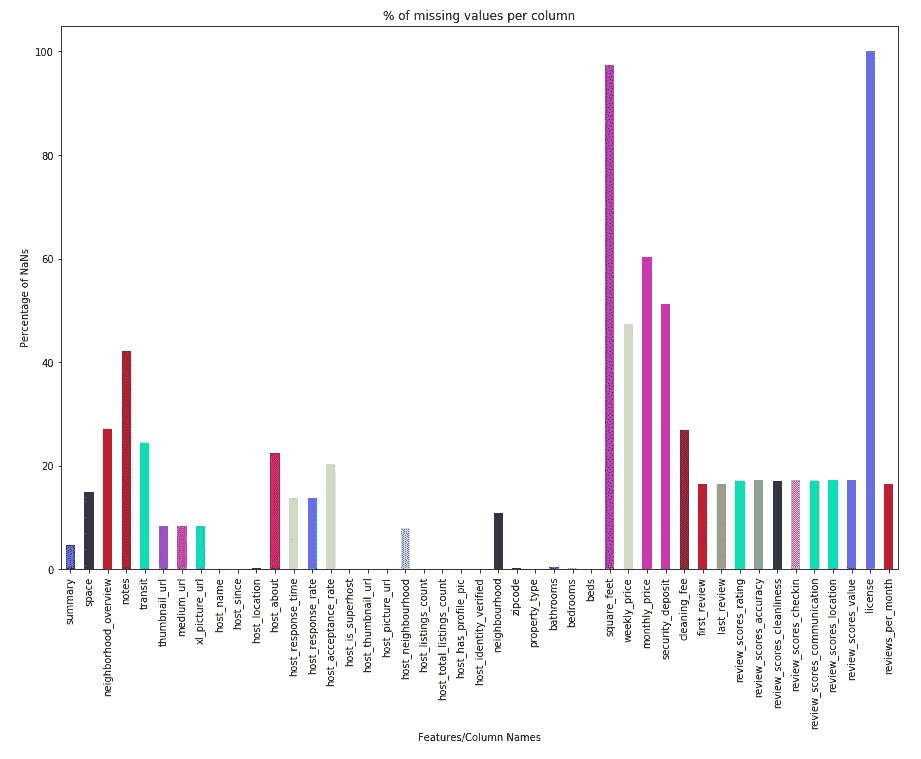*

***每列缺失值的百分比***

> *从上面的条形图中，我们得到了丢失值最少的重要列。像 ***牌*** 和 ***方*** ***脚*** 这样的列有超过 95%的数据缺失，因此我们将*删除*这些列。*

```
****Are the ids unique for each row?*** len(listing_seattle['id'].unique()) == len(listing_seattle)***Description of all numeric features***
listing_seattle.describe()*
```

*Github 查看数字列摘要的依据*

> *上面的 csv 文件中显示了所有数字列的摘要。使用`*df.describe()*`计算重要的数值参数，如计数、平均值、标准差、方差、最大值和分位数范围*

## *calendar.csv 概述*

*使用`pd.read_csv('calendar.csv')`读取“ *calendar.csv* ”并使用`df.head(5)`显示 csv 概览。这将显示数据框中的前 5 行。*

## *calendar.csv 数据的高级分析*

*让我们看看每列的类型和数据中缺失值的数量:*

*通过`df.dtypes`得到每一列的类型，见下面的实现*

*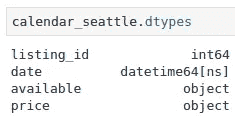*

*每列的数据类型*

*每列中缺失值的百分比:*

*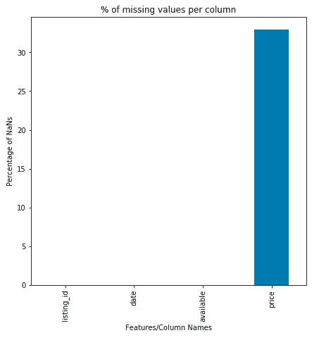*

***每列缺失值的百分比***

> *因此，在价格一栏中只有 33%的男性。这也表明，在全年所有 365 天的列表中，平均只有 33%的列表被占用*

*检查两个数据集中的列表数量是否相同:*

```
*len(listing_seattle) == len(calendar_seattle)//365 
>> True*
```

*因此，我们在两个数据帧中都有相同数量的列表 (属性),并且 calendar.csv 对于每个列表都有 *365 个条目。现在我们可以通过****listing _ id***来 ***合并两个数据集，以获得一个数据帧用于进一步分析。合并代码:`df = pd.merge(calendar_seattle, listing_seattle, on=’listing_id’)`****

# *数据准备*

*理解数据后，需要对其进行整理，以便为建模做好准备。我已经选择了一些商业话题来玩，回答相关的现实问题是下一个任务。为此，*清理与所选任务相关的数据*非常重要。以下各列是额外的负担(*与分析*无关)，因此 ***删除*** 它们:*

*使用`df = df.drop(columns = columns_to_drop)`删除所有此类列。*

*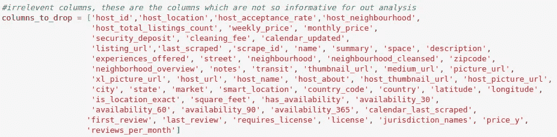*

*要永久删除的列的列表*

*执行下面给出的数据清理步骤(操作在注释中提到):*

*现在数据已经准备好，可以进行分析了。*

# *对最终数据集的洞察和分析*

*从这里我回答了一些商业问题。*

*   ****什么是***`***minimum***`*`***maximum***`*`***average price***`***的清单(楼盘)跨市？******

```
**#find minimum, maximum and average price for listing
min_price = df['price'].min()
>> $10.00
max_price = df['price'].max()
>> $1650.0
mean_price = df['price'].mean()
>> $137.94**
```

*   *****数据集中给定的每个清单的*** `***average price***` ***是什么？*****

```
**#get the average price for each listing
mean_price_for_listing = df.groupby('listing_id').mean()['price']
plt.hist(mean_price_for_listing, bins=20)**
```

**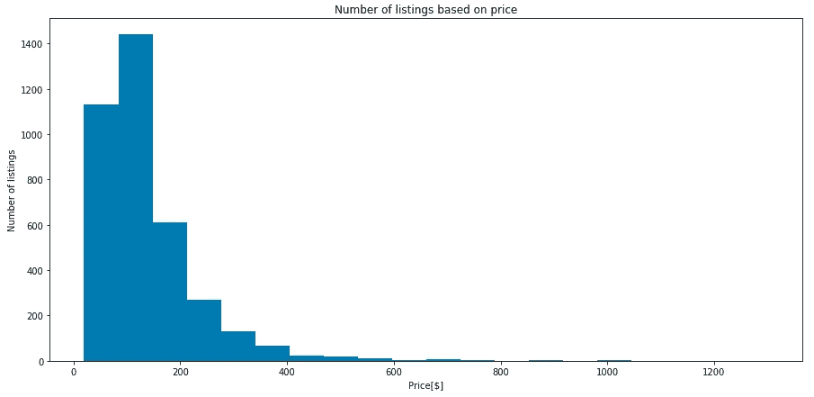**

> **从上面的直方图我们可以断定，`*majority of listings are concentrated around* ***$50-$150***`**

*   *****平均每个房源发布的点评数是多少？*****

```
**#get the average number of reviews per listing
avg_num_reviews = df.groupby('listing_id').mean()['number_of_reviews']
plt.hist(mean_price_for_listing, bins=30)**
```

**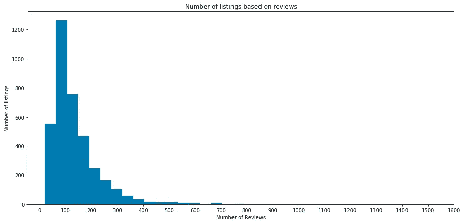**

> **大部分房源都是`***concentrated around 10-180 reviews***`**

*   *****登记了多少房源*** `***per month***` ***？*****

```
**#get number of registered listings, irrespective of available or unavailable for each month
grouped_month = df.groupby(['month'])
num__listing_per_month = [len(grouped_month.get_group(i)['listing_id']) for i in range(1,13)]plt.bar(np.arange(1,13,step=1), num__listing_per_month)**
```

**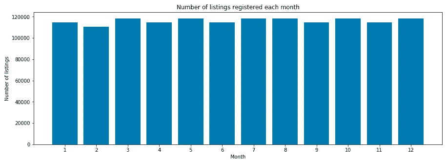**

**每月列表数量的条形图表示**

> **可以看到每月注册的列表数量的趋势。可以看出，上市数量在*二月、三月、四月、八月和十一月*较低，因为这几个月见`*surge in number of visitors*`。**

*   ***`***available***`*`***not available***`***每个月有多少个清单？*******

```
**#get number of available and not available listings per month 
num_listing_per_month = df.groupby(['month','available'])['listing_id'].unique()plt.plot(num_listings_available_per_month)**
```

**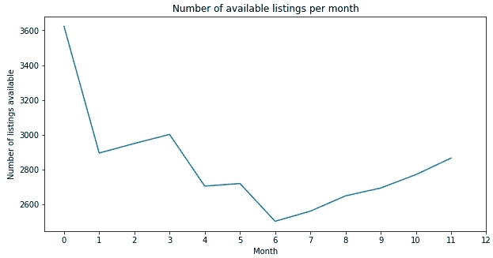**

> **这说明夏季可用房源数量**最少，也就是说**夏季是最忙的时候**大部分房源都被占了！****

```
**plt.plot(num_listings_not_available_per_month)**
```

**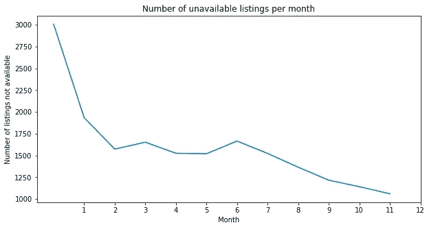**

*   *****什么是每月*** `***average price***` ***？*****

```
**#find average price per month
average_price_by_month = df.groupby(['month'])['price'].mean()
plt.plot(average_price_by_month)**
```

**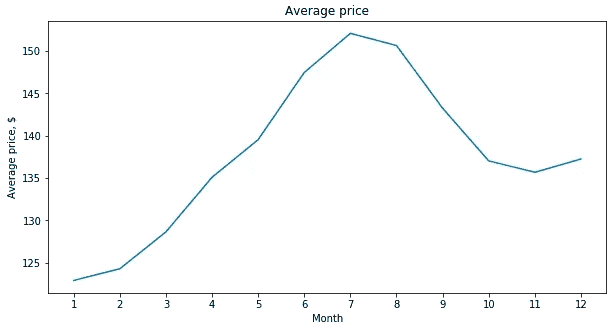**

> **挂牌价格**在夏季和冬季(12 月)**明显上涨，可能是因为可供预订的*房源较少。因此`***summer and winter holidays***`是参观西雅图的`***busiest times***`。***

*   ******价格视*** `***Neighbourhood***`***

***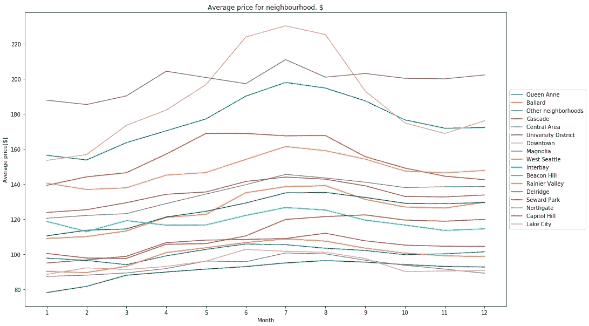***

***基于邻域的价格变化趋势***

> ***可以看出， ***的价格因地点*** (街区)而异。**最高均价**在`***Downtown***`处。但是对于每个社区来说，价格在夏天都会上涨，就像我们之前看到的一样。***

*   ******每种可容纳类型有多少个列表？******

```
***#get total number of listings for each accommodates type(number of accommodations)
num_listing_accommodates = [len(df.groupby(['accommodates']).get_group(i)['listing_id']) for i in sorted(df['accommodates'].unique())]plt.bar(sorted(df['accommodates'].unique()), num_listing_accommodates)***
```

***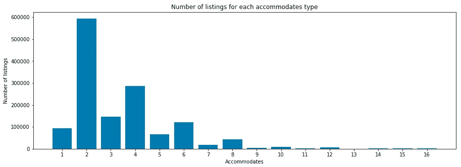***

> ***可以看到， `***2 occommodates***`有**个最大列表数。*****

*   ******每种型号*** 的平均价格是多少？***

```
***grouped_accommodate_mean_price = df.groupby(['accommodates'])['price'].mean()
average_price_per_accommodate = [grouped_accommodate_mean_price[i] for i in sorted(df['accommodates'].unique())]plt.bar(sorted(df['accommodates'].unique()), average_price_per_accommodate)***
```

***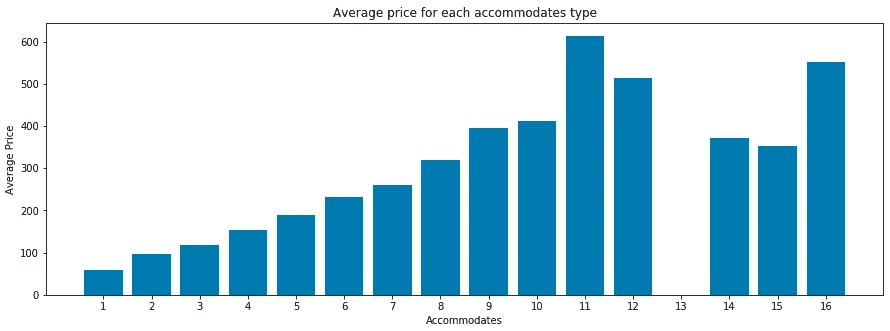***

***每种住宿类型的平均价格***

> ***可以看出，随着 ***数量的增加*** 价格也随之提高。这是相当明显的，越多的数量容纳的财产的价格应该更大。这也暗示了*预测价格的`***great influential feature***`。****

*   ******什么是全年的*** `***occupancy rate over the time***` ***？******

```
***plt.plot_date(calendar_seattle['date'].unique(), occupancy_rate, linestyle='solid', marker='None')***
```

***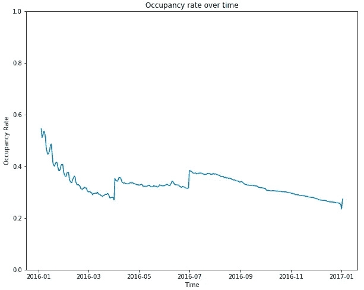***

> ***可以观察到*占用率 ***高***`***summer and winter***`(过年期间)。这再次证明了夏天和冬天是`***vacations in seattle***`的`***busiest times***`。****

*   ****`***reviews.csv***`***中随时间增加的评论数是多少？*******

***对于此任务，让我们阅读 **reviews.csv** 并查看 reviews 数据。***

```
***plt.bar(list(reviews_df['date'].unique()), num_reviews, color=np.random.rand(len(list(reviews_df['date'].unique())),3))***
```

***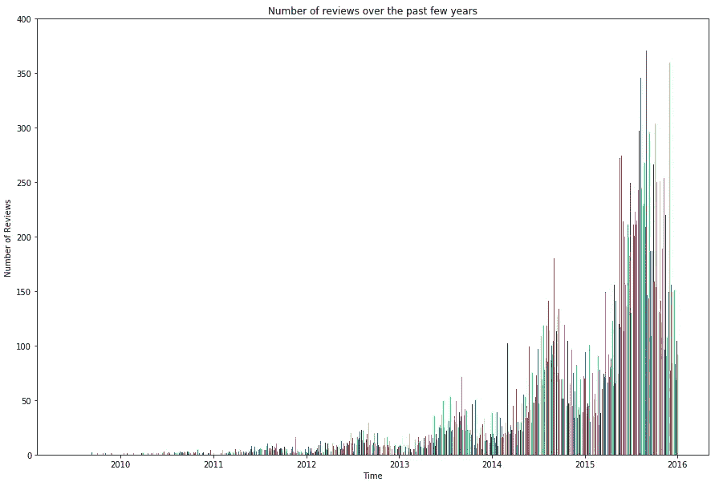***

> ***评论数从 2013 年开始`***exponentially increased***`，2016 年最高。***

# ***建模***

***数据集是干净的。它准备应用 ML 模型进行价格预测。以价格列为因变量。使用一键编码将所有分类特征转换为虚拟变量。下面给出了根据这些数据拟合模型的步骤:***

## ***估价***

****均方误差*作为*误差分析*，以及 *R2 平方*作为精度矩阵。***

```
***Random Forest MSE on **train** data: **186.944**, **test**: **211.258**
Random Forest R^2 score on **train: 0.983**, **test: 0.981*****
```

*   ******获取特征重要性******

***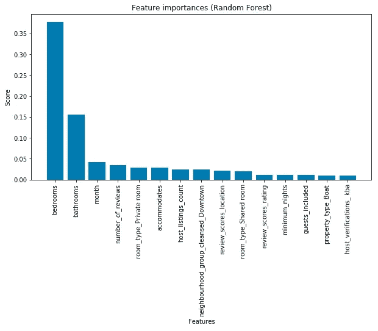***

> ***上面给出的条形图显示了对价格影响最大的`*top 15 features*`。`***Number of bedrooms***`是 ***最重要的特征*** 用于预测价格！***

# ***结论***

***这是一个很好的分析练习，最后得出结论***

*   ***所有的商业问题都用适当的数字来回答***
*   ***此外，随机森林回归方程适用于数据，以获得价格，这是作为因变量。***

***在我的[***Github***](https://github.com/s-nilesh)**页面上，查看本文 [**中使用的完整代码。**](https://github.com/s-nilesh/AirBnB-Data-Analysis)*****