# 马德里市政办公室针对外国人的 Pandas、Matplotlib 和 follow-Spanish 课程分析

> 原文：<https://towardsdatascience.com/analysis-with-pandas-matplotlib-and-folium-spanish-courses-for-foreigners-in-the-municipal-31e93fb3656f?source=collection_archive---------29----------------------->

## 并排条形图、堆积条形图、饼图和折线图

[**datos.madrid.es**](https://datos.madrid.es/portal/site/egob/) 是 [**Madrid**](https://en.wikipedia.org/wiki/Madrid) s 数据服务，包含近 500 个数据集，涵盖商业、交通、旅游、文化等广泛话题。目前，越来越多的欧洲城市提供开放的数据门户，允许公司、市民、研究人员和其他公共机构使用这些数据。

在本文中，我们采用了包含 2018 年第一学期在市政办公室参加外国人西班牙语课程的**学生信息的数据集。该数据集包括关于学生的信息，如他们参加的课程级别、性别、年龄、国籍、教育水平和行政地位。**

数据集(2018-1er semestre)可通过以下链接下载:

 [## 马德里阿云达芒托群岛的门户网站

### 马德里移民联盟的门户网站。西班牙语课程中的人物

datos .马德里. es](https://datos.madrid.es/portal/site/egob/menuitem.c05c1f754a33a9fbe4b2e4b284f1a5a0/?vgnextoid=454bdc5cc762b410VgnVCM2000000c205a0aRCRD&vgnextchannel=374512b9ace9f310VgnVCM100000171f5a0aRCRD&vgnextfmt=default) 

[**datos . Madrid . es**](https://datos.madrid.es/portal/site/egob/)**提供西班牙语的数据集。因此，在开始探索性数据分析之前，我们必须将数据集翻译成英语。下面的文章解释了我们如何通过使用 **Googletrans** 库来轻松翻译数据集。**

** [## 使用 googletrans 库翻译熊猫数据框

### Googletrans 是一个使用 Google Translate API 的免费 python 库。在这篇文章中，我们解释了如何使用…

towardsdatascience.com](/translate-a-pandas-data-frame-using-googletrans-library-fb0aa7fca592) 

一旦数据帧被转换，我们就准备好开始**探索性数据分析**。👌

# 探索性数据分析和数据清理

**探索性数据分析**包括分析数据集的主要特征，通常采用**可视化方法**和**汇总统计**。目标是理解数据，发现模式和异常，并在我们执行进一步评估之前检查假设。

我们通过使用 [**pandas.read_csv**](https://pandas.pydata.org/pandas-docs/stable/reference/api/pandas.read_csv.html) 函数将翻译后的文件加载到 Pandas 数据框中，并使用 [**pandas 可视化前 5 行。DataFrame.head**](https://pandas.pydata.org/pandas-docs/stable/reference/api/pandas.DataFrame.head.html) 方法。

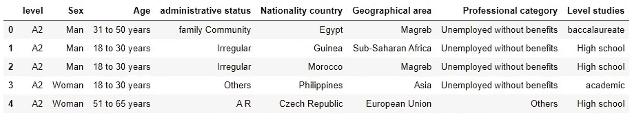

数据集包含 8 列:(1)级别，(2)性别，(3)年龄，(4)行政地位，(5)国籍国家，(6)地理区域，(7)专业类别，和(8)级别研究。

数据类型不合适和缺少值是数据集最常见的问题。通过使用 [**熊猫，我们可以很容易地分析这两者。DataFrame.info**](https://pandas.pydata.org/pandas-docs/stable/reference/api/pandas.DataFrame.info.html) 方法。该方法打印关于数据帧的信息，包括列类型、非空值的数量和内存使用情况。

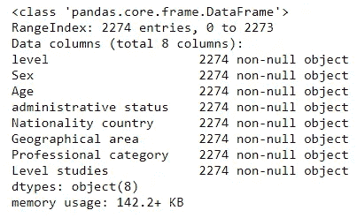

数据集不包含空值，数据类型是预期的类型。正如我们所看到的，列 age 有一个数据类型 string。这种数据类型是正确的，因为年龄是以范围给出的。

正如我们所观察到的，列名有空格和大写字母。我们修改这些名字，用下划线代替空格，用小写字母代替大写字母，用 [**熊猫。data frame . rename**](https://pandas.pydata.org/pandas-docs/stable/reference/api/pandas.DataFrame.rename.html#pandas-dataframe-rename)**方法。现在，不仅可以使用方括号，还可以使用点符号来访问列。**

**我们观察每一列中的独特元素，以发现不一致和重复的条目。**

**如上所示，对于同一元素(man 和 Man)，列 sex 有两个命名。此外，使用 googletrans 翻译数据框后，一些条目以大写字母开头(例如，高中、小学或员工)，而其他条目以小写字母开头(例如，学术、未受教育或学生)。**

**我们可以通过将每个条目的第一个字母转换成大写字母来一次性解决这两个问题，如下所示:**

**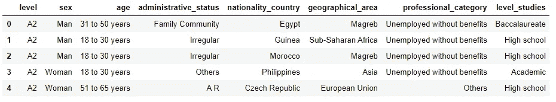**

**现在，数据帧中的每个条目都以大写字母开头。我们做了这个修改，因为我们不希望未来的可视化包含以大写字母和小写字母开头的标签。此外，我们希望用 man 替换 Man，这样数据帧的 sex 列中只包含两个唯一值:Man 和 Woman。**

**我们可以观察到列 age 包含条目 65。澄清这是指 65 岁的学生，还是 65 岁以上的学生(对我来说更有意义，因为年龄是以范围给出的)会很有意思。**

**数据清理完成！！😍现在，我们准备好回答问题，并使用我们的数据得出结论。**

# **回答问题并得出结论**

****探索性数据分析**和**数据清理**是让我们对数据集有所了解的步骤，并让数据集准备好使用它轻松得出结论。现在！我们准备使用数据集回答以下问题。**

## **2018 年第一学期，有多少学生**在市政府办公室参加了外国人西班牙语课程？****

**我们必须计算行数以获得学生数，因为数据框中的每一行都包含一个学生的信息。这可以通过 [**熊猫轻松实现。data frame . shape**](https://pandas.pydata.org/pandas-docs/stable/reference/api/pandas.DataFrame.shape.html)**属性为:****

****2018 年第一学期，2274 名学生参加了马德里市政办公室为外国人开设的西班牙语课程。****

## ****女生的比例是多少？****

****为了获得雌性的百分比，我们可以雇佣 [**熊猫。series . value _ counts**](https://pandas.pydata.org/pandas-docs/stable/reference/api/pandas.Series.value_counts.html)**函数。该函数返回包含唯一值计数的序列。如果我们想获得频率而不是计数，我们使用参数 ***normalize=True。*********

****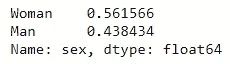****

****正如我们所观察到的，女性的比例大于男性。我们还可以通过以下方式使用条形图来可视化结果:****

****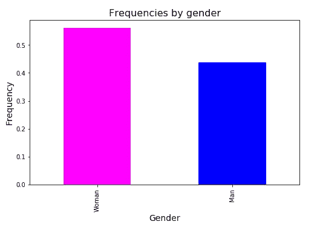****

## ****每个级别招收多少学生？性别之间有差异吗？地理区域之间有差异吗？****

****为了获得每个级别的注册学生人数，我们将使用 [**熊猫。Series . value _ counts**](https://pandas.pydata.org/pandas-docs/stable/reference/api/pandas.Series.value_counts.html)**的功能和以前一样，但是这一次，我们用 [**熊猫按字母顺序对返回的系列的索引进行排序。series . sort _ index**](https://pandas.pydata.org/pandas-docs/stable/reference/api/pandas.Series.sort_index.html)**函数，因为字母顺序匹配的难度越来越高(A1 比 A2 容易)。********

******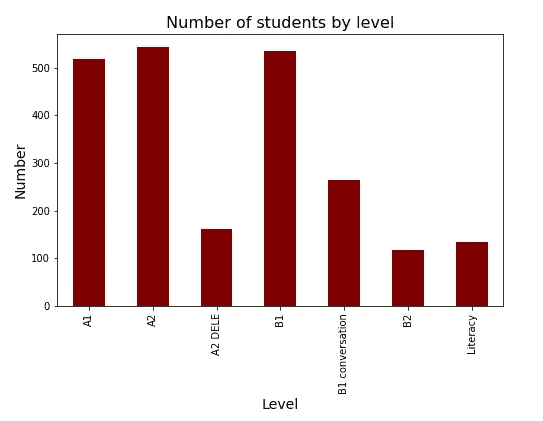******

******A2 DELE(获得西班牙国籍的考试)、B1 会话和识字(学习读写)等特殊课程的学生人数少于常规课程(A1、A2 和 B1)。然而，高级课程(B2)的参与者比其他常规课程少。******

******为了按级别和性别分析学生人数，我们使用函数 [**pandas。data frame . group by**T15**。**该功能涉及分割对象、应用功能和组合结果的某种组合。我们可以根据在列表中提供名称的两个特征进行分组，如下所示:](https://pandas.pydata.org/pandas-docs/stable/reference/api/pandas.DataFrame.groupby.html)******

****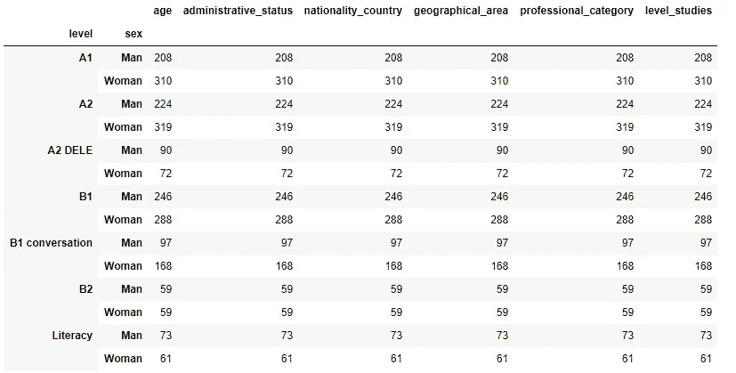****

****我们获得了一个多索引数据框，因为按两列分组将得到两个索引。我们的目标是使用这个包含按级别和性别划分的学生人数的数据框，并使用函数 [**pandas 创建一个并排条形图。DataFrame.plot**](https://pandas.pydata.org/pandas-docs/stable/reference/api/pandas.DataFrame.plot.html)****

****我们选择一列(如年龄)，因为所有列都提供相同的信息(计数)。然后，我们用 [**熊猫。data frame . un stack**](https://pandas.pydata.org/pandas-docs/stable/reference/api/pandas.DataFrame.unstack.html)**函数。该函数旋转一层(必须是分层的)索引标签，返回具有新一层列标签的数据帧，其最内层由旋转的索引标签组成。******

******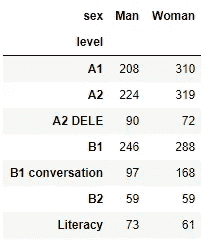******

******现在，我们可以使用绘图功能轻松创建并排条形图。每一列都分配有不同的颜色，每一行都沿水平轴嵌套在一个组中。******

******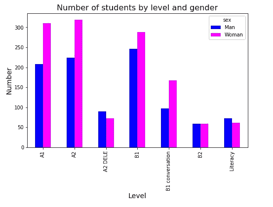******

******正如我们所看到的，更多的妇女注册了正规课程(A1、A2 和 B1)。然而，参加 A2 DELE 和扫盲课程的男性人数更多。******

******为了按级别和地理区域分析学生人数，我们像以前一样创建一个并排的条形图。******

******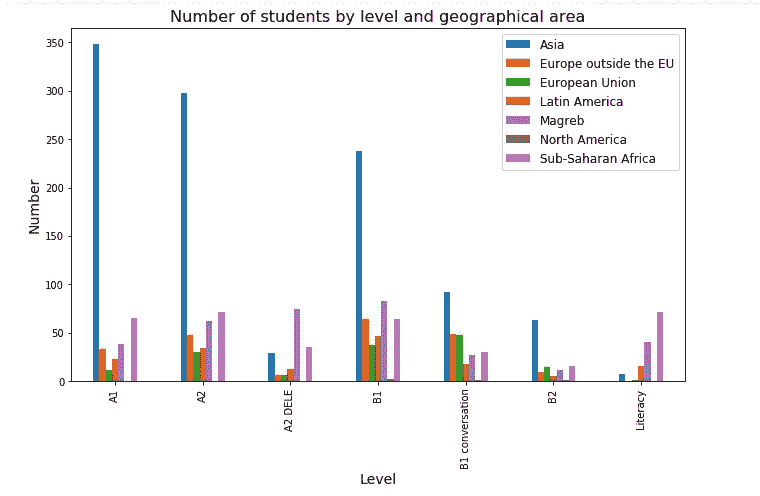******

******在 A1、A2、B1、B1 会话和 B2 课程中，大多数学生都是亚洲人。相反，A2 DELE 和扫盲班有更多来自马格里布和撒哈拉以南非洲的学生。******

## ******学生的行政身份是什么？******

******我们创建了一个条形图，根据管理状态来可视化学生的数量。在这种情况下，我们采用一个水平条形图，用标签显示学生人数。******

******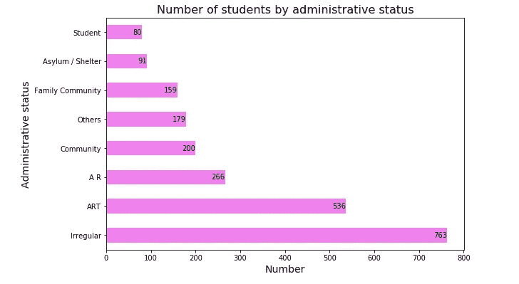******

******如上图所示，大部分学生处于不正常的行政状况(763)。略多于 500 名学生拥有居留和工作许可(*条款:居留和工作许可*)；266 名学生拥有居留证(*A R:autoriza ción de residencia*)。寻求庇护的学生人数达到 91 人。******

******如果我们希望标签显示百分比而不是学生人数，我们可以按以下方式修改图表:******

******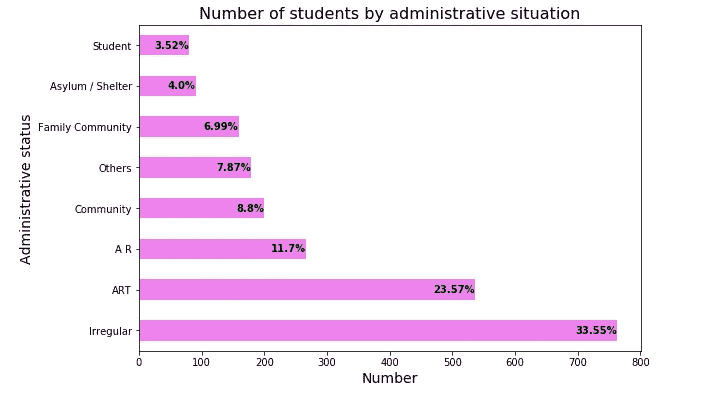******

******[方法**熊猫。Series.round**](https://pandas.pydata.org/pandas-docs/stable/reference/api/pandas.Series.round.html) 将序列中的每个值舍入到给定的小数位数(默认为 0)。在这种情况下，我们提供一个标签，四舍五入到两位小数，代表每个管理状态的学生百分比。如上所示，这些标签以粗体显示。我们可以通过在[**matplotlib . py plot . text**](https://matplotlib.org/3.1.1/api/_as_gen/matplotlib.pyplot.text.html)函数中包含参数 ***weight=bold*** 来轻松实现这一点。******

****到目前为止，我们只使用了**条形图**来获得结论，但是我们可以使用其他类型的可视化。其中一个选择是**饼图**。一个**饼状图**是一个圆形的图形，它被分成若干片来说明数字比例。在此图表中，切片的弧长与它所代表的数量(如条形图中的高度)成比例。****

****我们可以用熊猫来制作一个饼图。DataFrame.plot 函数，以如下方式提供参数 ***kind='pie'*** :****

****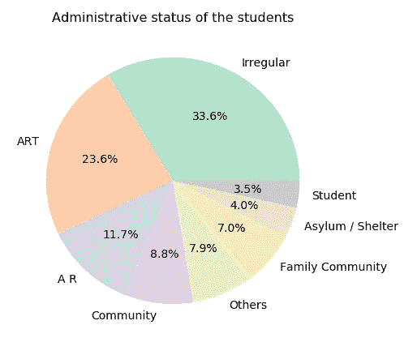****

*******auto pct = ' % 1.1f % % '***参数使用 Python 字符串格式显示百分比值。我们使用的另一个参数是 ***颜色。*** 该参数决定饼图循环的 matplotlib 颜色参数的顺序。在这种情况下，选择的色彩映射表是 ***Pastel2。*******

****正如我们所观察到的，**条形图**和**饼图**可以传达相同的信息。然而，条形图是可视化的更好选择，因为沿一维(高度)比沿二维(面积)比较对象更容易。****

****现在！是时候继续用数据回答问题了。如上所示，33.6%的学生处于不正常的行政状况，只有 4%的学生处于庇护状态。让我们试着获得更多关于这两个群体的信息！****

## ****处于非正规行政状况的学生来自哪里？他们注册了哪些课程？还有精神病院的学生？****

****为了评估这两个组，我们必须根据列 administrative_status 的值过滤数据框。我们创建了两个数据框，包含以下信息:(1)处于非正常情况下的学生，(2)处于庇护中的学生。****

****我们用 [**熊猫。Series.unique**](https://pandas.pydata.org/pandas-docs/stable/reference/api/pandas.Series.unique.html) 方法检查过滤是否正确进行。****

****我们做得对💪 💚！*Df _ unregular*仅包含处于非正常管理状态的学生的信息，而 *df_asylum* 包含处于庇护状态的学生的信息。****

****首先，我们分析非正常学生和庇护学生的国籍。****

****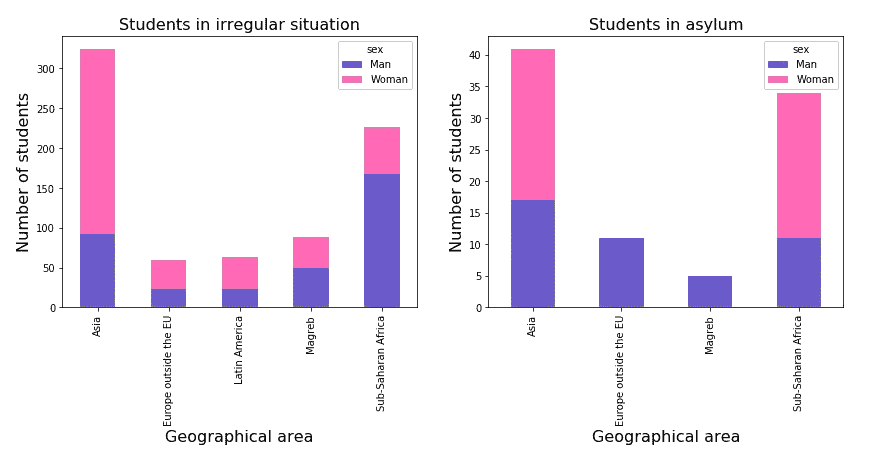****

****如上所示，大多数处于非正常状况的亚洲学生是女性；然而，大多数撒哈拉以南非洲学生是男性。没有来自北美和欧洲联盟的非正常或处于庇护状态的学生。此外，在欧盟以外的欧洲避难的学生，和马格里布只有男性。****

****关于级别，大多数非正常情况下的学生注册参加 A1 和 A2 级别的低级别课程(**58.72%**)，相比之下，寻求庇护的学生注册参加 A1 和 A2 级别的程度较低(**38.46%**)。参加扫盲班的学生比例几乎相等(大约 10% )。****

****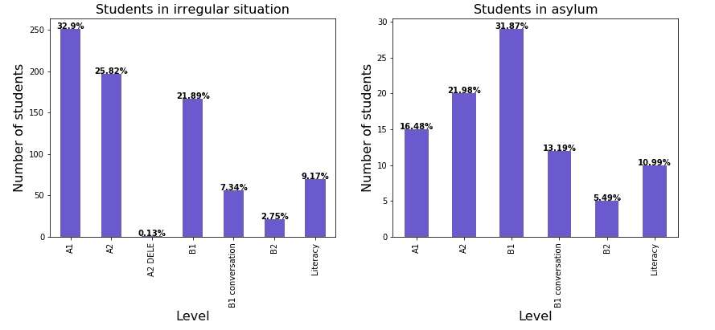****

## ****学生们多大了？是层次之间的差异吗？****

****为了获得学生的年龄，我们可以使用 [**熊猫。Series.value_counts** 这可以通过](https://pandas.pydata.org/pandas-docs/stable/reference/api/pandas.Series.value_counts.html) [**熊猫来实现。series . reindex**](https://pandas.pydata.org/pandas-docs/stable/reference/api/pandas.Series.reindex.html)**方法，传递一个带有新标签(索引)的列表作为参数。******

******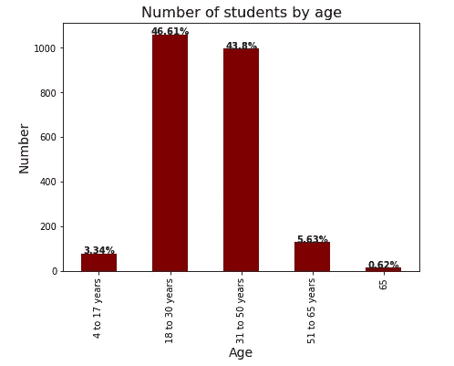******

******可以看出，90%以上的学生年龄在 18-50 岁之间。不清楚 65 岁是指 65 岁以上的学生(这是有意义的，因为年龄是以范围提供的)还是确切的 65 岁。******

******根据级别，A2 DELE 课程(获得西班牙国籍的考试)主要由 31 至 50 岁的学生参加。在其他级别(A1 除外)，18 至 30 岁*和 31 至 50 岁*学生的比例相当接近(见下图)。******

******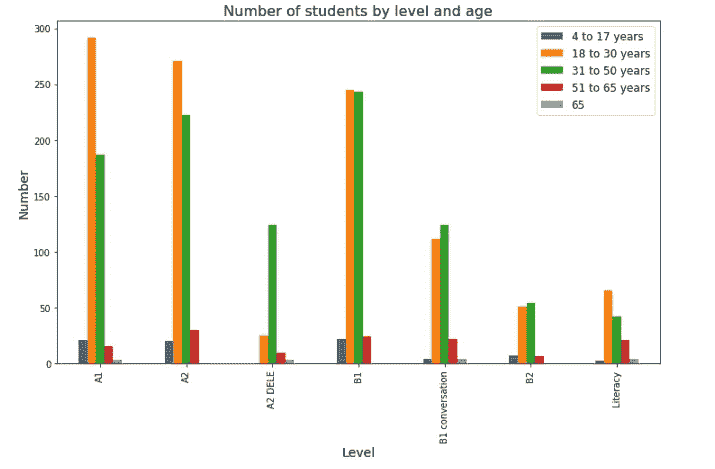******

******而现在！我们最后一个问题🍀******

## ********学生从哪里来？********

******为了回答这个问题，我们不打算像以前一样使用条形图，而是使用另一个有趣的可视化工具:**cloropletes maps**。******

******choropleth 地图**是一个专题地图，根据地图上显示的统计变量(如学生人数)对区域进行着色。这种可视化非常有助于通过使用连续颜色方案(测量值越高，颜色越强)来表示一个区域内测量值的可变性。****

****为了创建一个 **choropleth 地图**，**叶子**需要一个 **Geo JSON** 文件，包括该地区的地理空间数据。对于世界地图，我们需要一个 Geo JSON 文件来定义世界上所有国家的边界。您可以通过以下链接下载该文件:****

**** [## python 可视化/folio

### 此时您不能执行该操作。您已使用另一个标签页或窗口登录。您已在另一个选项卡中注销，或者…

github.com](https://github.com/python-visualization/folium/blob/master/examples/data/world-countries.json) 

将文件移动到当前目录后，我们可以使用 **json.load()** 方法从 **json** 库中读取 **json 对象**，如下所示:

如上图所示， **json.load()** 方法返回一个名为 *data* 的 python 字典。我们使用内置模块 **pprint** 以可读性更好的方式打印字典*数据*。正如我们所看到的，文件 *world-countries.json* 提供了**多边形**，定义了世界各国的边界。

我们正在读取并可视化 *world-countries.json* 文件，以便对数据的结构有所了解。然而，当使用**flour，**创建一个 cloropleth map 时，我们只需提供到 **GeoJSON** 文件的路径，这意味着不需要像上面那样使用 **json** 模块读取文件。

现在！我们准备用叶子了！💪 🌎

[**leav**](https://python-visualization.github.io/folium/)是一个 python 库，可以在传单地图上实现迭代可视化。在生成**克洛普勒斯图**之前，我们必须创建一个数据框，包含来自每个国家的学生人数，如下所示:

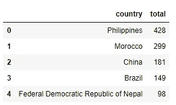

此外，要成功绑定数据框和 json 文件，数据框中的国家名称必须与 json 文件中的国家名称完全匹配。因此，我们必须分析数据框中的哪些名称没有包含在 json 文件中，并对其进行相应的修改。

如上所示，json 文件中没有下列名称:(1)尼泊尔联邦民主共和国，(2)阿拉伯叙利亚共和国，
(3)大不列颠及北爱尔兰联合王国，(4)撒哈拉，(5)摩尔多瓦共和国，(6)佛得角，(7)巴勒斯坦，(8)新加坡和(9)马耳他。现在，我们修改数据框，用 json 文件中可用的名称替换这些名称。

关于之前的修改，必须考虑以下方面:

*   json 文件中没有马耳他和佛得角；因此，它们的名称不会被修改，也不会绘制在克洛普勒斯图上。
*   新加坡被马来西亚取代，因为在 json 文件中，新加坡边界包含在马来西亚多边形中。这是不准确的，因为他们是不同的国家！
*   撒哈拉被西撒哈拉取代。这也是不准确的，因为撒哈拉的面积比西撒哈拉大。
*   该修改适用于以下情况:尼泊尔、叙利亚、英国、摩尔多瓦和西岸。

现在！我们已经准备好创建克洛普勒斯图了！🙌 😄

首先，我们创建一个**叶子地图对象，**以[0，0]为中心(**位置**参数允许将地图居中在一个特定的位置)。我们还提供了一个初始缩放级别为 2 的**来将地图缩放到中心。然后，我们使用**来显示一个云图。cloropleth()** 法。此函数绑定包含在 **Pandas** 数据框和 **GeoJSON** 几何图形中的数据。**

要生成地图，将使用以下参数:

*   **geo _ data→**JSON 文件的名称。该文件必须位于工作目录中。
*   **数据→** 包含数据的数据帧的名称。
*   **列→** 用于生成克洛普勒斯图的列。
*   **key _ on→**JSON 文件中包含国家名称的 Key。
*   **填充颜色→** 可视化中使用的颜色方案。

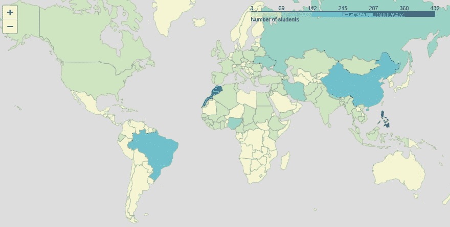

正如我们所看到的，图例显示了一个负边界(-3)。这个问题可以通过用 numpy.linspace()函数定义我们自己的边界来解决，如下所示:

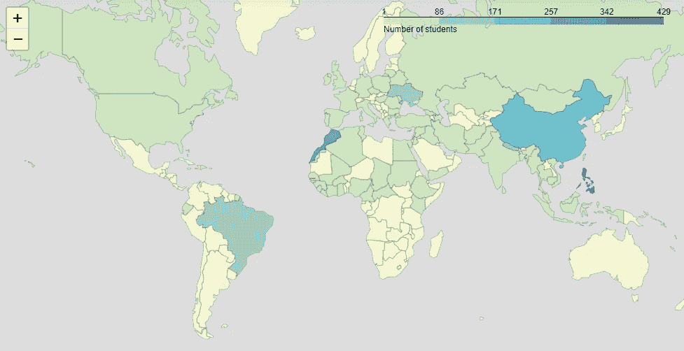

学生主要来自菲律宾和摩洛哥，这是有道理的，因为这两个国家都是西班牙的殖民地，目前西班牙语不是该国的官方语言。我们也可以观察到，有相当数量的学生来自中国、尼泊尔和巴西。此外，没有来自澳大利亚、北欧国家和大多数拉丁美洲国家的学生。

我们不能用柱状图来直观地显示学生的数量，因为学生来自 74 个不同的国家。但是，我们可以显示前十个国家，如下所示:

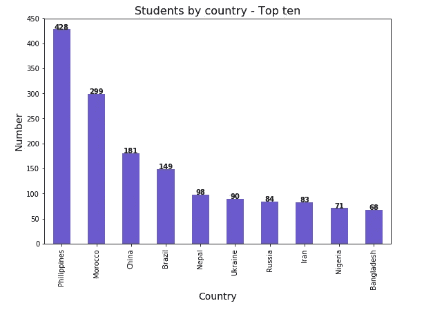

最后，我们将绘制一张欧洲的克洛普勒斯地图🌐

首先，我们创建一个数据框，包含来自每个欧洲国家的学生人数，如下所示:

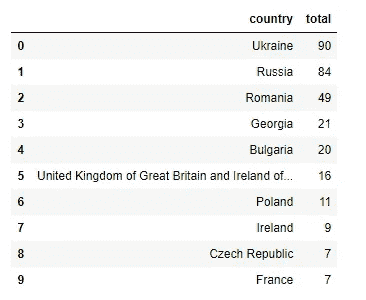

然后，我们分析数据框中有哪些名字是 **europe.geojson** 文件中没有的，并进行相应的修改。

我们可以通过以下链接下载 **europe.geojson** 文件:

 [## leaky mirror/欧洲地图

### permalink dissolve GitHub 是 4000 多万开发人员的家园，他们一起工作来托管和审查代码，管理…

github.com](https://github.com/leakyMirror/map-of-europe/blob/master/GeoJSON/europe.geojson) 

最后，我们创建一个**树叶贴图对象，**以【53.0，9.0】为中心，显示一个**树叶贴图**和**。cloropleth()** 方法和我们前面做的一样。

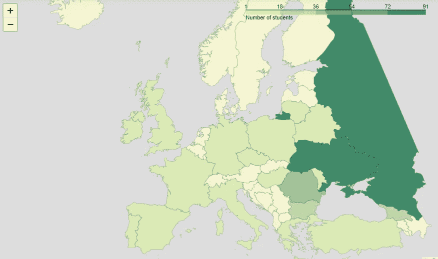

💪我们拿到了。

据我们观察，学生主要来自乌克兰、俄罗斯、罗马尼亚、格鲁吉亚和保加利亚。

根据性别或课程水平绘制克洛普勒斯图也将是有趣的。如你所见，分析可以是无止境的！我鼓励你生成更多的情节，利用这个公开的数据，尝试提取更多的结论！不过现在有些推荐:)

# 推荐

如果你想学习如何用 Python 创建有趣的可视化效果，请学习这门课程！它是完全免费的，你可以从基础的可视化学到高级的可视化。💪

 [## 登录或注册-认知类

### 编辑描述

courses.cognitiveclass.ai](https://courses.cognitiveclass.ai/courses/course-v1:CognitiveClass+DV0101EN+v1/info) 

此外，您还可以阅读我以前的一些使用开放数据执行的文章😊 😉

 [## 使用 Pandas、Matplotlib 和 lyum 分析巴塞罗那的车祸

### 巴塞罗那开放数据是巴塞罗那的数据服务，包含约 400 个数据集，涵盖广泛的主题，如…

towardsdatascience.com](/analysis-of-car-accidents-in-barcelona-using-pandas-matplotlib-and-folium-73384240106b)  [## 啤酒节:使用 Pandas、Matplotlib 和 Plotly 进行快速分析

### 2019 啤酒节已经开始了！慕尼黑啤酒节是世界上最大的啤酒节，自…年起每年在慕尼黑举行。

towardsdatascience.com](/oktoberfest-quick-analysis-using-pandas-matplotlib-and-plotly-79778367a4c) 

感谢阅读！！！🍀🍀🍀🍀🍀🍀🍀

阿曼达******