# 理解线性回归的解析和几何方法

> 原文：<https://towardsdatascience.com/analytic-and-geometric-approaches-to-understanding-linear-regression-96deda83a1fc?source=collection_archive---------48----------------------->

## 从解析角度和几何角度深入研究线性回归

(图片由作者提供)镜子，镜子，在墙上，谁是所有人中最小的正方形？

## 什么是线性回归？

在一个实验中，我们观察一些*特征*或*属性*的值。我们希望根据观察到的特征预测一个*目标*变量的值。线性回归试图推测特征和目标之间的线性关系。

让我们借助一个分析天气的例子来理解线性回归试图解决什么问题。假设我们有日平均温度 **T** ，风向 **W** ，以及每天日照总分钟数 **S** 。这些将是我们的特色。我们想预测每天的降雨量。这将是我们的目标变量。

我们试图找到 P，T，W，S 之间的线性关系。也就是说，我们希望找到 **θ** ₀ **，θ** ₁ **，θ** ₂ **，θ** ₃，以便

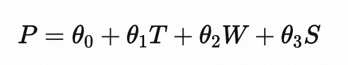

## 抽象出线性回归

假设我们有超过***天的天气数据。对于第 **i** 天，我们将那天的特征值 **T，w，S** 收集成一个行向量 **x** ᵢ = ( **x** ᵢ， **x** ᵢ， **x** ᵢ)。当天的降水值成为目标值 **y** ᵢ.***

***抽象出这个设置，我们可以假设给定了数据点 **x** ₁ **，x** ₂ **，… x_n** ，其中每个数据点 **x** ᵢ具有**k**t52】特征并且具有目标 **y** ᵢ.也就是说，每个数据点 **x** ᵢ看起来像行向量***

***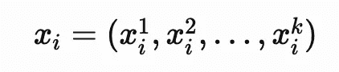***

***我们感兴趣的目标变量的值为数据点 **x** ᵢ.的 **y** ᵢ***

***线性回归试图找到数据点 **x** ᵢ和它们的目标 **y** ᵢ.之间的线性关系也就是说，我们想要找到实数 **θ** ₀ **，θ** ₁ **，θ** ₂ **，θ**₃……**θ_ k**，这样对于每个 **i** ，我们都有***

***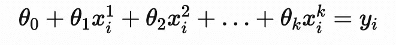***

******为一致性引入虚拟特征***:₀**θ**在没有绑定特征 **x** ᵢ⁰的情况下非常突出，因此为了使其一致，我们为每个数据点 **x** ᵢ.引入虚拟特征 **x** ᵢ⁰= 1 也就是说，每个数据点 **x** ᵢ现在看起来像行向量***

***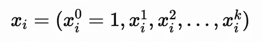***

***所以我们想找到实数 **θ** ₀ **，θ** ₁ **，θ** ₂ **，θ**₃……**θ_ k**，这样对于每个 **i** ，我们就有了***

***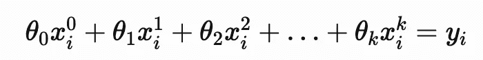***

## ***矩阵方程***

***让我们把 **θ** ₀ **，θ** ₁ **，θ** ₂ **，θ**₃……**θ_ k**捆绑成一个列向量 **θ** ，把 **y** ₁ **，y** ₂ **，… y_n** 捆绑成一个列向量 **Y** 和行向量***

***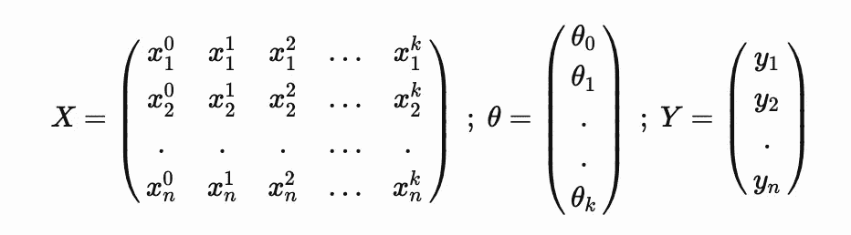***

***那么同时求解上面的 **n** 线性回归方程就等同于求解矩阵方程 **X θ** = **Y*****

## ***使用最小二乘法的近似解***

***不幸的是，你可能并不总能准确地解决这个线性方程组。然后我们的目标是一个*近似解*，它在以下意义上是其他近似解中最好的:***

***让**xθ**=**ŷ_θ。**也就是说，我们对目标变量的预测值是[]**ŷ_θ**。我们希望我们的预测尽可能接近真实情况。所以我们希望**ŷ_θ**尽可能的接近 **Y** 。也就是说，我们希望范数| |**y-ŷ_θ||**最小。***

***因为这与要求| |**y-ŷ_θ||**最小化是一样的，我们想要最小化下面的平方和***

***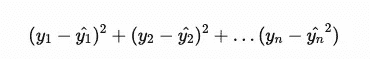***

***也就是说，我们想要矩阵方程 **X θ** = **Y** 的*最小二乘解****

## ***分析方法***

***如果你对多变量导数感到不舒服，直接跳到几何方法！***

******

***注意 Aᵀ是一个矩阵 a 的转置由于 **θ** ᵀ **X** ᵀ **Y** 是 a1×1 矩阵[ ]，**θ**ᵀ**x**ᵀ**y**=(**θ**ᵀ**x**ᵀ**y)**ᵀ.因此***

***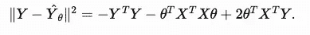***

***由于 Yᵀ **Y** 不依赖于 **θ** ，我们不妨最小化以下函数***

***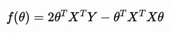***

***相对于 **θ** 取梯度，我们得到***

***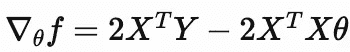***

***请记住，我们希望梯度为 0，因为我们试图找到极值 **f** ( **θ)** 。所以我们想要 2**x**ᵀ**y—**2**x**ᵀ**xθ= 0。*****

***也就是说，我们希望 **θ** 使得**x**ᵀ**xθ= x**ᵀ**y .*****

## ***正规方程***

***矩阵方程**x**ᵀ**xθ= x**ᵀ**y**被称为**xθ= y**的 ***正规方程*** 从我们上面的讨论中，应该或多或少地清楚，正规方程的解 **θ** 给出了 **Xθ = Y** 的最小二乘解。***

***这很好，但是我们如何知道正规方程*的解实际上存在*？我们如何检查我们得到的极值实际上是最小值？这些当然可以通过进一步的计算显示出来。相反，我们提出了一种几何方法，它完全避免了导数，并使用一些几何观点来推导正规方程，并显示最小二乘解的存在！***

## ***几何方法***

****回忆..****

***让我们回到方程 **Xθ = Y** 。由于我们不能总是直接解这个方程，我们满足于一个近似解 **θ** 使得 **Xθ** ≈ **Y** 。如果我们定义**ŷ_θ**=**xθ**，那么在所有可能的近似解 **θ** 中，我们要挑选一个使得| |**y-ŷ_θ||**最小的。***

***让我们考虑 **θ所有可能值的空间。**这只是 **R** ^{k+1}，即 **θ** 可以是任意 *k+1* 列向量。现在让我们看看集合 **V** ，它包含了所有可能的预测**ŷ_θ**。也就是说，***

***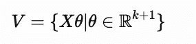***

***让我们将 **X** 视为一幅线性地图***

***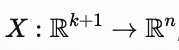***

***即 **X** 是从可能的 **θ** s 的空间到目标变量所有可能值的空间的线性映射。***

***那么 **V** 就是 **X** 的形象。特别地，它是ⁿ.的子空间重申一下， **R** ⁿ是目标变量所有可能值的空间， **Y** 是我们试图达到的目标变量的特定值， **V** 是我们所有可能预测的子空间。***

***现在，如果 **Y** 位于 **V** 中，我们就能准确无误地找到解决 **θ** 的方法，它实际上解决了 **Xθ = Y** ..如果不能，我们就试着在 **V** 中找到距离 **Y** 最近的*矢量**ŷ_θ**。****

***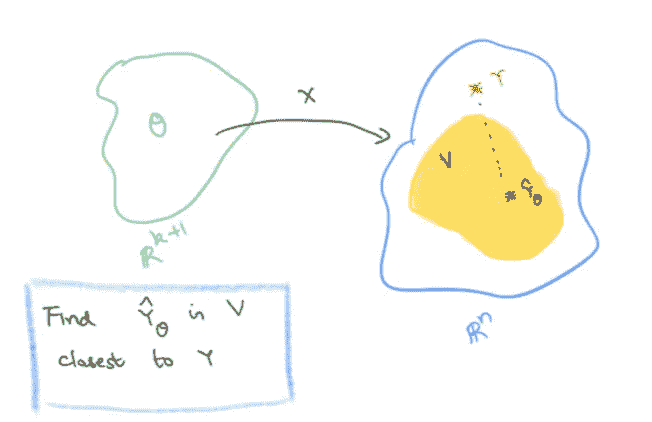***

***(图片由作者提供)几何方法***

## ***在最接近给定目标的子空间中寻找向量***

*****V** 是 **R** ⁿ的子空间，而 **Y** 是 **R** ⁿ.中的给定向量我们想在距离 **Y** 最近的 **V** 中找到**ŷ_θ**。我们如何做到这一点？
让我们想象一下这些矢量，还有矢量**y-ŷ_θ**。请记住，我们正努力使 y-ŷ_θ||的规范尽可能的小***

***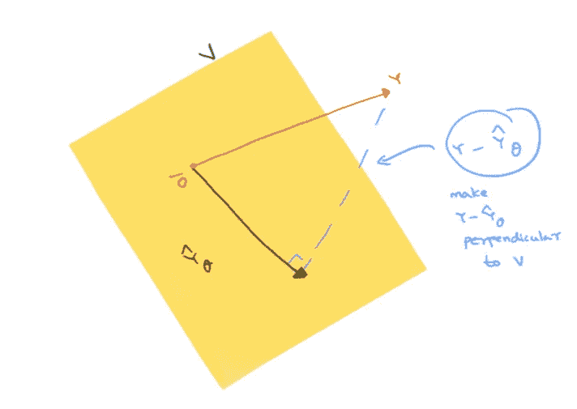***

***(图片由作者提供)可视化投影***

***由于点到子空间的最短距离是从点到子空间的垂线，我们的目标是使**y-ŷ_θ**垂直于 **V** ！注意，这和说最接近的预测**ŷ_θ**简单来说就是 **Y** 到 **V** 的 ***正交投影*** 是一回事。***

## ***图像、内核和转置***

***现在在线性地图的图像和它的转置ᵀ.的内核之间有了一个非常好的 relation[⁴垂直于图像的向量( **X** )实际上在 **X** ᵀ的内核中，反之亦然。在符号中，这写为***

***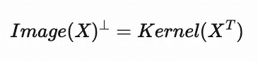***

***现在我们希望**y-ŷ_θ**垂直于 **V** = Image( **X** )。所以我们希望 y-ŷ_θ在ᵀ.的内核中也就是说，我们想要***

***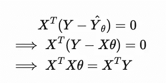***

***瞧啊。我们想要正规方程 **X** ᵀ **Xθ = X** ᵀ **Y** 的解 **θ*****

## ***正规方程的解***

***几何方法立即告诉你为什么法线方程**x**ᵀ**xθ= x**ᵀ**y**有解 **θ** 。这是因为(我们已经搞清楚了)当**xθ**=**ŷ_θ**是 **Y** 到 **V** =Image( **X** )的正交投影时， **θ** 就是精确解。***

***于是回溯，取 **Y** ，投影到 **V** =Image( **X** )。对于某些 **θ** ，投影必须看起来像 **Xθ** ，因为投影在图像子空间 **V** 中。那个 **θ** 是正规方程的一个解，因此是我们正在寻找的方程 **Xθ** = **Y** 的最小二乘解！***

## ***最小二乘解的唯一性***

***有一点我们忽略了，即*是我们所追求的* ***Xθ*** *的独特之处吗？*使用我们的几何方法， **Y** 到 **V** (也就是**ŷ_θ**)的投影是独一无二的。但是可能有几个 **θ** 使得**xθ**=**ŷ_θ.*****

***但进一步假设， **X** 是一个内射映射，即它有零核，那么我们得到的 **θ** 是唯一的。而且实际上，*原来*【⁵】如果 **X** 是内射的，那么 **X** ᵀ **X** 也是内射的。由于 **X** ᵀ **X** 是一个方阵，这意味着 **X** ᵀ **X** 是可逆的。因此，我们实际上可以求解 **θ** 如下:***

***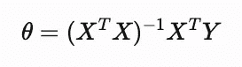***

## ***摘要***

****方程 **Xθ = Y** 的*最小二乘解* **θ** 与 ***正规方程*****x**ᵀ**xθ= x**ᵀ**y .**的解相同***

****正规方程总是至少有一个解。而进一步如果 **θ** 是一个解，那么 **Xθ** 这个最接近的预测就是 **Y** 到图像( **X** )的正交投影。***

****法线方程可能有多个解，因此可能有多个最小二乘解。然而，如果 **X** 是内射的(即具有零核)，则解是唯一的，并且由下式给出***

******

## ***脚注***

***[ ]:让***

***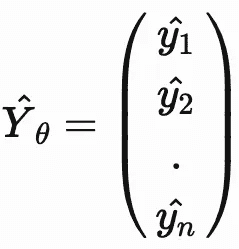***

***[]:**θ**ᵀ**x**ᵀ**y**是 an (1 x (k+1))((k+1) x n)(n x 1) = 1 x 1 矩阵
[ ]:距离**ŷ_θ**和 **Y** 是| |**y-ŷ_θ||**
【⁴和⁵]:关于这个事实请查阅你喜欢的线性代数教科书***