# Oracle 中的分析功能

> 原文：<https://towardsdatascience.com/analytical-functions-in-oracle-4ac48e022370?source=collection_archive---------9----------------------->

## ***本文通过概念构建练习*** 帮助理解分析函数的工作和用法


斯蒂芬·菲利普斯-Hostreviews.co.uk 在 [Unsplash](https://unsplash.com?utm_source=medium&utm_medium=referral) 上的照片

***分析函数用于对多行数据进行“分析”,并返回当前行的结果。*** 例如，分析函数可用于找出运行总数、对行进行排序、对前一行或即将到来的行进行汇总等。虽然通过使用标准聚合函数和使用连接和子查询的原生 SQL 可以实现相同的功能，但是分析函数使它更加简单和快速。Oracle 在 Oracle 8.1.6 中引入了 26 个分析功能。

我们将使用下面的脚本来创建样本数据:

```
CREATE TABLE DEPT
(
 DEPTNO NUMBER(2),
 DNAME VARCHAR2(14 CHAR),
 LOC VARCHAR2(13 CHAR)
);Insert into DEPT
 (DEPTNO, DNAME, LOC)
 Values
 (10, ‘ACCOUNTING’, ‘NEW YORK’);
Insert into DEPT
 (DEPTNO, DNAME, LOC)
 Values
 (20, ‘RESEARCH’, ‘DALLAS’);
Insert into DEPT
 (DEPTNO, DNAME, LOC)
 Values
 (30, ‘SALES’, ‘CHICAGO’);
Insert into DEPT
 (DEPTNO, DNAME, LOC)
 Values
 (40, ‘OPERATIONS’, ‘BOSTON’);
COMMIT;CREATE TABLE EMP
(
 EMPNO NUMBER(4) NOT NULL,
 ENAME VARCHAR2(10 CHAR),
 JOB VARCHAR2(9 CHAR),
 MGR NUMBER(4),
 HIREDATE DATE,
 SAL NUMBER(7,2),
 COMM NUMBER(7,2),
 DEPTNO NUMBER(2)
)Insert into EMP
 (EMPNO, ENAME, JOB, MGR, HIREDATE, SAL, COMM, DEPTNO)
 Values
 (7369, ‘SMITH’, ‘CLERK’, 7902, TO_DATE(‘12/17/1980 00:00:00’, ‘MM/DD/YYYY HH24:MI:SS’), 
 800, NULL, 20);
Insert into EMP
 (EMPNO, ENAME, JOB, MGR, HIREDATE, SAL, COMM, DEPTNO)
 Values
 (7499, ‘ALLEN’, ‘SALESMAN’, 7698, TO_DATE(‘02/20/1981 00:00:00’, ‘MM/DD/YYYY HH24:MI:SS’), 
 1600, 300, 30);
Insert into EMP
 (EMPNO, ENAME, JOB, MGR, HIREDATE, SAL, COMM, DEPTNO)
 Values
 (7521, ‘WARD’, ‘SALESMAN’, 7698, TO_DATE(‘02/22/1981 00:00:00’, ‘MM/DD/YYYY HH24:MI:SS’), 
 1250, 500, 30);
Insert into EMP
 (EMPNO, ENAME, JOB, MGR, HIREDATE, SAL, COMM, DEPTNO)
 Values
 (7566, ‘JONES’, ‘MANAGER’, 7839, TO_DATE(‘04/02/1981 00:00:00’, ‘MM/DD/YYYY HH24:MI:SS’), 
 2975, NULL, 20);
Insert into EMP
 (EMPNO, ENAME, JOB, MGR, HIREDATE, SAL, COMM, DEPTNO)
 Values
 (7654, ‘MARTIN’, ‘SALESMAN’, 7698, TO_DATE(‘09/28/1981 00:00:00’, ‘MM/DD/YYYY HH24:MI:SS’), 
 1250, 1400, 30);
Insert into EMP
 (EMPNO, ENAME, JOB, MGR, HIREDATE, SAL, COMM, DEPTNO)
 Values
 (7698, ‘BLAKE’, ‘MANAGER’, 7839, TO_DATE(‘05/01/1981 00:00:00’, ‘MM/DD/YYYY HH24:MI:SS’), 
 2850, NULL, 30);
Insert into EMP
 (EMPNO, ENAME, JOB, MGR, HIREDATE, SAL, COMM, DEPTNO)
 Values
 (7782, ‘CLARK’, ‘MANAGER’, 7839, TO_DATE(‘06/09/1981 00:00:00’, ‘MM/DD/YYYY HH24:MI:SS’), 
 2450, NULL, 10);
Insert into EMP
 (EMPNO, ENAME, JOB, MGR, HIREDATE, SAL, COMM, DEPTNO)
 Values
 (7788, ‘SCOTT’, ‘ANALYST’, 7566, TO_DATE(‘12/09/1982 00:00:00’, ‘MM/DD/YYYY HH24:MI:SS’), 
 3000, NULL, 20);
Insert into EMP
 (EMPNO, ENAME, JOB, MGR, HIREDATE, SAL, COMM, DEPTNO)
 Values
 (7839, ‘KING’, ‘PRESIDENT’, NULL, TO_DATE(‘11/17/1981 00:00:00’, ‘MM/DD/YYYY HH24:MI:SS’), 
 5000, NULL, 10);
Insert into EMP
 (EMPNO, ENAME, JOB, MGR, HIREDATE, SAL, COMM, DEPTNO)
 Values
 (7844, ‘TURNER’, ‘SALESMAN’, 7698, TO_DATE(‘09/08/1981 00:00:00’, ‘MM/DD/YYYY HH24:MI:SS’), 
 1500, 0, 30);
Insert into EMP
 (EMPNO, ENAME, JOB, MGR, HIREDATE, SAL, COMM, DEPTNO)
 Values
 (7876, ‘ADAMS’, ‘CLERK’, 7788, TO_DATE(‘01/12/1983 00:00:00’, ‘MM/DD/YYYY HH24:MI:SS’), 
 1100, NULL, 20);
Insert into EMP
 (EMPNO, ENAME, JOB, MGR, HIREDATE, SAL, COMM, DEPTNO)
 Values
 (7900, ‘JAMES’, ‘CLERK’, 7698, TO_DATE(‘12/03/1981 00:00:00’, ‘MM/DD/YYYY HH24:MI:SS’), 
 950, NULL, 30);
Insert into EMP
 (EMPNO, ENAME, JOB, MGR, HIREDATE, SAL, COMM, DEPTNO)
 Values
 (7902, ‘FORD’, ‘ANALYST’, 7566, TO_DATE(‘12/03/1981 00:00:00’, ‘MM/DD/YYYY HH24:MI:SS’), 
 3000, NULL, 20);
Insert into EMP
 (EMPNO, ENAME, JOB, MGR, HIREDATE, SAL, COMM, DEPTNO)
 Values
 (7934, ‘MILLER’, ‘CLERK’, 7782, TO_DATE(‘01/23/1982 00:00:00’, ‘MM/DD/YYYY HH24:MI:SS’), 
 1300, NULL, 10);
COMMIT;
```

# 分析函数和聚合函数的区别


威尔·弗朗西斯在 [Unsplash](https://unsplash.com?utm_source=medium&utm_medium=referral) 上拍摄的照片

> 聚合函数对行进行分组，并返回整个结果集的输出。但是，分析函数会返回聚合输出，但不会对结果集进行分组。它们返回结果集中每一行的值。

例如，如果我们必须从 employee 表中找出部门编号的计数，我们将使用聚合函数编写以下查询:

```
**SELECT deptno,COUNT(*) dept_cnt
FROM emp
GROUP BY deptno;**
```

结果如下:

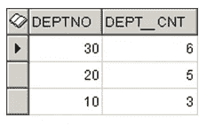

因此，对于每一行(即每个部门)，我们得到计数。

使用分析函数，查询将被写成:

```
**SELECT deptno, 
COUNT(*) OVER (PARTITION BY 
deptno) DEPT_COUNT
FROM emp**
```

输出如下所示:

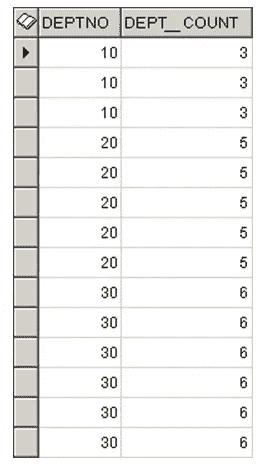

这里，结果是 emp 表中的每一行。

因此，在使用聚合函数时，我们不能包含任何非分组依据列，但是在使用分析函数时，您可以这样做。例如，下面的查询将返回一个错误:

```
SELECT empno,deptno,COUNT(*) dept_cnt
FROM emp
GROUP BY deptno;
```


但是使用解析函数，就不会面临这种错误。

```
SELECT empno,deptno, 
COUNT(*) OVER (PARTITION BY 
deptno) DEPT_COUNT
FROM emp
```

输出将是:

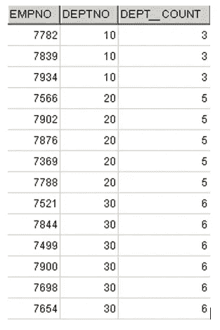

# 语法:


照片由 [timJ](https://unsplash.com/@the_roaming_platypus?utm_source=medium&utm_medium=referral) 在 [Unsplash](https://unsplash.com?utm_source=medium&utm_medium=referral) 上拍摄

分析函数的一般语法是:

***函数(arg1，…，argn) OVER(【分区由< … >)【排序由< …)。>][<window _ clause>])***

我们一部分一部分的解剖吧。

**结束:**

分析函数的范围是在 OVER 子句中定义的。对于所有分析功能，OVER 是强制的。如果您在 OVER 之后没有给出任何参数，它将假定范围为 ALL。因此，以下查询将计算整个表中部门的数量:

```
**SELECT deptno, 
COUNT(*) OVER() DEPT_COUNT
FROM emp**
```

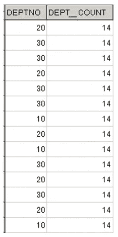

**分区依据:**

正如聚合函数使用 GROUP BY 对行进行分组一样，分析函数使用 PARTITION BY。例如，如果我们希望找出每个部门的最高工资和每个工作类型的最高工资，我们可以编写如下查询:

```
SELECT 
ename,
sal,
job,
deptno,
max(sal) over (partition by deptno) max_sal_deptno , 
max(sal) over (partition by job) max_sal_job
FROM emp
```

在这里，我们按 deptno 进行了分区，以找出最高工资，并将其显示在 max_sal_deptno 列中。类似地，我们按职务进行了划分，以找出最高工资，并将其显示在 max_sal_job 列中

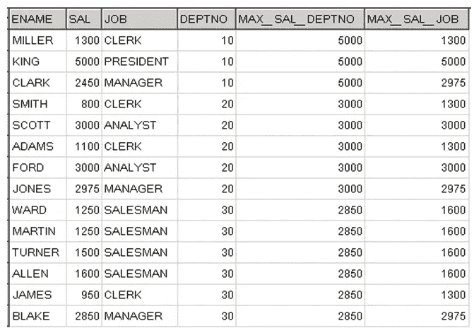

如果我们分析 emp 表的数据，很容易发现 10 部门的最高工资是 5000，20 部门是 3000，30 部门是 2850。

同样，对于工作类型的职员，最高工资是 1300，总裁是 500，经理是 2975，分析师是 3000，销售员是 1600。

**排序依据:**

它用于指定所选分区中记录的顺序。这不同于 WHERE 之后的主查询的 ORDER BY 子句。

**窗口条款:**

partition 子句不是限制分析函数范围的唯一方法。我们可以使用“ROWS BETWEEN”或“RANGE BETWEEN”子句来定义一个额外的范围。这在“窗口”一节中有明确的解释

# 一些常用分析函数的工作和用法:

一些常用的分析函数如下:

**a .行数:**

ROW_NUMBER 为一组记录提供一个连续的序列号。这里，ORDER BY 子句在枚举行时起着至关重要的作用。例如，如果您想返回每个部门中第二个被雇用的员工，您可以编写如下查询:

```
**select
ename, deptno,hiredate
from
(
SELECT 
ename,
hiredate,
deptno,
row_number() over (partition by deptno order by hiredate) rn 
FROM emp
) where rn=2**
```

输出是:

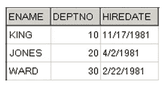

这里，我们按 deptno 对行进行了分区，并按 hiredate 进行了排序。函数的作用是:为所有的行分配一个序列号，从 1 开始，代表所有按 hiredate 排序的部门。对于新部门，编号将从 1 重新开始。内部查询执行此操作。内部查询的输出如下所示。(最后需要的行用红色标记)

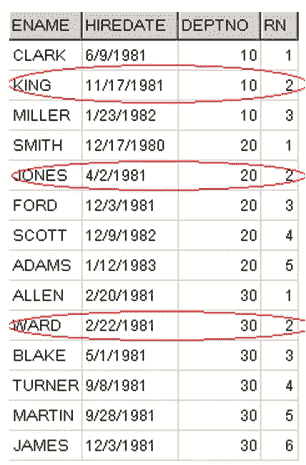

外部查询现在选择 rn=2 的那些行，以给出我们想要的结果。

**b.** **等级:**

等级分析函数还为一组以特定方式排序的行提供一个序列号，如 ROW_NUMBER。但是，不同之处在于:ROW_NUMBER 为每一行赋予一个唯一的编号，即使这些行是重复的。但是 RANK 对重复行给出相同的编号。

因此，在我们的 emp 表中，如果两个雇员有相同的雇佣日期，那么 RANK 函数将为每个重复的行给出相同的数字。查看以下查询的结果:

```
**SELECT 
ename,
hiredate,
deptno,
row_number() over (order by hiredate) rn, 
rank() over( order by hiredate) rank_num
 FROM emp**
```

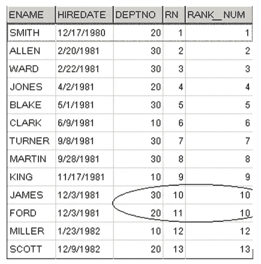

由于 JAMES 和 FORD 的雇佣日期相同，ROW_NUMBER 为他们指定了不同的编号，而 RANK 为他们指定了相同的编号。

**c.** **密 _ 秩**

DENSE_RANK 的工作方式与 RANK 类似。唯一的区别是，在分配给重复行时，它不会跳过数字。检查以下查询的结果，了解 RANK 和 DENSE_RANK 函数之间的区别:

```
**SELECT 
ename,
hiredate,
deptno,
rank() over(order by hiredate) rank_num,
dense_rank() over( order by hiredate) dense_rank_num
FROM emp**
```

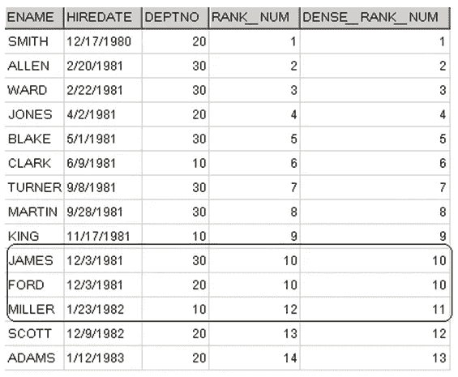

詹姆斯和福特的雇佣日期相同。因此，对于等级和密集等级，两行都被分配编号 10。但是在等级的情况下，米勒的下一行被分配 12，而在密集等级的情况下被分配 11。

**d .**超前和滞后

LEAD 允许我们对下一行(当前行之后的行)应用任何计算。LEAD 函数的一般语法是:

> **LEAD( <表达式>，<偏移>，<默认> ) over( <解析子句> )**

在哪里

**<表达式>** 是应用于前导行的表达式

**<偏移量>** 是相对于当前行的第一行的数量(可以是 1，2…..)

**<默认>** 是当<偏移量>指向分区范围外的行时返回的值

> **LAG 的语法完全一样。LAG 中的<偏移量>指向相对于当前行的前几行。**

假设我们必须找出部门 10 先前较低的薪水和下一个较高的薪水，查询将是:

```
**SELECT 
ename,
sal,
lead(sal,1,0) over(partition by deptno order by sal desc) next_low_sal,
lag(sal,1,0) over(partition by deptno order by sal desc) prev_high_sal
FROM emp
 where deptno=10**
```

结果是:

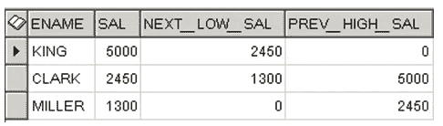

**e .**第一个值和最后一个值

在由 partition 和 order by 子句定义的记录集下，如果我们必须选取第一条记录，可以使用 FIRST_VALUE 函数。同样，在由 partition 和 order by 子句定义的记录集下，如果我们必须挑选最后一条记录，可以使用 LAST_VALUE 函数。比方说，如果我们必须找出部门 10 的每个雇员的第一次雇用和当前雇用日期之间的天数，则查询可以写成如下形式:

```
**SELECT 
ename,
sal,
hiredate-first_value(hiredate) over(order by hiredate) no_of_days
FROM emp
where deptno=10**
```

结果是:

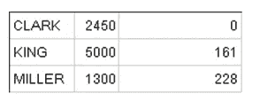

# 窗口条款


[R 莫](https://unsplash.com/@mooo3721?utm_source=medium&utm_medium=referral)在 [Unsplash](https://unsplash.com?utm_source=medium&utm_medium=referral) 上拍照

partition 子句不是限制分析函数范围的唯一方法。我们可以使用“ROWS BETWEEN”或“RANGE BETWEEN”子句来定义一个额外的范围。

<window_clause>的一般语法是< start_expr >和<end _ expr>之间的
T28【行或范围】</window_clause>

**< start_expr >** 可以是以下任意一个
无界 PECEDING
当前行
< sql_expr >之前或之后。

**< end_expr >** 可以是以下任意一个
无界跟随或
当前行或
< sql_expr >之前或之后。

让我们编写一个查询，给出前几行相对于当前行的最高工资。

```
**SELECT 
ename,
hiredate,
sal,
max(sal) over(order by hiredate,ename 
 ROWS BETWEEN UNBOUNDED PRECEDING AND 1 PRECEDING) max_before_sal
FROM emp**
```

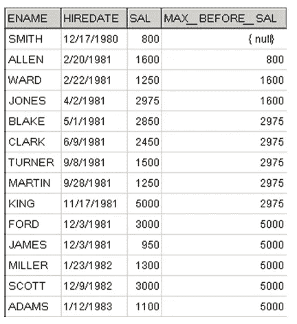

这里，对于每一行，返回当前行之前的最高工资。这里的 ORDER BY 子句不用于排序，而是用于指定窗口。无界在前是最低的可能界限，即第一行。

检索当前行之前或之后的行，n 在前或 n 在后，其中 n 是相对于当前行的位置。在我们的例子中，n 是 1。

范围与行非常相似，但范围中的间隔不是行数。它们代表一定范围的值，可以是数字或日期值。

Oracle 的分析功能是非常强大的工具，可以在多个维度上汇总和分析数据。执行速度也比普通的聚合函数快得多。对于 Oracle 开发人员来说，了解这些功能无疑是额外的收获。