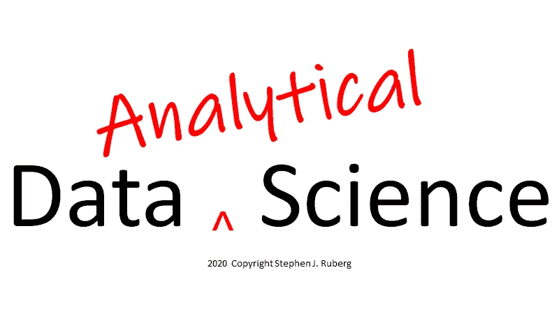

# 分析、数据科学和统计:

> 原文：<https://towardsdatascience.com/analytics-data-science-and-statistics-f9f140d731ba?source=collection_archive---------14----------------------->

## 什么是分析？什么是数据科学？什么是统计学？

## 一朵玫瑰，不管它叫什么名字…

我想在数据科学、统计学或一般来说的分析媒体上发表另一种声音，以拓宽视角，增加关于这一主题的丰富对话。虽然我的意图是让这个充斥着数据和分析及其不同词汇的世界更加清晰，但毫无疑问，我也会给这个广阔的话题带来一些困惑和不和谐。这就是数据和分析领域的现状。如果没有别的，也许我可以带来一些更好的理解，或者至少是一个补充的理解，关于数据和分析的学科和实践的新兴多样性。

首先，我认为大多数对分析和数据科学的描述都过于狭隘，一种更具包容性的方法将有利于社区。事实上，由于大多数数据科学实际上是关于数据分析的，我们是否可以受益于一个更宽泛的名称——数据*分析*科学和数据*分析*科学家？第二，我认为统计学作为一门学科经常被视为数据科学之外的东西，只被归为严格的分析。此外，统计学家经常被描述为假设检验、产生 p 值的数据处理者。对于我为 Medium 写的第一篇文章，我将扩展第一个主题，并希望开始消除第二个主题，尽管后者将需要更多的文章。

那么，我从哪里开始呢？好吧，让我们从一些定义开始。

**1。** **分析放大**

首先，对我来说，我认为术语“分析”是一个广泛的、包容的术语。分析是指使用数学来分析数据或建立模型来解决现实世界的问题。它包括使用数学方程式、算法、逻辑、计算机代码来工作的人。这是我作为礼来公司公司高级分析科学负责人的观点，直到我 2017 年退休。我雇佣、合作和管理具有各种分析学位的专业人士，包括**统计学(数学统计、生物统计、商业统计)、数学、运筹学、计算化学、经济学、计算机科学和 ML/AI。这些技能和能力的互补性质鼓舞人心，当然“整体”大于“部分”的总和**

在我们公司还有其他分析学科**,我和其他人认为它们是“分析社区”的一部分，我对此没有直接责任，但与我们的高级分析团队合作。其中包括:**

****流行病学家**和健康结果研究人员，他们主要在观察数据空间工作，以评估疾病的自然史和药物/生物治疗的真实结果；**

****药物计量学专家**，他们建立药物与生物体(动物和人类)相互作用的药代动力学和药效学模型，以预测最佳给药方案、药物相互作用和治疗的临床效果；**

****系统生物学家**，他们在组织和细胞水平上创建疾病的数学模型，以阐明新分子实体的潜在积极和消极影响及其生物作用机制；**

****生物信息学家**，他们将遗传学、疾病和分子生物学数据库中的信息联系起来，寻找疾病过程中可能涉及的生化途径，以便其他科学家可以设计分子、抗体或其他治疗方法来阻止疾病；**

****计量经济学家**，他们建立微观和宏观经济模型来描述我们的世界并预测未来可能的结果。**

# ****分析领域既广又深！****

****

**(无摄影师署名)[https://dlpng.com/png/6767898](https://dlpng.com/png/6767898)(仅供个人免费使用)**

**受过良好教育的专业人员执行这种广泛的数据分析工作，每个人都有一个特殊的工具集和知识库，不可避免地源于数学。有些人知道微分方程，有些人知道概率分布理论，有些人将他们的数学技能与深厚的生物或医学知识相结合，有些人知道商业，金融或市场营销，有些人知道优化算法，有些人知道建模和模拟，有些人知道各种深度学习方法，有些人拥有高超的编码技能。**

**旁注 1:我必须说，在制药行业工作并领导一个非常有才华的高级学位数据分析科学家团队是一次拓展思维的经历，也是一种真正的快乐。相信我，在这些队伍中，即使有，也是非常少的刻板的书呆子或后台数字处理者。这些人理解数学，参与科学/商业问题、策略和问题，解释他们的发现，并以商业伙伴可以理解的语言交流他们的结论。**

**旁注 2:我使用的短语是 ***数据*** **分析型**科学家，因为在科学界，“分析型科学家”这个术语已经被生物/化学人群所采用。这些人执行复杂的化验，例如，确定流体的化学成分(例如，药物 X 在血浆中的浓度)。由于他们通常被称为分析化学家或生物分析化学家，我将使用术语 ***数据*** **分析科学家来区分上面在我的分析“大帐篷”中提到的学科。****

**旁注 2:在我早期涉足更广泛的分析领域时，我并没有意识到上述区别。当我第一次成为礼来公司高级分析部门的领导时，我开始接到猎头的电话(我们都是这样)，告诉我其他制药公司领导化学部门的工作机会。我常常困惑地说:“你一定是打错电话了，或者找错人了。无论如何，我都不是化学家。”在打了几次这样的电话后(也许我学得很慢)，我意识到发生了什么。**

****统计****

**现在，为了完全公开，我是一名训练有素的生物统计学家(伴随着数学)，尽管在制药行业解决实际问题几十年，我认为我的知识和观点超越了统计或统计学家的传统或刻板印象。**

**好的。随着我的披露澄清和我对分析的定义到位，我将进入下一个重要的定义，因为它似乎在我们目前的数据和分析世界中产生了很多困惑和恐慌。什么是统计学？尽管其他人已经对这一古老的职业做出了新的定义，特别是在“数据科学”的背景下，但我将从不同的角度来看待统计学家几个世纪以来一直在做的事情。同样，我将统计学视为数学的一个分支，我用它来对比统计学和我在下面的对联中学到的数学知识。**

# **数学是辨别真理的科学。**

# **统计学是一门量化什么可能是真实的科学。**

**谁能忘记汤姆·克鲁斯对杰克·尼克尔森大吼:“我要真相！”**

****

**(《几个好人》)；阿伦·索尔金编剧；https://pbs.twimg.com/media/DUWaGNnUQAAi9Up.jpg 罗伯·莱纳**

**虽然关于这两种说法可以说很多，但为了简洁起见，我只提出几点。简而言之，数学是关于证明，确定性，真/假。从这个意义上说，它存在于****集*** *{0.1}* 。统计学是关于不确定性、概率/可能性和存在于真假之间灰色阴影中的证据。在这个意义上，它存在于****区间*** *(0，1)* 。****

********

******在单位区间上捕捉到的数学与统计学的根本区别。******

****统计学的标志是“不确定性的量化”，它可以表示为概率、可能性、置信度或其他类似的度量。这是所有数据分析科学的关键和挑战。我这样说是因为在我们的现代世界中，如果一个人有数据(谁没有访问大量数据的权限？！)和一台电脑(谁没有接触到不可思议的计算资源？！)，然后你可以把数据输入计算机，它会给你一个答案。它必须给出一个答案。这就是它的作用。这很容易。难的是评估这个答案的质量。这需要理解数据的来源及其潜在的偏差，其中一些可能相当微妙。它需要理解分析中可能的混淆因素、模型拟合和过度拟合、多重性和虚假相关性等等。一个没有经过如此深思熟虑的答案只是一个留给人一个疑问的答案，“好吧，那我该怎么做呢？”****

# ****如果你能接触到数据，并且有一台电脑，得到答案是很容易的。****

# ****评估这个答案的质量是非常困难的。****

****根据我的经验(请记住，这直接发生在制药行业和整个医疗保健行业)，无论是研究科学家和临床医生、销售和营销主管、财务总监，甚至是业务部门的总裁，他们都想知道，“你发现的东西有多大可能是真实的？”更具体地说，他们可能会问:****

****研究人员:“你有多确定这种基因变异实际上是区分有反应的患者和没有反应的患者的一个因素？我是否应该再投资 4000 万美元进行临床试验来调查或证明这一点？”****

****营销人员:“你有多大把握对营销活动 X 的投资真的会增加销售额？如果我把下一笔 10，000，000 美元投资在这些广告、口号或推销上，投资回报是多少？”****

****财务:“如果我们将 25，000，000 美元从项目 X 转移到项目 Y，我们增加总收入的可能性有多大？你的预测有多准确？”****

****所有这些问题都隐含着对量化不确定性的渴望——而不是消除不确定性，我的所有研究或商业伙伴都理解并接受了这一点。他们需要量化他们决策的利弊。****

****现在，并不是所有的决定都涉及数百万美元的投资或后果。当风险很高时，数据分析学科、方法和工具的全部力量应该用于量化研究/业务领导决策的可能后果。当投资规模较小、后果不太严重时，更快、更简单的方法可能就足够了，答案可能更具猜测性。然而，即使在这种情况下，也应该传达一些关于答案的合理性或可靠性的*定性评估…比如“嘿，老板，这是一个真正的赃物，但这是我们在 24 小时内所能做的最好的了”或“鉴于我们过去的经验，我们认为这是一个非常好的答案…”*****

*****这就是“符合目的”的概念。我在很多场合听到过这句话，它也适用于这里:“既不寻求也不回避复杂性。”如果一个简单的数据分析方法给出了一个好的答案，那就这样吧。但是，如果手头的问题很难，很复杂，有大量的变量，那么就开始进行全面、深入的分析。问题是当前者被认为是后者的一个简单的出路时…当它很容易得到一个答案并说，“这是我们的数据中一些可能的关系。我做了我的工作。你的工作就是把它弄清楚。”我的商业伙伴绝不会容忍这种事。他们指望我们提供某种程度的可靠性…某种不确定性的量化，以帮助指导他们的决策。*****

*******总结*******

*****我们都知道 ***数据*科学不仅仅是*数据*** 。事实上，大多数数据科学都是关于*分析*数据，而不仅仅是操纵它(尽管这可能是由于它的起源……请继续关注这个主题的更多内容)。所以，我更喜欢用一个更贴切的描述来描述我们所做的事情——数据分析科学。*****

# ******大部分数据科学都是关于*分析*数据。******

****所以，让我们用一个更贴切的描述词——数据分析科学。****

********

****我们的工作有没有更贴切的名称？****

****我喜欢把数据分析科学想象成一个大帐篷。许多专业人士使用某种形式的数学来处理和分析数据。我指的是 ***专业人士***——那些在数据分析方法和工具方面受过正规训练的人。让我们面对它，几乎每个人都可以声称他们分析数据。谁不把事实和数字放入电子表格，并以某种方式进行排序、总结或可视化呢？我认为数据分析科学家是那些专门从事某种形式的数据分析的人，这种数据分析超出了简单的描述性或初级统计(例如线性回归)。****

# ******把数据分析科学想象成一个大帐篷。******

# ****数学、统计、比较科学、OR、Epi、PK/PD、经济学、生物信息学。****

****最后，分析非常容易。解读很辛苦。如果我们要成为数据分析科学的专业人士，那么我们有责任为我们的科学/商业伙伴提供一些不确定性的量化，这些不确定性是我们的结论、建议或预测的基础。至少，一些定性评估应该是强制性的。****

# ******分析很容易。解读很辛苦。******

****在他著名的戏剧《罗密欧与朱丽叶》中，莎士比亚写到朱丽叶对她心爱的罗密欧说:“我们称之为玫瑰的东西/不管叫它什么名字，闻起来还是一样香。”所有涉及数据分析以解决问题的学科都有好处。这种甜蜜源自数学的美丽和多功能性，以及数据驱动决策的效用。****

********

****(无署名) [bwallpapers](http://s1.bwallpapers.com/thumbs2/2014/01/20/multi-colored-roses_112007393.jpg) (免费使用)****