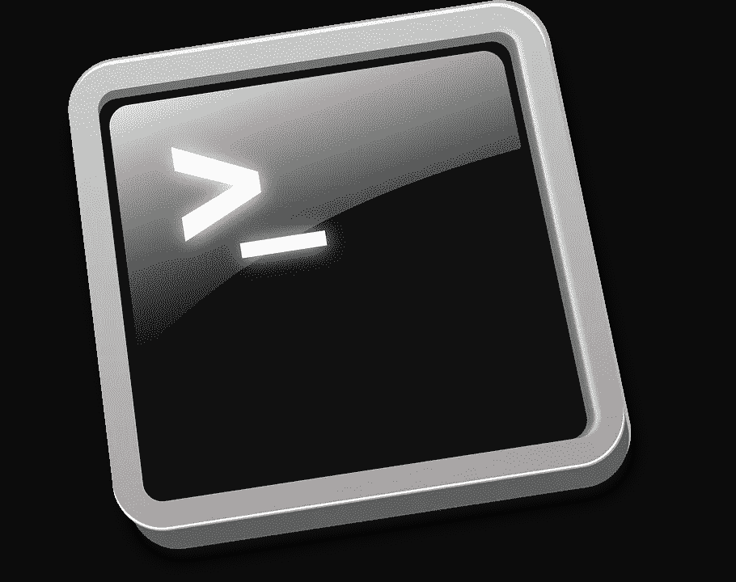
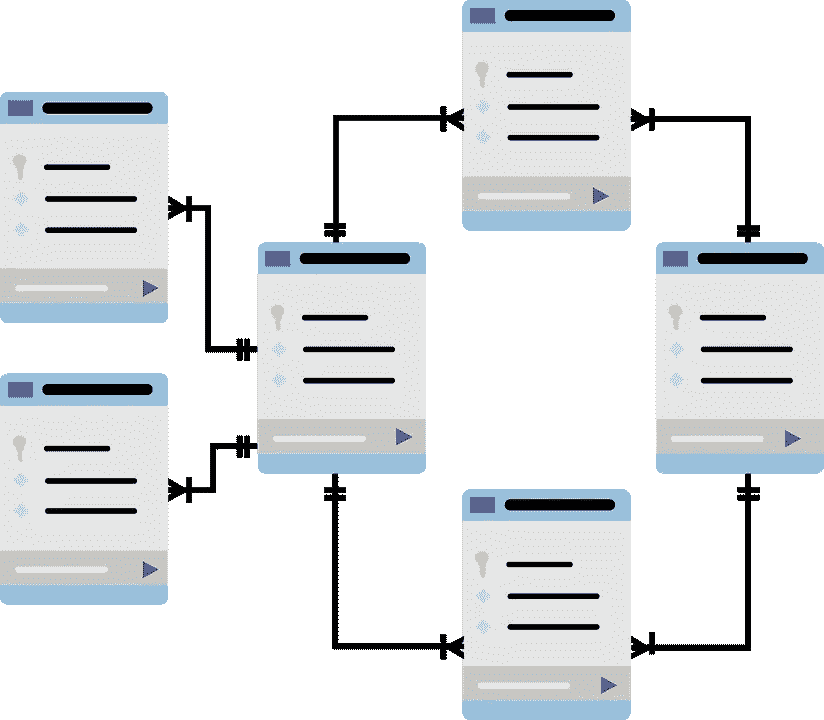

# 分析/数据科学学员实验室工具和技术

> 原文：<https://towardsdatascience.com/analytics-data-science-learner-lab-tools-and-tech-b41040de0f6b?source=collection_archive---------77----------------------->

## 您在数据科学学习之旅中应该了解的工具和技术

照片由 [holdentrils](https://pixabay.com/users/holdentrils-297699/) 在 [pixabay](https://pixabay.com/) 拍摄

每个人都想成为数据科学家。互联网上有大量的学习资源。每件好事都有副作用。当我遇到那些自称为数据科学家的数据从业者时，我并不感到惊讶。纠结于基础研究方法论或者概率概念。但那是另一天的话题。今天，我们将讨论您应该知道什么，以及在开始学习数据科学或分析时可能需要使用哪些工具。最后，您还会发现一些关于设置实验室的工具的建议。

# 1.计算机和互联网连接

由[安德里亚·b·卢卡奇](https://pixabay.com/users/blukacsandrea-4165074/)在 [pixabay](https://pixabay.com/) 拍摄的照片

任何想要踏上分析或数据科学之旅的人，他们首先需要的是一台运行良好、网速适中的电脑。该机可以是笔记本，台式机，甚至花式 2in1 平板电脑也行。有人提到 iPad/Android 平板了吗？如果你有覆盆子酱，你也可以从这个开始。这里的重点是，你不需要那些高配置的工作站或疯狂的计算与花哨的 RGB 灯光游戏装备。好吧！如果你想玩所有新的 AAA 评级游戏，你需要最新一代的英伟达 GTX 或 RTX GPU 和无尽的核心(！)处理器拥有大量内存(RAM)，当然还有超高速存储(硬盘)。是的，数据科学家在某些时候也需要这些，但不是一开始就需要。让我们一致认为，一台可以正常上网的电脑足以让我们开始学习。哦，是的，我们需要互联网来下载我们将用来学习的所有工具(一切都是免费或开源的)。

因此，无论你打算用什么系统来学习，强烈建议你好好了解你的机器。请不要成为那种仅仅因为笔记本电脑和他的手机有相同的发光标志而购买笔记本电脑的人。赛前了解马匹尤为重要。尤其是不管是 x86 还是 x64 还是 ARM 架构。如果您还不知道它，请转到您的系统属性并检查它。把它记下来。当我们下载学习旅程所需的软件时，它会派上用场。如果你想了解更多关于这些平台之间的区别，你可以在维基百科上找到关于这些平台的详细文章。接下来我们需要知道我们的系统有多少内存。这些信息也可以在系统属性中找到，当然你需要了解你有多少空闲空间。我们将安装软件并带来样本数据。所以，你需要非常熟悉储物单元。感谢智能手机制造商，现在就连奶奶也知道她需要一部 5tb 的手机，因为她想用 4800 万像素的超宽手机摄像头给所有的孙子孙女拍很多照片。总之，您始终需要了解处理器架构及其速度、总内存和机器的可用空间，以便有效地设置整个学习实验室环境。

# 2.操作系统和用户帐户类型

现在，您已经了解了机器的主要硬件。在开始讨论我们将使用哪些工具之前，让我们熟悉另一个关键部分。

照片由[openclipbart-Vectors](https://pixabay.com/users/openclipart-vectors-30363/)在 [pixabay](https://pixabay.com/) 上拍摄

操作系统有很多种形式。当今世界上最流行的操作系统是 Android。10 台设备中有 4 台采用安卓系统。我们可以在 Android 中进行分析吗？为什么不呢？它并不意味着像 Windows 或 OS X 或 Linux 那样的桌面计算。它日益成熟。多窗口操作和越来越多的编码环境的支持，它是非常能干的。因此，如果你拥有一部高端智能手机或平板电脑，你也可以用这款设备开始你的数据科学之旅。如果你有一台 iPad，你也可以在你的 iPad 操作系统中进行类似的编码和分析。您不需要等待笔记本电脑或台式机。在我们的例子中，最有效的操作系统将是这三个微软视窗系统、苹果 OS X 系统或任何版本的 Linux。以 Linux 为例，我最喜欢的是 Ubuntu。一旦你知道你正在运行哪个操作系统，现在你需要知道它的变体是什么——32 位还是 64 位，是哪个版本？

一旦你熟悉了所有这些术语，接下来就是故事的下一部分——你在机器上使用的是什么类型的用户账户。如果您与任何人共享设备，或者这是由您的办公室或学校提供的，那么了解您的帐户类型尤为重要。如果没有正确的权限或帐户类型，您可能无法安装或配置自己需要的所有工具。在安装或设置所有工具时，最好拥有管理员或高级用户权限。一旦一切都启动并运行，那么常规用户帐户将是极好的。当您想要更新/升级工具时，您还需要特殊权限。

# 3.文字编辑器

其他操作系统都有默认的文本编辑器。你日常用的 windows 机器有经典的记事本应用，Mac OS 自带文本编辑。大多数 Linux 发行版都预装了 vi 或 vim。这些都是很有能力的编辑器，可以打开、浏览数据和编写代码。由于编码人员非常依赖他们的编辑器，他们也为他们构建了编辑器。如果你每隔一天谷歌一下，你不会惊讶地发现一个新的编辑。每个作家、程序员和开发人员都有一套最喜欢的工具，就像每个木匠都有一把最喜欢的锤子，每个艺术家都有一套最喜欢的画笔。有些编辑器在所有操作系统中都可用。有些是付费的，有些是免费或开源的。Atom，Sublime Text，Notepad++是目前流行的文本编辑器中为数不多的几个。

使用文本编辑器非常简单。开始时，只需打开一个新文件，写入并以所需的文件扩展名保存。在大多数情况下，如果你不给出任何扩展名，你的编辑器将把它保存为一个普通的。txt 文件。一旦你开始每天使用它，你就会找到有效处理它的方法。像使用一些键盘快捷键会非常方便。你就越会使用它；您将开始熟悉附加组件、宏和其他功能。我们将在后面详细讨论文本编辑器。在这种情况下，我们将在所有示例中使用 Notepad++。

# 4.基本 CLI

照片由[openclipbart-Vectors](https://pixabay.com/users/openclipart-vectors-30363/)在 [pixabay](https://pixabay.com/) 上拍摄

自第一代 iPhone 问世以来，世界已经发生了变化。一切不仅好到足以基于 GUI。它需要进行触摸优化。但是世界的这一部分还不是 100%真实的。对于初学者来说，您仍然需要掌握一些基本的文件管理 CLI 技能。像创建一个新的文件夹/文件或复制，粘贴，删除一个文件夹/文件，更重要的是，要知道当前的工作目录或改变目录，最后如何使用帮助文件。对于初学者来说，这已经足够好了。使用命令行一开始可能会很吓人，但是用得越多，就越不吓人。一旦你采用了它，你就掌握了！CLI 等待您的命令。我们将讨论与学习者数据专家相关的最常见的 CLI 命令。

# 5.基于 GUI 的工具

每隔一段时间，奇迹就会在每个领域发生，对于所有的数据专业人员来说，Microsoft Excel 就像是来自地球上天堂的祝福。很难找到一个和数据打交道的人，而且从来没有碰到过微软的 Excel。从数据分析的初学者到大师，每个人，如果不是经常，偶尔会使用这个工具。年复一年，情况越来越好。数据清理、可视化、基本统计建模或高级探索性数据分析一切皆有可能。一旦你开始使用 add on 或者开始构建你的宏，可能性是无限的。你可以不同意将 Microsoft Excel 视为一个合适的分析工具，但它拥有完成大多数分析步骤所需的所有功能。

SAS 和 IBM SPSS 在过去是非常流行和有影响力的分析工具。它们仍然很出色，可以很好地解决大多数高级分析或预测建模问题。当您想将这些工具用于所有现代大(！)高度可扩展的生态系统。在这种情况下，Knime 和 Rapid Miner 做得非常好。您可以从今天开始学习这些工具，但是学习曲线会非常平滑。但是并不是所有的商业组织都有能力使用所有这些工具。这些工具最棒的地方在于，你可以在所有这些工具中使用你最喜欢的 python 或 R 语言。如果不提 H2o、Dataiku、DataRobot、Orange、Alteryx，这些列表就不完整。

# 6.程序设计语言

约翰逊·马丁在 [pixabay](https://pixabay.com/) 上的照片

我们有微软 Excel 和一个基于图形用户界面的工具。我需要学习编码吗？是也不是。如果你在一个大型团队中工作，并且你的团队中有人可以通过编码快速完成工作，而这对于架子工具是不可用的，你可以从他们那里获得帮助。不过，最好还是学习必要的编码，这样沟通才能顺畅，你也会明白他们在实现你的要求时可能面临的挑战。重点是现在；市场上没有任何工具可以开箱即用，100%解决您的数据分析问题。这将需要一些特定于行业或问题的自定义功能。在这些情况下，编码是必不可少的。

现在我们一致认为，我们需要学习一种编程语言，以便在分析的世界中导航。那么问题就是哪种语言。让我们不要卷入这场辩论；相反，我们可以选择 Python 或 r。这两种语言都能够做类似的事情。你甚至可以学习 Java 或者 Julia。哪种语言都无所谓。一旦你熟悉了一个，切换到另一个就不会花太多时间，而且总有 google 和 StackOverflow 帮助你。但是最好从拥有最大社区的语言开始。最大的社区意味着大量的教程、例子和论坛。您还可以找到许多示例项目来跟进。

# 7.结构化查询语言

照片由[麦克默里朱莉](https://pixabay.com/users/mcmurryjulie-2375405/)在 [pixabay](https://pixabay.com/) 上拍摄

并非所有数据都能放入 Excel 电子表格。Excel 是一个很棒的工具，毫无疑问。但是你需要把你的数据存储在一个便于组织和快速访问的地方。这是一个非常拥挤的领域——针对不同类型的数据库有大量的解决方案。但是如果你熟记标准的 SQL，你可以在帮助文件或谷歌的帮助下使用任何解决方案。要么是 Microsft SQL Server 要么是 Oracle 要么是 Impala 要么是 Google Big Query 作为数据专业人士 SQL 应该是你的第二语言。数据库和 SQL 的概念可以帮助您通过 python 或 R 进行数据准备，即使您不在任何数据库之上工作。

# 8.多方面的

你就快到了。现在你知道了你的硬件和所需的软件。为了以后的效率，你需要更多的工具，比如版本控制，调度器；您需要熟悉文件压缩技术，当然，还有现代基于云的工具和技术。一旦你习惯了数据专家的生活方式，你就可以学到这些，这种生活方式只对合适的人有吸引力。

# 2020 年中期推荐的实验室工具和技术

**电脑- >** CPU:酷睿 i5 或 AMD 锐龙 5 级，RAM: 16GB，HDD: 1TB SSD

**操作系统->**Ubuntu LTS 64 位或 Windows 10 64 位带 WSL Ubuntu LTS

**文本编辑器->-**记事本++本

**GUI 工具- >** Knime &微软 Excel

**编程语言- >** Python 3 Anaconda 发行版

**SQL - >** MySQL