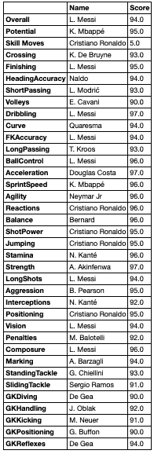
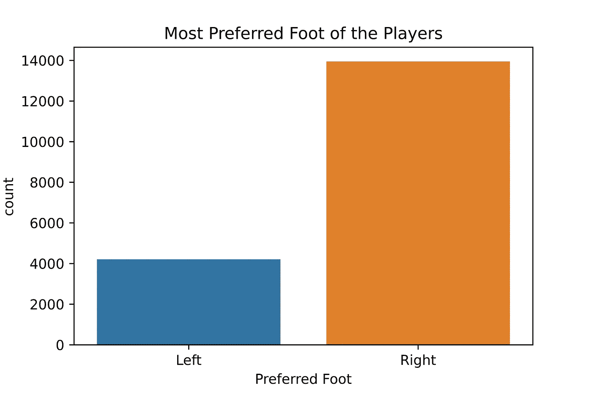
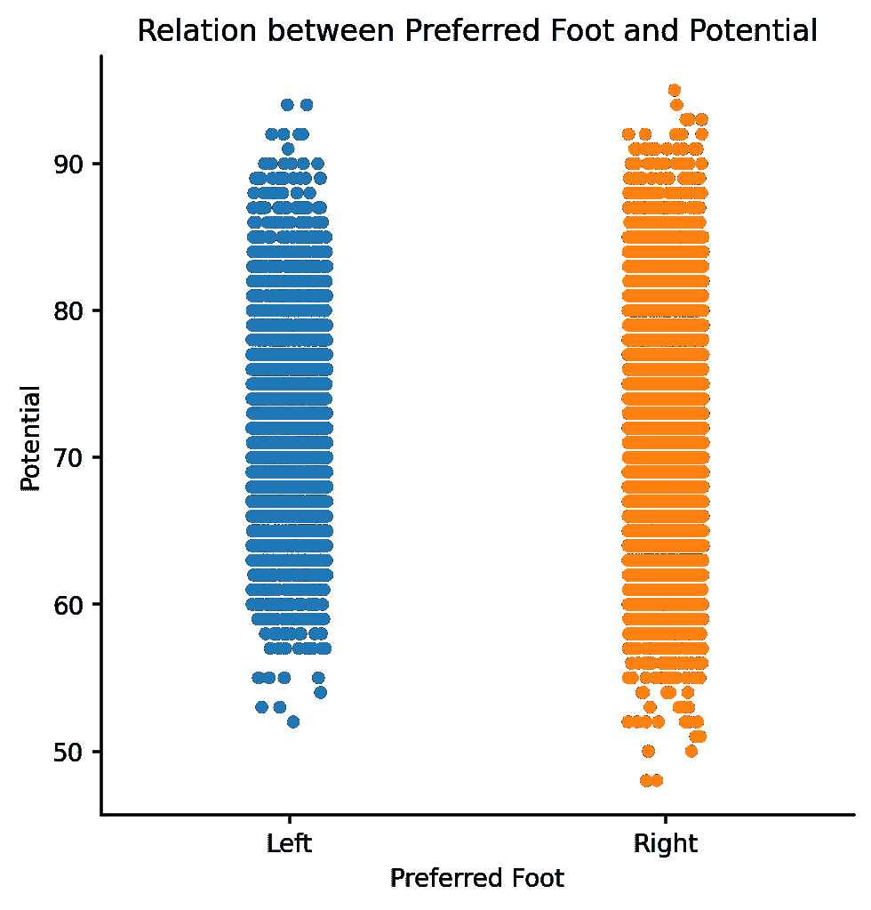
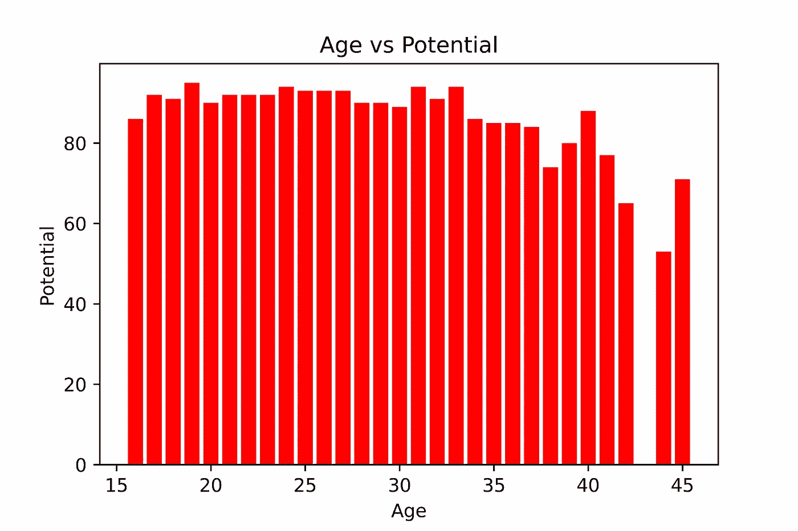
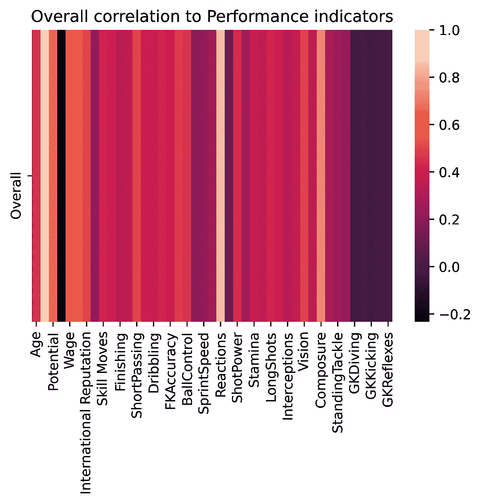
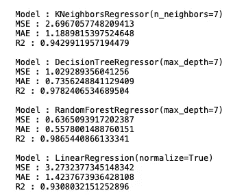

# FIFA 2019 球员分析！

> 原文：<https://towardsdatascience.com/analytics-on-fifa-2019-players-b63747958d79?source=collection_archive---------59----------------------->


康纳·科因在 [Unsplash](https://unsplash.com?utm_source=medium&utm_medium=referral) 上的照片

## CRISP-DM 数据科学足球赛

## 国际足联的足球分析和建模

在本帖中，我们将按照 CRISP-DM 流程对 FIFA 2019 完整球员数据集进行简单的数据分析和建模。数据集已经收集完毕 [Kaggle](https://www.kaggle.com/karangadiya/fifa19) 。数据集包含 1 个 CSV 文件。

> FIFA 2019 是作为电子艺界的 *FIFA* 系列的一部分开发的足球模拟视频游戏。这是 FIFA 系列的第 26 部，销量超过 2000 万部。

让我们开始吧！

在足球这样的运动中，每个球员都为团队的成功增加了重要的价值。了解球员的技能很重要。年龄如何影响球员的潜力？哪个玩家最擅长哪个侧面？该研究还侧重于根据表现指标评估球员的整体表现，以及各种模型如何对准备好的数据进行评估。

# **数据理解**

作为 CRISP DM 的第二阶段，使用数据可视化和查询来探索数据和解决数据挖掘问题是很重要的。数据集由 89 列组成，但我们将只限于以下几列:

```
Index(['Name', 'Age', 'Overall', 'Potential', 'Value', 'Wage', 'Special',
       'Preferred Foot', 'International Reputation', 'Weak Foot',
       'Skill Moves', 'Crossing', 'Finishing', 'HeadingAccuracy',
       'ShortPassing', 'Volleys', 'Dribbling', 'Curve', 'FKAccuracy',
       'LongPassing', 'BallControl', 'Acceleration', 'SprintSpeed', 'Agility',
       'Reactions', 'Balance', 'ShotPower', 'Jumping', 'Stamina', 'Strength',
       'LongShots', 'Aggression', 'Interceptions', 'Positioning', 'Vision',
       'Penalties', 'Composure', 'Marking', 'StandingTackle', 'SlidingTackle',
       'GKDiving', 'GKHandling', 'GKKicking', 'GKPositioning', 'GKReflexes'],
      dtype='object')
```

1.  **各方面最好的选手？**

可以看出，以下选手在各自领域被评为最佳。可以看出，K. Mbappé潜力最大，c 罗技术动作最好，内多头球准确性最高等。



图 1:基于表现得分的最佳球员

**2。球员最喜欢的脚？**



图 2:球员最喜欢的脚

**3。足球脚对球员潜力的影响**



图 3:脚对球员潜力的影响

从上面的图中可以看出，球员的潜力几乎不取决于他是左脚还是右脚。

**3。年龄对潜力有影响吗？**



图 4:年龄与潜力

从柱状图中可以看出，随着年龄的增长，球员的潜力有下降的趋势。

# 建模

## 表现指标是属性的组合，给出了选择的细节，球员的整体表现。热图用于发现绩效指标如何影响玩家的整体绩效。



图 3:整体与其他绩效指标的相关性

从热图中可以看出，总体绩效与大多数绩效指标正相关。

CRISP-DM 的第三阶段是数据准备。对数据进行清理(处理分类数据和缺失值以预测整体性能)并为实现结果做好准备。建立线性回归模型，根据表现得分预测选手的整体表现。

# 估价

此外，我们将数据拟合到各种模型中——随机森林回归、K 近邻和决策树回归，并使用以下指标评估模型:

1.  绝对平均误差
2.  r 广场
3.  均方误差



图 5:各种模型的评估

# **结论**

在本文中，我们对 FIFA 2019 完整球员数据集进行了简单的数据分析。

1.  我们观察了哪个玩家擅长某个特定的性能指标。比如:l .梅西最擅长整理。
2.  然后，我们研究了年龄对球员潜力的影响，即随着年龄的增长，球员的潜力下降。
3.  建立一个模型来预测一个球员的整体表现，给出他在每个表现指标上的技能得分。
4.  最后，我们针对 KNearestRegressor、DecisionTreeRegressor、RandomForestRegressor 评估了我们的线性回归模型

这里的发现是观察性的，还有很多分析要做:

> 你将如何解决这个问题？

所有代码都在我的 [**Github 资源库**](https://github.com/dhanushkr/Simple-Analysis-On-FIFA-19) 中。