# 用谷歌日历和熊猫分析和跟踪自由职业者的收入

> 原文：<https://towardsdatascience.com/analyze-and-track-freelance-revenue-with-google-calendar-and-pandas-3ac7b01ea32a?source=collection_archive---------24----------------------->

## 将日历数据引入 Pandas，实现自由职业者收入跟踪任务的自动化。

# 介绍

作为一个住在西班牙的异乡人，我的收入来源之一是给私人上英语课。2016 年开始的时候，我在一个简单的 Google Sheets 文档中手工输入了所有的私有类。我的目标是跟踪工作时间和收入，并分析我的新职业的趋势和见解。

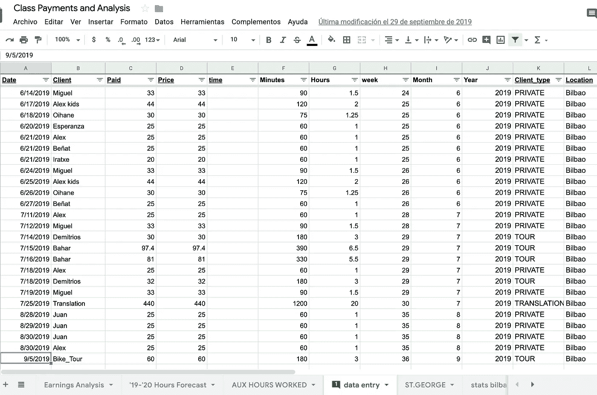

# 问题是

电子表格需要手工输入类别；日期，长度，学生姓名和收入。手动更新文档花了大约 5 分钟，我喜欢每周回顾我的时间表，反思所上的课和获得的收入。然而，记住每周做一次开始变得有点乏味，几年后，有了多种收入来源，电子表格膨胀成一个不稳定的庞然大物，有过多的选项卡、数据透视表和各种原始数据来源。是时候自动化解决方案了。

# 解决方案

我的生活和工作日程由谷歌日历管理——这包括我所有的私人课程、自行车/摄影之旅、学术工作、政府职位、翻译工作和随机的自由职业。每一个有偿工作的“单位”都在日历中；我只需要找到一种方法来直接访问谷歌日历数据，并将我的电子表格重建成一台可持续的分析机器。在我以前的公司生活中，我专门在 Pandas 笔记本(用于分析数据的 Python 框架)的世界中工作，因此利用这些工具从 Google Calendar 访问我的课程表并利用 Pandas 处理和分析收入数据是一个自然的解决方案。

# 第一步:在谷歌日历和熊猫世界之间架起一座桥梁

我偶然发现了一篇很棒的文章，它解决了我的问题。使用 Google Calendar API，我可以轻松地获取我的日历事件(使用特定的“英语类”日历)并将其转换成易于分析的形式。我建议查看这篇博文，逐步了解如何使用您的帐户设置 Google Calendar API 并创建 OAuth 客户端 ID。

下一步是执行代码，该代码将生成一个 URL，该 URL 需要 google 登录和授权，以使应用程序能够访问我们的日历事件。将生成一个授权码，我们需要将它粘贴回我们的熊猫笔记本。注意:“your_calendar_id”是我想要查看的特定日历(Google 提供了创建多个日历的选项)。

(以下所有代码也可在 [GitHub repo](https://github.com/datachico/G_Cal_Events_to_Pandas/blob/master/Access_Google_Calendar_Events.ipynb) 上获得)。

```
*#read calendar events from google*
*#requirement: pip install --upgrade google-api-python-client google-auth-httplib2 google-auth-oauthlib*

**from** **apiclient.discovery** **import** build
**from** **google_auth_oauthlib.flow** **import** InstalledAppFlow
**import** **pickle**

scopes = ['https://www.googleapis.com/auth/calendar']
flow = InstalledAppFlow.from_client_secrets_file("client_secret.json", scopes=scopes)
credentials = flow.run_console()

*#save credentials*
pickle.dump(credentials, open("token.pkl", "wb")) 
credentials = pickle.load(open("token.pkl", "rb"))

service = build('calendar', 'v3', credentials=credentials)
result = service.calendarList().list().execute()

*#specify desired calendar to access*
your_calendar_id = 'YOUR_CALENDAR_ID'
```

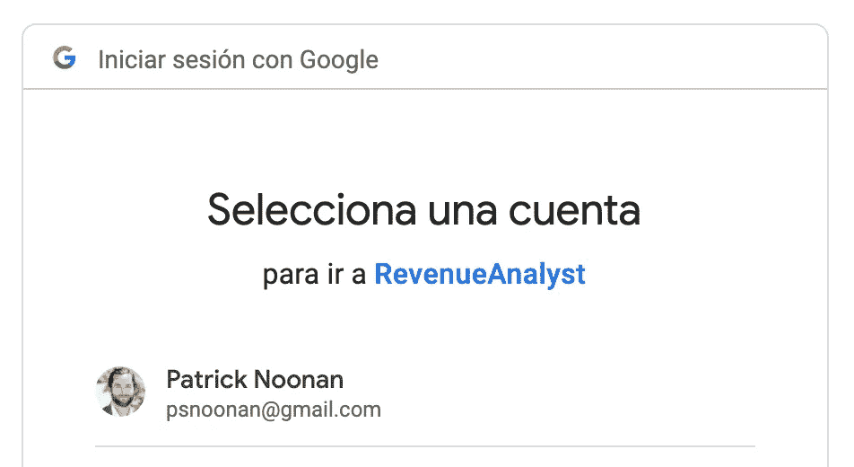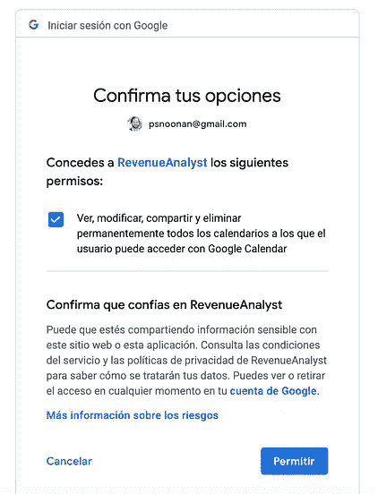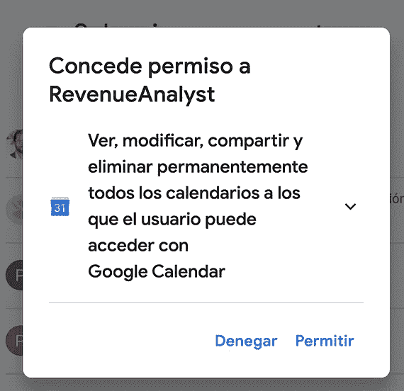

登录我们的帐户(我们已经为其创建了一个日历 API 项目),并授予我们的应用程序访问日历的权限。

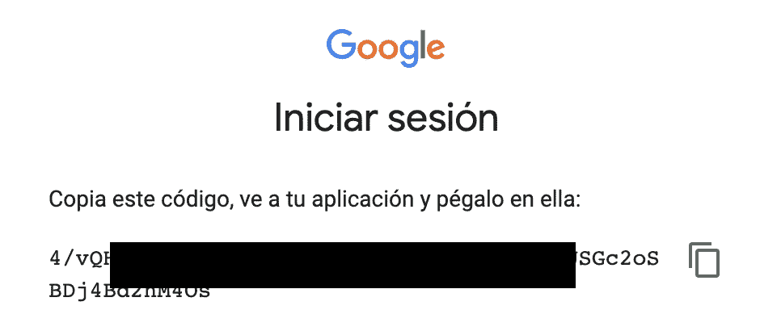

在点击各个确认框后，会生成一个授权码，我们需要将它粘贴回笔记本中。我们现在可以从我们的熊猫笔记本上直接访问您的谷歌日历。

# 第二步:在谷歌日历中访问所需的数据，并转换成熊猫数据框架

好了，现在我们有了谷歌日历和熊猫之间的链接——下一步是正确地获取数据并将其转换成可用的形式。

我们可以使用“service.events()直接访问事件。列表()。execute()"调用，如下面的代码所示——参考[日历 API 文档](https://developers.google.com/calendar/v3/reference/events),以便根据我们的需求进行定制是很有帮助的。

我决定过滤日历中从我开始从事自由职业到未来一年的日期(以便正确跟踪预定时间和工作时间)。

```
*# Call the Calendar API*
**from** **datetime** **import** datetime
**from** **datetime** **import** timedelta
**from** **dateutil.parser** **import** parse **as** parse_date
**import** **pytz**utc=pytz.UTC

*#specify max date of calendar events you would like to access (days in future)*
days_in_future = 365

now = datetime.utcnow()
date_final = (datetime.utcnow() +  timedelta(days=days_in_future)).isoformat() + 'Z'

*#start_date - earliest date of calendar events needed*
start_date_str = '09/01/19'
start_date = datetime.strptime(start_date_str, '%m/**%d**/%y').isoformat() + 'Z'

events_result = service.events().list(calendarId=your_calendar_id, 
                                    timeMin=start_date, 
                                    timeMax=date_final,
                                    maxResults=1000,
                                    singleEvents=**True**,
                                    orderBy='startTime').execute()
events = events_result.get('items', [])
```

我们现在有一个很好的字典列表，每个字典代表一个特定的日历事件，对应于一个特定的自由职业者事件，并包含重要的数据，如开始/结束时间和事件的描述。

让我们遍历字典列表，以便解析出有用的信息，并转换成一个整洁的字典列表，很好地放入 Pandas 数据框架。我决定获取活动的开始/结束日期、持续时间，并做一点逻辑分析，看看活动是仅仅被预订了还是已经完成/支付了。结果被保存到 pandas 数据框架中，以备进一步处理和分析。

```
event_list = list()
**for** event **in** events:
    start = parse_date(event['start'].get('dateTime'))
    end = parse_date(event['end'].get('dateTime'))
    event_duration = end - start
    event_duration_minutes = event_duration.seconds // 60
    **if** end < utc.localize(now):
        status = 'PAID'
    **else**:
        status = 'BOOKED'
    cal_entry_dict={'date': start.strftime('%Y-%m-**%d**'), 
                    'client': event['summary'], 
                    'minutes':event_duration_minutes,
                   'status' : status}
    event_list.append(cal_entry_dict)

*#Convert to Pandas Dataframe*
classes_df = pd.DataFrame(event_list)
```

生成的数据帧如下所示:

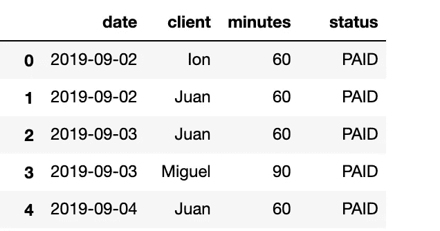

让我们施展一些熊猫魔法，引入价格、位置和一些其他数据点，以便正确地开始分析数据。

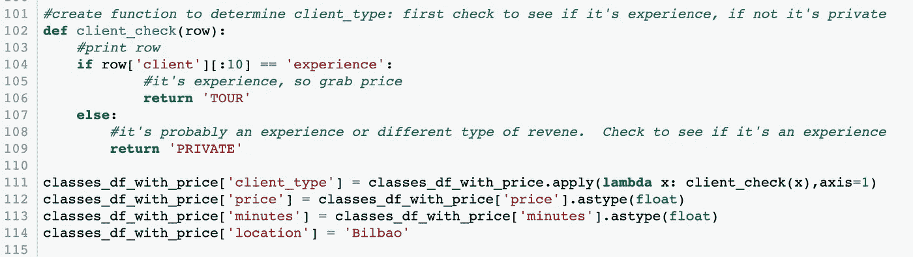

使用一点逻辑将定价数据与主数据框架连接起来，以根据活动的长度确定收入。此外，解析我们的“旅游”日历事件，这些事件应该与类区别对待。

产生的数据框架给我的信息与我的手动电子表格完全相同；我们的电子表格的数据输入部分已经自动化了！我们努力工作的结果:

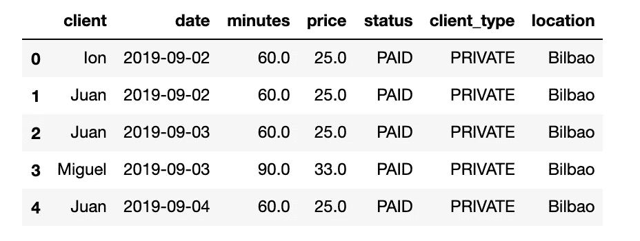

# 第三步:分析数据

好戏开始了！我们将整理这些数据，以获得一些一般性的见解。

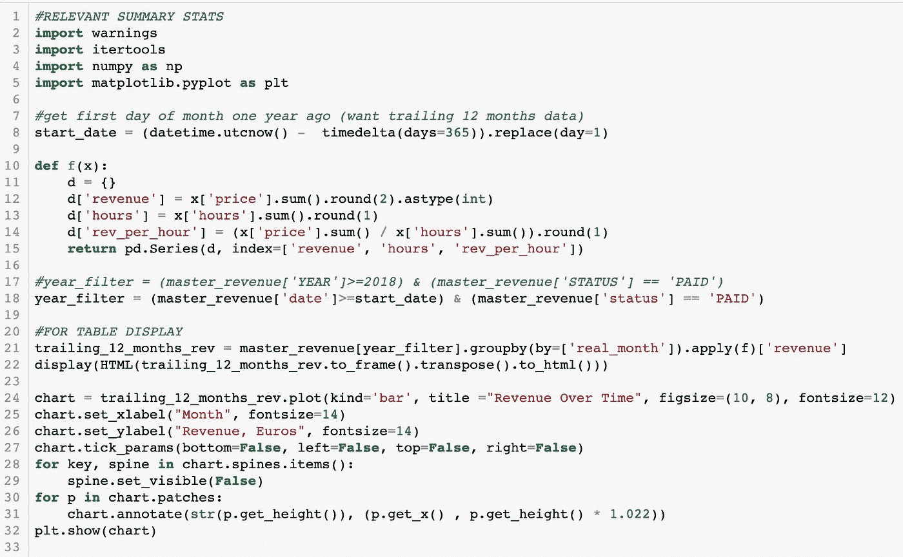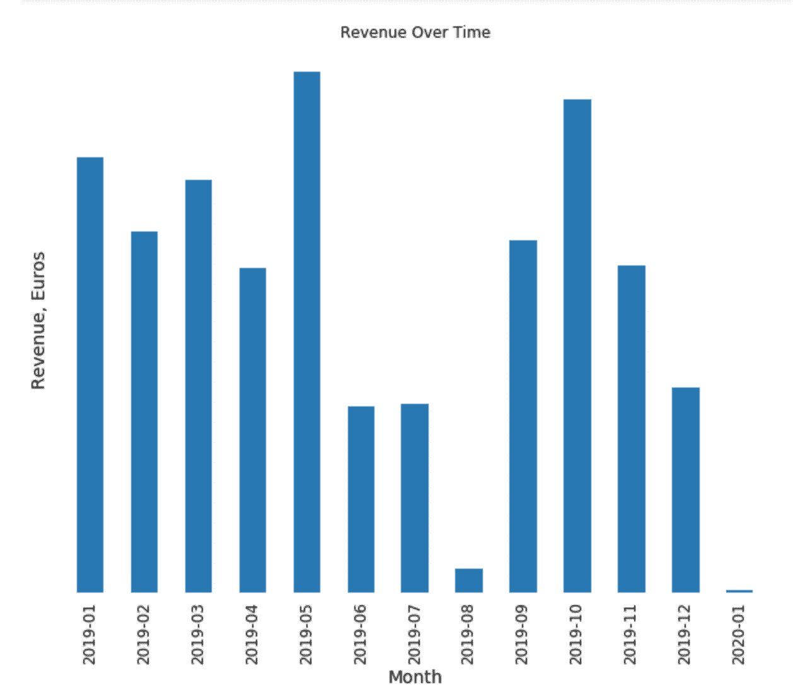

显然，这里有一些季节性趋势，因为我们看到夏季收入大幅下降。让我们引入更多的历史数据，看看这种趋势能否持续。

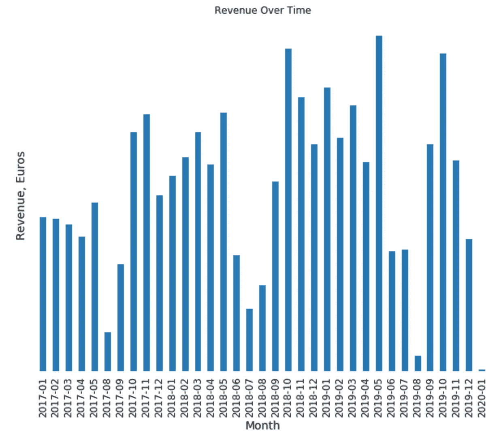

我们看到了一些严重的收入季节性趋势。夏季的几个月里收入大幅下降——天气晴朗的时候，没人想学英语！

让我们从另一个角度来看这个问题:每年作为一条线，x 轴仅仅是月——这将有助于我们直观地看到随着月份的推移，每年的轨迹。

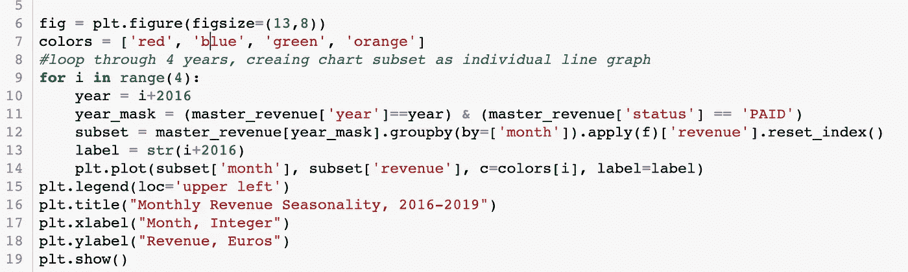

明显的季节性:

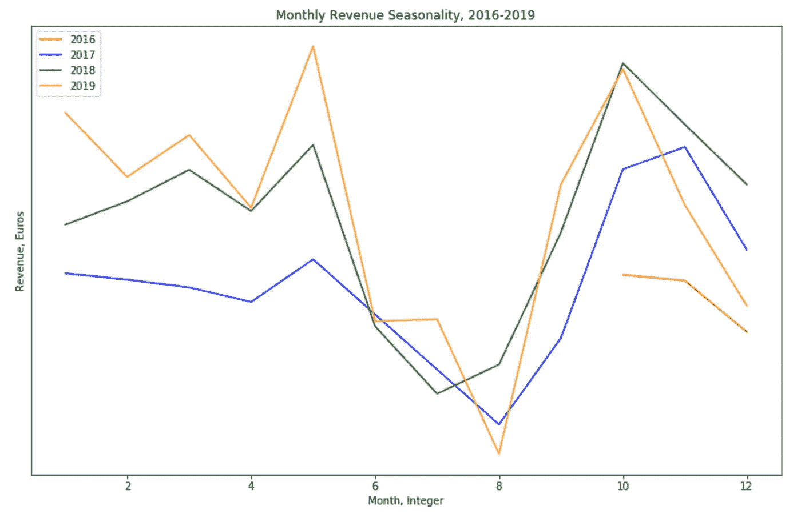

这些图表显示了总收入，但缺乏任何关于收入来源的信息(私人课程、政府工作、自行车旅游、翻译等)。让我们调整代码以显示“client_type ”,这样我们可以更好地了解收入来自哪里。

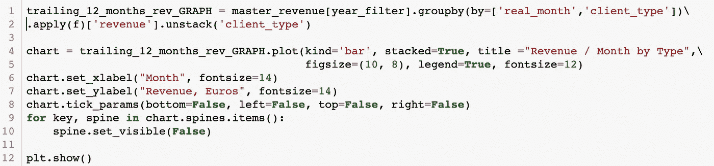

结果显示了收入的良好多样化:

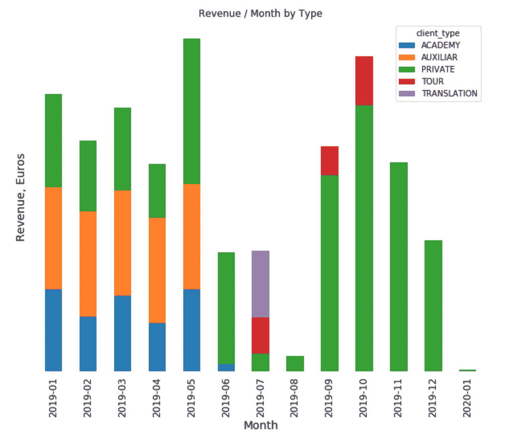

我们应该展望未来，我们对未来的收入有什么样的预订？(所有被定义为“有偿”的工作都被视为已完成/有偿工作，所有被“预订”的工作都是对未来工作和报酬的承诺。

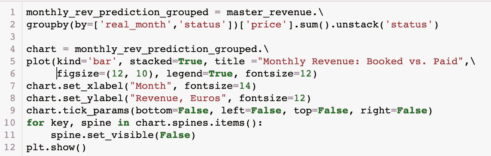

我们将看到 2020 年的收入大幅下降！是时候开始预订了。

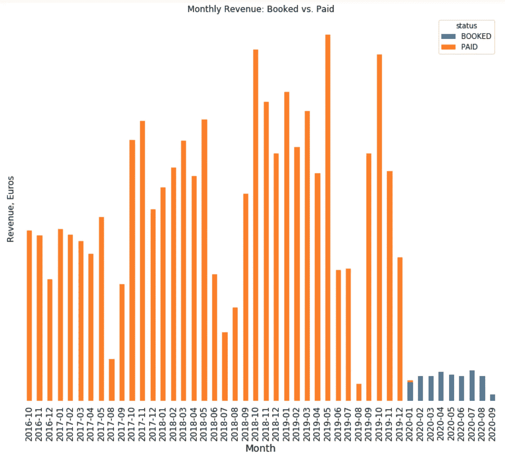

一年前的这个月，我在同一时间点做得怎么样？两年前？这里有一个漂亮的图表，显示了本月迄今为止的收入(当月)逐年减少的情况。我的想法是看看我目前的收入与前几年相比如何。

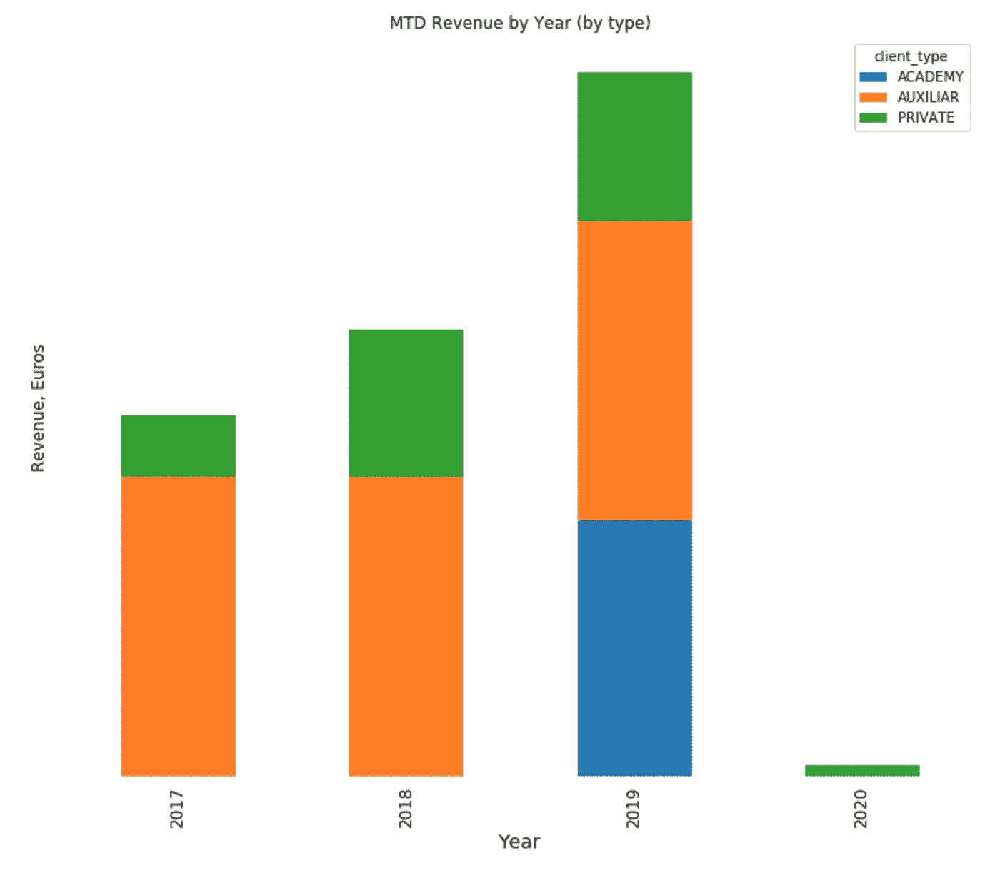

(由于各种新项目，2020 年将是收入增长缓慢但个人成长迅速的一年！)

这些是我用来洞察收入活动的一些基本图表。可能性是无穷无尽的；任何阅读这篇文章的人都可以很容易地定制他们的代码来满足他们的需求。

# 最后的想法

自动化解决方案已被证明是一个更加强大、自动化和有效的解决方案，让我能够洞察我的收入。Pandas 是一个快速和强大的操纵/可视化数据的极好资源。我鼓励任何在电子表格中跟踪收入(并使用谷歌日历)的人开始利用熊猫来达到同样的结果。这里有一些有用的资源可以让熊猫笔记本正常运行:

*   [Dataquest Jupyter 笔记本教程](https://www.dataquest.io/blog/jupyter-notebook-tutorial/)
*   [Jupyter 项目](https://jupyter.org/)
*   [笔记本必备快捷键](/jypyter-notebook-shortcuts-bf0101a98330)
*   谷歌“如何[在此插入您的问题]熊猫 python”并扫描相关 StackExchange 问题。