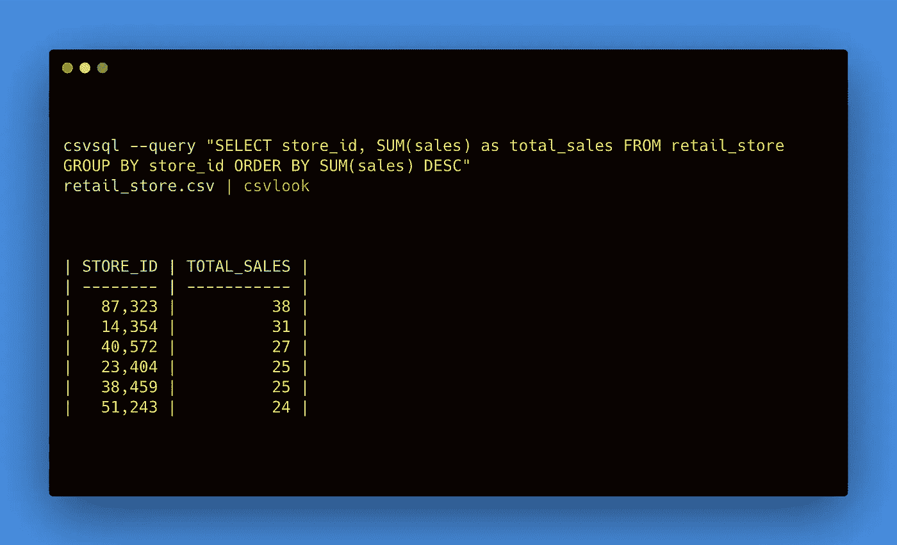
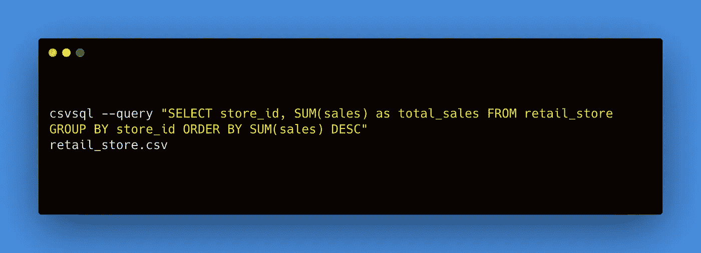
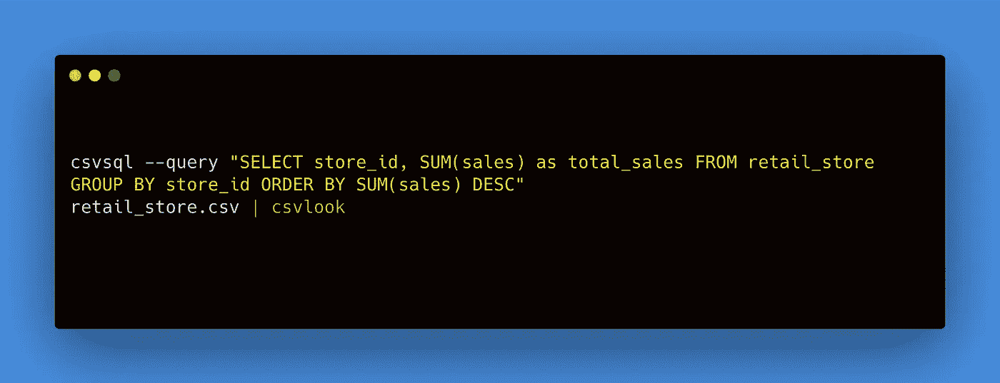
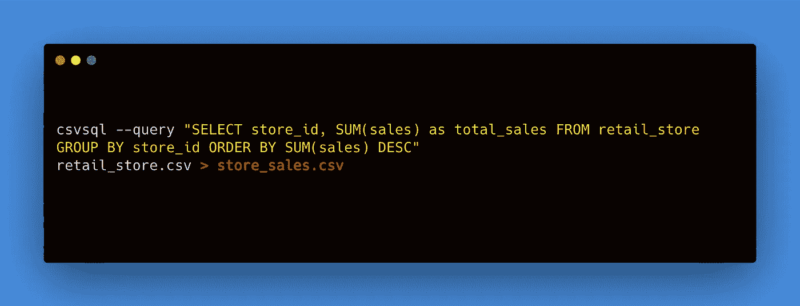

# 在命令行中使用 SQL 查询 CSV

> 原文：<https://towardsdatascience.com/analyze-csvs-with-sql-in-command-line-233202dc1241?source=collection_archive---------6----------------------->

## *通过命令行对 CSV 文件运行 SQL 的快速指南*



如果你熟悉 SQL 中的编码，你很有可能在 [PgAdmin](https://www.pgadmin.org/) 、 [MySQL](https://www.mysql.com/) 、 [BigQuery](https://cloud.google.com/bigquery) 、 [SQL Server](https://www.microsoft.com/en-us/sql-server/sql-server-2019) 等中使用它。但是有时您只想使用您的 SQL 技能对中小型数据集进行快速分析。

使用`csvkit`,您可以在命令行中对 CSV 文件运行任何 SQL。

`[csvkit](https://csvkit.readthedocs.io/en/latest/)`是一套命令行工具，用于转换和使用 CSV，表格文件格式之王。一旦你安装了`csvkit`，你就可以使用`csvsql`来运行你的 SQL 命令。

# 1.装置

如果你没有安装`csvkit`，点击 [**这里**](https://csvkit.readthedocs.io/en/0.9.1/install.html) 并按照安装说明操作，或者如果你熟悉`pip`你可以做以下操作。

```
pip install csvkit
```

您可以使用以下方式查看`csvkit`文档。

```
csvsql -h
```

# 2.句法

现在您已经设置好了，您可以按照这个简单的结构来运行您的查询。需要注意的是，SQL 查询必须用引号括起来，并且**必须**在一行中。没有换行。

```
csvsql --query "ENTER YOUR SQL QUERY HERE"
FILE_NAME.csv
```

就是这样！遵循这个基本的代码框架，你就可以开始了。

确保您与 CSV 文件位于同一个工作目录中。

# 3.例子

下面是一个设置目录并启动和运行我们的第一个 SQL 命令的例子。

## 检查目录

```
pwd
```

## 设置工作目录

确保您计划使用的文件位于同一目录中。我的 CSV 文件在`/Documents`文件夹中。

```
cd ~/Documents
```

## 运行查询

接下来，我们可以使用`csvsql`运行查询



密码


输出

## 用 csvlook 格式化查询输出

使用`| **csvlook**`管道可以改善输出的查询格式。



密码


输出

## 将查询输出保存到新的 CSV 文件中

使用带有`**>**`的重定向，您可以将查询输出发送到一个新的文件/位置。注意运行下面的代码不会输出任何东西，因为我们将输出保存到一个新文件中。新的查询将输出保存到新的 csv 文件`**store_sales.csv**`



你都准备好了！现在，您可以对 CSV 文件运行 SQL，无需通过数据库就能快速了解情况。

如果您想了解更多关于 SQL 的知识，请查看我的其他文章。

*   [SQL Cheatsheet](/sql-cheat-sheet-776f8e3189fa)
*   [SQL 中的日期/时间函数](/date-time-functions-in-sql-1885e2cbdc1a)
*   [在 SQL 中使用 CTEs】](/using-ctes-to-improve-sql-queries-dfcb04b7edf0)
*   [窗口功能介绍](/intro-to-window-functions-in-sql-23ecdc7c1ceb)