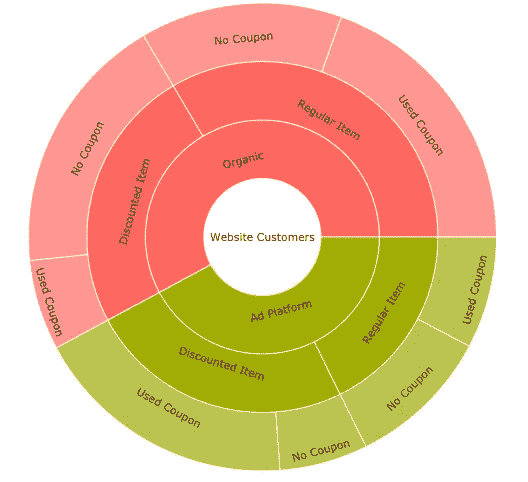
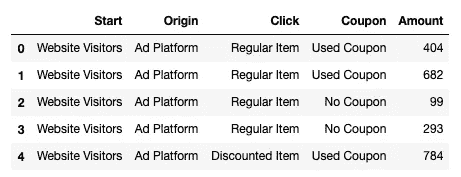
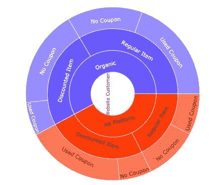
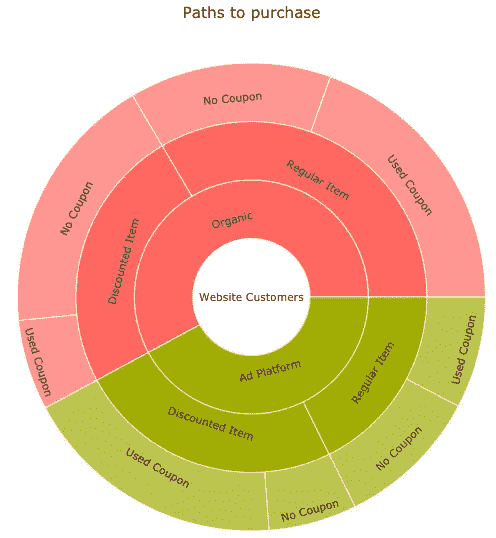
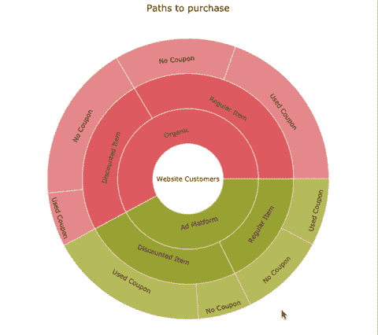

# 使用 Python、Pandas 和 Plotly 构建的旭日图以正确的方式分析客户行为

> 原文：<https://towardsdatascience.com/analyze-customer-behavior-the-right-way-using-a-sunburst-chart-built-with-python-pandas-and-plotly-a493076515c1?source=collection_archive---------38----------------------->



旭日图，有时也称为环形图、多层饼图或径向树形图( [Anychart，n.d.](https://www.anychart.com/chartopedia/chart-type/sunburst-chart/) )是可视化和理解分层或顺序数据的一种极好的方式。

旭日图有两个主要用例:

1.  理解整体的最大贡献者和这些组成部分的比例
2.  理解流程中连续步骤之间的人员流动

为了说明旭日图的用例，我将使用我生成的数据集来模拟客户在网站上完成购买的简单路径。(如果你想复制我的例子，数据集可以在[我的 Kaggle 数据集](https://www.kaggle.com/giordan/datasets)中找到)



在这个假设的用例中，我们希望了解我们的客户在我们的网站上完成购买的最常见途径是什么，并比较访问我们的客户的行为是否与通过广告平台到达的客户不同。

值得一提的是，旭日图对于时间序列或连续数据来说并不理想，但对于层次性或序列性数据来说更理想。

有了基本的方法，让我们把无聊的熊猫数据框变成一个互动的旭日图，让我们找到一些见解。

要学习本教程，您需要在当前环境中安装以下库:

*   Numpy
*   熊猫
*   Plolty

我的大部分工作都是在 Jupyter 笔记本和 Jupyter 实验室中完成的，但是您可以随意使用您喜欢的任何 IDE。请参考 [*Plotly 入门文档*](https://plotly.com/python/getting-started/) *，*尤其是如果你像我一样使用 Jupyter 工具的话。在 Jupyter 中第一次使用 Plotly 时，您必须运行几行代码，但我向您保证这并不复杂。

当您确信可以显示 Plotly 图形时，您可以通过导入上述带有常用别名的库开始，Plotly 提供了一个名为 Plotly Express 的高级 API，我们将使用它。

```
import numpy as np
import pandas as pd
import plotly.express as px
```

如果你正在使用我的数据集，并把它放在同一个工作目录中，你可以用下面的方法导入它，如果你正在使用其他数据集，请随意使用你最喜欢的方法把它作为一个熊猫数据框架。

```
df = pd.read_csv(‘path_to_purchase.csv’)
```

使用 Plotly Express 构建旭日图相当简单，尤其是从熊猫数据框架。我们必须指定的关键内容是使用 *data_frame* 参数的数据帧、使用的列以及使用 *path* 参数的它们的层次结构，以及将确定我们的 sunburst 图表中各部分的大小的列

```
fig = px.sunburst(
    data_frame = df,
    path = ['Segment', 'Customer Origin', 'First Click', 'Coupon Usage'],
    values = 'Customer Count'
)
fig.show()
```

上面的代码生成了下面的图表:



还有一些格式改进的空间，我不会深入讨论这些参数的细节，但是这些关键字清楚地表明了它们的作用，所以它们对你来说不应该是一个问题。

通过添加以下代码行，我们可以生成一个更好看的图表:

```
fig =px.sunburst(
 data_frame = df,
 path = [‘Segment’, ‘Customer Origin’, ‘First Click’, ‘Coupon Usage’],
 values = ‘Customer Count’,
 title = ‘Paths to purchase’,
 height = 700,
 template = ‘ggplot2’
)
fig.show()
```



与 Matplotlib 不同，Plotly 的一个优点是它生成的图表是交互式的。这增加了一个可用性层，可以增强您的探索性分析，并在演示时提供令人惊叹的因素。想想 Tableau 或 Power BI，但可以通过 Python 获得。

通过利用这种可视化和交互性，我们现在可以在图表中看到以下内容:

1.  大多数顾客都是有机地来到我们的网站
2.  有机到达的顾客倾向于购买更多无折扣商品，但来自平台广告的顾客更喜欢有折扣的商品
3.  最重要的是，来自广告平台并购买打折商品的顾客比其他类型的顾客更倾向于使用优惠券购物



当然，这将引发更多的问题，我们可以使用这些问题来推动进一步的分析，但旭日图使我们能够对数据进行快速探索。