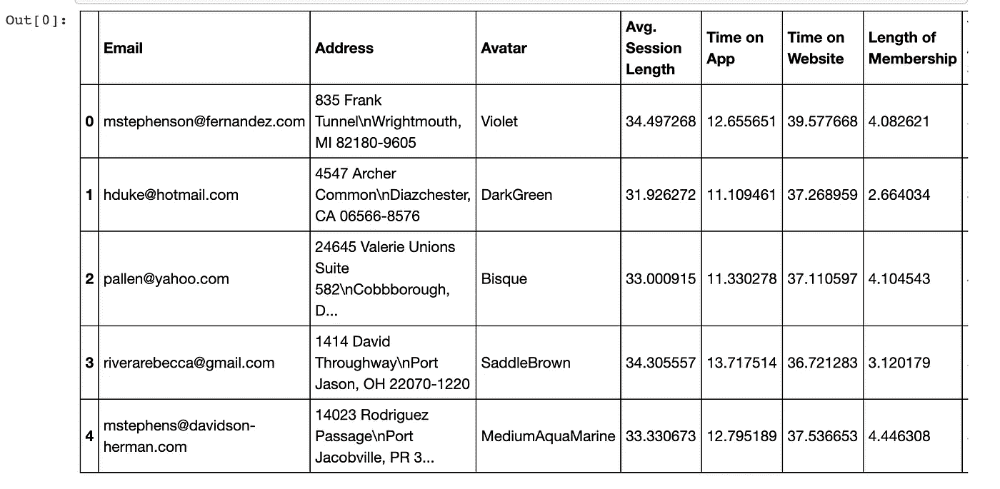
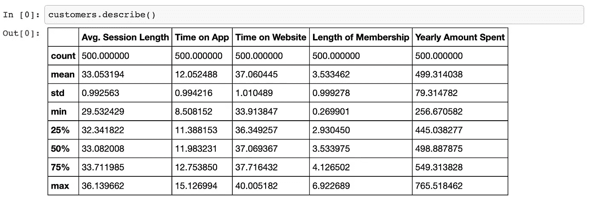
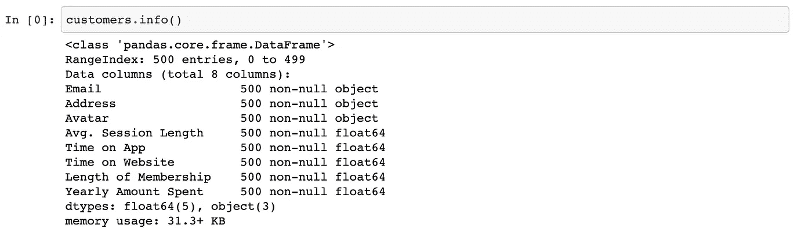
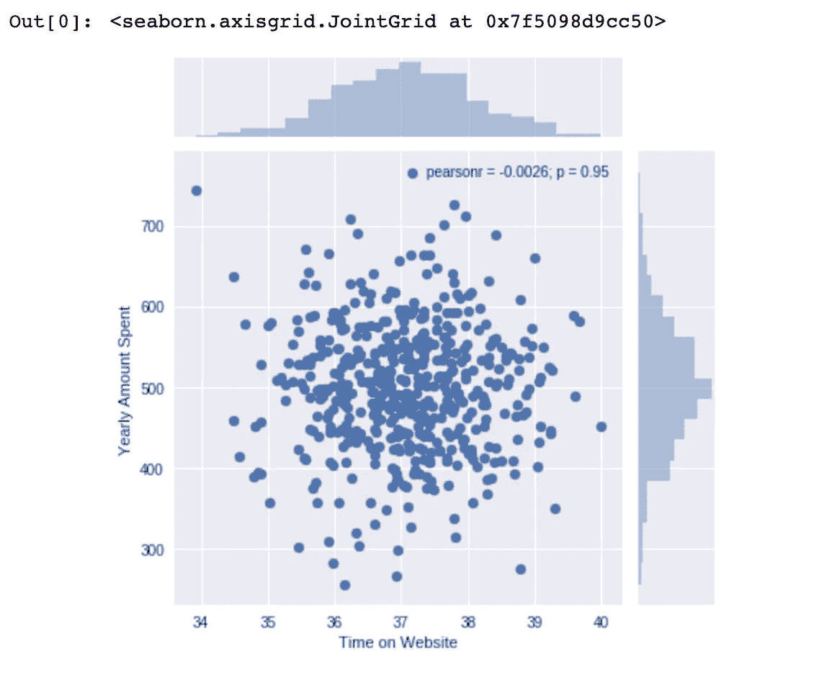
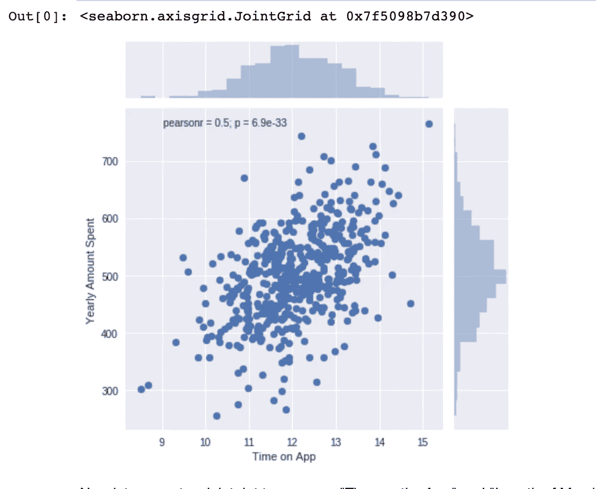
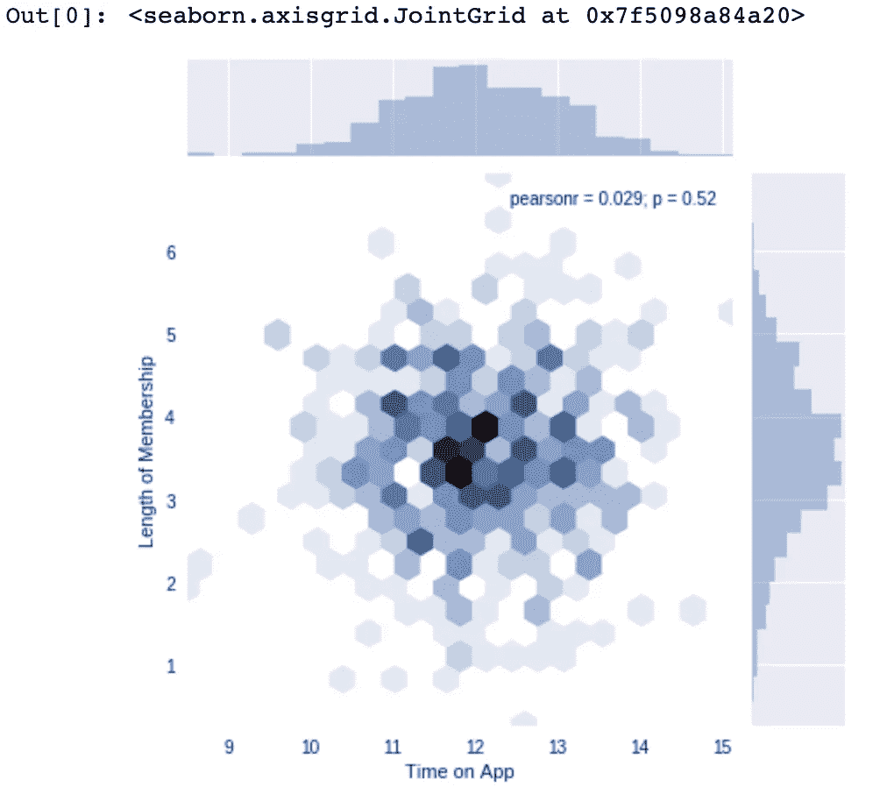
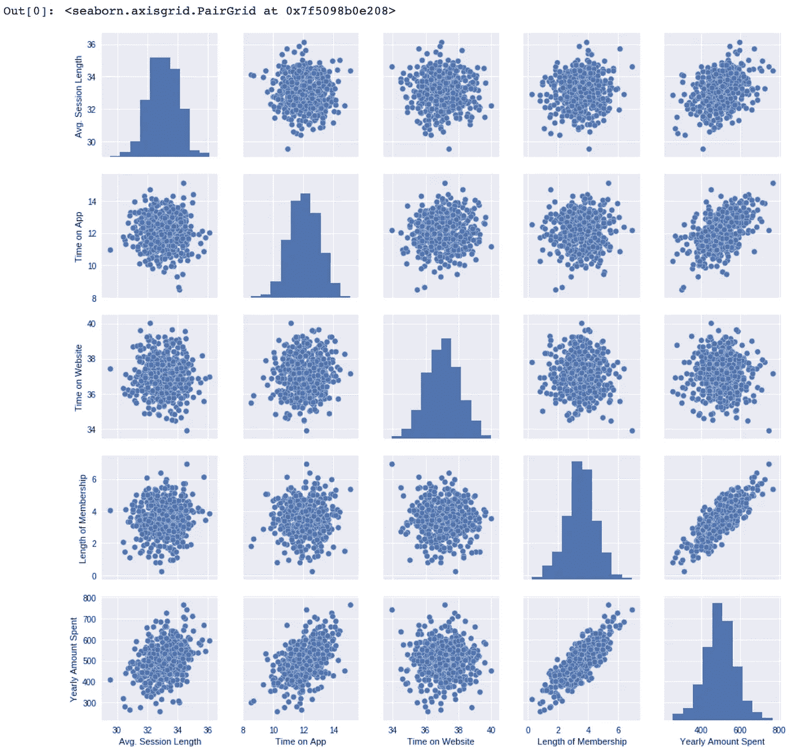
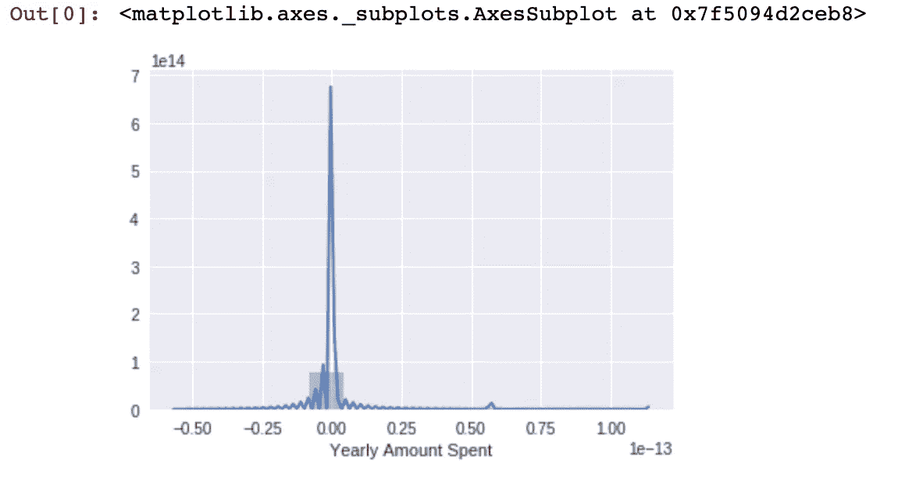
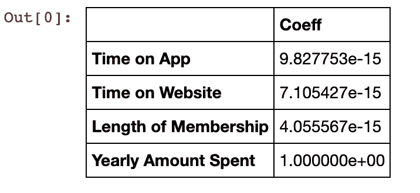

# 分析数据并在 15 分钟内为一家电子商务初创公司提供可行的见解

> 原文：<https://towardsdatascience.com/analyze-data-provide-actionable-insights-to-an-e-commerce-startup-in-15-minutes-929335fac1d0?source=collection_archive---------45----------------------->

## 这篇文章帮助你戴上数据科学家的帽子，分析一家电子商务初创公司的数据，提供可操作的见解。


由[马库斯](https://unsplash.com/@markusspiske)对 [UnSplash](https://unsplash.com/?utm_source=medium&utm_medium=referral)

由于有大量的在线资源可用于学习数据科学，本科生很难将自己与其他人区分开来，因为每个人都完成了相同的课程和类似的项目。在这种情况下，努力理解数据科学项目的典型工作流并在数据科学和机器学习之间划清界限就变得势在必行。一旦我们理解了其中的区别，学生就可以构建端到端的项目(对于数据科学概要文件来说更重要)，而不仅仅关注 it 的数学方面(对于机器学习概要文件来说更合适)。

# **岗位描述**

这篇博客展示了数据科学家的典型工作流程以及所有必须遵循的步骤。

我们将使用基本的 Python 库进行数据操作，使用基本的可视化库进行数据可视化，使用简单的机器学习库进行线性回归分析。

这不是最先进的(SoTA)实施，而是说明数据科学工作流基础的直观指南。

*请注意，我们将为此使用*[*Google Colab*](/getting-started-with-google-colab-f2fff97f594c)*。请“*”表示回购是你喜欢的。*

# 项目描述

在这篇博文的范围内，假设你是一名自由职业的数据科学家，你被纽约一家专门从事服装的在线电子商务公司聘为合同工。这家电子商务公司在网上销售服装，也有店内风格和服装建议会议。顾客来到店里，与私人造型师进行会谈/会面，然后他们可以回家，在手机应用程序或网站上订购他们想要的衣服。


从 [UnSplash](https://unsplash.com/s/photos/ecommerce)

该公司正试图决定是将精力集中在他们的移动应用程序体验还是他们的网站上。他们雇佣你来帮助他们解决这个问题！我们开始吧！

让我们试着分析一下客户数据(这是假的，不包含任何真实的信用卡号码或电子邮件)。

*你也可以在* [*上关注这个我的 Github 这里*](https://github.com/pratyushchry/Data-Analytics-Notebooks/blob/master/Data%20Scientist%20for%20an%20E-Commerce%20Startup/Linear%20Regression%20in%20E-Commerce.ipynb) *。*

# 导入包

```
**import** **numpy** **as** **np**
**import** **pandas** **as** **pd**
**import** **matplotlib.pyplot** **as** **plt**
**import** **seaborn** **as** **sns**
%matplotlib inline
```

下面是允许您将文件上传到 Colab 文件的代码片段。我们将在笔记本中使用的数据在一个 **CSV** 文件中。该文件位于名为[“E-commerce . CSV”](https://github.com/pratyushchry/Data-Analytics-Notebooks/blob/master/Data%20Scientist%20for%20an%20E-Commerce%20Startup/Ecommerce%20Customers.csv)的同一文件夹中

```
**from** **google.colab** **import** files
**import** **os**
uploaded = files.upload()
all_files = [(name, os.path.getmtime(name)) **for** name **in** os.listdir()]
latest_file = sorted(all_files, key=**lambda** x: -x[1])[0][0]customers = pd.read_csv('Ecommerce Customers')
customers.head()
```

一旦你运行这段代码，你应该会看到这样的输出——



[我的 Github 回购](https://github.com/pratyushchry/Data-Analytics-Notebooks/blob/master/Data%20Scientist%20for%20an%20E-Commerce%20Startup/Linear%20Regression%20in%20E-Commerce.ipynb)

现在我们已经上传了数据，我们已经看到了数据的“头部”,我们将更多地使用它。

我们将使用“describe()”和“info()”函数。输出应该是这样的—



[我的 Github 回购](https://github.com/pratyushchry/Data-Analytics-Notebooks/blob/master/Data%20Scientist%20for%20an%20E-Commerce%20Startup/Linear%20Regression%20in%20E-Commerce.ipynb)



[我的 Github 回购](https://github.com/pratyushchry/Data-Analytics-Notebooks/blob/master/Data%20Scientist%20for%20an%20E-Commerce%20Startup/Linear%20Regression%20in%20E-Commerce.ipynb)

# 探索性数据分析

既然我们已经处理了数据，让我们来研究一下。

我们将使用“Seaborn”来创建一个联合图，并比较以下各列-“花在网站上的时间”和“每年花费的金额”

```
sns.jointplot(data=customers,x='Time on Website',y='Yearly Amount Spent')
```



[我的 Github 回购](https://github.com/pratyushchry/Data-Analytics-Notebooks/blob/master/Data%20Scientist%20for%20an%20E-Commerce%20Startup/Linear%20Regression%20in%20E-Commerce.ipynb)

> 相关性有意义吗？

让我们用“App 上的时间”一栏重复这个过程。

```
sns.jointplot(data = customers, x='Time on App', y = 'Yearly Amount Spent')
```



[我的 Github 回购](https://github.com/pratyushchry/Data-Analytics-Notebooks/blob/master/Data%20Scientist%20for%20an%20E-Commerce%20Startup/Linear%20Regression%20in%20E-Commerce.ipynb)

现在让我们创建一个 jointplot 来比较“在应用上的时间”和“会员的时间长度”。

```
sns.jointplot(x='Time on App',y='Length of Membership', kind='hex',data = customers)
```



[我的 Github 回购](https://github.com/pratyushchry/Data-Analytics-Notebooks/blob/master/Data%20Scientist%20for%20an%20E-Commerce%20Startup/Linear%20Regression%20in%20E-Commerce.ipynb)

我们可以选择创建一个 **Pairplot** 来一次执行多个比较，而不是逐个执行。

```
sns.pairplot(customers)
```



[我的 Github 回购](https://github.com/pratyushchry/Data-Analytics-Notebooks/blob/master/Data%20Scientist%20for%20an%20E-Commerce%20Startup/Linear%20Regression%20in%20E-Commerce.ipynb)

**问:根据这张图，什么看起来是与每年花费金额最相关的特征？**

***Ans —隶属关系长度***

现在，让我们也创建一个每年花费金额与会员资格时间的线性模型。

```
sns.lmplot(x='Length of Membership', y='Yearly Amount Spent', data = customers)
```


[我的 Github 回购](https://github.com/pratyushchry/Data-Analytics-Notebooks/blob/master/Data%20Scientist%20for%20an%20E-Commerce%20Startup/Linear%20Regression%20in%20E-Commerce.ipynb)

# 机器学习(基础部分)

现在我们已经对数据进行了一些探索，让我们继续将数据分成训练集和测试集。将变量 X 设置为客户的数字特征，将变量 y 设置为“每年花费的金额”列。

我们将使用来自 Scikit Learn 的简单线性回归来训练我们的模型。

```
customers.columns
y = customers['Yearly Amount Spent']
X = customers [['Time on App','Time on Website', 'Length of Membership', 'Yearly Amount Spent']]
**from** **sklearn.cross_validation** **import** train_test_split
**from** **sklearn.linear_model** **import** LinearRegression
X_train, X_test, y_train, y_test = train_test_split(
...     X, y, test_size=0.4, random_state=101)lm = LinearRegression()
lm.fit(X_train,y_train)
X_trainpredictions = lm.predict(X_test)
plt.scatter(y_test,predictions)
plt.xlabel('Y Test (True Values)')
plt.ylabel('Predicted Values')
```


[我的 Github 回购](https://github.com/pratyushchry/Data-Analytics-Notebooks/blob/master/Data%20Scientist%20for%20an%20E-Commerce%20Startup/Linear%20Regression%20in%20E-Commerce.ipynb)

# 模型评估

让我们通过计算残差平方和以及解释方差得分(R)来评估我们的模型性能。

```
**from** **sklearn** **import** metrics
**import** **pandas** **as** **np**
print('MAE', metrics.mean_absolute_error(y_test,predictions))
print('MSE', metrics.mean_squared_error(y_test,predictions))metrics.explained_variance_score(y_test,predictions)
sns.distplot((y_test-predictions))
```



[我的 Github 回购](https://github.com/pratyushchry/Data-Analytics-Notebooks/blob/master/Data%20Scientist%20for%20an%20E-Commerce%20Startup/Linear%20Regression%20in%20E-Commerce.ipynb)

# 讨论:我们回答了问题吗？

我们还是想搞清楚原问题的答案，我们是把精力放在手机 app 还是网站开发上？或者这根本不重要，会员时间才是真正重要的。让我们看看我们是否能解释这些系数来得到一个想法。

```
cdf = pd.DataFrame(lm.coef_,X.columns,columns=['Coeff'])
cdf
```



[我的 Github 回购](https://github.com/pratyushchry/Data-Analytics-Notebooks/blob/master/Data%20Scientist%20for%20an%20E-Commerce%20Startup/Linear%20Regression%20in%20E-Commerce.ipynb)

# 解释这些系数

1.  保持所有其他功能不变，平均增加 1 个单位。会话长度与 25.98 美元的总花费的增加相关联。
2.  在所有其他功能不变的情况下，App 上的时间每增加 1 个单位，总花费就会增加 38.59 美元。
3.  在所有其他特征不变的情况下，网站时间每增加 1 个单位，总花费就会增加 0.19 美元。
4.  在保持所有其他特征不变的情况下，会员时间每增加 1 个单位，总花费就会增加 61.27 美元。

问:现在该公司应该更关注他们的移动应用还是网站？

这很棘手，因为有两种思考方式——你可以开发网站来赶上移动应用程序的性能。

或者你可以开发更多的移动应用程序，因为它运行得更好。

这个问题的答案不是二进制的。这取决于很多因素——资源的可用性是其中之一。

也许有一个大的节日销售即将到来，你想增加你的销售。

或者，你可能正在寻求新一轮融资，而投资者对该应用的下载量很感兴趣。

决定这些取舍并不是一件容易的事情，通常由**产品经理/业务分析师**来完成。这就是团队合作、业务目标和收入目标的由来。

# 结束语

本笔记本的目的是说明典型数据科学项目的工作流程，解释数据科学职能如何与产品管理/业务分析师等其他职能协同工作。

真实世界中的数据集不会那么完美，会大得多，甚至在准备好进行处理之前，也可能需要大量清理。

然而，除了所使用的工具之外，整个过程与此非常相似。

— — — — — — — — — —

在这篇文章中表达的观点是我个人的，并不代表我现在或过去的雇主的观点。

我喜欢简化技术，分解围绕它的术语。如果你喜欢阅读，你可以在媒体和 [LinkedIn](https://www.linkedin.com/in/pratyushchoudhury/) 上关注我。万一我犯了什么错误，请毫不犹豫地告诉我。