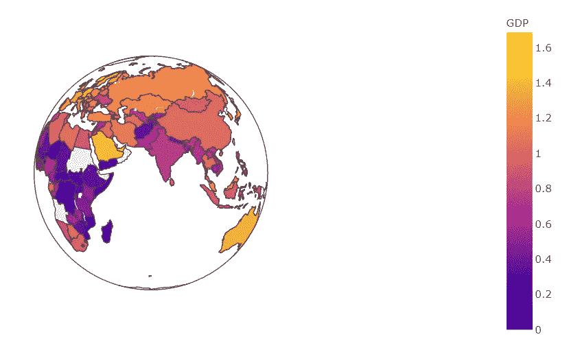
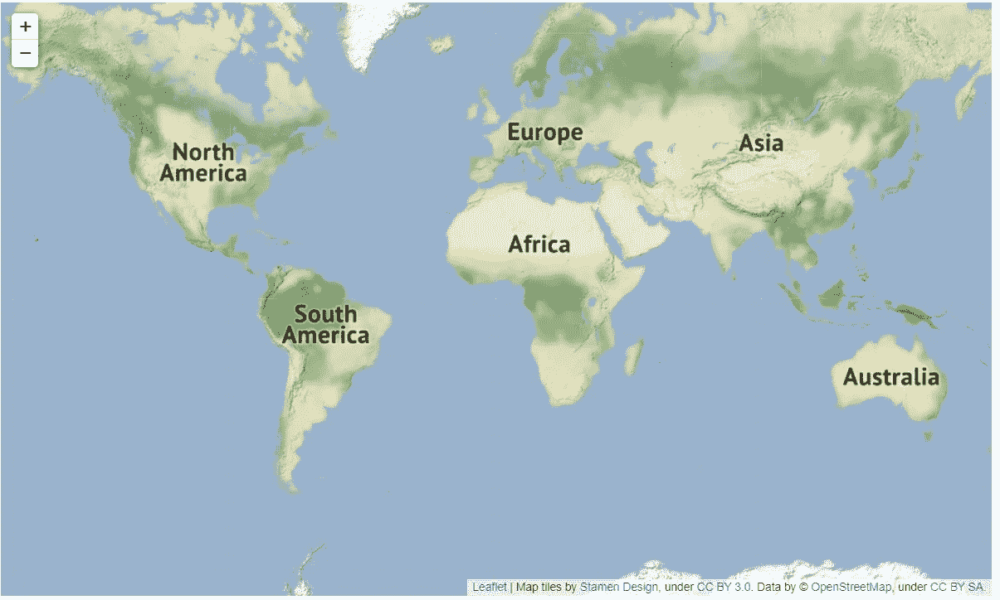
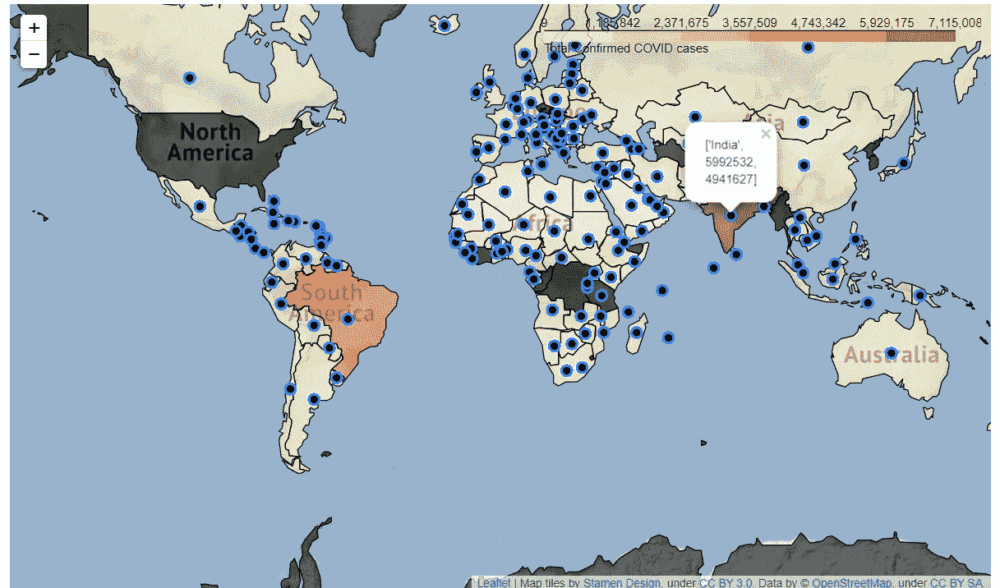
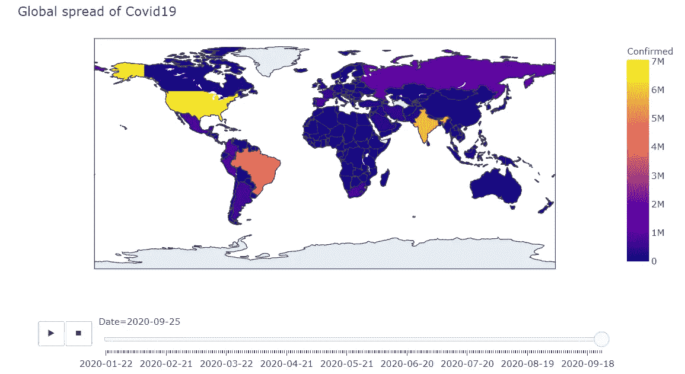

# 使用 Choropleth 图分析全球 COVID 19 数据

> 原文：<https://towardsdatascience.com/analyze-global-covid-19-data-with-choropleth-maps-2636f4a454d0?source=collection_archive---------40----------------------->

## Python 中与 Plotly 和 Folium 的比较


亚当·尼西奥鲁克在 [Unsplash](https://unsplash.com/s/photos/pandemic?utm_source=unsplash&utm_medium=referral&utm_content=creditCopyText) 上拍摄的照片

新冠肺炎无需介绍——它是最近席卷全球的传染病。那么，你有没有想过在过去的几个月里世界发生了怎样的变化？我们能想象几个月内不同国家的这种变化吗？

> 太多的问题，但我们有一个简单的答案——我们可以很容易地使用 Choropleth 地图，我会用最少的编码要求使它变得简单。

所以事不宜迟，让我们开始吧:

这将是我们今天的议程:

1.  什么是 Choropleth 地图
2.  叶子简介
3.  使用叶绘制的 Choropleth 图
4.  关于 plotly 的简介
5.  使用 plotly 绘制 Choropleth 地图
6.  choropleth 映射的一些限制

# 1.什么是 Choropleth 地图

Choropleth 是基于统计变量或数据变量划分不同地理区域的地图或显示。这是一种专题地图，根据所考虑的变量和该变量在一个区域中所占的比例，对不同的区域进行着色。例如:考虑下面的图 1，它显示了不同国家的人均 GDP:



图 1:人均 GDP:作者图片

该地图使用与人均 GDP 相关的色阶来表示上图中的不同国家。

因此，创建 choropleth 地图需要两件重要的事情:

a)具有地理边界的地理空间数据，如 geo json 文件和

b)颜色编码的变量或数据点

# 2.叶子简介

Folium 是 Python 中的一个库，可用于可视化地理空间数据。fleed . js 是一个用于创建地图的 java 脚本库，为了创建漂亮的交互式地图，它将 fleed 的功能与 python 的数据处理能力(即清理复杂的数据集并将其转换为简单的格式)相结合。

follow 有助于绑定数据以创建 choropleth 之类的地图，还支持 HTML 可视化的标记功能。

不同的地图投影也可以像正交，自然地球等和不同的地图瓷砖像地图框，雄蕊调色剂等。

现在让我们考虑全局 COVID 19 数据集来创建 choropleth 图。您可以在参考资料中获得数据集链接。

# 3.使用叶绘制的 Choropleth 图

a)首先，我们需要生成基本地图。以下代码可用于此:

```
m = folium.Map(tiles = 'Stamen Terrain',min_zoom = 1.5)
display(m)
```

我们将得到这样的输出:



图 2:[作者](https://medium.com/@krishnan.mythili)的底图

b)我们必须从 this [链接](https://raw.githubusercontent.com/python-visualization/folium/master/examples/data)获取地理数据，然后生成 choropleth 地图层，如下所示:

```
url = '[https://raw.githubusercontent.com/python-visualization/folium/master/examples/data'](https://raw.githubusercontent.com/python-visualization/folium/master/examples/data')
country_shapes = f'{url}/world-countries.json'folium.Choropleth(
    geo_data = country_shapes,
    min_zoom=2,
    name='Covid-19',
    data=df,
    columns=['Country', 'Confirmed'],
    key_on='feature.properties.name',
    fill_color='OrRd',
    nan_fill_color='black',
    legend_name = 'Total Confirmed COVID cases',
).add_to(m)
m
```

c)现在，我们将为具有该代码的每个国家添加带有确诊病例详细信息的标记。标记可以定制，我们在这里使用圆形标记:

```
def plotDot(point):
    folium.CircleMarker(location = (point.latitude, point.longitude),
                       radius = 5,
                       weight = 2,
                       popup = [point.Country, point.Confirmed, point.Recovered],
                       fill_color = '#000000').add_to(m)covid_df.apply(plotDot, axis = 1)
m.fit_bounds(m.get_bounds())
m
```

这是带有已确认和已恢复病例标记的最终输出。我们可以将鼠标悬停在标记周围，按国家查看确诊和恢复病例的数量。在下图中，突出显示了印度的标记:



图 3:带有标记的 Choropleth 叶地图:作者提供的图片

现在，我们可以使用 plotly 创建一个类似的地图。

# 4.关于 plotly 的简介

Plotly 是一个开源的 Python 可视化库。它也可以用来创建 html 可视化的伟大的动画。与 leav 一样，这些图形是交互式的，并带有动画特性。它构建在 plotly.js 之上，可视化也可以保存为图像。它还提供了许多定制和样式选项，实现非常简单。它还与 dash 兼容，这使得它很容易嵌入到博客或其他网络应用程序中。

> Dash 是一个用于构建分析应用程序的开源框架，不需要 Java 脚本，并且与 Plotly 图形库紧密集成。点击了解更多[。](https://dash.plotly.com/)

随着更多的观察，plotly 可能会导致性能问题。建议离线使用。

# 5.使用 Plotly 绘制 Choropleth 地图

现在让我们用 plotly 来构造 choropleth 图。这可以通过使用具有相同数据集的简单代码来实现，如下所示:

```
fig = px.choropleth(df , locations = 'Country', locationmode = 'country names', color = 'Confirmed'
                    ,animation_frame = 'Date')
fig.update_layout(title_text = 'Global spread of Covid19')
fig.show()
```

输出如下所示:



图 4: Plotly Choropleth 地图(作者图片)

在这里，我们可以看到按日期排列的动画窗格，它提供了几个月来确诊病例如何在不同国家传播以及病例增长率的视图。

动画冠状动脉分布图:数月来冠状病毒的全球传播(作者[作者](https://medium.com/@krishnan.mythili)

地图的 HTML 可视化可以使用一行代码保存，您可以在这里访问地图的 HTML 版本。

```
import plotly.offline as py# html file
py.offline.plot(fig, filename='C:/plotlyplots/Global_covid.html')
```

# 总结:

我们今天学习了如何使用两个不同的 python 库来创建带有新冠肺炎数据的 choropleth 地图。Plotly 在地图中通过简单的缩放、过滤和动画选项在该领域真正得分。但是，没有添加自定义标记的选项。叶尤其有助于 choropleth 和其他地图。自定义选项，如自定义弹出窗口、自定义平铺、标记和其他功能，使 Folium 成为一个可行的竞争者。此外，Folium 是专为可视化地理空间数据而构建的，而 Plotly 的用途要广泛得多。

*Choropleth 地图上最后几个字:*

Choropleth 地图有利于整体观察，但一个国家/地区内的一些变化可能会被遗漏，因为它假设整个区域具有相同的值。很少有其他 ***限制*** 为好，比如:

a)使用绝对计数有时会产生误导，最好使用标准化的测量单位，如比例/比率

b)边界可能不连续，大面积可能会占据显示屏。

c)由于关于数据如何分类的分类问题，可能存在准确性问题。具有图形值的未分类 choropleth 图可以消除分类中的信息损失。

尽管有这些限制，但 choropleth 图仍是进行实证研究和地理空间分析的一种非常有用的方法。

如果你有任何问题，请联系我，并留下你的意见。

完整的代码可以在 [Github](https://github.com/Mythili7/Choropleth) 上获得。

可以通过[媒体](https://medium.com/@krishnan.mythili)、 [LinkedIn](https://www.linkedin.com/in/mythili-krishnan-94a5125) 或 [Twitter](https://twitter.com/KrisMythili) 联系到我。

***参考文献*** :

[1] Jochen Schiewe，[关于 Choropleth 地图中空间模式视觉感知的实证研究](https://link.springer.com/article/10.1007/s42489-019-00026-y) (2019)，Springer

[2] Jeffrey S. Torguson， [Choropleth 地图](https://onlinelibrary.wiley.com/doi/abs/10.1002/9781118786352.wbieg0951) (2017)，威利在线图书馆

[3]Robert G . Cromley 和 Ellen K Cromley， [Choropleth 地图图例设计用于可视化社区健康差异](https://ij-healthgeographics.biomedcentral.com/articles/10.1186/1476-072X-8-52) (2009 年)，《国际卫生地理杂志》

[3][Python 中的 Choropleth 地图](https://plotly.com/python/choropleth-maps/)，Plotly 文档

[4][Python 中的 Choropleth 地图](https://python-visualization.github.io/folium/quickstart.html)，leav 文档

[5]约翰·霍普斯金大学，[新冠肺炎数据集参考文献](https://github.com/CSSEGISandData/COVID-19)