# 分析纽约时报新冠肺炎数据集

> 原文：<https://towardsdatascience.com/analyze-ny-times-covid-19-dataset-86c802164210?source=collection_archive---------23----------------------->

## 创建一个简单的 Python 类来分析和可视化来自纽约时报的新冠肺炎数据集。

***编者按:*** [*走向数据科学*](http://towardsdatascience.com/) *是一份以数据科学和机器学习研究为主的中型刊物。我们不是健康专家或流行病学家，本文的观点不应被解释为专业建议。想了解更多关于疫情冠状病毒的信息，可以点击* [*这里*](https://www.who.int/emergencies/diseases/novel-coronavirus-2019/situation-reports) *。*

# 介绍

自第二次世界大战以来最大的全球性危机和自 1918-1919 年西班牙流感以来最大的全球性疫情今天就在我们面前。

每个人都在关注死亡人数的每日上升，以及这种新型病毒的快速指数传播。

有一些非常丰富的数据可视化和分析仪表板来跟踪世界各地发生的事情。

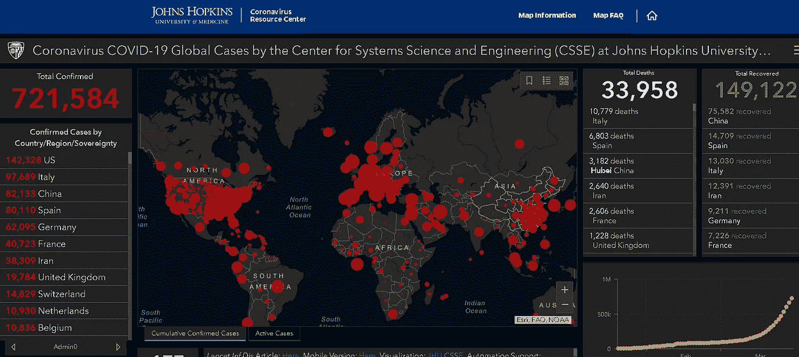

[**仪表板来自约翰·霍普斯金大学**](https://coronavirus.jhu.edu/map.html)

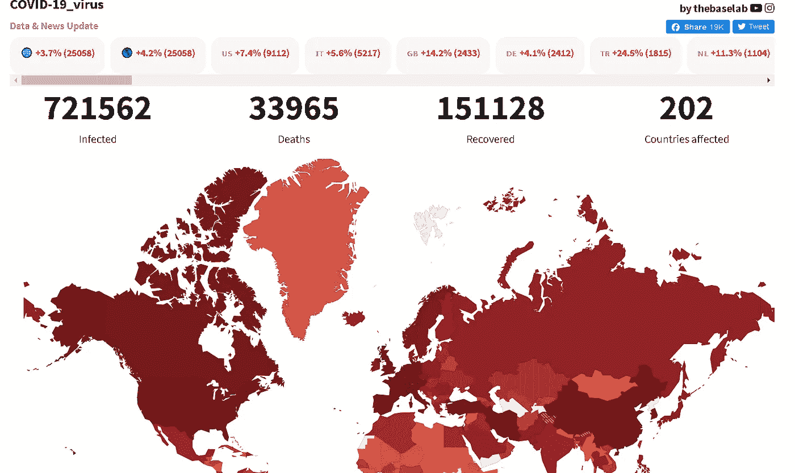

[**仪表盘从**](https://coronavirus.thebaselab.com/) 开始

然而，如果能够自己编写简单的 Python 代码，并为不断出现的所有这些数据绘制趋势线或条形图，岂不是很棒？你想并排比较美国各州的趋势吗？你如何验证华盛顿的封锁和社交距离措施是否奏效？

在本文中，我们将快速展示如何从易于访问的数据集中创建阳性病例和死亡人数的快速图表。

注意:**这不是一个预测模型，将来也不会是**。这个项目的目标是只做视觉分析。**没有扎实的流行病学知识或没有合作，人们不应该仅仅从时间序列数据中建立任何预测模型。**

# 纽约时报数据集

《纽约时报》是新闻业的一个神圣的名字，它正在做他们最擅长的事情——在新冠肺炎问题上带来高质量、数据驱动、客观的分析、事实和观点。 [**他们制作了所有与新冠肺炎相关的文章，供世界上的任何人免费阅读**](https://www.nytimes.com/news-event/coronavirus) ，也就是说，把它们从付费墙后面拿出来。

专注于美国各州和县，他们也一直[维护一个简单而全面的数据集](https://github.com/nytimes/covid-19-data)，用于他们的日常地图。

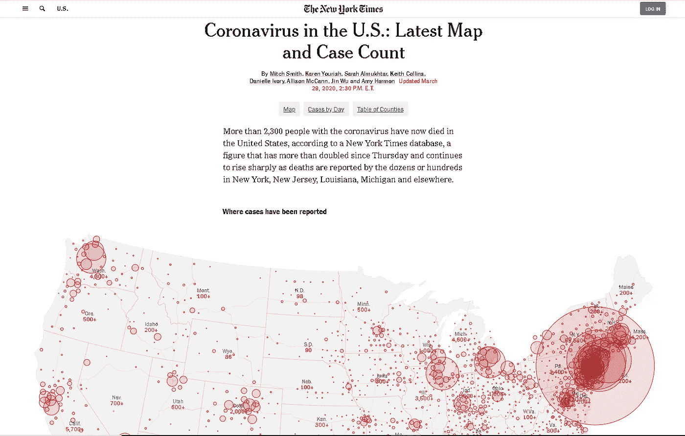

[**纽约时报美国新冠肺炎病例地图(每日更新)**](https://www.nytimes.com/interactive/2020/us/coronavirus-us-cases.html)

> 然而，如果能够自己编写简单的 Python 代码，并为不断出现的所有这些数据绘制趋势线或条形图，岂不是很棒？你想并排比较美国各州的趋势吗？

## 包含重要信息的简单数据集

NYT 数据集易于使用和探索，因为它只列出了大多数人感兴趣的数据片段，

*   案例数量
*   死亡人数

并且，它包含了自 1 月下旬以来的数据，即华盛顿州首次报告病例的时间。

但是，我们将会看到，利用这组简单的数据，可以创建相当多有趣的可视化效果。

## 没有恢复数据

你可能会问**为什么它不记录恢复的次数**。这听起来可能是明智之举，但要记录这个数字却非常困难。这是因为许多病例，甚至是未报告的病例，都属于这一类——人们无需去医院就能自动康复。在大多数这样的情况下，数据没有得到适当的维护(如果这个人住院的话就会这样)。

因此，我们不应该太担心没有这些数据，因为在没有适当控制的收集相关信息的方式的情况下，这些数据不应该用于简单的绘图和模型中。

## 只有累积数据

《纽约时报》数据集的一个缺陷是，它仅以累积的方式获取新冠肺炎病例和死亡数据。然而，当谈到可视化时，人们对累积的和每天的数据都感兴趣。

尽管累积数据提供了病毒总体影响/传播的感觉，但每天的新病例数据提供了传播速度的良好指示，并可以告诉我们它是否显示出任何放缓的迹象。

所谓的“疫情高峰”只能在新增病例或死亡的逐日图表中看到，因为累积图表只会显示单调增加的趋势。

因此，我们处理数据集来提取这些信息。

# 我们的 Python 脚本

## 简单的面向对象设计

为了保持面向对象软件设计的良好实践，我们决定编写一个 Python 类，它可以将原始数据和实用方法封装在一个容器中。

[**举个例子 Jupyter 笔记本在这里**](https://github.com/tirthajyoti/Covid-19-analysis) **。**

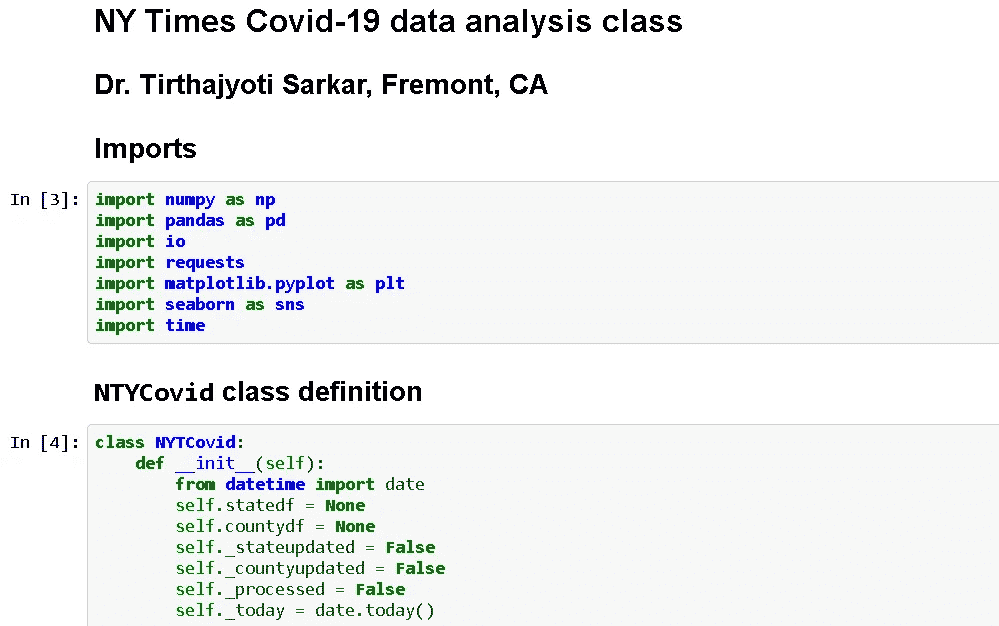

## 直接从纽约时报 Github 获取数据

这个想法是要与时俱进，因为全国的情况每天(事实上，每小时)都在变化。《纽约时报》的人似乎每天都在某个时间更新数据集，并在他们的 Github repo 上保持相同的文件名。因此，我们有一个简单的方法直接从他们的 Github repo 中提取数据并更新内部数据集。

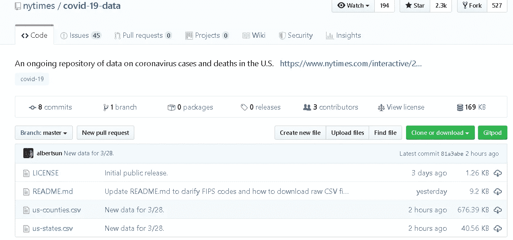

## 查看数据集

一个简单的 peek 方法可以让我们在进一步处理之前快速查看原始数据。请记住,“病例”和“死亡”列仍然是此时的累积数据。

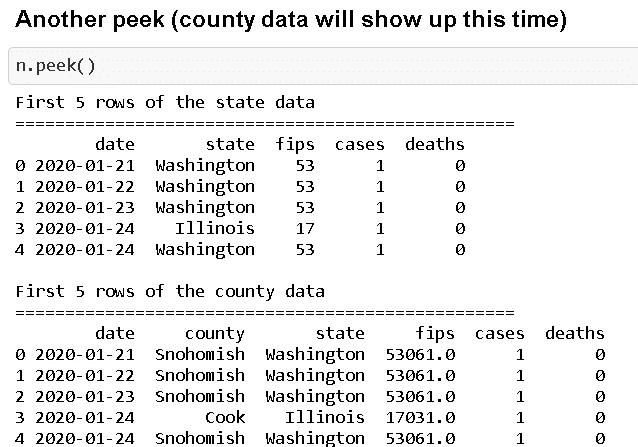

## 创建州级和县级数据集

《纽约时报》的默认数据集是一个平面 CSV 文件，其中有一列是州或县的名称，但它不适合绘制新冠肺炎病例或比率(按州或县)。

我们使用简单的 Pandas 过滤技术创建内部字典来存储每个州和县的数据。更重要的是，这是动态的，并且与最新版本的数据相关联。因此，如果某个县今天出现了第一例病例，那么该县只会在今天出现在我们的内部数据集中，而不会在此之前出现。

也是在这种州级和县级数据中，我们提取了每天的新增病例和新增死亡病例。第一行将显示 NaN，因为在此之前没有数据。

> 尽管累积数据提供了病毒总体影响/传播的感觉，但每天的新病例数据提供了传播速度的良好指示，并可以告诉我们它是否显示出任何放缓的迹象。

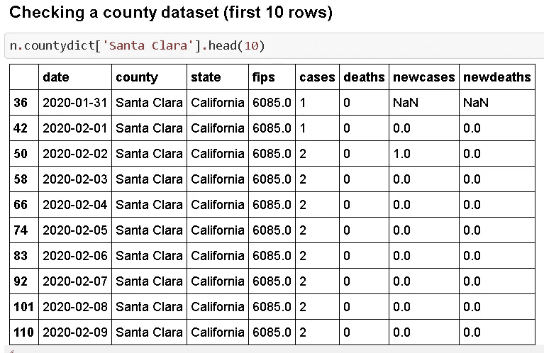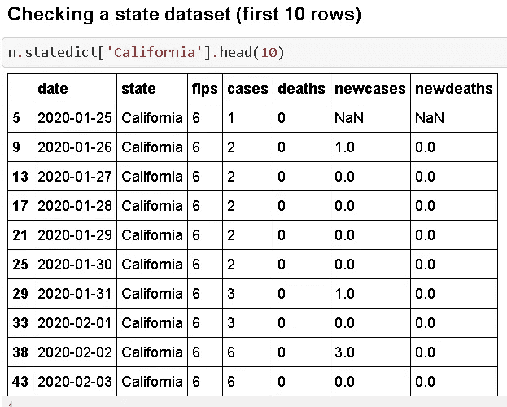

## 条形图

现在，是时候将这些州级或县级数据可视化为时间序列了。同样，Jupyter 笔记本中给出了函数的详细信息。用户可以简单地传递一个州的名称，

*   累积案例
*   累积死亡人数
*   每天新病例
*   每天新增死亡人数

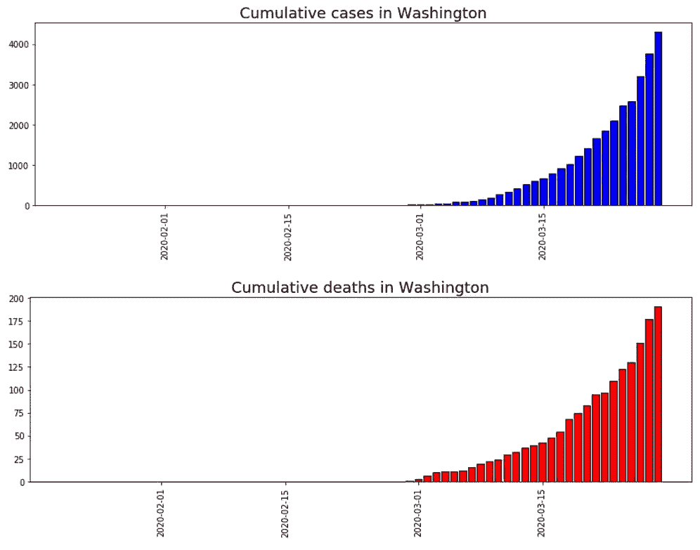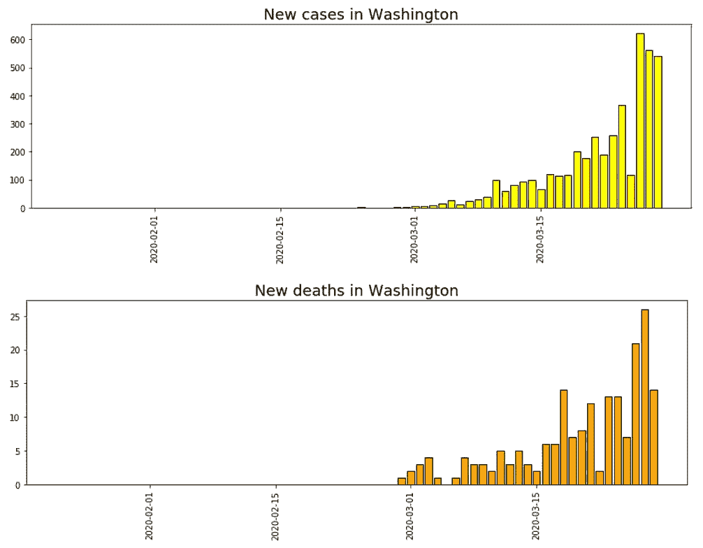

## 仅最近 30 天的数据

用户还可以选择只绘制最近 30 天的数据，而不是绘制 1 月下旬以来的所有数据。

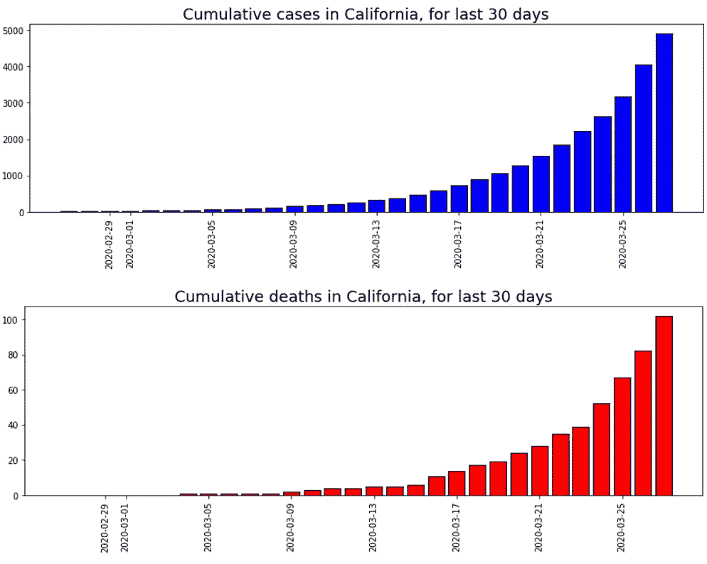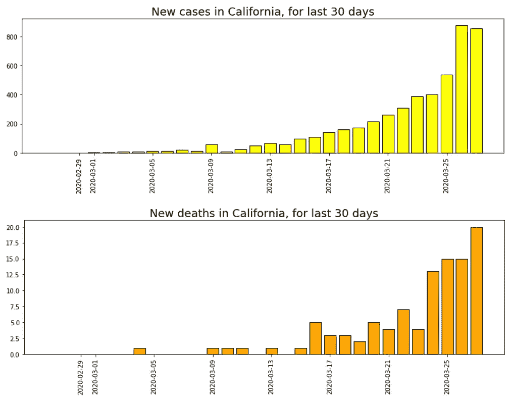

## 比较线图

统计数据中最受争议和关注的一个问题是，各州对新冠肺炎病例的处理情况如何。我们提供了一个简单的函数来并排绘制任意数量的状态。用户必须传递一个州名列表。

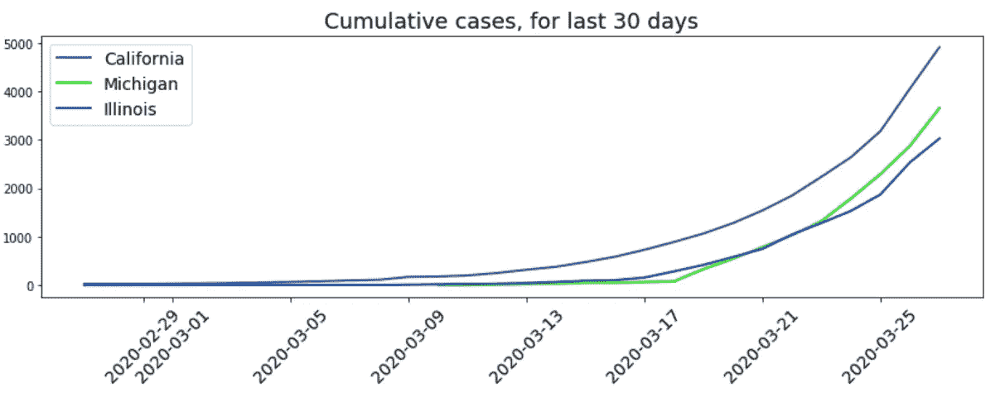

## 各州排名

尽管听起来很可怕，但毫无疑问，我们总是在辩论各州在阳性病例和死亡的严峻统计数据方面的排名。

一个简单的方法允许你绘制排名靠前的州的条形图。此外，您可以选择一个特定的日期来创建这个排名图，这样您就可以检查各州的相对位置是如何随时间变化的。

例如，我们在下图中绘制了 2020 年 3 月 22 日排名前 4 的州。

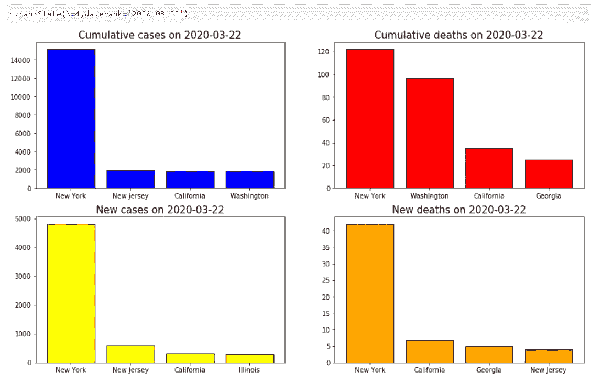

# 更多待添加

本文的主要目标是展示任何人，即使是对 Python 数据分析有初步了解的人，都可以快速完成一个小项目，从基于 web 的来源提取数据并创建方便的可视化。

又一个重要的提示。

**这不是一个预测模型，将来也不会是**。这个脚本的目标是只做可视化分析。**没有扎实的流行病学知识或没有合作，人们不应该仅仅从时间序列数据中建立任何预测模型。**

这是一项正在进行的工作，更多的可视化可以稍后添加。也欢迎其他数据科学家同事利用这种方法，使用我的代码并对其进行扩展。请让我知道你是否用它来进行分析和可视化。

再次， [**演示 Jupyter 笔记本在这里**](https://github.com/tirthajyoti/Covid-19-analysis) **。**

如果您有任何问题或想法要分享，请通过[**tirthajyoti【AT】Gmail . com**](mailto:tirthajyoti@gmail.com)联系作者。此外，您还可以查看作者的 [**GitHub**](https://github.com/tirthajyoti?tab=repositories) **知识库**，获取机器学习和数据科学方面的代码、思想和资源。如果你和我一样，对人工智能/机器学习/数据科学充满热情，请随时[在 LinkedIn 上添加我](https://www.linkedin.com/in/tirthajyoti-sarkar-2127aa7/)或[在 Twitter 上关注我](https://twitter.com/tirthajyotiS)。

 [## Tirthajyoti Sarkar - Sr .首席工程师-半导体、人工智能、机器学习- ON…

### 通过写作使数据科学/ML 概念易于理解:https://medium.com/@tirthajyoti 开源和有趣…

www.linkedin.com](https://www.linkedin.com/in/tirthajyoti-sarkar-2127aa7/)