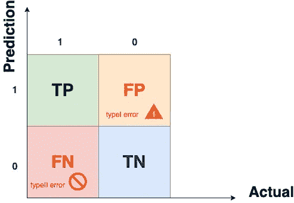
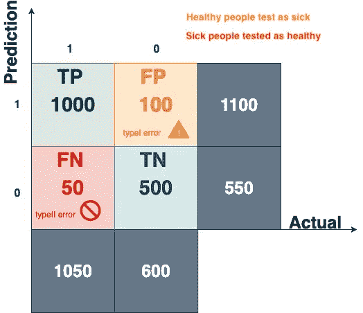
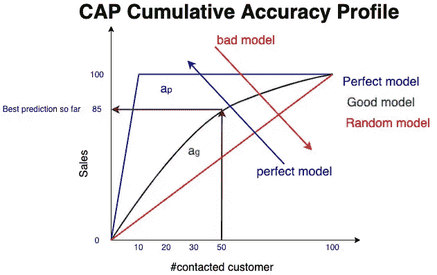
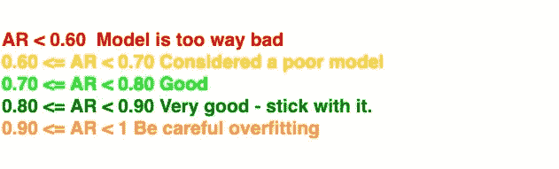
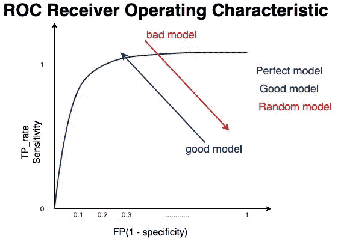
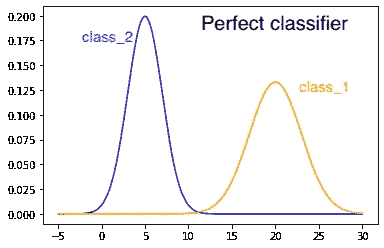
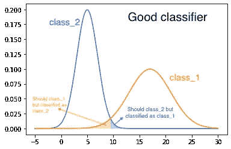
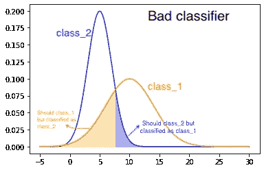
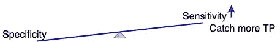

# 分析医学背景下的线性分类器混淆矩阵。

> 原文：<https://towardsdatascience.com/analyze-the-linear-classifier-confusion-matrix-within-the-medical-context-62bbd9f3d82?source=collection_archive---------58----------------------->

Jules Bss 在 [Unsplash](https://unsplash.com/s/photos/confusion?utm_source=unsplash&utm_medium=referral&utm_content=creditCopyText) 上的照片

构建分类模型时，最具挑战性的任务是评估性能。广泛使用的一个基本指标是混淆矩阵。在本教程中，我将尝试解释混淆矩阵和正确的阅读方法。

# **覆盖的是什么？**

*   混淆矩阵结构和术语。
*   一类和二类错误。
*   准确性悖论。
*   精确度和召回率。
*   累积精度曲线— CAP 分析
*   受试者工作特征— ROC 分析
*   曲线下面积——AUC
*   延伸阅读—发表的学术论文。

# 1.什么是混淆矩阵？

它是一个维数为 N*N 的矩阵，允许从分类模型中提取有意义的度量，这有助于评估性能。它被视为预测质量的总结报告。

## 怎么读？

混淆矩阵的水平轴代表实际值，而垂直轴代表预测值。例如，在下面演示的 2X2 混淆矩阵中，有两个数据类；阳性病例(1)和阴性病例(0)。模型的阳性预测可能是真阳性或假阳性情况。真正的阳性预测(TP)定义为模型对阳性病例进行正确分类的次数。相比之下，假阳性预测(FP)是模型对阳性病例进行错误分类的次数。同样，真正的负面预测(TN)被定义为模型对负面情况进行正确分类的次数。相反，假阴性预测(FN)是模型对阴性病例进行错误分类的次数。

混乱矩阵解剖学

> 正如你可能注意到的，正确的预测落在矩阵对角线上。

FP 也被定义为 I 型错误，它表示我们的模型错误地预测了多少个阴性病例为阳性病例。FN 被认为是第二类错误，它表明我们的模型错误地预测了多少阳性病例为阴性病例。

## 从矩阵中提取度量

可以使用几个重要的度量来评估该模型。我们将一个一个地检查它们。让我们从基本的开始。

分类预测模型产生的混淆矩阵示例

1.  准确性:分类器正确的频率。是对角线值之和与总例数之比:(TP+TN)/(TP+TN+FP+FN)—1500/1650 = 0.91。
2.  错误率:所有错误预测与总案例之间的比率。误差率范围从 0 到 1；最好的是 0，而最差的是 1。(TN)/(TP+TN+FP+FN)—500/1650 = 0.30。
3.  准确率:所有正面预测与总案例之间的比率。最好的准确率是 1，最差的是 0。(TP)/(TP+TN+FP+FN)—1000/1650 = 0.61。
4.  特异性(阴性率):真阴性与真阴性和假阳性之和的比率。(TN)/(TN+FP) — 500/600 = 0.80。

然而，仅仅考虑准确性不足以恰当地评估模型。一个模型可能有很高的精确度，但在预测中并不可靠，这是由于类别不平衡造成的。因此，除了准确性之外，还有其他用于评估的方法，如精确度和召回率。

1.  精确度:有多少被预测为阳性的结果是真正的阳性病例。要确定模型精度，请计算真阳性与真阳性和假阴性之和之间的比率。(TP) / (TP + FP) — 1000/1100 = 0.90。
2.  回忆(敏感度):假设案例确实是阳性的，那么案例是阳性的频率。(TP) /(TP + FN) — 1000/1050 = 0.95。

在这种情况下，我们可以将结果解读为:预测类的 90% **(精度)**原来是 1(正)。而 95%的**(回忆)**阳性类别被模型成功预测。

## **精准与召回**

使用哪一种取决于应用程序和您想要的结果类型。您可能已经注意到， **Precision 使用 FP(第一类错误)**而 **Recall 使用 FN(第二类错误)**。根据经验，当 FP 或 I 类误差比 II 类误差更重要时，使用 Precision。相反，当假阴性比假阳性更重要时，使用回忆，尤其是在医学研究中。

> **Precision 使用 FP(第一类错误)**而 **Recall 使用 FN(第二类错误)**

如前所述，由于准确性悖论，我们需要更多的方法来评估我们的模型。累积精度曲线 CAP 和接收器工作特性曲线 ROC 就是这些方法中的一种。

# 2.累积精度曲线上限

> 通过将曲线与直接获得最大数量正面结果的**完美上限**和正面结果平均分布的**随机上限**进行比较，上限可用于评估模型。[维基百科](https://en.wikipedia.org/wiki/Cumulative_accuracy_profile)

准确率——曲线下的面积，定义为生成模型下的面积与完美模型下的面积之比(见下图)。该比率范围在 0 和 1 之间，越接近 1 的模型越精确。例如，下面的模型假设联系的客户数量和退货销售之间存在关系。计算返回最大购买量的最小顾客数是一个优化问题。如图所示，好的模型(绿线)越接近完美的模型(蓝线)就越好。

累积精度曲线— CAP

这些曲线可以根据下表进行评估:

评估上限时应遵循的假设规则

# 3.接收机工作特性曲线 ROC

> 累积精度曲线上限**与接收器工作特性曲线 ROC**不同。

受试者工作特征(ROC)曲线用于更广泛的领域，并经常用于医学研究。ROC 是一种基于两个因素评估模型性能的方法:特异性和敏感性。正如我们前面提到的，敏感性是真阳性率，特异性是假阴性率。ROC 曲线在 y 轴上代表灵敏度，在 x 轴上代表(1-特异性)。每个轴从 0 开始，到 1 结束。

ROC 曲线

更详细地说，假设有三个不同的模型。两个分布之间的重叠区域代表 FN 和 FP，如下图所示。第一个模型代表了一个完美的分类器(完美的分类——没有重叠)。

完美分类器

第二个模型也被认为是一个好模型。曲线下的面积(AUC)很小，且分布均匀。

好的分类器

然而，最后一个模型是预测模型的坏例子，并且被认为在区分 class_1 和 class_2 方面是弱的。

错误的分类器

曲线下面积或 AUC 是用于评估分类器的基本度量，特别是对于不平衡的类别，这是使用 ROC 的一个相当大的好处。

# 外卖食品

*   在敏感性和特异性之间应该有一个平衡；否则，模型会陷入过度拟合的陷阱。

敏感性和特异性的关系

*   ROC 曲线的解释与累积精确度曲线(CAP)相同。只要模型处于向上的正确方向，它就表现得更好。
*   重要的是要注意，具有有意义的性能水平的分类器通常位于随机(基线)和完美线之间的区域。
*   帽子不摇。
*   FN(假阴性)是第二类错误，而 FP(假阳性)是第一类错误。
*   如果第二类错误对你的模型更重要，使用召回措施；否则使用 type-I 错误。
*   正确的预测落在混乱矩阵的对角线上。
*   该模型不能仅基于准确性进行评估，它可能会由于类别不平衡而产生误导。例如，考虑 ROC AUC 曲线。

# 参考

*   [使用决策树算法的高血压风险分类预测模型](https://www.researchgate.net/publication/314284545_Predictive_Model_for_the_Classification_of_Hypertension_Risk_Using_Decision_Trees_Algorithm)
*   [跌倒检测技术的真实世界评估方法:范围审查](https://www.ncbi.nlm.nih.gov/pmc/articles/PMC6068511/)
*   [使用混淆矩阵进行风险评估策略绩效衡量](https://www.ijrte.org/wp-content/uploads/papers/v7i6s/F03250376S19.pdf)
*   [在医疗保健的机器学习预测中，混淆矩阵是一个混淆矩阵](https://www.fharrell.com/post/mlconfusion/)

最后，我希望我的帖子能帮助你理解模型评估的不同方法，以及你应该考虑哪一种。感谢阅读！！