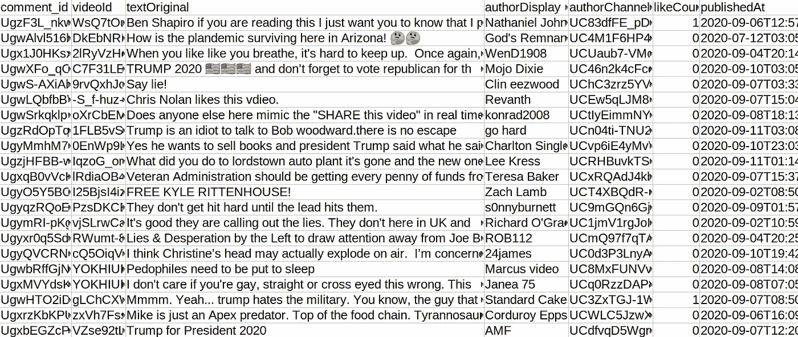
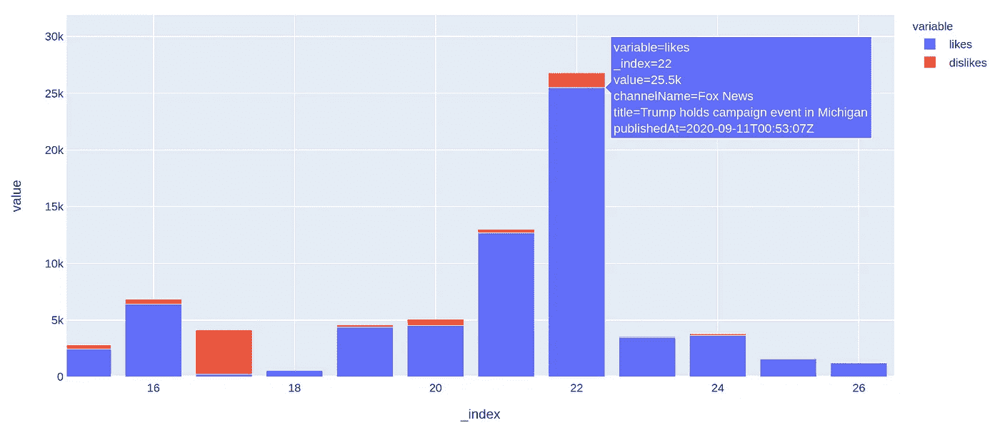
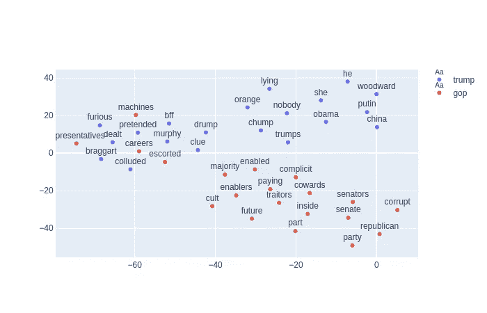
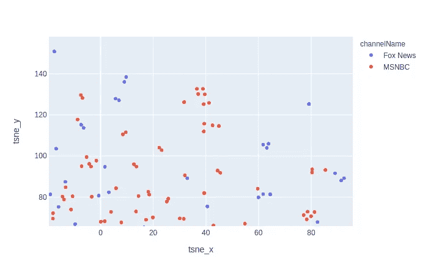
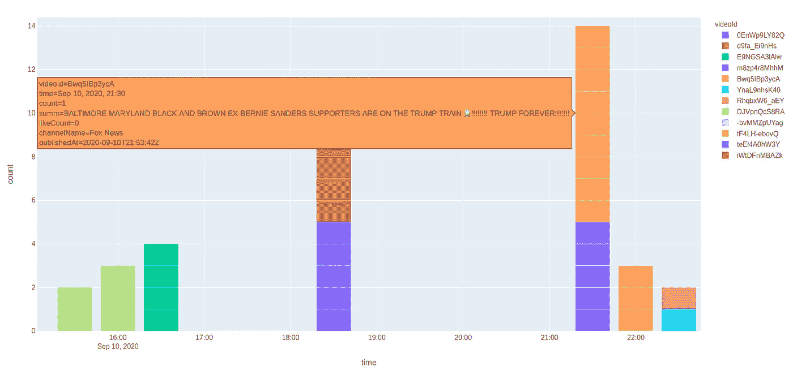

# 分析 YouTube 话语并使用 Python 找到巨魔机器人

> 原文：<https://towardsdatascience.com/analyze-youtube-discourse-and-find-troll-bots-with-python-410daacbba6b?source=collection_archive---------35----------------------->

## 使用 YouTube 数据 API 分析 YouTube 评论中的政治话语并识别机器人

正如你在选举年可能会预料到的那样，社交媒体如今充斥着政治话语——其中一些合理且富有成效，许多具有煽动性。关于社交媒体的两极分化“回音室”效应，以及有针对性的虚假信息运动和假新闻，已经有大量文章发表。为了研究 YouTube 上的政治话语，我将解释如何使用免费的 YouTube 数据 API 将 YouTube 评论收集到一个有趣的数据集中。然后，我们将使用一些数据科学工具，如 Pandas 和 Plotly，来可视化这个数据集并寻找模式。YouTube 上的数据量是巨大的，所以我将这个项目的[代码开源，以鼓励其他人也进行他们自己的分析。如果你愿意，请跟随代码！](https://github.com/thomashikaru/youtube-discourse)


由 [Kon Karampelas](https://unsplash.com/@konkarampelas?utm_source=medium&utm_medium=referral) 在 [Unsplash](https://unsplash.com?utm_source=medium&utm_medium=referral) 上拍摄的照片

## 使用 YouTube 数据 API 收集数据

[YouTube 数据 API](https://developers.google.com/youtube/v3/docs/) 允许每天多达 10，000 个请求免费检索 YouTube 视频、播放列表、评论和频道的信息。这些都可以在 YouTube 上公开获得，但是 API 使得检索变得更加容易。第一步是[生成自己的个人 API 密匙](https://developers.google.com/youtube/registering_an_application)。您将需要使用它来替换附带代码中的占位符，以便发出 API 请求。

在我的程序中，您指定要抓取的频道列表，每个频道要抓取多少个视频，每个视频要抓取多少页评论。(就我的分析而言，我想获得主流政治新闻频道与各种意识形态倾向的混合，如 CNN、MSNBC 和福克斯新闻频道。)程序然后处理 API 请求，这些请求返回包含所请求数据的 JSON 响应。经过一点解析后，这个数据可以附加到 Pandas 数据帧中，当最后一个 API 请求完成时，这个数据帧可以保存到 CSV 文件中。如果我们收集更多的数据，可以在以后更新这个 CSV 文件，并且当我们想要运行分析时，可以将它加载回数据帧。以下是运行一些收集后的示例(请注意，我们在这里筛选的唯一内容是频道，我们没有专门选择政治评论):



我们的数据库包含成千上万的评论和它们的元数据。我们希望确保每条评论都能追溯到发布它的视频、发布它的用户以及其他相关信息，如赞数和时间戳。如你所见，有很多政治性的内容。图片作者。

目前，我也在探索更多的小众政治渠道，看看它们与大网络有什么不同。我鼓励你尝试从各种渠道收集数据——可能是你订阅的渠道，也可能是 YouTube 算法向你推荐的渠道。

## 基本分析:关键字搜索和喜欢/不喜欢细分

让我们实现一个**基本关键字搜索**，它将调出包含给定搜索词的评论。Pandas 提供的 DataFrame 抽象使得按频道名称过滤变得非常容易，比如计数和其他特性。

```
# select the rows that contain the query string (case insensitive)
subset = df[df["textOriginal"].str.contains(query, case=False)]
```

以下是“covid”的两个不同结果，显示了对新冠肺炎疫情政治的高度分歧的世界观:

> 美国最大的威胁。Don the Con，双手沾满了 190，000 新冠肺炎人的鲜血，并谎称其对美国公众构成威胁。
> 
> 疾控中心说，COVID 只杀了 9200 人。其他死于 COVID 的人都患有严重的疾病，或者死于完全不同的疾病，只是测试呈阳性。现在结束所有的封锁！

接下来，我们将生成一个**按时间顺序排列的视频条形图，显示他们喜欢/不喜欢的细目分类**。为此，我们必须返回到 YouTube 数据 API 来检索评论数据库中每个唯一视频的完整数据(这是因为 CommentsThread 请求的 API 响应提供了每个评论视频的 videoID，但没有提供附加信息，如喜欢和不喜欢的数量)。我确定的实现是创建一个单独的视频数据库，它有自己相应的数据帧和 CSV 文件，并给它一个同步功能，这将确保它有评论数据库中出现的所有视频的信息。



可视化一组最近的福克斯新闻频道视频的喜欢/不喜欢比率。我真的很好奇那个令人厌恶的视频是什么！图片作者。

为了制作如上图所示的条形图，我使用了 Plotly Express，它的`bar()`功能使得创建美观的交互式图表变得非常容易:

```
# take video database's DataFrame: sort, filter, plot
df = vdb.df.sort_values(by="publishedAt")
if channelName:
    df = df[df["channelName"] == channelName]
fig = px.bar(df, x="videoId", y=["likes", "dislikes"], hover_data=["channelName", "title", "publishedAt"])
fig.show()
```

## 中级分析:word2vec 和 t-SNE

关键词搜索很棒，但它应该会让你觉得我们几乎没有挖掘 10 万条评论的潜力。让我们用单词嵌入来提升我们的分析，特别是 [word2vec](https://radimrehurek.com/gensim/models/word2vec.html) 。

顾名思义，word2vec **将单词转换成高维向量**。这样做的主要优点是，以相似方式使用的单词将被转换成相似的向量(具有高[余弦相似度](https://en.wikipedia.org/wiki/Cosine_similarity)的向量)。这样，具有相似含义的不同词汇标记——像“GOP”和“Republicans”——就可以映射到 100 维超空间中的相似位置(听起来像科幻，我知道)。这个方法允许我们在数据集中找到更有趣的**模式**，幸运的是，gensim 中有一个 Python 实现。

虽然对人类来说，可视化高维多维空间是不可能的，但幸运的是，有一些方法可以将这些高维嵌入物投射到二维或三维空间中，这样我们就可以将它们包裹起来。 [t-SNE 方法](https://lvdmaaten.github.io/tsne/) [将](https://scikit-learn.org/stable/modules/generated/sklearn.manifold.TSNE.html)word 2 vec 向量转换成我们可以绘制和查看的东西，关键约束是它近似保持距离关系。所以超空间中距离较远的向量在 t-SNE 之后依然会很远，原本很近的向量依然会很近。

我们可以使用 word2vec 和 t-SNE 来绘制彼此相似的向量簇。关于这方面的一个很棒的教程，请查看这篇文章。给定一个单词列表，我们根据单词的嵌入性绘制出与它们最相似的单词。请注意，相似性是根据单词是否在相似的上下文中使用来定义的，因此聚类可能不总是包含语义同义词。


根据福克斯新闻频道视频的评论训练单词嵌入，使用 t-SNE 投影到二维空间。显示类似于“biden”和“blm”(即“黑人生命至关重要”)的单词。这表明评论区对 BLM 有相当负面的看法。图片作者。



根据 MSNBC 视频的评论训练单词嵌入，使用 t-SNE 投影到二维空间。显示类似于“trump”和“gop”的单词。图片作者。

## 矢量化并绘制整个注释

虽然绘制单个单词很有见地，但如果能够绘制整个评论，使相似的评论彼此靠近，那将会很有用。由于评论是一系列单词，我们可以尝试的一件事是对评论中所有单词的单词向量进行平均，然后绘制这个向量来表示整个评论。然而，这将使修辞学过分重视像“the”或“and”这样的普通词。为了解决这个问题，我们可以执行一个 [Tf-Idf 矢量化](https://scikit-learn.org/stable/modules/generated/sklearn.feature_extraction.text.TfidfVectorizer.html)，并在取平均值时使用逆文档频率来加权评论中的单词。这使得生僻字比普通字具有更高的权重，在 Scikit-Learn 中有一个易于使用的实现。这种方法有缺点，但它应该开始抓住 YouTube 评论的一些意义和主题。



密切相关的评论的群集(图中间的红点)。一查，都是类似“特朗普撒谎，美国人死了！”。重要的是，尽管在措辞上有一些小的不同，它们还是聚集在一起，所以评论矢量化工作正常。图片作者。

## 狩猎巨魔机器人

你可能听说过某些国家行为者试图通过巨魔军队和自动评论机器人来影响美国大选。我想看看是否有一种方法可以完全基于我们的评论数据库来自动检测可能的机器人活动。

有几件事我建议作为机器人活动的危险信号。一个是在**短时间**内发布**大量评论**。这要么表明一个人正在复制和粘贴评论，而不是逐字逐句地键入它们，要么表明一个自动化的机器人在工作。另一个危险信号是一个账户在多个不同的视频上发布了**完全相同的评论**。

使用我们的数据库，我们可以很容易地筛选给定频道上最多产的评论者，并绘制他们的评论活动。通过绘制以 10 分钟为增量的评论活动，我注意到一些帐户的活动对一个人来说非常不寻常——比如在五分钟内评论十几次多段评论。一个账号在 10 分钟内发布了 60 次完全相同的评论:

> “全国范围内的内乱共和党下降 33%失业率增加两倍，19 万美国人死亡。特朗普让你的生活越来越糟糕”

有趣的是，该账户发布了同一条评论的细微变化，不同之处仅在于评论末尾多了几个标点符号。这让我怀疑该机器人被编程为逃避 YouTube 的机器人检测措施。在下面的可视化中，x 轴被分割成 30 分钟的时间增量，每个堆叠块代表同一帐户的一个评论。这些块通过视频进行颜色编码。


在短时间内(不到 90 分钟)，福克斯新闻频道 YT 频道的各种视频中，一个账户有几十条反特朗普的评论。突出的评论是:“五次逃避兵役的骨刺学员，充满激情地憎恨美国军队……”作者图片。



在福克斯新闻频道 YT 频道的各种视频中，一个账户(不是上面的同一个账户)发表了几十条支持川普的评论。突出显示的评论是:“巴尔的摩马里兰州黑人和棕色人前伯尼·桑德斯的支持者在特朗普的火车上！！！！特朗普永远！！！！!"图片作者。

这类活动还有很多例子。机器人似乎有各种各样的策略。他们中的一些人只是在一个视频上重复发布相同的评论。有的在各种视频上发布各种评论。据我所知，每个机器人都保持一致的支持特朗普或反对特朗普的立场，但在其他方面似乎遵循非常相似的策略。我查阅了几个机器人的档案，没有一个一致的模式。有些只有很少的相关信息，并且是在过去几个月内创建的。有些人喜欢视频和播放列表，似乎曾经属于真人。

## 结论

根据我们的分析，我们注意到政治分歧的双方都有许多煽动性的言论。我们可以使用数据科学和计算语言学来寻找这种话语中的模式。使用该数据集，进一步的分析可以探索以下一些内容:

*   什么特征可以预测一条评论会获得多少赞？
*   我们能不能长期跟踪一个 YouTube 用户，看看我们能否根据他们的评论来衡量任何激进行为？
*   我们能否训练一个文本分类器(或许使用神经网络)，能够准确区分支持特朗普和反对特朗普的情绪？

另一方面，CNN、福克斯新闻频道和 MSNBC 等主流新闻媒体似乎对巨魔机器人存在严重问题。许多账户在他们的视频上发布高度煽动性的评论，偶尔每分钟多次。有趣的是，政治光谱的两边都有机器人——支持和反对唐纳德·特朗普。根据一些理论，这可能是试图削弱人们对美国民主和即将到来的选举的合法性的信心。

我希望这篇教程能让你对如何在 Python 中使用 API、如何用 Pandas 组织数据库、如何用 Plotly 可视化以及如何在 Python 中使用单词嵌入有所了解。我鼓励你们收集自己的数据，并以[代码](https://github.com/thomashikaru/youtube-discourse)为起点进行自己的调查。分析 YouTube 上的政治话语还有很多工作要做，更不用说整个社交媒体了。我很乐意听到您的反馈以及您的任何发现！

## 参考

[1] Gensim word2vec，【https://radimrehurek.com/gensim/models/word2vec.html】T2

[2] "sklearn.manifold.TSNE "，Sci-kit Learn 文档，[https://Sci kit-Learn . org/stable/modules/generated/sk Learn . manifold . tsne . html](https://scikit-learn.org/stable/modules/generated/sklearn.manifold.TSNE.html)

[3] YouTube 数据 API，[https://developers.google.com/youtube/v3/docs/](https://developers.google.com/youtube/v3/docs/)

[4]“普京正在偷下一次选举的路上”，The Atlantic，[https://www . theatlantic . com/magazine/archive/2020/06/Putin-American-democracy/610570/](https://www.theatlantic.com/magazine/archive/2020/06/putin-american-democracy/610570/)。

[5]“t-SNE”，劳伦斯·范德马腾，[https://lvdmaaten.github.io/tsne/](https://lvdmaaten.github.io/tsne/)

[6]“谷歌新闻和列夫·托尔斯泰:使用 t-SNE 可视化 Word2Vec 单词嵌入”，谢尔盖·斯梅塔宁，[https://towards data science . com/Google-News-and-Leo-Tolstoy-Visualizing-Word 2 vec-Word-embedding-with-t-SNE-11558 D8 BD 4d](/google-news-and-leo-tolstoy-visualizing-word2vec-word-embeddings-with-t-sne-11558d8bd4d)

[7] "TfidfVectorizer "，scikit-learn，[https://scikit-learn . org/stable/modules/generated/sk learn . feature _ extraction . text . TfidfVectorizer . html](https://scikit-learn.org/stable/modules/generated/sklearn.feature_extraction.text.TfidfVectorizer.html)