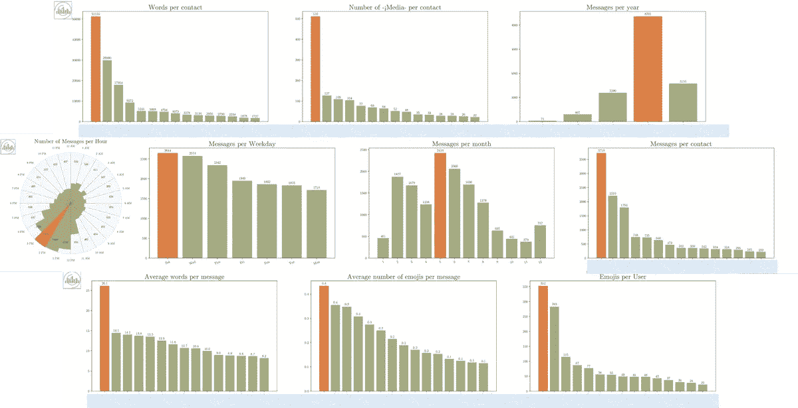

# 基于 Python 的 WhatsApp 聊天分析器

> 原文：<https://towardsdatascience.com/analyzethechat-python-based-whatsapp-chat-analyzer-cb53951c7ebb?source=collection_archive---------14----------------------->


[图像来源](http://www.prism.gatech.edu/~manwar8/AnalyzeTheChat)

以有趣的图表形式分析你的 WhatsApp 聊天

几周前，我和妻子开始查看我们去年在 Whatsapp 上的聊天记录。消息太多了，我们简直无法一一查看。我使用 Python 已经 3 年多了，我想创建一个非常简单的分析器，为我提供一些关于我们 WhatsApp 聊天的有用见解。生成的图表非常有趣。

在本文中，我将介绍我为分析 WhatsApp 聊天而创建的 GitHub 存储库。

# **分析在线演示:**

要查看易于使用的在线演示，而不经历安装存储库和 Python 包的麻烦，请单击下面并按照说明进行操作。

[](https://sites.google.com/view/aqeel-anwar/analyzethechat)

# 什么是 AnalyzeTheChat？

AnalyzeTheChat 是一个基于 Python 的存储库，为你的 WhatsApp 聊天生成有用的统计数据。它会抓取提供的。txt 文件，并生成一个熊猫数据帧。然后对该数据帧进行处理，以绘制以下接触式和时间式统计数据

## 联系方式统计:

*   每个联系人的消息数量
*   每个联系人的字数
*   每个联系人每封邮件的平均字数
*   每个联系人的表情数量
*   每个联系人每条消息的平均表情数量
*   每个联系人的媒体数量
*   每个联系人的关键字数量

## 时间统计

*   每小时的消息数量
*   每个工作日的邮件数量
*   每月的邮件数量
*   每年的邮件数量

下面是一个生成统计数据的示例



图片:【https://github.com/aqeelanwar/AnalyzeTheChat 

# 如何安装 AnalyzeTheChat？

建议为这个项目创建一个新的虚拟环境(使用 python 3.6)。创建虚拟环境的详细步骤可以在[这里](/setting-up-python-platform-for-machine-learning-projects-cfd85682c54b)找到

## 1.克隆存储库

创建虚拟环境后，激活它，并使用以下命令克隆存储库。

```
git clone [https://github.com/aqeelanwar/AnalyzeTheChat.git](https://github.com/aqeelanwar/AnalyzeTheChat.git)
```

## 2.安装所需的软件包

```
cd AnalyzeTheChat
pip install -r requirements.txt
```

# 如何运行 AnalyzeTheChat？

## 1.导出 WhatsApp 聊天

使用以下步骤导出您想要分析的 WhatsApp 聊天

1.  打开 WhatsApp 聊天
2.  单击右上角的三个垂直点
3.  点击更多
4.  单击导出聊天
5.  单击无媒体
6.  保存生成的。可访问的 txt 文件


图片:[https://github.com/aqeelanwar/AnalyzeTheChat](https://github.com/aqeelanwar/AnalyzeTheChat)

## 2.执行代码

```
# Generic
python main.py --path <path-to-chat> --save_as <save-type># Example
python main.py --path theoffice.txt --keyword 'jello' --save_as pdf
```

## 3.争论


图片:[https://github.com/aqeelanwar/AnalyzeTheChat](https://github.com/aqeelanwar/AnalyzeTheChat)

# 查看结果

结果以用户通过参数 *save_as* 选择的格式保存在结果文件夹中。

# 总结:

AnalyzeTheChat 是一个基于 python 的 WhatsApp 聊天分析器，可以生成有趣的条形图。它可以用来分析一个人或一个群聊的活动，以推断出有用的结果。在线演示可以在[这里](http://www.prism.gatech.edu/~manwar8/AnalyzeTheChat)找到