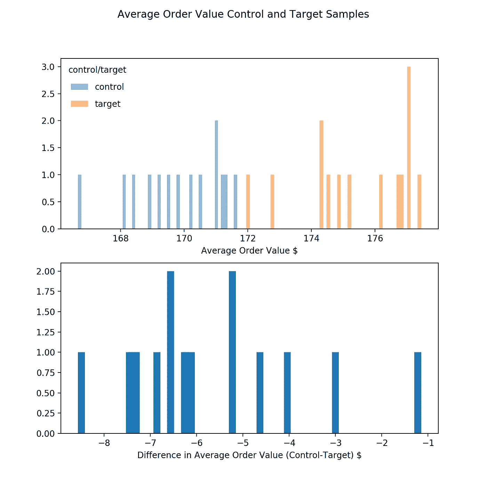

# 用 Python 代码分析 A/B 测试结果

> 原文：<https://towardsdatascience.com/analyzing-a-b-test-results-with-python-code-b55fdcd8a78e?source=collection_archive---------23----------------------->


照片由[mārtiņš·泽姆利克斯](https://unsplash.com/@mzemlickis?utm_source=medium&utm_medium=referral)在 [Unsplash](https://unsplash.com?utm_source=medium&utm_medium=referral) 上拍摄

**A/B 测试的七个步骤，以及如何选择能给出 p 值的正确 Python 库。**

所以你设计了你的 A/B 测试。现在您运行它，使用您在[上一步](https://medium.com/@sujeewak/basic-elements-of-a-b-testing-with-python-code-to-simulate-2b7f342f5ac6)中确定的样本大小(客户数量)和天数。

现在是关键时刻了。销售团队和网页设计团队都在急切地等待你的回答:你的公司为网站引入了一个新功能；这个特性是像销售团队预测的那样降低了销售额，还是像网页设计团队预测的那样保持了销售额不变？

基本上是销量减少了还是没有？

*他们还可以问“网站上的新功能是减少了销售额还是增加了销售额？”。这是有区别的——第一个询问是否有变化，第二个询问变化是积极的还是消极的。我们稍后将讨论第二个问题。*

我们在之前的帖子中讨论过 [p 值。在那篇文章中，我们还研究了](https://medium.com/@sujeewak/p-value-basics-with-python-code-ae5316197c52?source=your_stories_page)[68–95–99.7 规则](https://en.wikipedia.org/wiki/68%E2%80%9395%E2%80%9399.7_rule)。p 值和 68–95–99.7 规则以一定的置信度回答了上述问题。

# 运行 A/B 测试的步骤

1.  [确定您将运行测试的天数](https://medium.com/@sujeewak/basic-elements-of-a-b-testing-with-python-code-to-simulate-2b7f342f5ac6)
2.  [确定样本量——每天有多少客户](https://medium.com/@sujeewak/basic-elements-of-a-b-testing-with-python-code-to-simulate-2b7f342f5ac6)
3.  决定你的无效假设
4.  决定你想要的自信程度
5.  对 1 完全运行测试。第二。超过
6.  获取 p 值
7.  对零假设作出断言:要么拒绝，要么拒绝失败

# 问题设置示例

让我们来看看与前几篇文章相同的例子。我们的客户群平均购买价值 170 美元的产品。网站设计团队想要引入一项新功能，但是销售团队对此感到担忧。您运行 A/B 测试，看看新特性是否会改变平均订单值。你将有一个对照组，他们将看到旧的网站，还有一个目标组，他们将看到有新功能的新网站。

# 1.确定您将运行测试的天数

我们在之前的帖子中讨论过这个问题。让我们假设我们将运行测试 14 天。

# 2.确定样本量——每天有多少客户

[我们在之前的帖子](https://medium.com/@sujeewak/basic-elements-of-a-b-testing-with-python-code-to-simulate-2b7f342f5ac6)中也讨论过这个问题。假设我们的样本中有 10，000 名客户。

# 3.决定你的无效假设

在这种情况下，零假设是新特征不会改变平均阶数值。也就是说，对照组和目标组的平均订单价值都是 170 美元。换句话说，控制组和目标组将从相同的人群中抽取，就好像他们看的是同一个网站。这是我们将要检验的假设。

# 4.决定置信水平

通常，企业会告诉你他们对结果的信心水平。一般来说，大多数企业采用 95%的置信区间。也就是说，你要 95%确定控制组和目标组来自同一人群；也就是说，如果控制组和目标组在 5%的时间里看起来不像来自同一个群体，这是可以的。**所以我们的临界 p 值将是 0.05。**

# 5.运行测试

现在坐下来，对 1 中确定的参数进行测试。第二。没有峰值。如果你需要达到峰值，我们需要设计一个不同的 A/B 测试，比如 Bandit 测试。A/B 测试首先探索，然后在测试结束后利用。一个强盗同时探索和利用，或者学习和赚钱。

我们正在进行 A/B 测试，所以让我们探索整整 14 天。每天我们向对照组展示旧网站，在测试结束时，我们会有 14 个平均订单值。在这 14 天中的每一天，目标群体中的客户都会看到新网站，在测试结束时，我们还会看到他们的 14 个平均订单值。

像这样:

```
control means = cm = [169.84, 166.66, 170.5, 168.09, 168.36, 171.28, 169.53, 169.25, 171.66, 171.03, 168.89, 171.04, 171.20, 170.22]target means = tm = [174.54, 171.95, 177.06, 174.33, 174.85, 174.34, 176.89, 176.71, 172.81, 176.22, 177.45, 177.10, 175.23, 177.09]
```

# 6.获取 p 值

有许多方法可以从两个样本中获得 p 值。

在这种情况下，我们将比较两个样本，看它们是否相似。Kolmogorov-Smirnov 测试是最简单的方法之一，也在 [Python](https://docs.scipy.org/doc/scipy-0.15.1/reference/generated/scipy.stats.ks_2samp.html) 中实现。

```
import scipy.stats as stats
stats.ks_2samp(cm, tm)
```

给你:

```
Ks_2sampResult(statistic=1.0, pvalue=4.985467362637908e-08)
```

这个 p 值是什么意思？这意味着，给定上面给出的对照样本平均分布(cm 的数组)，我们获得上面的目标样本平均分布(由数组 tm 给出)的概率是 5.0x10-⁶ %(来自上面的 pvalue 4.985467362637908 e-08 乘以 100)。也就是说，目标样本来自与对照样本相同的群体的概率非常非常低，约为十亿分之五十。

# 7.对零假设作出断言:要么拒绝，要么拒绝失败

5.0x10-⁶ %的 p 值比我们在上面第 4 步中设定的容差 5%要小得多。因此，看来我们必须拒绝目标样本和控制样本来自同一人群的假设。

让我们实际绘制上面 cm 和 tm 给出的控制和目标均值，看看它看起来像什么:



如果我们用蓝色绘制控制平均值(上面的 cm 阵列),用橙色绘制目标平均值(上面的 tm 阵列),我们会发现它们确实不同，与顶部的图不同。控制均值似乎以 170 美元为中心，而目标均值似乎以 175 美元为中心。如果您查看每对数组(对照减去目标)之间的差异，您会得到底部图，该图显示每天目标平均值都高于对照平均值(x 轴始终为负)。

所以目标均值始终不同于控制均值。这就是我们的 p 值所暗示的。

*注意，目标平均值实际上一直高于控制平均值，但这不是我们在步骤 3 中试图发现的；我们试图发现对照样本和目标样本是相同还是不同，而不是更高或更低。所以我们无法对此做出具体的结论。如果这是一个真正的问题，我们将不得不运行另一个 A/B 测试来找出答案。比赛开始后不要移动球门柱！*

# 示例 2

让我们看第二个例子:

```
cm = [169.84, 166.66, 170.5, 168.09, 168.36, 171.28, 169.53, 169.25, 171.66, 171.03, 168.89, 171.04, 171.20, 170.22]
tm = [169.66, 167.14, 172.11, 169.44, 169.95, 169.46, 171.94, 171.77, 167.97, 171.29, 172.49, 172.14, 170.33, 172.13]
stats.ks_2samp(cm, tm)
Ks_2sampResult(statistic=0.42857142857142855, pvalue=0.15493471530488623)
```

**在这种情况下，由于 0.15 的 KS 检验 p 值大于 0.05 的临界 p 值，我们说我们未能拒绝零假设；我们不能否认对照样本和目标样本来自同一分布。**

鉴于‘拒绝失败’是一个双重否定，难道它不意味着我们接受零假设吗？不，不是的。我们永远不能接受零假设，或者说两个样本来自相同的分布，有 100%的把握。为什么？因为我们一开始就给自己定了一个 95%自信的目标。再次声明，比赛开始后，不要移动球门柱。

你可能会问，我们能不能不把信心水平定在 100%呢？如果我们这样做，我们的尾部容差将是 0.0(从 100%–100%；之前，当我们要求 95%的置信度时，我们的容差是 5%)。也就是说，我们的临界 p 值是 0.0，无论我们做什么，实验的 p 值总是高于 0.0，我们必须始终拒绝零假设。

# 使用哪种算法来比较两个样本

Python 有许多用于计算 p 值的库。您可以使用它们中的任何一个，语法同上。

我们应该使用哪一个？这里有一个宽松的指导方针:

[**双样本 t-检验(学生 t-检验)**](https://docs.scipy.org/doc/scipy/reference/generated/scipy.stats.ttest_ind.html)如果您确信控制样本和目标样本均值呈正态分布
或
如果您测试超过 30 天(因为超过 30 天中央极限定理开始生效并保证常态— 30 不是一个神奇的数字，但在行业中被广泛接受。)

[**Kolmogorov-Smirnov 检验(KS 检验)**](https://docs.scipy.org/doc/scipy-0.14.0/reference/generated/scipy.stats.kstest.html)你无法保证对照和目标均值呈正态分布
或者
你的测试中没有多少天(工业上公认 30 天左右就足够了，虽然这个数字背后并没有什么魔力。在任何情况下，没有企业会允许你运行 30 天的 A/B 测试。)
或
你认为两个样本的均值、方差和分布形状是一样的。
或
如果你想捕捉一天中控制样本和目标样本最大的不同，使用这个测试。KS 测试对测试中最大的差异很敏感。

[**Mann-Whitney 秩检验**](https://docs.scipy.org/doc/scipy/reference/generated/scipy.stats.mannwhitneyu.html)你无法保证控制和目标均值呈正态分布
或者
你的测试中没有多少天(工业上公认 30 天左右就足够了，虽然这个数字背后并没有什么魔力。在任何情况下，没有企业会允许你运行 30 天的 A/B 测试。)
或
你认为两个样本的均值、方差或分布形状不同。

如果您不确定使用哪一个，一个好的经验法则是使用 Mann-Whitney 秩检验。

# 这个故事的寓意

1.  如果测试 p 值< critical p-value reject the null hypothesis
2.  if test p-value >临界 p 值未能拒绝零假设

# **两个重要的教训**

1.  假定零假设为真，p 值给出了我们观察到的现象的概率。它没有告诉我们零假设为真的概率。

所以在我们的第一个例子中，零假设是目标样本和对照样本都来自同一人群。那么我们可以说，假设目标和对照样本均值 tm 和 cm 都来自同一个总体，那么观察到它们的概率是 5.0x10-⁶ %。十亿分之五十的机会，非常小的概率。所以我们拒绝零假设:我们拒绝两个样本来自同一个分布的假设。

它没有告诉我们零假设本身为真的概率。

开车回家是一个很难的教训。但总的来说，在生活中，我们无法说出任何假设为真的概率——我们所能说的只是根据某人的假设进行观察的概率。

2.有了 p 值，我们要么拒绝零假设，要么无法拒绝零假设。你永远不能接受无效假设。
没有拒绝原假设不等于接受原假设。这是因为当我们设定置信水平时，我们总是将自己设定在 100%以下，这意味着我们永远不能 100%确定零假设是真的。