# 分析 NHL 曲棍球的十年

> 原文：<https://towardsdatascience.com/analyzing-a-decade-of-nhl-hockey-e600103ee304?source=collection_archive---------24----------------------->

## 2010 至 2019 赛季

塞斯·赫夫曼在 [Unsplash](https://unsplash.com?utm_source=medium&utm_medium=referral) 上拍摄的照片

T4 我第一次穿溜冰鞋的时候，只有 6 岁。我的弟弟才 4 岁。9 岁时，我开始接受花样滑冰训练。一天，当冰球队到达时，我正试图做一个非常简单的跳跃，我正努力跟随溜冰场右边的圆圈。我不知道该怎么解释。他们停下来时溜冰鞋在溜冰场上的声音让我大吃一惊。车轮撞击瓷砖的声音。传球时球撞击球棍的微妙声音。那天我被卖了。训练结束后，我和我的教练谈了谈，当天我就换成了曲棍球。我整个业余生涯效力的那个俱乐部的主席给了我她儿子的球棍，是给初级球员用的小球棍。我这辈子再也没想过滑冰了。从那天起，我成了一名冰球运动员，并自己发出了那美妙的声音。这不是冰球。这是直排轮曲棍球，四个轮子平行。

# 这项工作的动机

今天我不再打冰球了，也没有机会打冰球了。在这项工作中，我结合了我的两个爱好:数据科学和曲棍球。

这项工作的主要动机是开始寻找一些关于过去十年曲棍球成绩的问题的答案。我将根据我在 [Kaggle](https://www.kaggle.com/martinellis/nhl-game-data) 中找到的数据回答以下问题。

1.  联盟中最好的守门员有哪些？
2.  联盟最佳得分手球员有哪些？
3.  进球多的球队有哪些？
4.  每支球队中罚分最多的球员是谁？
5.  生产 NHL 球员最多的国家是哪个？

让我们开始分析。在我的 [GitHub 存储库](https://github.com/pwolter/HockeyStats)上可以找到关于几个 CSV 文件的细节和数据清理与合并的笔记本。

*“出产更多 NHL 玩家的国家”*图来源此处。该图被上传到 Tableau public 以便于访问。

# 联盟中最好的守门员有哪些？

我从守门员开始，因为当我在工作中接触到他们时，我发现了一个非常重要的关于扑救百分比的问题。如果我们根据扑救百分比得分按降序绘制前 10 名守门员的图表，我们会得到以下图表:

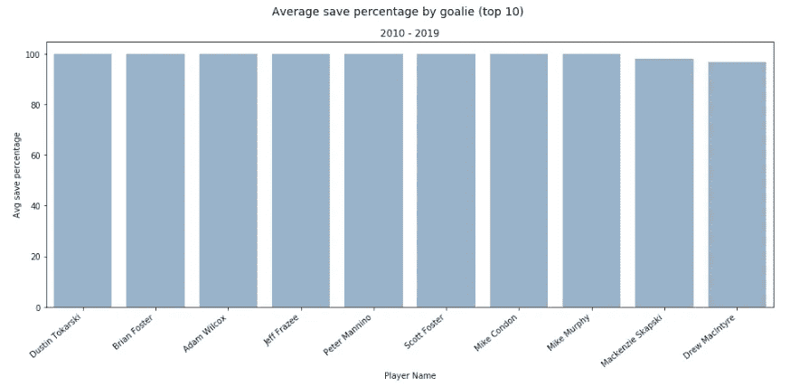

这里发生了什么？他们中没有一个是我们在每场比赛中经常看到的守门员，他们都有 100%的平均扑救率！答案是这些大多是“*紧急守门员*”。你还记得黑鹰队著名的签约紧急守门员斯科特·福斯特 吗？他在该队任职期间从未参加过正式比赛。直到 2017-2018 赛季的那个幸运的夜晚，所有黑鹰队的守门员都受伤了，他被叫出来(终于)穿上衣服。他打了“他一生中最长的 14 分钟曲棍球”,正如他在随后的无数次采访中描述的那样。他打了大约 14 分钟，没有进球，所以他的扑救率是 100%(在他的整个 NHL 职业生涯中！).为了解决这个问题，我考虑了两种选择:

***以 100%的扑救率消灭所有守门员***

这种选择对于经验丰富的守门员和球员来说是不公平的。经验丰富的守门员球员在已经进了 3-4 个球(或更多)时进入冰场代替首发守门员。所以在这种情况下，他们应该得到 100%的储蓄。

***确定分析中需要考虑的最少季节数***

这种方法也有一些警告，因为这产生了一个问题，即什么使最少季节数正确？尽管有这种担心，我还是选择了这个选项。我决定设定最少 5 个赛季，每个赛季 81 场比赛(41 个主场冰加 41 个客场)。

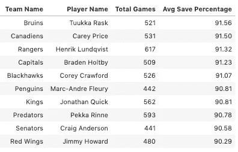

前 10 名守门员平均。保存百分比

现在我们看到了常见的嫌疑人。图克卡·拉斯克成为平均得分更高的守门员。拯救百分比其次是我的两个最爱:**凯里·普莱斯**和**亨里克·伦德奎斯特**。正如你在这里看到的，他们的数字非常接近。它被认为是一个 NHL 守门员！期望值非常高。

# 联盟最佳得分手球员有哪些？

让我们从总进球数的角度来看最好的球员。

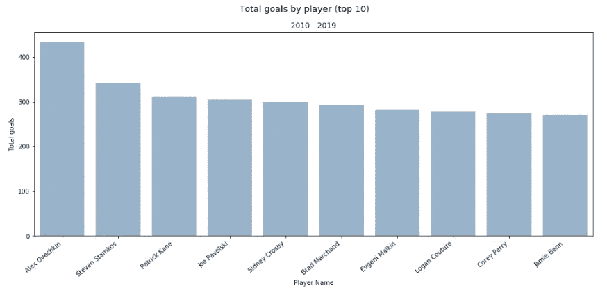

这并没有真正告诉我们事情的全部。这不是 100%准确或公平的，因为有些球员比其他人打得更少，但每场比赛和/或每场冰上时间(每场比赛的时间)得分更多。让我们看看同样的指标，但现在考虑到玩的游戏。

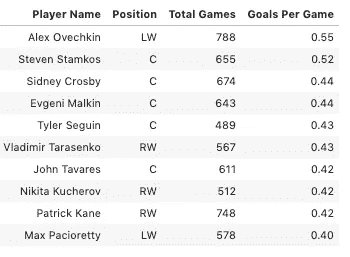

前 10 名球员每场比赛的进球

每场比赛的进球数告诉我们**亚历克斯·奥韦奇金**保持着第一的位置，因为他打了很多比赛，也进了很多球！他几乎每隔一场比赛就进一个球。史蒂文·斯塔姆科斯以非常相似的数字紧随其后，但比奥韦奇金少打了 100 多场比赛。**希尼·克罗斯比**和**叶夫根尼·马尔金**已经跃居榜首，使得企鹅队成为一支非常危险的队伍！毫不奇怪，几乎所有人都是各自球队的队长和前锋/边锋。来自达拉斯明星队的泰勒·塞金(Tyler Seguin)出场次数明显更少，仅为 489 场，但占据第 5 位，因此他的进球非常有效。另一方面，**帕特里克·凯恩**在参加的比赛中排名第二，但进球很少，排名倒数第二。

让我们来看看那些花更多时间在冰上的球员，看看这是否与进球数有关。

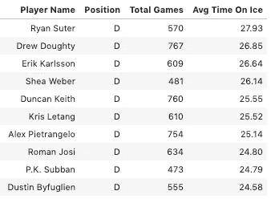

十大防御平均值。冰上时间

按冰上时间排序(TOI)前 10 名都是防守队员。平均每场防守时间大约是 14-25 分钟。那几乎是游戏的一半！瑞安·萨特虽然没有出现在很多比赛中，但还是打了很多分钟。国王队的德鲁·多尔蒂在这十年中几乎一直打半边天比赛。

过滤掉防守球员，我们看到前锋平均 TOI。

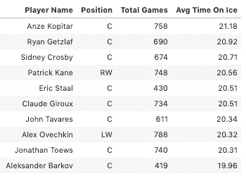

前 10 名球员(无防守)平均。冰上时间

前锋在冰上的时间更少，因为他们倾向于滑得更多。安泽·科普塔尔、**瑞恩·盖茨拉夫**和**希尼·克罗斯比**位居榜首。亚历克斯·奥韦奇金并不在这张图表的首位，但他是一名非常有效率的球员，因为他每场比赛都有进球。

# 进球多的球队有哪些？

我计算了每队进球最多的 3 名球员的平均值，以此来透视每队的得分能力。下图显示了由于三名得分最高的球员，该队得分能力更强。

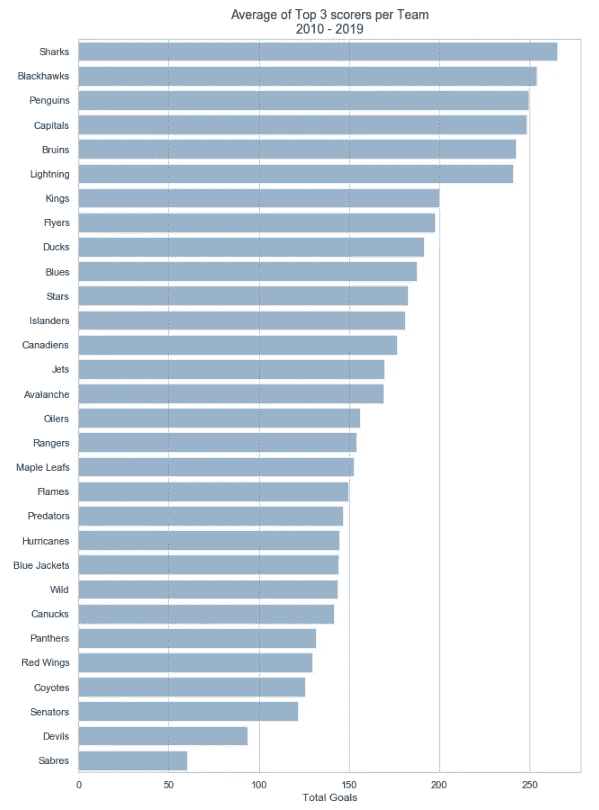

每支球队前 3 名得分手的总进球平均值

这里我们可以看到鲨鱼队前三名球员在过去十年中比其他球队进了更多的球。紧随其后的是最危险的队伍**黑鹰**和**企鹅**分别位居第二和第三。**首都，**然而，尽管**亚历克斯·奥韦奇金的**巨大的生产，只是在第四位。

令人惊讶的是，当看球队每场比赛的进球数时，**星**是每场比赛进更多球的球队(保证每 3 场比赛进 1 球！).紧随其后的是**闪电、** **黑豹**和**油工**。企鹅**队**排在第五位，离每三场比赛进一球还差一点。

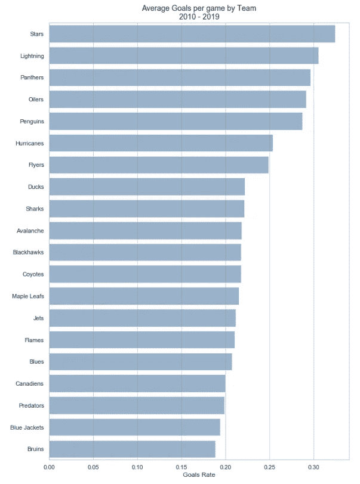

球队每场比赛的平均进球

# 每支球队中罚分最多的球员是谁？

令人惊讶的是这些都不是防御。他们是前锋。参议员克里斯·尼尔每 6 场比赛 10 次坐在罚球线上，高居榜首！。紧随其后的是科迪·麦克劳德和汤姆·威尔逊，他们每场比赛都坐在罚球点上。他们都以力量和身体著称。

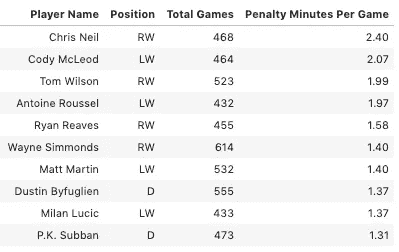

前 10 名球员每场比赛的罚球时间

# 生产 NHL 球员最多的国家是哪个？

发现加拿大为国家冰球联盟提供的球员比其他任何国家都多，这并不奇怪。

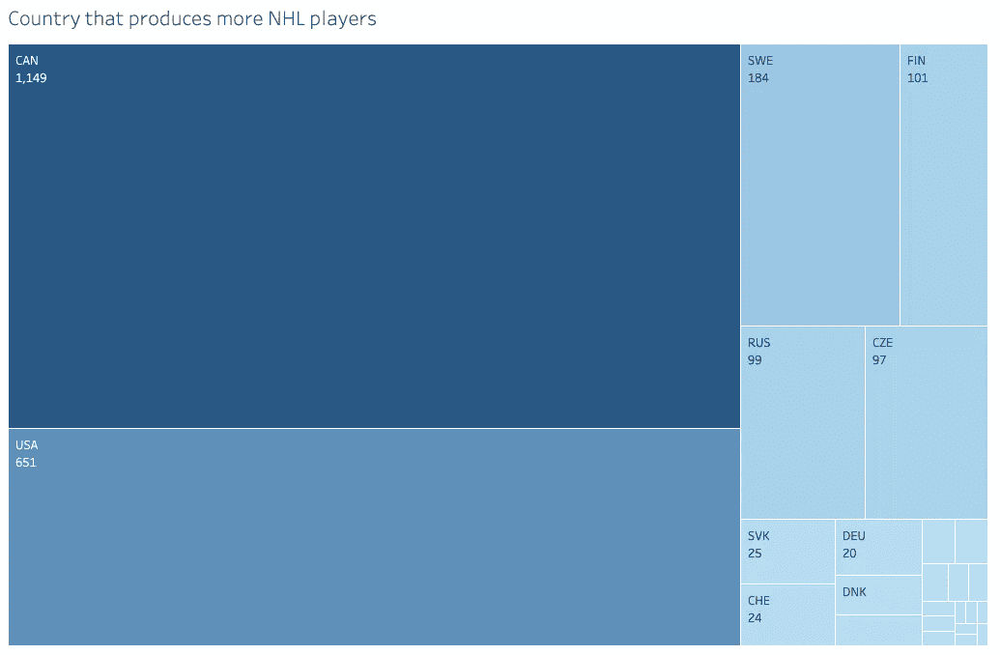

从 2010 年到 2019 年生产更多 NHL 球员的国家

在过去的十年里，加拿大球员的总数达到了 1149 人。其次是**美国**带 **651** 然后是**瑞典**带 **184** 。加拿大玩家的数量几乎是美国玩家的两倍，而美国玩家的数量是瑞典玩家的四倍。

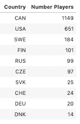

其余前 10 名的国家总共只有 380 名球员。

# 结论

这只是对 NHL 曲棍球十年的描述性分析。在这项工作期间，出现了很多问题，为了能够按时完成，我在这篇文章中忽略了这些问题。我计划在这篇文章的第二部分继续回答其他有趣的问题。例如，未来帖子中会出现的内容有:

*   球队如何将罚球时间与球队输掉比赛联系起来？
*   这和球队在主场还是客场比赛有关系吗？
*   在比赛的最后一节(第三节)或加时赛(加时赛)中，得分最高的球员有什么不同吗？

你最喜欢的球员出现在这部作品的排名中了吗？请在评论中告诉我。此外，让我知道你还有什么兴趣看到第二部分的分析。感谢您的阅读！