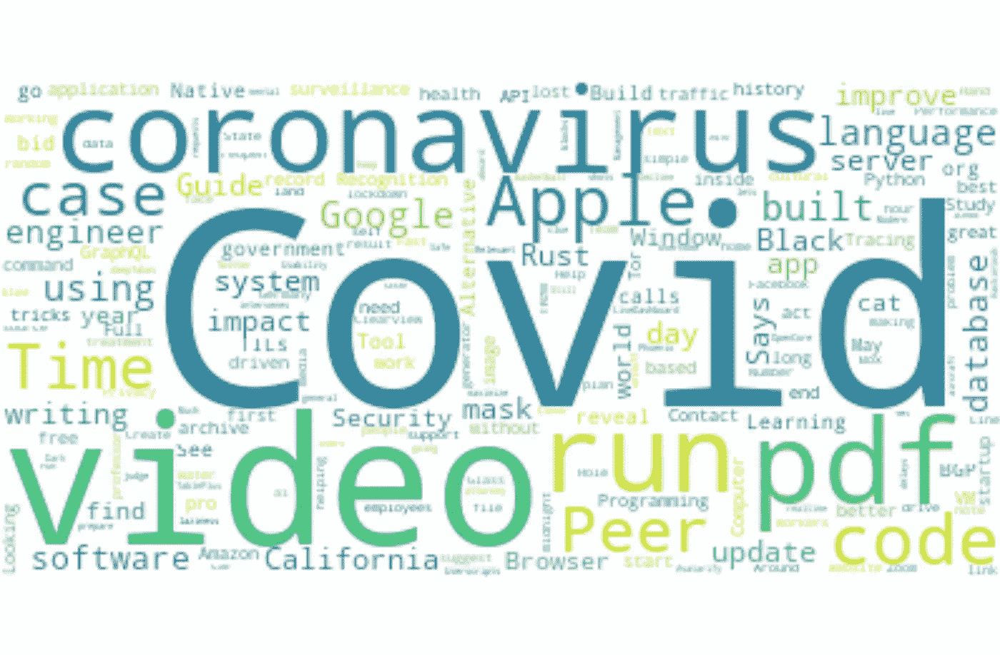
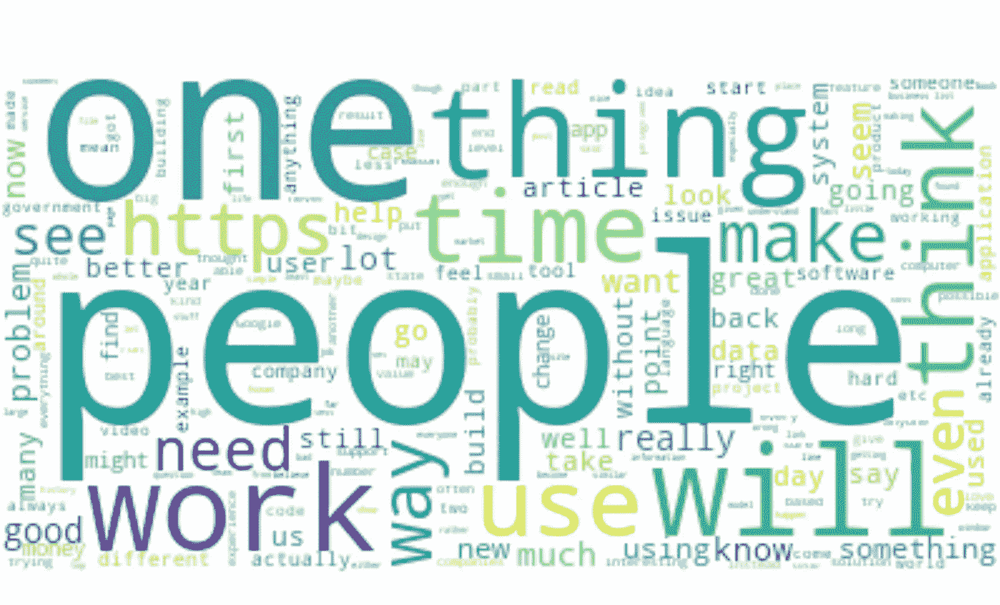
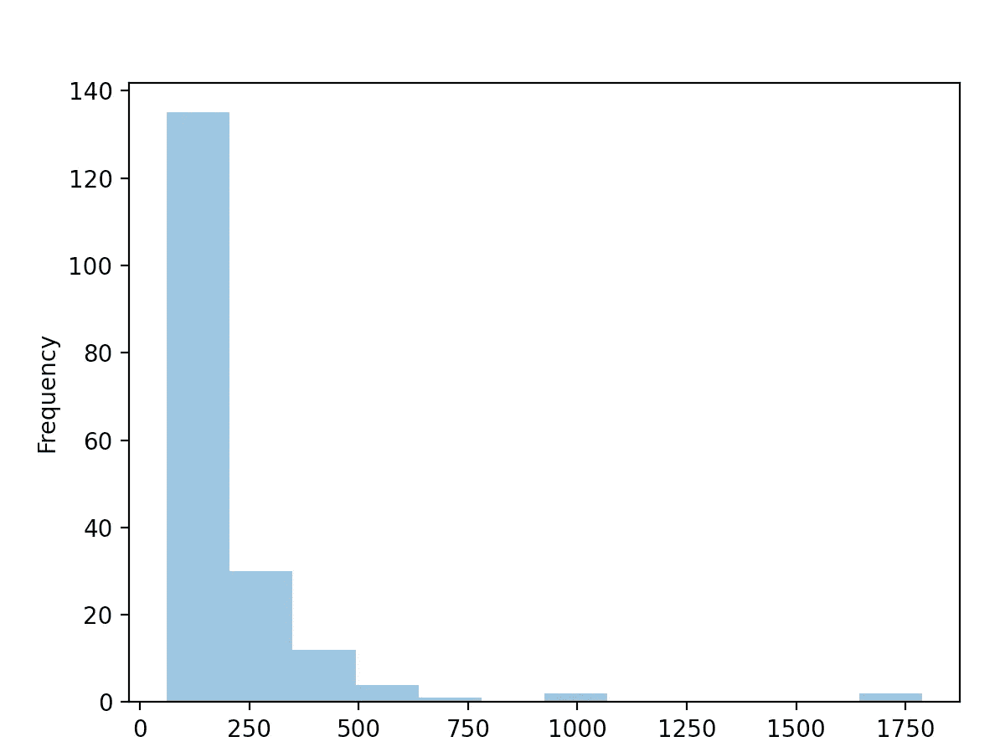
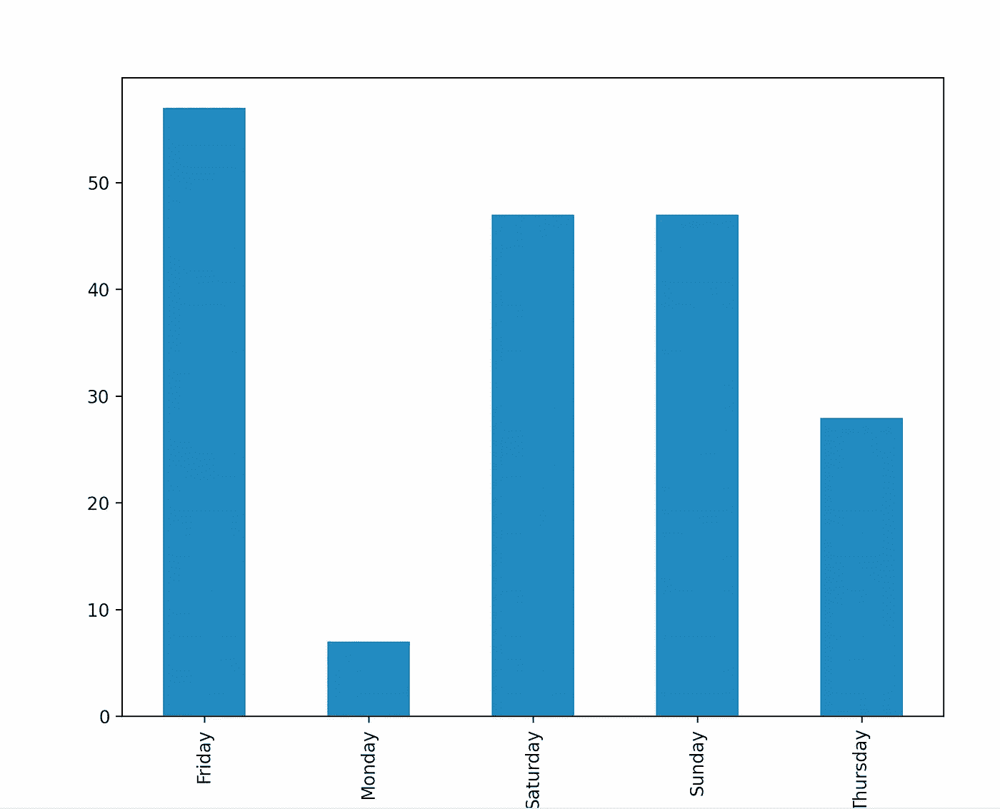
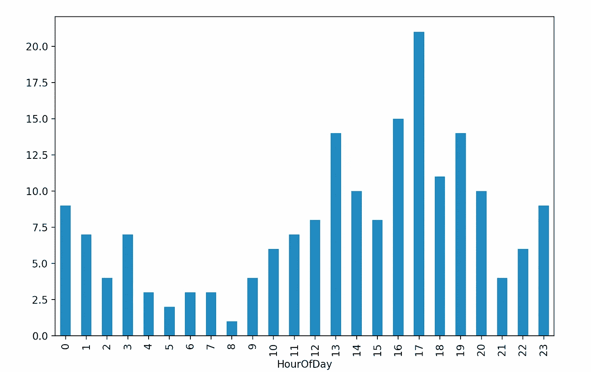
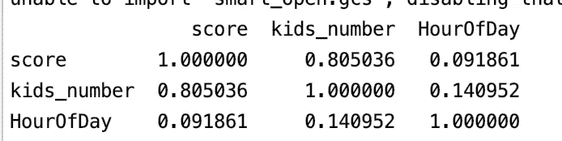

# 分析最佳黑客新闻帖子

> 原文：<https://towardsdatascience.com/analyzing-best-hacker-news-posts-bebd7d2fd791?source=collection_archive---------48----------------------->

*有史以来最佳黑客新闻帖子的统计和文本分析。*

每天我都会查看[黑客新闻](https://news.ycombinator.com/)寻找有趣的信息，无论是文章、故事、软件还是工具。大多数登上头版的投稿都非常有趣和有用，而且社区驱动的帖子管理如此之好的事实让我着迷。

为了这篇文章的目的，我使用了[黑客新闻 API](https://github.com/HackerNews/API) 收集了大约 200 篇提交给 Hacker News 的最好的故事和他们的评论，并对数据进行了一些处理，以获得一点关于什么是一篇好的《HN 邮报》的见解。

在我们开始之前，我必须说，我毫不怀疑黑客新闻提交是好的，这要归功于所提供信息的质量和对该特定信息的兴趣程度。但是，可能还有其他因素，在很小的比例上，帮助 HN 提名登上头版。

记住这一点，让我们看看这篇文章的概述:

*   为我们的分析获取数据
*   数据可视化:单词云和分数分析
*   何时在 HackerNews 上发帖
*   问 HN vs 秀 HN
*   黑客新闻上的人们谈论谁:实体识别和关键词提取
*   结论

*本文原载于* [*程序员背包博客*](https://programmerbackpack.com/latent-dirichlet-allocation-for-topic-modelling-explained-algorithm-and-python-scikit-learn-implementation/) *。如果你想阅读更多这类的故事，一定要访问这个博客。*

*对更多这样的故事感兴趣？在 Twitter 上关注我，地址是*[*@ b _ dmarius*](https://twitter.com/b_dmarius)*，我会在那里发布每一篇新文章。*

# 获取数据进行分析

我使用了 HackerNews API /beststories 端点收集了 188 个有史以来最好的故事。对于每个故事，我也收集了评论(但不是对评论的评论，只有主线)。这是我为每个条目存储的数据。

```
id - the id of the entry
parent - the id of the parent. For a story, it is the same as the id field. For a comment, it's the id of the story to which the commend was added
kids_number - only for stories, meaning the number of comments
score - only for stories: the number of points the submission got
time - UNIX timestamp of the time the entry was added
text - title of posts or texts of comments
type - 'story' or 'comment'
```

我用来获取数据的类的完整代码将在本文末尾提供。

然后，数据存储在 csv_file 中，并从那里加载到 Pandas 帧中。我还需要为我的分析创建另外 4 列: *DayOfWeek，HourOfDay，isAsk，isShow。这些名字不言自明。*

```
dataFetcher = DataFetcher("https://hacker-news.firebaseio.com/v0/", "data.csv")
    dataFetcher.fetchData() df = pd.read_csv("data.csv") df['DateTime'] = pd.to_datetime(df['time'], unit='s')
    df['DayOfWeek'] = df['DateTime'].dt.day_name()
    df['HourOfDay'] = df['DateTime'].dt.hour
    df['isAsk'] = df.apply(lambda x: x.type=='story' and x.text.lower().startswith("ask hn:"), axis=1)
    df['isShow'] = df.apply(lambda x: x.type == 'story' and x.text.lower().startswith("show hn:"), axis=1)
```

# 数据可视化:单词云和分数分析

我首先对数据做了一些探索性的分析。首先，我从故事标题和评论中建立了两个独立的单词云，希望我能对 HackerNews 上常用的单词有所了解。我已经从标题中删除了“展示 HN”和“询问 HN”的标签。

```
stopwords = set(STOPWORDS)
    stopwords.update(["Ask", "Show", "HN"])
    titles_text = " ".join(df[df['type']=='story']['text'].unique())
    titles_cloud = WordCloud(stopwords=stopwords, background_color='white').generate(titles_text)
    plt.figure(figsize=(8, 8), facecolor=None)
    plt.imshow(titles_cloud, interpolation="bilinear")
    plt.axis("off")
    plt.tight_layout(pad=0)
    plt.show()
```



从故事标题构建单词云

除了大的、明显的 Covid 和冠状病毒词，大多数词都与软件、编程和技术有关。一个很好的观察是，视频似乎在黑客新闻上工作得很好(至少这个词云告诉我们)。

也来看看评论吧。

```
comments = " ".join(df[df['type'] == 'comment']['text'].unique())
    comments_cloud = WordCloud(background_color='white').generate(comments)
    plt.figure(figsize=(8, 8), facecolor=None)
    plt.imshow(comments_cloud, interpolation="bilinear")
    plt.axis("off")
    plt.tight_layout(pad=0)
    plt.show()
```



从评论中构建单词云

我有一点失望，因为我没有包括所有关于这个分析的评论，但是评论的数量非常大，我不确定它对我的这篇文章有多大帮助。但是我们都知道有时候我们花在评论区的时间比花在最初提交的帖子上的时间还多😀

然后我想看看最好的帖子的分数。我绘制了一个直方图来说明分数倾向于聚集的值，我还计算了分数的平均值和中值。

```
# Histogram of scores scores = df[df['type']=='story']['score']
    scores.plot.hist(bins=12, alpha=0.5)
    plt.show() # Average score
    print ("Average score: ", df[df['type']=='story']['score'].mean()) # Median score
    print("Median score: ", df[df['type'] == 'story']['score'].median())
```



黑客新闻最佳帖子得分直方图

我们可以看到，大多数故事的得分都低于 200 分，但也有一些异常值，至少有 1000 分。

我的数据集的平均得分为 194.80，但是这受到了异常值的巨大影响。这就是为什么我还计算了**的中间值**，它是 140.0。也就是说，黑客新闻上大约一半的最佳报道得分不到 140 分，而另一半得分超过了 140 分。

# 何时在黑客新闻上发布

这是很多人在网上问的问题。这篇文章绝不是寻找答案的捷径，但我仍然认为我找到了一些有趣的东西。

首先，我绘制了一周中每天的故事分布图。

```
daysOfWeek = df[df['type']=='story'].groupby(['DayOfWeek']).size()
    daysOfWeek.plot.bar()
    plt.show()
```



何时在 HackerNews 上发帖——按星期几发帖

大多数最好的故事都是在周末发布的。不知何故，我期待着这一点。但对我来说最有趣的事实是，没有一个最好的故事是在周二或周三提交的。周一似乎也是非常糟糕的一天，很少有成功的提交。

在做这个分析之前，我还会猜测星期五会获得最多的成功提交。我也不知道具体为什么，只是直觉。

我们还可以看看另一个时间维度，那就是一天中的某个时刻。让我们画出同样的分布。

```
hoursOfDay = df[df['type']=='story'].groupby(['HourOfDay']).size()
    hoursOfDay.plot.bar()
    plt.show()
```



何时在 Hackernews 上发帖——按星期几发帖

让我们的时间列以 UTC 时间显示，我们可以看到大多数成功的帖子是在下午提交的，最大的峰值出现在 UTC 时间下午 5 点。

我想检查的另一件事是，一篇帖子获得的点数和该帖子的评论数之间是否有任何关联。对我来说，这似乎很明显应该是真的:如果人们发现一些足够有趣的东西来投票，他们也可能会在那个帖子上开始讨论。

我还在这个关联矩阵中加入了一天中的某个小时，以检查一天中人们是否有更想参与对话的时候。

```
correlationsData = df[df['type'] =='story'][['score', 'kids_number', 'HourOfDay']]
    print (correlationsData.corr(method='pearson'))
```



何时在黑客新闻上发表文章——相关性

分数和评论数量之间似乎有很强的相关性。正如我所说的，我多少预料到了这一点。但是我对分数和时间之间不存在的相关性有点失望。

# 问 HN vs 秀 HN

接下来，我想看看黑客新闻上有多少最成功的帖子是提问/展示提交的。

```
print ("Count of Ask HN stories: ", df[df['isAsk']==True].shape[0])
    print ("Percentage of Ask HN stories:", 100 * df[df['isAsk']==True].shape[0] / df[df['type']=='story'].shape[0])
    print ("Count of Show HN stories: ", df[df['isShow']==True].shape[0])
    print ("Percentage of Show HN stories:", 100 * df[df['isShow']==True].shape[0] / df[df['type']=='story'].shape[0])
```

似乎只有 8 个帖子问 HN(占我的数据集的 4.30%)，16 个帖子显示 HN(占数据集的 8.60%)。毕竟这里没什么可看的，只有几个提交的问题 HN/展示帖子。

# 黑客新闻上的人们谈论谁:实体识别和关键词提取

下一步是对黑客新闻上的最佳帖子的标题运行一个实体提取器，并从这里保存个人和组织实体，看看是否有任何东西冒出来。我用 [**spacy 进行实体提取**](https://programmerbackpack.com/machine-learning-project-series-building-a-personal-knowledge-management-system-part-1-named-entity-recognition/) 。

我得到了 175 个实体的名单。因为这是一个没有告诉我们任何事情的大列表，所以我只提取了出现不止一次的实体。

```
nlp = spacy.load('en_core_web_sm')
    doc = nlp(". ".join(df[df['type']=='story']['text'].unique()))
    entity_names = [entity.text for entity in doc.ents if entity.label_ in ["PERSON", "ORG"]]
    freq = {entity_names.count(entity): entity  for entity in entity_names}
    for i in sorted (freq.keys()):
        if i > 1:
            print (freq[i])

    # Prints: Amazon, Google, Apple
```

三家科技巨头是唯一三家在最佳黑客新闻帖子中出现不止一次的实体。

最后一步是 [**使用 gensim 从帖子的标题中提取关键词**](https://programmerbackpack.com/machine-learning-project-series-part-2-python-named-entity-recognition/) 。

```
print(keywords(". ".join(df[df['type']=='story']['text'].unique())).split('\n'))
```

这会产生一个巨大的关键字列表，其中前 3 个是:“covid”、“pdf”和“video”。除此之外，大多数关键词都与“生成器”、“应用程序”和“机器学习”有关。

我们不要忘记添加我用来从 Hacker News API 中提取数据的类的代码，正如我在本文开始时承诺的那样。

```
import csv
import requests
from bs4 import BeautifulSoup BEST_STORIES="beststories.json"class DataFetcher: def __init__(self, baseUrl, dataFile):
        self.baseUrl = baseUrl
        self.dataFile = dataFile def fetchData(self):
        with open(self.dataFile, mode='w') as data_file:
            data_writer = csv.writer(data_file, delimiter=',', quotechar='"', quoting=csv.QUOTE_MINIMAL)
            data_writer.writerow(['id', 'parent', 'kids_number', 'score', 'time', 'text', 'type']) # Best stories
            r = requests.get(url=self.baseUrl + BEST_STORIES)
            bestStoriesIds = r.json()
            count = 0
            for id in bestStoriesIds:
                count = count + 1
                print (str(count) + " / " + str(len(bestStoriesIds)))
                story = requests.get(url=self.baseUrl + "item/" + str(id) + ".json")
                storyJson = story.json()
                data_writer.writerow([storyJson['id'], storyJson['parent'] if "parent" in storyJson else storyJson['id'],
                                      len(storyJson['kids']) if 'kids' in storyJson else 0, storyJson['score'],
                                      storyJson['time'], BeautifulSoup(storyJson['title'], features="html.parser").getText(), storyJson['type']]) # Getc
                if "kids" in storyJson:
                    for kidId in storyJson["kids"]:
                        kid = requests.get(url=self.baseUrl + "item/" + str(kidId) + ".json")
                        kidJson = kid.json()
                        if kidJson and kidJson['type'] == 'comment' and "text" in kidJson:
                            data_writer.writerow(
                                [kidJson['id'], storyJson['id'],
                                 len(kidJson['kids']) if 'kids' in kidJson else 0, 0,
                                 kidJson['time'], BeautifulSoup(kidJson['text'], features="html.parser").getText(), kidJson['type'], '']) print ("Latest stories")
            maxId = requests.get(url=self.baseUrl + "maxitem.json").json()
            countDown = 1000
            while countDown > 0:
                print ("Countdown: ", str(countDown))
                story = requests.get(url=self.baseUrl + "item/" + str(maxId) + ".json")
                storyJson = story.json()
                if storyJson["type"] == "story" and storyJson["score"] > 50:
                    countDown = countDown - 1
                    maxId = maxId - 1
                    data_writer.writerow(
                        [storyJson['id'], storyJson['parent'] if "parent" in storyJson else storyJson['id'],
                         len(storyJson['kids']) if 'kids' in storyJson else 0, storyJson['score'],
                         storyJson['time'], BeautifulSoup(storyJson['title'], features="html.parser").getText(),
                         storyJson['type'],
                         storyJson['url'] if "url" in storyJson else '']) # Getc
                    if "kids" in storyJson:
                        for kidId in storyJson["kids"]:
                            kid = requests.get(url=self.baseUrl + "item/" + str(kidId) + ".json")
                            kidJson = kid.json()
                            if kidJson['type'] == 'comment' and "text" in kidJson:
                                data_writer.writerow(
                                    [kidJson['id'], storyJson['id'],
                                     len(kidJson['kids']) if 'kids' in kidJson else 0, 0,
                                     kidJson['time'], BeautifulSoup(kidJson['text'], features="html.parser").getText(),
                                     kidJson['type'], ''])
```

# 结论

这就是我对有史以来最佳黑客新闻帖子的小小分析。我真的很喜欢摆弄这些数据。我希望你也喜欢这个，并从这个项目中获得一些有意义的见解。

*本文原载于* [*程序员背包博客*](https://programmerbackpack.com/latent-dirichlet-allocation-for-topic-modelling-explained-algorithm-and-python-scikit-learn-implementation/) *。如果你想阅读更多这类的故事，一定要访问这个博客。*

*非常感谢您阅读本文！有兴趣了解更多吗？在 Twitter 上关注我，地址是*[*@ b _ dmarius*](https://twitter.com/b_dmarius)*，我会在那里发布每一篇新文章。*