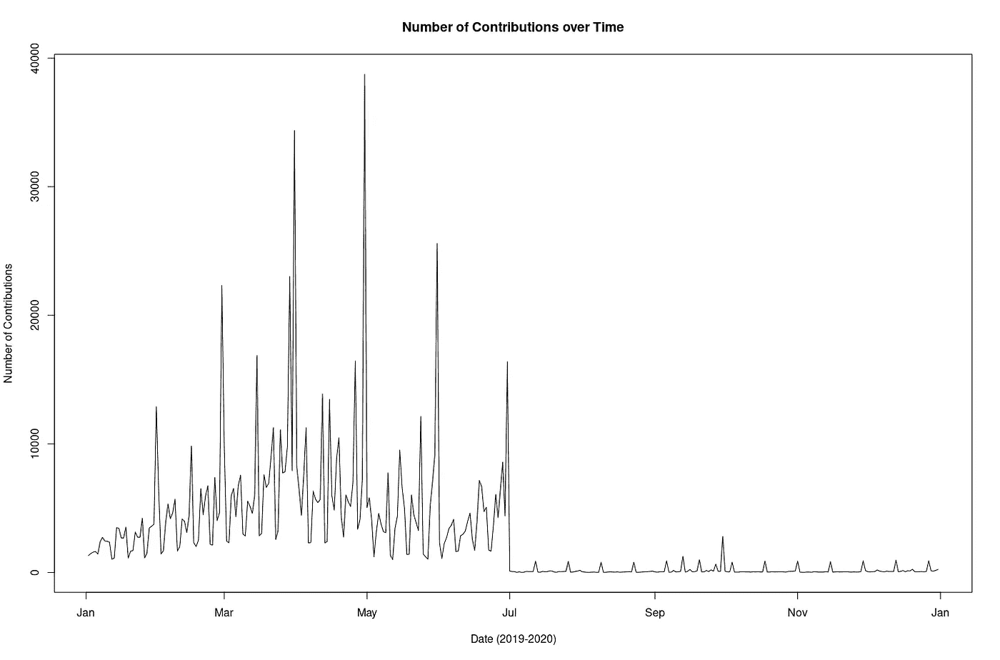
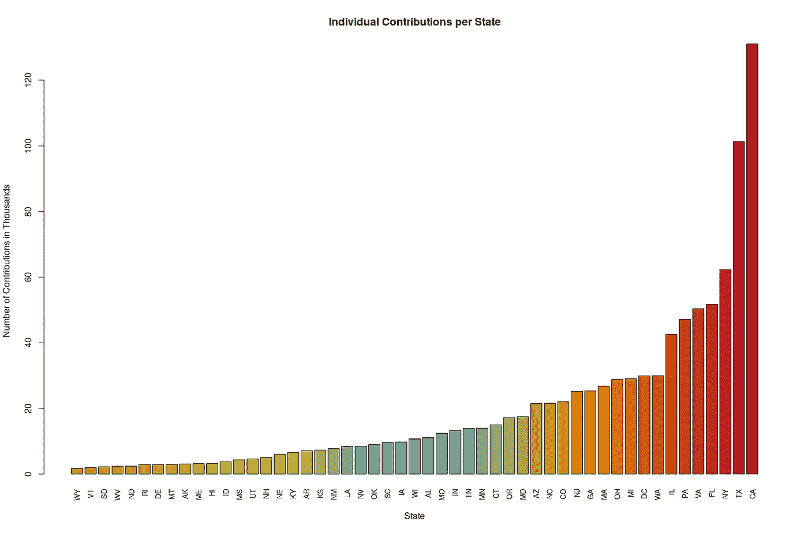
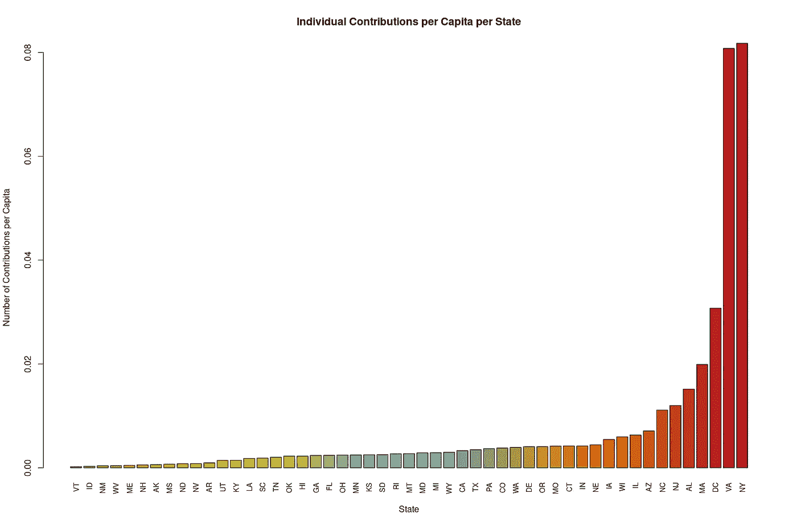
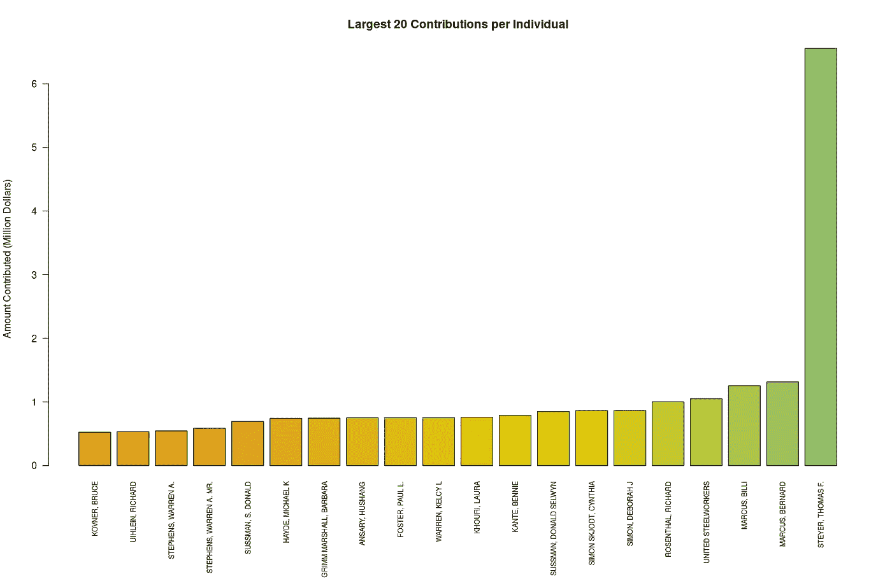

# 分析公民个人的竞选捐款

> 原文：<https://towardsdatascience.com/analyzing-campaign-contributions-from-individual-citizens-8fae00b40f5b?source=collection_archive---------37----------------------->

## r 的一项研究。

# 简介:

竞选捐款在美国政治体系中发挥着重要作用。当大多数人考虑竞选捐款时，他们通常会想到超级政治行动委员会，因为他们向候选人捐款最多。然而，这忽略了来自全国各地的个人贡献。

有了联邦选举委员会(FEC)的公开数据，我们可以从他们的[网站](https://www.fec.gov/data/browse-data/?tab=bulk-data)观察个人捐款数据。要下载我将使用的数据，请执行以下操作:

*   点击**个人捐款**
*   下载 2019–2020 年数据。

# 探索性数据分析:

包含有问题数据的表格并不完美，需要采取一些步骤进行清理，最重要的注意事项是:

*   每个条目由竖线字符`|`分隔
*   列的标签不存在。
*   交易日期列需要重新格式化。

幸运的是，带有数据集的 CSV 文件包含列的标签。对于交易日期，还需要做一些工作。

如果自动读取，R 会假设交易日期是一个数字，因为它就是。日期的结构如下:MMDDYYYY。这个结构很重要。如果月份小于 10，日期的月份将以 0 开始，这意味着 R 决定忽略它，因为它将日期作为整数读入，这使得到 date 对象的转换很困难。

这个问题可以通过加载数据样本、操作交易日期的类，以及使用类集加载更大的数据子集进行探索来缓解，这与具有超过 3400 万个观察值的完整数据集相比，利用了 100 万个样本。在我的笔记本电脑上，这需要大约一分半钟。通过使用更多的行，装载时间会成倍增加。

即使有 100 万个样本，它仍然不能代表更大的图景——特别是考虑到这些数据可以被结构化为时间序列这一事实。通过从 34 个中取出第一个 100 万，我们只观察到捐款的一个小时间窗口。我们将在随后的章节中观察这些故障如何妨碍我们的分析。

# 时间序列分析:

如前所述，这些数据可以塑造成一个时间序列。然而，在本报告中，分析仅针对前 100 万个样本。在某个特定的日期之后，我们应该期待一个贡献计数的显著下降。有了足够强大的计算机，这个代码可以扩展到分析所有 3400 万次观察。

按作者分列的数字

从上面可以看出，我们的假设是正确的。这意味着前一百万次观察主要发生在 2019 年的前七个月。

# 状态分析:

一个自然的假设是分解并比较各州的个人贡献。当按每个状态分组并找到它们的相对频率时，需要注意的是有 62 个状态，其中 61 个有效，另一个为空。

但是，怎么会有 61 个有效的状态条目呢？除去我们已经知道的典型的 50 个州和 DC，剩下的 10 个州由联邦/领地、军队州、外国，当然还有空州组成。与 50 个国家和 DC 相比，这 10 个国家的捐款数量微不足道。正因为如此，这次探索的主要焦点将是美国的 50 个州和 DC。

按作者分列的数字

单纯的票数本身就表明了某些州之间的指数差距。然而，单纯的数量并不能代表捐款对选举的影响。事实上，应该预料到加利福尼亚和德克萨斯的投票人数最多，因为它们是最大的州。为了尝试解决这一问题，将使用可视化每个国家的人均捐款数量。

为了找出各州的人均收入，我们将我们的观察值除以各州的人口数。[美国人口普查局提供了美国 50 个州的人口数据，这里将使用这些数据](https://www.census.gov/data/datasets/time-series/demo/popest/2010s-state-total.html#par_textimage_1873399417)。不出所料，包含我们信息的 excel 表格也需要清理一下。关于 excel 文件的重要注意事项如下:

*   由于格式不规则，列名没有被读入。
*   五十个州名前面都包含一个句点(即。德克萨斯”而不是“德克萨斯”。)
*   贡献数据集使用州的缩写(TX ),而人口普查数据使用州的实际名称(德克萨斯州。)

按作者分列的数字

从上面的结果中我们可以看到，纽约和弗吉尼亚的人均捐款数最多，这可能使它们成为筹款的关键州。这进一步强化了这样一种观念，即捐款的数量本身并不能代表整个竞选过程。

# 谁在大厅里？

因为这个数据集的主要焦点是看个人的贡献，所以只适合分析个人本身。然而，在 100 万个投稿中，几乎有无限多种不同的名字。需要有一种直接的方法来判断谁作为个人对政治有着深厚的热情——甚至更深的口袋。为了找到我们家乡的游说者，我将所有的名字分组，并总结出代表捐款金额的那一栏。从那里，我们可以得到前 20 名贡献者，看看他们愿意付出多少。

然而，这一分析并不完美。我们应该记住，这些是 2019 年上半年最大的贡献者。此外，当查看左边的第三和第四个条时，我们看到这些贡献是由同一个人做出的。然而，在一个例子中，他的头衔(先生)在他的名字里，而在另一个例子中，却没有。基本正则表达式可以通过省略诸如先生、小姐等头衔来清除姓名。然而，这并没有忽视每个人所贡献的大量资金。即使是前 20 名贡献者，托马斯·f·施泰尔(贡献最大)和布鲁士·高富拿(贡献“最小”)之间也有超过 8 倍的显著差距！

# 结论:

有了一台更强大的计算机，上面进行的分析可以更深入地了解竞选活动在这个国家可以获得的资金种类。尽管超级政治行动委员会凭借其巨大的影响力和影响力主导着政治领域，但仅 2019 年第一阶段的前 20 名捐助者就贡献了超过 1000 万美元的捐款。我们的时间序列是受计算资源缺乏影响最大的分析。这是预料之中的，并在第 3 节中得到证实。正因为如此，假设各州的数据也可能与本报告中的结果不同也是安全的，因为我们无法使用 2019 年上半年来预测另一年的捐款价值。