# 用 Python 分析芝加哥法院数据

> 原文：<https://towardsdatascience.com/analyzing-chicago-court-data-with-python-8a4bae330dfd?source=collection_archive---------33----------------------->

## [变更数据](https://towardsdatascience.com/tagged/data-for-change)

## 从库克县公开法庭数据预测精神健康相关的处置和判决

```
*Note from the author: This article is based on a project and the report created by myself, Karmen Hutchinson, Kelsey Markey and Alene Rhea for our final project in the course DSGA1001 at NYU CDS. This article reflects my personal learnings, experiences, and opinions on our project and relies heavily on the work we did together as well as the project report that we all wrote and submitted together, but I am not by any means speaking for our group as a whole, or taking full credit for our project, which we did collaboratively and as a team. This article reflects my personal opinions and reflections only.*
```

D 在我读研的第一个学期，我与我的队友 Karmen Hutchinson、Kelsey Markey 和 Alene Rhea 在我们的数据科学导论课程中合作了一个机器学习项目。这是我与团队合作的第一批数据科学项目之一，我很感激有机会与上述人员一起工作。这是一次很棒的经历，这篇博文的发现是团队合作的结果。通过这篇文章，我希望与数据科学界的其他人分享我所学到的东西。特别是，尽管我们的团队没有找到结论性的结果，但我从寻找数据集、建立模型、评估模型以及与同行交流我们的发现的过程中学到了很多。让我们开始吧！


照片由[卡莱斯·拉巴达](https://unsplash.com/@carlesrgm?utm_source=unsplash&utm_medium=referral&utm_content=creditCopyText)在 [Unsplash](https://unsplash.com/s/photos/jail?utm_source=unsplash&utm_medium=referral&utm_content=creditCopyText) 上拍摄

对于这个项目，我们的团队使用了来自 2019 年 12 月 2 日更新的数据集，这些数据集来自库克县开放数据门户[上的](https://datacatalog.cookcountyil.gov/)[数据集](https://datacatalog. Cookcountyil.gov))。能够处理政府数据并理解政府机构跟踪心理健康的不同方法是很有趣的。该项目的目标是基于库克县的数据集，更好地了解和发现可能患有精神疾病的人。有趣的是，我们看到在这个数据集中，有精神疾病的个人在监狱中的人数据报道高达 30%，超过全国平均水平近 10%(行为健康创新，2015)。库克县在专业治疗法院和项目方面也处于领先地位，这些法院和项目可以及早识别符合条件的个人，并将他们与基于社区的服务联系起来，以增加成功的缓刑和重返社区的机会(TASC 健康与司法中心，2019 年)。然而，进入精神健康法院程序需要卫生部门的当前案例，并且发生在法律程序的相对较晚阶段。

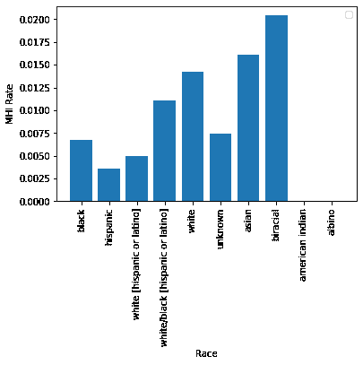

这个项目之所以相关的一个重要原因是，患有精神疾病的人特别容易触犯法律。因此，他们在通过刑事司法系统时，往往需要专门的资源和周到的治疗。具体来说，当我们在这个项目中工作时，我们的团队旨在从一组司法和基于案例的特征中预测精神健康相关的倾向和判决，这些特征仅在初始阶段可用。早期发现可能患有精神疾病的人将使政府和其他机构能够尽早向这些人提供适当的支持。与普通人群相比，刑事司法系统涉及的个人中精神健康障碍的发生率要高三至六倍(Blandford & Osher，2012 年)。也有证据表明，患有精神健康疾病的人在监狱中度过的时间明显更长，并且在释放后一年内再次入狱的可能性接近两倍(Haneberg & Watts，2016 年；Eno Louden & Skeem 2011)。这为患有精神健康疾病的人创造了一个不利的环境，并形成了一个问题循环，他们被释放到社区，但很可能在未来又回到司法系统。该项目的目标是减少通过法律系统转移对精神健康障碍患者的有害影响，同时也最大限度地减少国家承担的费用。为了做到这一点，我们旨在预测一个人患有精神健康障碍的可能性，只要他们被引入法律系统(不需要医疗记录或人员)。审前识别个人允许迅速和适当的干预(即监狱转送干预)和资源(即强化案件管理方案，见 Loveland 等人，2007 年)，以避免继续卷入法律系统。总的来说，我们的项目强调了在这样的系统中不同影响跟踪的需要。

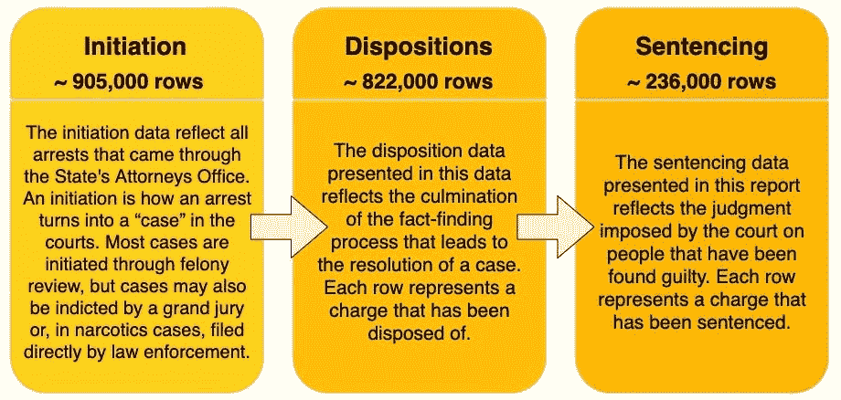

本研究中使用的库克县法律数据集的描述。由项目团队成员创建的图像。

首先，让我们看看我们团队使用的数据集。库克县数据集包含多个标识号，这些标识号将它们之间的记录联系起来。因为我们想在个人层面上进行预测，所以我们使用了 case_participant_id。Case_participant_id 是库克郡分配给与案例相关的每个人的唯一内部标识符。每个 case_participant_id 可以与多个费用关联，每个费用在数据集中显示为单独的一行。如果发生了重新判决，一项指控可能会在判决数据集中显示为多行。此外，我们的团队还希望将我们的训练数据限制在 Initiation 中的 27 列，以便模拟用例。其中 14 列是分类的，6 列是基于时间的。

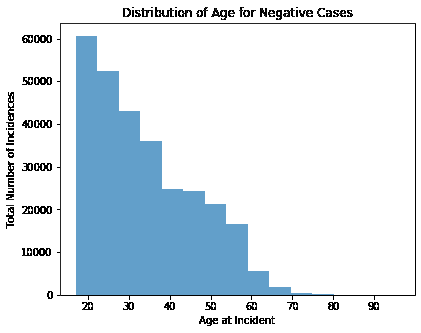

由于问题和数据集的性质，我们实际上创建了自己的目标变量。由于我们希望根据精神健康对个人进行分类，因此我们创建了一个二元目标变量“精神健康指标(MHI)”来表示个人是否被识别为患有精神健康残疾。我们查看了所有可能表明精神健康相关结果的量刑和处置的可能价值，并确定了 6 栏中的 15 个相关价值。我们将判决和处置数据集放在一起，以确定哪些行包含 MHI 的代理。例如，如果找到了这样的实例，则该个人有一个 sentence_type = "住院精神健康服务"，则该行的 MHI 为 1，否则为 0。由于可能有多行属于 case_participant_id，我们创建了一个单独的数据集，其中包含每个唯一的 case_participant_id 的一行，以及相应的 MHI。如果对应于该 ID 的任何行的 MHI 为 1，则每个唯一 ID 都被赋予 1。最终，我们能够分配 1 到 2212 个唯一的 case_participant_id 的 MHI。

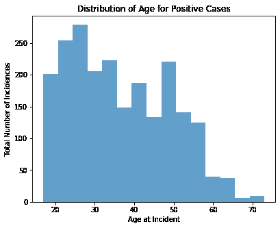

由于年龄、种族和性别等受保护的类别可能会在模型中引入偏见，我们检查了它们在阳性和阴性标签实例中的分布。我们发现，阳性病例的年龄偏高，女性 MHI =1 的可能性几乎是男性的四倍，被标记为“混血儿”或“亚裔”的人跨种族的 MHI 阳性率最高，被标记为“西班牙裔”的人跨种族的 MHI 阳性率最低。

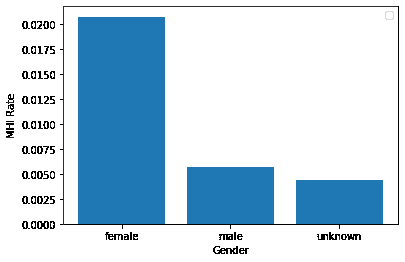

接下来，我们清理了数据集。在数据清理期间，我们更改了一些数据类型，填充缺失的信息，验证列中的输入是否一致，应用 StandardScaler()等缩放方法，以及 one hot 编码分类变量。具体来说，我们做了以下工作:

*   所有字符串变量都被转换成小写。
*   数字列(如 charge_count)被转换为整数。
*   所有缺失或异常的数值都被替换为中间值。
*   所有缺失的非数字输入都被替换为“未知”(因为数据调查显示这是库克郡已经实施的常见填充符。)
*   除“男性”和“女性”(即空值或“男性姓名，未给出性别”)之外的所有性别值都被转换为“未知”
*   年龄被转换成整数，空值和外围值(大于 100)被中值年龄所取代。在我们的伪基线随机森林表明年龄是一个极其重要的因素后，我们考虑建立一个单独的模型来预测和估算缺失的年龄。鉴于项目的时间限制，这被认为是不可行的。
*   转换为日期时间的日期和缺失或未知的日期被赋予一个对应于 1900 年 1 月 1 日午夜的填充值
*   因为关联热图显示 ID 号与重要特征相关，所以所有 ID 号都从数据中去除，以防止潜在的数据泄漏。Case_participant_id 设置为索引，而 case_id、charge_id 和 charge_version_id 从数据集中完全删除。

我们将所有分类变量转换为二进制虚拟变量，以允许使用参数模型，并为行的聚合做准备。这就产生了一个稀疏的高维数据集。

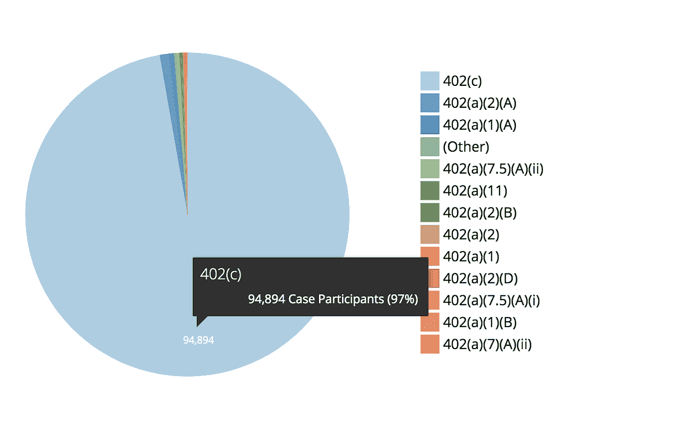

有“402”部分的案例参与者的频率。作者创建的图表。

因为我们使用的数据集非常不平衡，所以我们应用了缩减采样。为了帮助我们的模型学习识别数据集中的阳性类，我们使用随机分层采样对训练集中的阴性案例进行了缩减采样。考虑到对更大计算资源的访问，我们也想尝试一下上采样。具体来说，我们使用 100%的正面实例，并且不替换负面实例进行采样。最初，我们对负面实例进行缩减采样，使得正面实例占训练集人口的 50%，假设这将是我们的数据和用例的理想比率。但是，验证集和测试集没有缩减采样以复制部署。

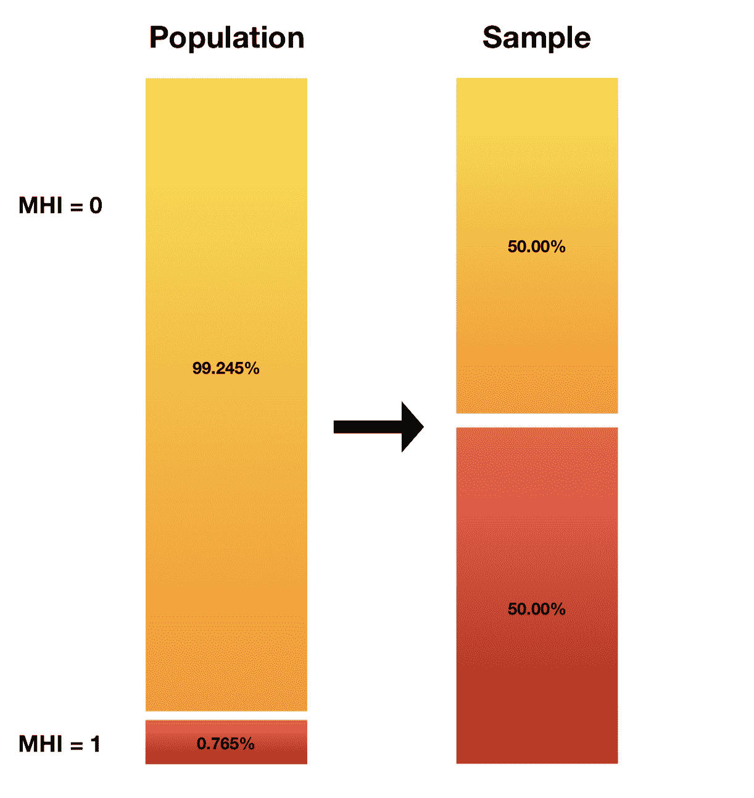

数据集总体中和缩减采样后的类概率。作者创建的图像。

接下来，我们将数据集分成训练集、测试集和验证集。特别是，我们选择将数据集分为 70%数据的训练集、15%数据的静态验证集和 15%数据的测试集，这一比例得到了许多数据科学家的认可(Shah，2017)。为了模拟部署环境，其中我们的模型将用于预测未来时间，我们根据 received_date 划分了我们的训练、验证和测试集。接收日期最早的案例成为我们的训练集，最后的案例成为我们的测试集。我们想要使用基于时间的分区的一个原因是为了防止数据泄漏。

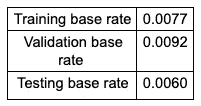

跨数据集的 MHI 基本汇率

为了降低数据的维度，在实施虚拟变量后，数据的维度增长到近 5000 个特征，我们使用了主成分分析，因为它简单、有效且可用于从数据集提取相关信息的非参数应用(Shlens，2014)。我们在我们的规模训练集上使用了 PCA 的经典应用(尽管稀疏 PCA 应该在未来的工作中进行研究)，这产生了解释的方差比。给定更大的计算资源，我们希望使用 500 个主成分来执行测试，因为我们在该点看到一个尖锐的弯头。

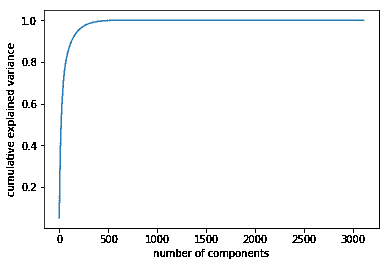

在评估我们的模型时，我们关注两个性能指标:(1)受试者工作曲线下面积(AUC ),和(2)灵敏度。我们对此的推理是因为我们认为在我们的用例中，假阴性的成本要比假阳性的成本高得多；错过一个精神疾病的例子可能对那个人有害，但是向一个没有特别需求的人提供支持和服务可能只会给国家带来边际运营成本。然而，在没有库克县可用资源和心理健康相关预算限制的具体知识的情况下，我们试图提供一个可以在不同阈值下表现良好的模型。因此，我们针对 AUC 优化了我们的模型，密切关注每次迭代对灵敏度的影响。这种选择是基于这样的认识，即由于我们的基础率低，准确性将是一个很差的指标，因为它可能非常高，即使少数民族阶层没有得到很好的预测。另一方面，AUC 更适合我们的业务目标，因为它对类别不平衡很敏感，因为它对少数类别和多数类别一样重视。

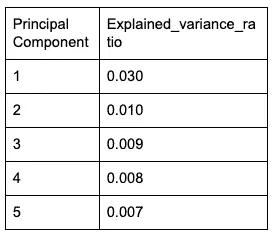

解释主成分分析的差异率

优化 AUC 提供了一个自然的基线，因为 0.5 的 AUC 代表随机分配类别概率的模型(Brownlee，2019)。使用 50%的概率截止值，这种模型的预期灵敏度也将是 0.5。将该阈值降低到 0%(即，将每个病例分配到阳性类别)将是最大化灵敏度的最简单方法；事实上，这种模型的灵敏度是 1。这进一步说明了在这种情况下优化 AUC 比优化敏感性更好的原因:我们的目标不是简单地识别阳性实例，而是以最小的 I 型错误来进行。

我们运行的第一个模型是一个随机森林模型，具有现成的参数，适合我们清理和缩减采样的训练集。我们称之为“伪基线”，因为在这个阶段我们已经在数据管理上投入了大量的时间。基于系综树的方法被选为基线，因为已知它们在分类变量上表现良好(Tutz & Berger，2017)。在特征工程和超参数调整之前，我们将该模型视为开始的基线。这种未精炼的模型产生了 0.78 的 AUC 和 0.78 的灵敏度。

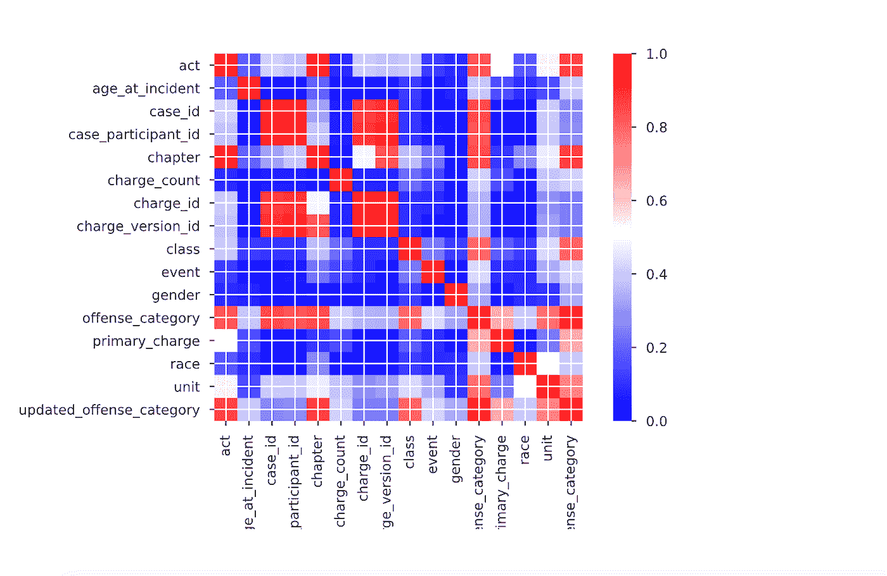

特征相关性

在我们的伪基线随机森林中展示的特征重要性指导了我们大部分的初始特征工程。例如，“Section 402(c)”属于前十五个重要特征，进一步的研究表明，这对应于与毒品或持有毒品相关的法律部分(伊利诺伊州州务卿)。因此，研究人员设计了一个新的指示变量，以编码 section 列是否包含 402(c)以外的其他“402”部分。为了关联附近的区域，我们将事件城市地理编码为纬度和经度。地理编码还确保我们的位置代理在整个数据集中是一致的。还设计了许多日期时间特性，试图更好地表示我们假设的心理健康事件和时间之间的相关关系。最后，由于事件发生时的年龄有近 4%的缺失值和大约 40 个(不现实的)超过 100 的异常年龄，我们为事件发生时的年龄是否为空和年龄是否超过 100 创建了一个二元特征。

就我们想要应用于这个问题的算法而言，我们确定了五种算法来探索:逻辑回归、决策树、随机森林、梯度推进和支持向量机。在所有特征工程完成后，使用已清理、已缩放和已缩减采样的数据的现成参数来建立每个模型的初始性能。

由于数据集的高维数，我们选择不使用 k-最近邻模型(kNN)进行实验。在这种情况下，事实上可能相似的实例可能有很大的距离，因此 kNN 可能表现不佳(Brownlee，2016)。我们还决定不实现朴素贝叶斯分类器，因为使用哑变量来编码分类数据明显违反了算法的条件独立性假设。

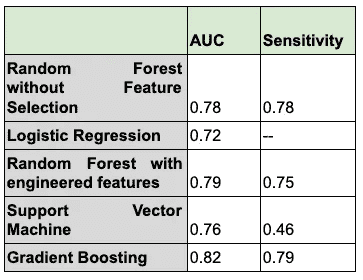

使用现成参数的验证集的性能指标

由于数据集的高维数，我们选择不使用 k-最近邻模型(kNN)进行实验。在这种情况下，事实上可能相似的实例可能有很大的距离，因此 kNN 可能表现不佳(Brownlee，2016)。我们还决定不实现朴素贝叶斯分类器，因为使用哑变量来编码分类数据明显违反了算法的条件独立性假设。

**支持向量机** 通常被视为机器学习的通用算法，我们选择 SVM 作为我们的探索模型之一，因为它能够通过线性或非线性内核捕捉复杂的关系。然而，SVM 比我们的任何其他模型花费更长的时间来训练，可能是因为我们的大量功能和支持 SVM 的约束优化问题(Ragnar，2016)。此外，它没有产生证明长时间训练是合理的结果。研究人员确定，开箱即用的 SVM 模型的运行时间和极低的灵敏度(0.46)意味着它不会成为超参数调整的候选对象。

**逻辑回归** 逻辑回归因其稳健性、可靠性和直观解释而被选中。此外，使用随机梯度下降的方法，逻辑模型相对容易用新数据更新，并且可以容易地被正则化以避免过度拟合(李，2017)。在进行适当的转换之后和调整之前，当使用所有~4800 特性时，模型无法收敛。增加最大迭代次数、测试不同的解算器以及测试不同的非线性特征变换都无法使模型收敛。假设多重共线性可能是一个问题，我们从随机森林中减少了前十个要素重要性的列数，并发现模型(使用 solver = 'liblinear '和 C = 1e30)能够拟合 AUC 为 0.72 的数据。我们最终决定不进行逻辑回归，因为很难将逻辑回归拟合到我们的虚拟变量，并且我们已经使用树方法得到了令人印象深刻的结果。

**决策树
虽然集成方法通常在关键指标上优于决策树，但是单一决策树可以提供有价值的透明性。我们决定尝试创建可解释的决策树，因为在 hand⁴.问题的背景下，透明度尤其重要**

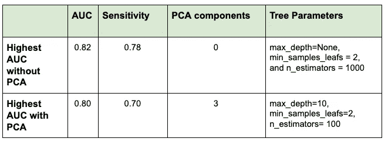

验证集上的随机森林调优和性能

政府用来辅助决策的模型要接受公众的审查，因此提取一套直观的规则来解释其决策的能力可能值得降低绩效指标。树是根据未缩放的数据训练的，因此数值是可以解释的。研究人员迭代了 max_depth (2，3，4)、min_samples_leaf (1，10，100，500)和 max_features (10，5，3，无)的值。超参数的最佳组合是 max_depth=4，min_samples_leaf=10，max_features=None，AUC 为 0.75，灵敏度为 0.86。

**随机森林** 经过特征工程，我们用默认参数评估了一个随机森林模型，发现 AUC 上升到 0.79，灵敏度下降到 0.75。考虑到模型的高性能，我们决定继续调整随机森林模型，包括超参数调整和特征提取。我们从调整超参数开始，测试了一系列 max _ depths(无、3、10、30)、min_samples_leaf (2、50、100、200)和 n_estimators (10、100、500、1000)。我们发现在这些条件下，AUC 优化为 0.82，灵敏度= 0.78(表 A4)。然后，我们决定使用各种 PCA 组件进行调优，并使用 1、3、100 和 1000 的 PCA 组件以及不使用 PCA 的组件测试了相同的树参数。最终，没有 PCA 成分和超参数的组合可以击败没有 PCA 的模型性能。

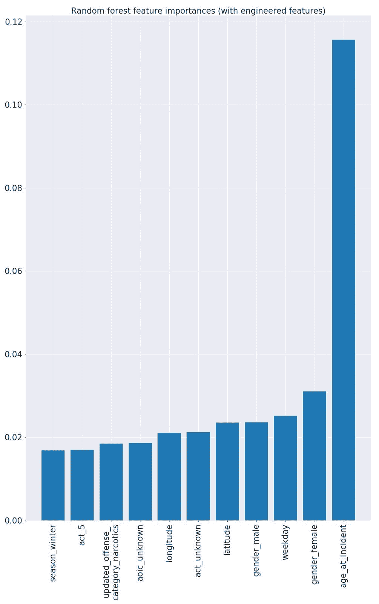

**梯度推进** 考虑到我们的树集成方法的表现，我们决定将梯度推进作为我们的探索性算法之一。我们发现现成的梯度增强模型的 AUC 为 0.82，灵敏度为 0.76，因此是进一步超参数调整的合理候选。同时调整基于树和基于学习的超参数被证明成本太高，因此我们选择首先优化基于树的参数，然后使用所选择的参数来调整基于学习的参数。我们首先通过遍历 max_depth = [None，3，10，30]和 min_samples_leafs = [1，2，10，500]的所有可能组合来调整基于树的超参数(表 A5)。我们在这些条件下优化了 AUC，max_depth = 3，min_samples_leafs = 10，AUC = 0.82，灵敏度= 0.78。然后，我们使用这些参数迭代 n_estimators = [10，100，500，1000]和 learning_rates = [0.25，0.1，0.01，0.0001]。我们对使用如此大量的估计量感到满意，因为我们知道这不会导致梯度推进集成方法过度拟合。我们发现，当 learning_rate = 0.01 和 n_estimators = 1000 时，AUC 在这里得到优化，AUC = 0.82，灵敏度= 0.79。这个灵敏度比我们使用优化的随机森林获得的稍好，所以我们决定进一步优化梯度增强模型。

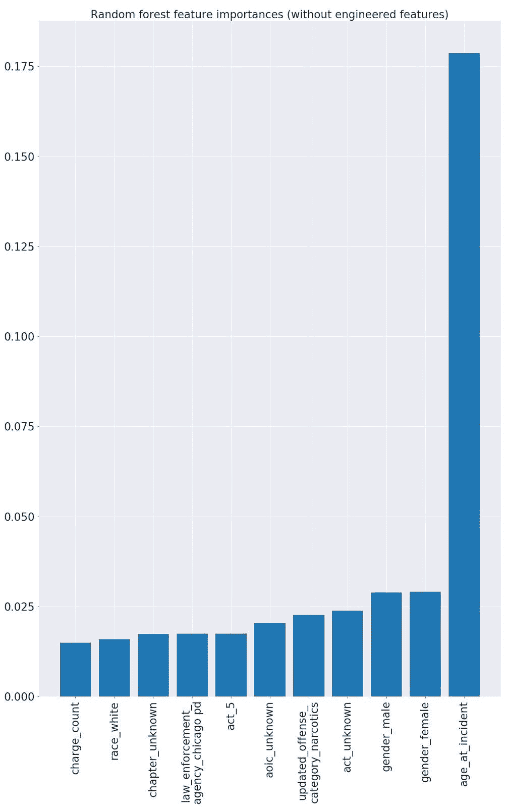

我们决定探索不同数量的 PCA 组件如何影响我们的梯度增强模型的性能。我们再次循环通过所有超参数，也在 1、3 和 100 之间改变组件数量。在使用较少组件评估模型时，我们能够创建一个大循环来优化主组件、基于树的超参数和基于学习的超参数的数量。所有超参数保持不变，只是增加了一个额外的 min _ samples _ leafs 100，以提高 10 到 500 之间的分析粒度。在 100 个主成分时，发现最佳 AUC 为 AUC = 0.81，灵敏度为 0.73。1 种成分的灵敏度优化为 0.91，然而该模型只有 0.55 的 AUC。

我们选择梯度推进集成算法作为我们的最终模型，其中{max_depth = 3，min_samples_leafs = 10，learning_rate = 0.01，n_estimators = 1000}

调整我们的梯度增强模型的最后一步是试验各种级别的下采样。所有以前的测试都依赖于 50%的下采样比率，因此我们的训练集具有相等的正负标签出现率。首先，我们使用 20%的下采样比率(意味着 20%的训练集由阳性实例组成)测试优化的梯度增强模型，并发现 AUC 几乎保持不变，但灵敏度极低，为 0.28。当模型以 10%的下采样比率再次运行时，灵敏度再次恶化到 0.10，因此我们得出结论，小于 50%的比率恶化了我们的模型性能，下采样比率在 50%时被优化。这些结果与我们关于下采样对灵敏度的影响的假设一致。

在这一轮评估中，我们选择不缩放我们的任何功能，因为缩放不应影响树模型(李，丁等人，2017)。为了测试这个假设，我们在未缩放的数据集上以 50%的下采样比率重新运行最终模型。这产生了与我们在缩放数据中发现的相同的 AUC 和灵敏度，证实了缩放是对计算能力的不必要使用。

使用我们之前的调整实验的结果，我们在没有 PCA 或缩放的情况下训练最终的梯度增强模型，并且具有 50%的下采样比率。我们使用最高性能的超参数 max_depth = 3，min_samples_leaf = 10，learning_rate = 0.01，n_estimator = 1000，并根据组合的测试和验证数据评估模型。我们的最终模型实现了 0.84 的 AUC，同时仍保持 0.76 的高灵敏度。接收器操作特征曲线表明，该模型相当快地实现了超过 90%的召回率，然后变得平坦。此时的假阳性率刚刚超过 40%。这一点代表最适合业务案例的分类阈值。

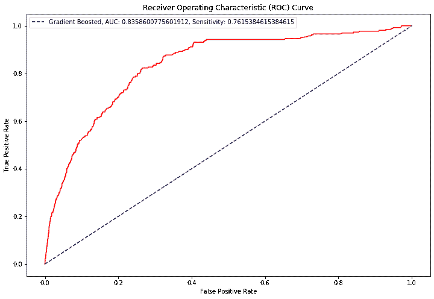

在部署该模型之前，有许多与偏差相关的问题需要解决。首先，我们必须解决我们的模型从数据中学到的社会偏见。我们的特征重要性充满了歧视性特征，考虑到 MHI 在这些阶层中的分布，这并不奇怪。可以采用区分单元测试来确定问题所在(d'Alessandro 等人，2019)。验证哪些特征与受保护的属性直接或间接相关，将允许研究人员识别哪些特征要从模型中移除。

因为我们的模型只能从法院已经确定的精神疾病案例中学习，所以它有效地让法院完全控制什么被认为是精神健康残疾。这样，MHI 只是精神疾病的一个松散的代表，这些记录中可能存在对某些类型或表现的精神疾病的偏见。人口统计学也可能有一个缺点，要么通常负担不起精神保健，要么被保健提供者系统地误诊，因为他们不会有残疾记录。先前的研究表明，某些人口统计数据不太可能被医疗保健专业人员认真对待(Hoffman 等人，2016 年)，因此属于受保护群体的一些个人可能与他们确实存在的心理健康问题无关。为了捕捉这些隐性偏见的影响，种族的条目被尽可能少的改动。我们没有合并群体或过滤特定条目，因为如何看待一个人的种族可能会让我们了解这个人如何能够在司法系统中导航(Maryfield，2018 年)，特别是在他们的心理健康方面。

我们惊讶地发现，与家庭暴力相关的特征没有在我们的模型中得到反映，因为研究表明，库克县的家庭暴力和精神健康障碍之间有着密切的关系(Tsirigotis & Luczak，2017；行为健康创新，2015)。领域相关的特征工程有可能捕捉到这种关系；还有一种可能是，这些精神疾病的案例通常没有得到法院的确认。

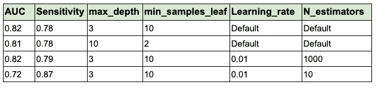

验证集上的梯度增强模型超参数调整

我们的模型是仅使用公开可用的数据开发的。如果库克县对这个项目感兴趣，我们可以与他们合作开发一个公平公正的精神疾病早期识别系统。这种系统可以利用不公开的信息，例如个人在库克县司法系统中的历史和他们的卫生部门记录。此外，我们的模式对于那些希望在法律体系内为个人提供服务的非政府组织来说仍然有希望。这里使用的数据是特定于库克县的，因此不能将模型直接导出到另一个辖区；然而，这个项目很容易成为其他地方类似项目的蓝本。

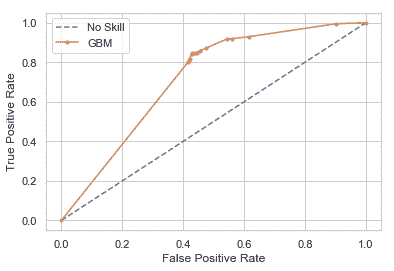

参数调谐梯度增强模型的 ROC

此外，概念漂移可能是部署中的一个问题。随着库克县精神健康法院项目的继续扩大，我们可以预计随着时间的推移，基本利率会增加，这最终可能会降低模型的性能。因此，应该仔细监控 MHI 基本利率以及可能影响它的法律和政策因素。当模型过时时，可能需要定期重新训练。模型管理人也可能决定从训练中排除较旧的数据，以减轻概念漂移——这可以通过经验进行测试，并需要结合审查偏差的影响进行考虑。1 型审查偏倚可能对我们的模型产生相反的影响，要减轻这种影响，需要为纳入训练的病例年龄开发一个启发式截断点。在删截的情况下，监控部署中的模型敏感性可能被证明是具有挑战性的，但是开发上述启发式方法将会给保管人一个设定的时间来评估个人的 MHI。

我们的模型目前不可实现，因为它依赖于受保护的类别(种族、年龄、性别)进行预测。在删除这些受保护的类和能够预测它们的功能时，需要进一步努力来测试模型性能。我们决定在我们的最终模型中保留敏感的特性，以免模型被误解为公平的，并强调不同影响跟踪的需要。

我和我的团队在这个项目中学到了很多东西，我很高兴将这些新想法应用到我即将到来的项目中！感谢阅读！

[1]可以在我们的团队 Github 上查看该项目中使用的功能的完整列表:[https://github.com/angelaaaateng/dsga1001_project](https://github.com/angelaaaateng/dsga1001_project)
[2]完整列表可以在我们的团队 Github 和团队报告上查看
[3]有关我们的数据清理流程的更多详细信息，请参见我们的最终报告以及我们的团队报告
[4]有关完整的决策树，请参见我们最终报告的附录，此处[https://Github . com/angelaaaateng/dsga 1001 _ project/blob/master/TERM](https://github.com/angelaaaateng/dsga1001_project/blob/master/TERM%20PROJECT%20FINAL%20PAPER.pdf)

应阿伦·雷亚和凯尔西·马基的要求，我附上了他们对这个项目[https://github.com/akrhea/mental-health-court-outcomes](https://github.com/akrhea/mental-health-court-outcomes)所做的另一项研究的链接。

## 参考资料:

阿布舍克·夏尔马，阿布舍克·夏尔马。"决策树介绍及实例."*geeks forgeeks*2019 年 11 月 25 日[https://www . geeks forgeeks . org/decision-tree-introduction-example/](https://www.geeksforgeeks.org/decision-tree-introduction-example/)。

a .布兰德福德和 f .奥谢尔(2012 年)。*为有行为健康障碍的司法介入成年人实施循证实践和计划(EBPs)的清单。*纽约州德尔玛市:SAMHSA 行为健康和正义转化增益中心。

行为健康创新。库克县保释法院的精神健康与司法重罪保释法院精神病患者管理的审查。为伊利诺伊州法院行政办公室编写的报告，2015 年 7 月。

博特夫、兹德拉夫科和阿德·里德。“方差缩减。” *Wiley StatsRef:统计参考在线*，2017，第 1–6 页。，doi:10.1002/9781118445112 . stat 07975。

布朗利，杰森。“机器学习的 K 近邻。”*机器学习掌握*2019 年 8 月 12 日[https://machinelementmastery . com/k-nearest-neighbors-for-Machine-Learning/](https://machinelearningmastery.com/k-nearest-neighbors-for-machine-learning/)。

布朗利，杰森。"评估 Python 中机器学习算法的度量标准."*机器学习掌握*，2019 年 11 月 21 日[https://machinelingmastery . com/metrics-evaluate-Machine-Learning-algorithms-python/](https://machinelearningmastery.com/metrics-evaluate-machine-learning-algorithms-python/)。

" TASC 健康与正义中心:连接政策、研究与实践."TASC 健康与司法中心|连接政策、研究和实践。、【http://www2.centerforhealthandjustice.org/】和。

认真分类:一个数据科学家的歧视意识分类指南。ArXiv.org，2019 年 7 月 21 日，[https://arxiv.org/abs/1907.09013](https://arxiv.org/abs/1907.09013)。

Eno Louden，j .，& Skeem，J. (2011 年)。患有精神障碍的假释犯:走向循证实践。循证矫正中心公报，7(1)，1–9。

Haneberg，r .，& Watts，k .,“站出来”战胜美国监狱中的精神健康危机。刑事司法/教养。纽约州纽约市:州政府委员会司法中心。从[http://knowledgecenter.csg.org/kc/system/files/Haneberg](http://knowledgecenter.csg.org/kc/system/files/Haneberg)瓦 2016.pdf 取回

疼痛评估和治疗建议中的种族偏见，以及关于黑人和白人之间生物学差异的错误信念。*美国国家科学院学报*，美国国家科学院，2016 年 4 月 19 日，[https://www.ncbi.nlm.nih.gov/pmc/articles/PMC4843483/](https://www.ncbi.nlm.nih.gov/pmc/articles/PMC4843483/)。

艾萨克斯，迈克。"县心理健康法院选择罪犯治疗而不是监禁."chicagotribune.com。2019 年 12 月 9 日接入。[https://www . Chicago tribune . com/suburban/sko kie/CT-skr-mental-health-court-TL-0526-2016 05 23-story . html](https://www.chicagotribune.com/suburbs/skokie/ct-skr-mental-health-court-tl-0526-20160523-story.html)。

约翰斯通，伊恩 m 和亚瑟鲁愚。"关于高维主成分分析的一致性和稀疏性."*美国统计协会杂志*，第 104 卷，第 486 期，2019 年，第 682–693 页。，doi:10.1198/jasa.2009.0121。

《隐含的种族偏见》*法律中隐含的种族偏见*，第 9-24 页。，doi:10.1017/CBO 9780511820595.002。

洛夫兰、大卫和迈克尔·博伊尔。"强化个案管理作为一种监狱转移计划，用于患有严重精神疾病的人."*《国际罪犯治疗和比较犯罪学杂志》*，第 51 卷，第 2 期，2007 年，第 130-150 页。，doi:10.1177/0306624x06287645。

李，惠，和 SAS 数据科学博客。“我应该使用哪种机器学习算法？”*SAS 数据科学博客*，2017 年 4 月 12 日，[https://blogs . SAS . com/content/subconcious musings/2017/04/12/machine-learning-algorithm-use/# pretty photo](https://blogs.sas.com/content/subconsciousmusings/2017/04/12/machine-learning-algorithm-use/#prettyPhoto)。

李，丁，等.〈自适应标度〉. *ArXiv:1709.00566v1【统计。ML]2017 年 9 月 2 日*2017。

玛丽菲尔德贝利。“隐含的种族偏见。”*司法研究与统计协会*，2018。

“现代机器学习算法:优势和劣势。” *EliteDataScience* ，2019 年 1 月 25 日[https://elitedatascience.com/machine-learning-algorithms](https://elitedatascience.com/machine-learning-algorithms)。

纳格帕尔，阿努哈。"主成分分析-简介."*中*，走向数据科学，2017 年 11 月 22 日，[https://towardsdatascience . com/principal-component-analysis-intro-61f 236064 b38](/principal-component-analysis-intro-61f236064b38)。

萨朗·纳克赫德。“理解 AUC-ROC 曲线。”*中*，走向数据科学，2019 年 5 月 26 日，[https://towardsdatascience . com/understanding-AUC-roc-curve-68b 2303 cc9 C5](/understanding-auc-roc-curve-68b2303cc9c5)。

理解和使用敏感性、特异性和预测值。*https://www.ncbi.nlm.nih.gov/pmc/articles/PMC2636062/眼科杂志*，Medknow 出版物，2008 年，[印](https://www.ncbi.nlm.nih.gov/pmc/articles/PMC2636062/)。

亚历山大·普拉里卡斯(1998 年 9 月)。*信号处理公式和表格手册*(第 1 版。).CRC 出版社。第 42–8 页[https://en.wikipedia.org/wiki/Upsampling#cite_note-1](https://en.wikipedia.org/wiki/Upsampling#cite_note-1)

拉格纳。"什么样的学习问题适合支持向量机？"*数据科学栈交换*，2016 年 2 月 1 日[https://Data Science . Stack Exchange . com/questions/9736/what-kinds-of-learning-problems-is-fitted-for-support-vector-machines](https://datascience.stackexchange.com/questions/9736/what-kinds-of-learning-problems-are-suitable-for-support-vector-machines)。

" Sklearn.metrics.recall_score。" *Scikit* ，[https://Scikit-learn . org/stable/modules/generated/sk learn . metrics . recall _ score . html](https://scikit-learn.org/stable/modules/generated/sklearn.metrics.recall_score.html)。

塔朗·沙阿。"关于机器学习中的训练、验证和测试集."*介质*，朝向数据

科学，2017 年 12 月 10 日，[https://towards data science . com/train-validation-and-test-sets-72 CB 40 CBA 9 e 7](/train-validation-and-test-sets-72cb40cba9e7)。

黄邦贤史伦斯。"主成分分析教程."*ArXiv:1404.1100 v1【Cs。2014 年 4 月 3 日*、[https://arxiv.org/pdf/1404.1100.pdf](https://arxiv.org/pdf/1404.1100.pdf)。

伊利诺伊州国务卿。“在线服务。”*伊利诺伊州国务卿*、[https://www.cyberdriveillinois.com/](https://www.cyberdriveillinois.com/)的官方网站。

Tsirigotis、Konstantinos 和 Joanna UC zak。“遭受家庭暴力的女性的复原力。”*《精神病学季刊》*，斯普林格美国，2018 年 3 月，[https://www.ncbi.nlm.nih.gov/pmc/articles/PMC5807488/](https://www.ncbi.nlm.nih.gov/pmc/articles/PMC5807488/)。

图茨，格哈德和莫里茨·伯杰。"广义加性回归中分类预测因子的树形结构模型."*数据分析与分类进展*，第 12 卷第 3 期，2017 年，第 737–758 页。，doi:10.1007/S11 634–017–0298–6。

托尼，你好。“了解随机森林”*中*，走向数据科学，2019 年 8 月 14 日，[https://Towards Data Science . com/understanding-random-forest-58381 e 0602d 2](/understanding-random-forest-58381e0602d2)。