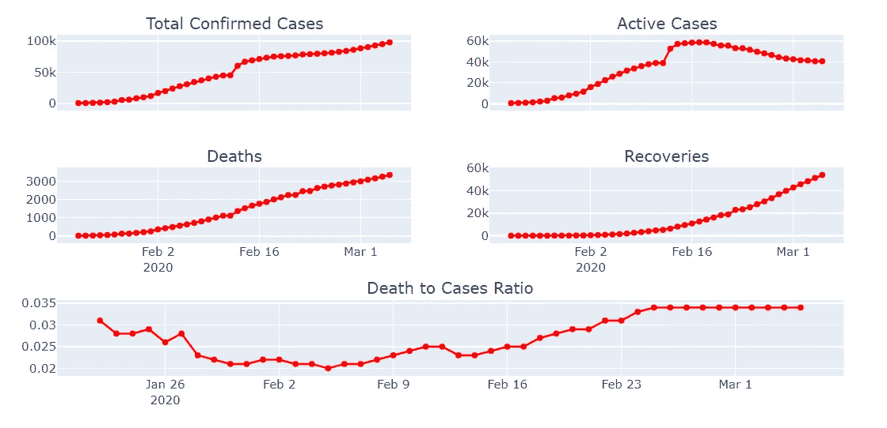

# 使用 Pandas 和 Plotly 分析冠状病毒(新冠肺炎)数据

> 原文：<https://towardsdatascience.com/analyzing-coronavirus-covid-19-data-using-pandas-and-plotly-2e34fe2c4edc?source=collection_archive---------12----------------------->

## 透过总体数字来量化冠状病毒的传播

[疾控中心](https://unsplash.com/@cdc?utm_source=unsplash&utm_medium=referral&utm_content=creditCopyText)在 [Unsplash](https://unsplash.com/s/photos/virus?utm_source=unsplash&utm_medium=referral&utm_content=creditCopyText) 拍摄的照片

起源于中国的新冠肺炎病毒现已蔓延至全球，各国都在争相应对。这种病毒最初是一种医疗保健紧急情况，现在已经开始产生严重的经济后果。在这篇文章中，我试图用熊猫和情节来理解和想象新冠肺炎的传播。

我们从导入所有库和加载所有数据开始。这些数据由约翰·霍普斯金大学提供，可以在[这里](https://github.com/CSSEGISandData/COVID-19)的链接中找到。有三个文件包含全部确诊病例、死亡和恢复情况。

运行上面的代码后，数据看起来是这样的。

我们有

*   日期(作为列)
*   确诊病例总数
*   省
*   国家
*   经纬度

尽管数据组织得很好，我们还是会对其进行一些修改，使其更适合绘图。我们可以使用 pandas melt 函数来改变一列中的日期，这样我们可以在以后将它设置为索引，这使得绘图更加容易。

有了日期和国家作为索引，数据集现在更清晰、更容易绘制。请看下面的快照。

出于本文的目的，我们将只查看国家级别的数据，而不是省/州级别的数据。让我们创建一个整合的数据集，将病例、死亡和恢复的数据集结合起来。我还创建了一个从累积数据中获取每日计数的函数。我们使用下面的代码进行处理。

我还创建了一些计算字段，如活动病例(没有死亡或康复结果的病例)和死亡病例比率，并使用 pandas 的合并功能合并了所有数据集。

> 活跃病例=确诊病例-康复-死亡

整合数据集的索引为国家和日期，每个指标为一列(参见下面的快照)

我们使用 plotly.graph_objects 进行所有的绘图。这是一个简洁的解决方案，不用很多代码就能做出漂亮的图形。我们使用下面的代码创建五个图表，显示全球确诊病例、活动病例、死亡、恢复、死亡与病例比率的数字。

全球 Covid19 案例的关键指标

我们可以看到，确诊病例、死亡和康复都在增长，但很难从这些数字中得出增长的程度，因为这些数字是累积的。死亡与病例的比率为 3.4%(这是世卫组织几天前报道的)。

“活动案例”作为一种衡量标准的效用是显而易见的，因为它提供了给定时间点的爆发快照。从图表中，我们可以看到，自 2 月中旬以来，活跃病例一直在下降，这是一个很好的指标，表明我们正在更好地控制疫情。然而，这张图表本身就有误导性，因为我们知道大多数病例发生在中国，这可能会扭曲数据。让我们比较一下中国以外地区的活跃案例。

上面的情节描绘了中国内外两种截然不同的情况。随着中国国内病例数量的下降，疫情似乎得到了控制，但在中国以外，疫情仍在强劲增长。

让我们进一步挖掘每个国家的数据。为了使数据有意义，让我们把自己限制在病例都大于 300 的前 10 个国家。让我们使用下面的代码，根据案例的数量来绘制这些国家的图表:

截至 2020 年 3 月 5 日的数据

现在让我们来看看前四个国家的病例是如何随着时间的推移而增长的。使用下面的代码，我们计算从“疫情开始”起的病例数，疫情开始是指报告第一例病例的那一天

例如，下面意大利的输出显示，第一个日期“2020-01-31”是两例确诊病例爆发的开始。该指数可以解释为“第 0 天”。

现在，让我们根据病例数绘制出前四个国家的数据，并使用以下代码查看疫情是如何随着时间的推移而增长的:

让我们看看下面的输出。请注意，一旦开始增长，数字增长得有多快。

这些国家的疫情都是逐渐开始的，但一旦达到“爆发”阈值，就会呈指数级增长。上面的图表是对自满的警告。如果不加以控制，病例会非常迅速地增加，增长几乎是指数级的，因此即使是少量的病例也可能迅速发展成全面爆发。

> 在韩国跨过 100 例用了 29 天，跨过 7000 例只用了 16 天！在意大利，跨过 100 用了 23 天，跨过 5000 只用了 13 天！

最后，由于不同国家的情况差异很大，因此创建一个视图来深入了解特定国家是值得的。在这里，我们可以使用 ipywidgets 库使我们的图表具有交互性，并使用下面的代码从下拉列表中选择国家:

下面的输出与上面的非常相似，但是我们现在有一个下拉菜单，可以从中选择国家(图表显示的是意大利)。

我们再次注意到，增长是突然的，而且相当迅速，尽管病例数量很高，但就病例总数而言，意大利仍未达到峰值！

全世界的病例和死亡人数一直在增长，但我们可以从中国的数据中看到，如果采取适当的措施，疫情是可以得到控制的。如果你想用我的代码自己分析数据，请在这里找到 jupyter 笔记本[的链接。](https://github.com/mashhadazam/datacookies/blob/master/CoronaVirus%20-%202019.ipynb)

让我们希望并祈祷疫情迅速结束！