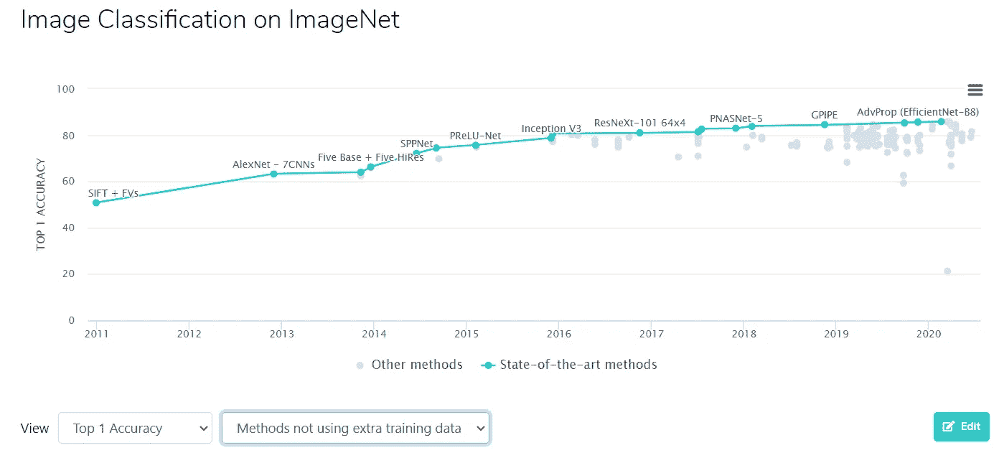
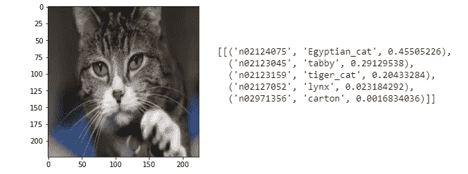
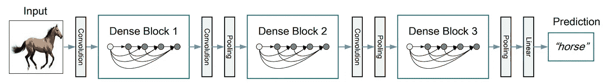
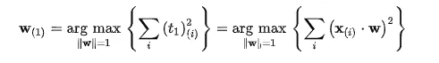
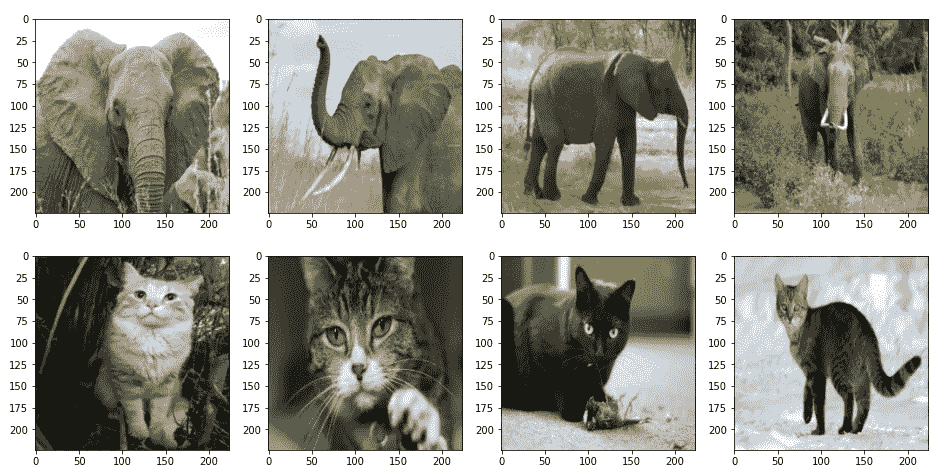
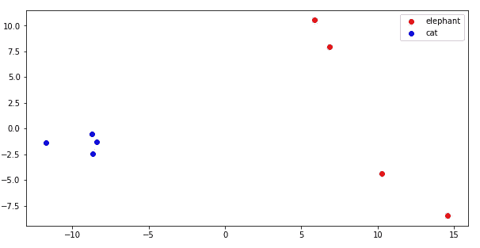
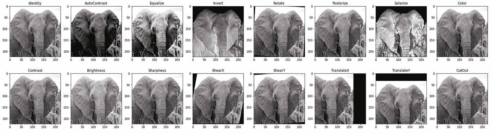
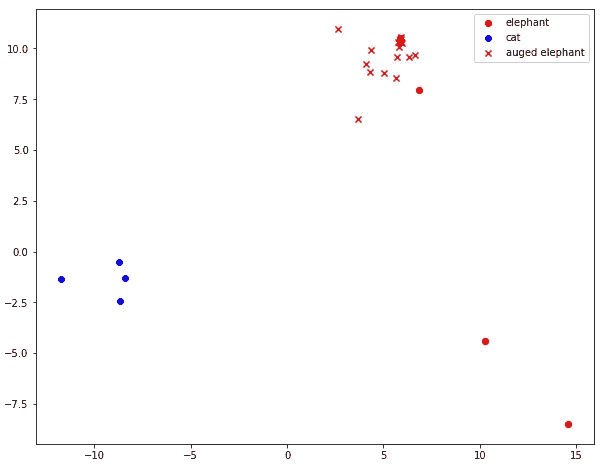
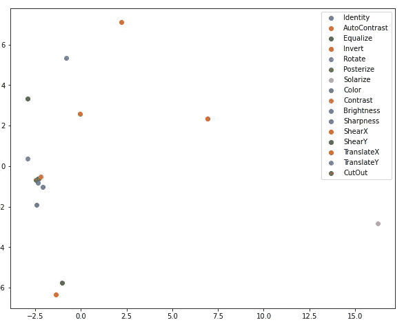
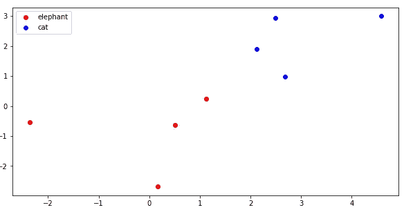

# 分析用于图像分类的数据扩充

> 原文：<https://towardsdatascience.com/analyzing-data-augmentation-for-image-classification-3ed30aa61411?source=collection_archive---------50----------------------->

## 最新图像分类模型中使用的图像增强技术的主成分分析

图像分类是机器学习中研究最多、记录最完整的任务之一。有许多基准和大型公共数据集，如 ImageNet [1]，可以将新的模型和算法与最先进的技术(SOTA)进行比较。每年都会有一些新算法问世，SOTA 的精确度也在快速提高。

近年来，改进的一个关键因素是数据扩充技术，特别是当人们试图在不使用外部数据的情况下改进排名时。*数据扩充*，对训练数据的微小修改有助于模型更好地概括未知的例子。数据增强处理图像的一个例子是镜像图片:猫也是镜子里的猫。

在这个故事中，我们分析了谷歌研究人员 2019 年的算法 RandAugment [2]中使用的图像增强技术。为此，我们将使用 Tensorflow 2.0 Keras 中提供的预训练 DenseNet [3]模型[。](https://github.com/keras-team/keras-applications)为了说明模型输出，我们将对模型的最后一个隐藏层进行主成分分析。所有代码都可以在 Google Colab 上找到。

ImageNet 分类基准的改进由代码为的[论文说明](https://paperswithcode.com/sota/image-classification-on-imagenet)

# 图像分类

有了 [Keras](https://keras.io/) ，图像分类就是一个三步走的问题。1)加载图像，2)加载预训练的模型，3)解码输出。下面是使用 TensorFlow 2.0 预训练的 Keras DenseNet 模型来完成它的一个小片段。

Keras 中基于预训练模型的图像分类

如果我们用`include_top`加载模型，分类的输出层有 1000 个类。`decode_predictions`收集最有可能的类别，并添加类名。

[猫图像](https://en.wikipedia.org/wiki/Cat#/media/File:Kittyply_edit1.jpg)来自维基百科并分类输出

对于 PCA 分析，我们将使用模型的最后一个隐藏层的输出(在 softmax 之前)。在 DenseNet 121 中，它意味着 1024 维的大向量空间。在 Keras，我们将使用以下方式获得新模型:

`model_last_hidden = tf.keras.models.Model(inputs=model.input, outputs=model.layers[-2].output)`

我使用这个实践来获得模型输出的良好表示，而没有 softmax 层的展平效果。

原始论文中 DenseNet 模型的一个例子

# 利用主成分分析子空间识别类别

## 主成分分析

正如我在前面的故事中所讨论的， [PCA](https://en.wikipedia.org/wiki/Principal_component_analysis) 是一种正交变换，我们将使用它来降低向量的维数【4，5】。PCA 以最大化降维数据的方差的方式找到投影的特殊基向量(特征向量)。使用 PCA 有两个重要的好处。一方面，我们可以将 1024 维向量投影到 2D 子空间，在那里我们可以将其绘制成数据。另一方面，它保持了最大可能方差(投影丢失了信息)。因此，它可能保持足够的方差，以便我们可以识别图片上的类。

最大化第一主成分的方差—来自[维基百科](https://en.wikipedia.org/wiki/Principal_component_analysis)的等式

使用带有`[sklearn.decomposition.PCA](https://scikit-learn.org/stable/modules/generated/sklearn.decomposition.PCA.html)`的 PCA 是一行程序:
`pred_pca = PCA(n_components=2).fit_transform(pred)`

## 猫还是大象？

为了确定从 1024 维向量空间到 2D 向量空间的变换，我们将使用八幅图像，四只猫和四只大象。稍后，我们将在这个投影中展示数据增强的效果。图片来自维基百科。

维基百科上的猫和大象的图片

举例说明 2D 投影，我们可以看到猫和大象是完全分开的。

使用主成分分析的 DenseNet 最后隐藏层的 2D 投影

# 图像增强

数据扩充是训练机器学习模型的重要部分，尤其是在训练图像有限的情况下。对于图像增强，定义了许多增强算法。Python 开发者可以在`imgaug` [包中找到大量的方法。](https://imgaug.readthedocs.io/en/latest/index.html)

对于此分析，我们将使用 RandAugment [2]中使用的方法的`imgaug`实现，这是一种使用 EfficientNet 模型在 2019 年实现 ImageNet 上 SOTA 的增强，但许多其他算法也使用相同的基本方法。

对于数据扩充，最关键的部分是确定扩充方法的参数区间。例如，如果我们使用旋转这种简单的图像增强技术，很明显，将猫或大象的图像旋转几度不会改变图片的含义。然而，通常情况下，我们并不希望看到大象在自然界中旋转 180 度。另一个例子是当我们使用亮度或对比度操作时:过高的修改可能会导致无法识别的数据。

最近的工作，如基于人口的扩增[6]旨在适应训练时间的修改幅度，而其他人如 RandAugment [2]将其用作训练的超参数。自动增强研究表明，在训练期间增加增强的幅度可以提高模型的性能。

使用 imgaug 增强方法的默认间隔来增强大象图像

如果我们处理上面的增强图像，并将其投影到与之前的猫象图像相同的 2D 向量空间，我们可以看到新的点在原始图像的周围。这是图像增强的效果:

> 增强将分类空间中大象图像的单点扩展到大象图像的整个区域。

猫-大象投影中的增强大象图像

## 一次性方法

当一个标签类中只有很少的样本时，这个问题被称为少镜头学习，数据扩充是解决这个问题的一个重要工具。下面的实验试图证明这个概念。当然，这里我们有一个大数据集上的预训练模型，所以它不是在几次训练中学会的。然而，如果我们试图只使用一个原始的大象图像来生成投影，我们可以得到类似的东西。

对于这个投影，我们将使用一个新的 PCA，它使用原始的大象图像和它的增强图像。下图显示了该子空间中的增强图像。

增强图像的 PCA 投影

但是这个投影，仅仅使用一张大象图片，能把大象和猫分开吗？嗯，聚类不像前一种情况那样清晰(见第一个散点图)，但猫和大象实际上在向量空间的不同部分。

从一幅大象图像生成的 PCA 投影中的大象和猫

# 摘要

在这个故事中，我们展示了在最先进的影像分类中使用的数据增强工具的效果。我们将猫和大象的图像以及大象的增强图像可视化，以更好地理解模型如何看待增强图像。

# 参考

[1]邓，李，李，，李(2009 年 6 月).Imagenet:一个大规模的分层图像数据库。在 *2009 年 IEEE 计算机视觉和模式识别会议上*(第 248–255 页)。Ieee。

[2] Cubuk，E. D .，Zoph，b .，Shlens，j .，& Le，Q. V. (2020 年)。 [Randaugment:用缩小的搜索空间进行实用的自动数据扩充。](https://openaccess.thecvf.com/content_CVPRW_2020/papers/w40/Cubuk_Randaugment_Practical_Automated_Data_Augmentation_With_a_Reduced_Search_Space_CVPRW_2020_paper.pdf)在*IEEE/CVF 计算机视觉和模式识别研讨会会议录*(第 702–703 页)。

[3]黄，g .，刘，z .，范德马腾，l .，，温伯格，K. Q. (2017 年)。[密集连接的卷积网络。](https://arxiv.org/pdf/1608.06993v3.pdf)IEEE 计算机视觉和模式识别会议论文集(第 4700–4708 页)。

[4]皮尔逊，K. (1901 年)。 [LIII。在最接近空间点系统的直线和平面上。](https://www.tandfonline.com/doi/pdf/10.1080/14786440109462720) *《伦敦、爱丁堡和都柏林哲学杂志和科学杂志》*， *2* (11)，559–572 页。

[5]h .霍特林(1933 年)。[将复杂的统计变量分析成主要成分。](https://psycnet.apa.org/record/1934-00645-001)*教育心理学杂志， *24* (6)，417 页。*

*[6]何，d，梁，e，陈，x，，I .，& Abbeel，P. (2019 年 5 月)。[基于人口的扩增:扩增策略时间表的有效学习。](https://arxiv.org/pdf/1905.05393.pdf)在*机器学习国际会议*(第 2731–2741 页)。*