# 通过 Python 中的可视化和机器学习分析电动滑板车活动

> 原文：<https://towardsdatascience.com/analyzing-e-scooter-activity-through-visualization-and-machine-learning-in-python-a33585b2c29?source=collection_archive---------33----------------------->

## 从数据收集到在热图上可视化聚类


根据最近发布的 [2019 TomTom 交通指数报告](https://www.tomtom.com/en_gb/traffic-index/)，全球 416 个城市中有 239 个城市(57%)交通拥堵加剧。仅在美国，主要城市的交通拥堵率为+20%。这意味着，一次出行将比在城市基线不拥挤的情况下多花 20%的时间。洛杉矶以+42%高居榜首，然后是+37%的纽约市。更不用说由于更高的排放量而带来的环境影响了。


由[马克·阿斯特霍夫](https://unsplash.com/@qa9de?utm_source=medium&utm_medium=referral)在 [Unsplash](https://unsplash.com?utm_source=medium&utm_medium=referral) 上拍摄的照片

如上所述，人们正在使用替代的通勤方式，如拼车、骑自行车、公共交通或两者的结合。一个这样的选择是电动滑板车。电动滑板车对市场来说相当新，主要针对通勤的“最后一英里”部分。

伯德公司就是这样一家公司。对于那些不熟悉该公司的人，伯德在全球 100 多个城市经营*无码头滑板车*。有各种型号的滑板车，在我去华盛顿特区实地考察的时候，我就骑过其中的两种。骑滑板车不贵，除非你的平衡感很差，否则骑这种车应该很容易。

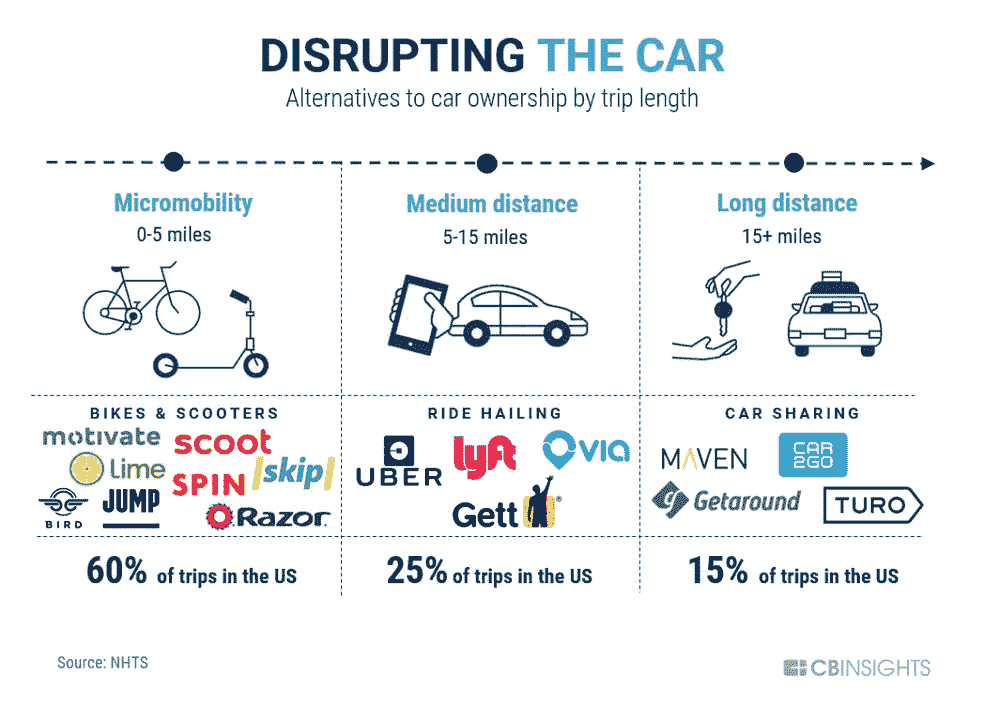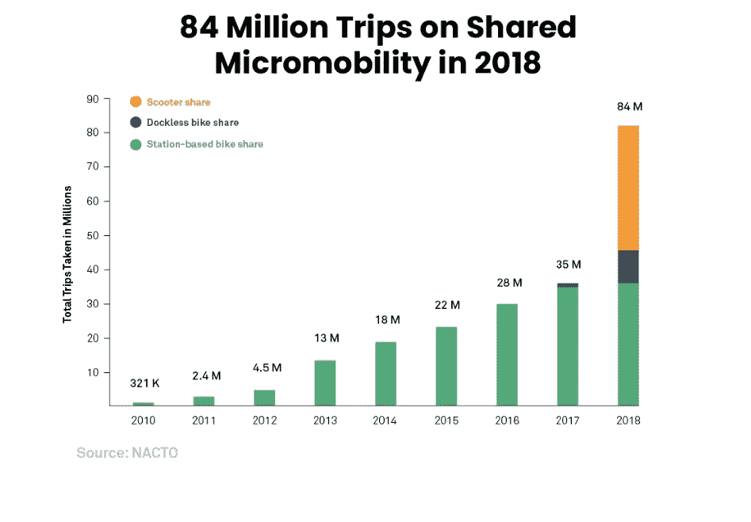

来源(左):CBINSIGHTS(右):NACTO

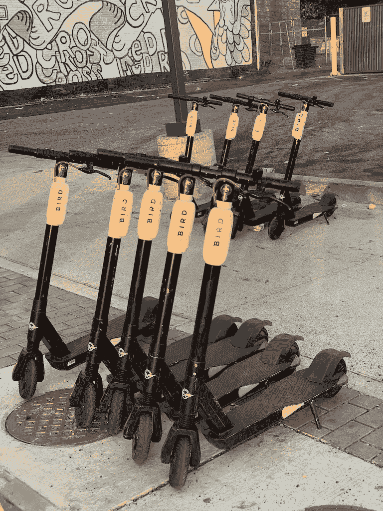

停放在华盛顿特区十字路口的小型摩托车

# 简介:

踏板车通常安装有大量传感器，这导致大量数据产生，因此有利于有趣的数据探索。

我带着以下问题出发:

1.电动滑板车在华盛顿特区及其周边的普及程度如何？

2.平均行程距离是多少？用法是否取决于一周中的日期和时间？*后者看似直观但仍需证明。*

3.我能从顾客使用滑板车的行为中了解到什么？

4.我可以用上面的发现来产生见解吗？

# 数据收集:

某些州要求公司制定开放数据政策。但是华盛顿特区没有，因此 Bird 没有一个面向华盛顿特区的公共 API，但是一个在 Github 上化名为 ubahnverleih 的人设法一起破解并开发了一个 API。ubahnverleih 已经为多个其他乘车共享公司开发了 API，所以如果你正在寻找任何这样的数据，请查看他的 Github。

华盛顿特区及其周边地区大约占地 100 平方英里。为了覆盖整个区域，我精心选择了 49 个不同的坐标点*(大致 36 sq。这样，在 API 中 ping 这些点，将返回该地区所有小型摩托车的数据。我使用的方法可以在[这里](https://docs.google.com/document/d/1zalmeb7jNfvLY2K0zGE9-NuxibdbtYIhVIZO0XXcztY/edit)找到。*

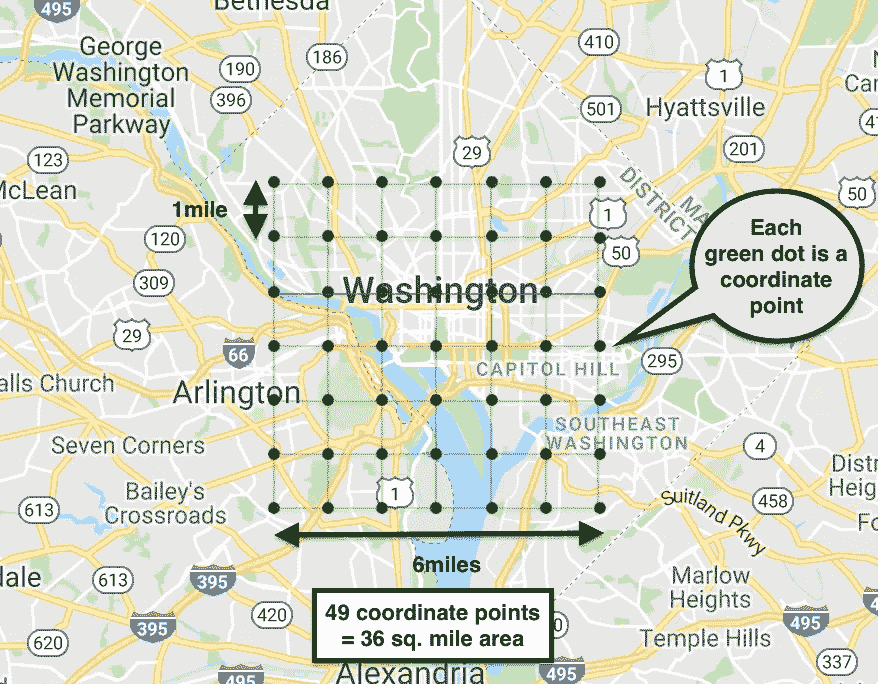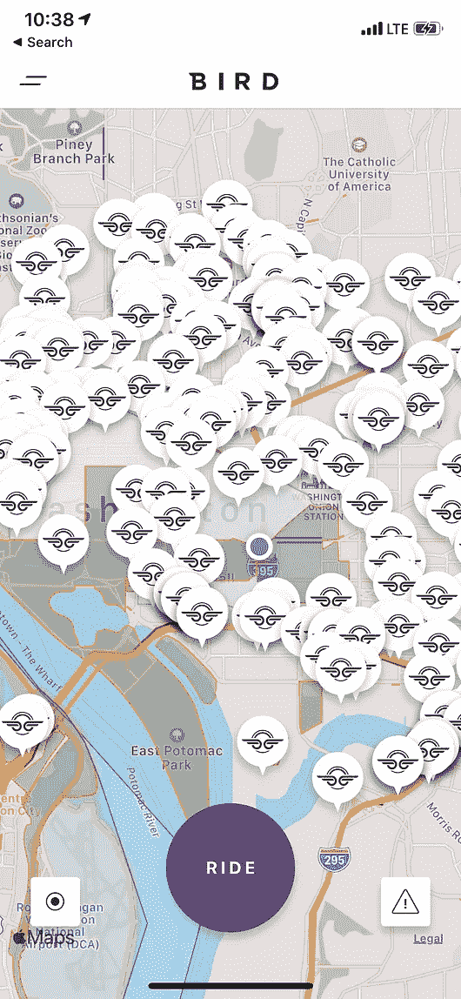

图片来源(右):波导手机 app

这是任务的第一部分。然而，它缺少一个要素:时间。我想研究一段时间内踏板车的使用情况，而不仅仅是踏板车在地理上是如何分布的。

为了捕捉一段时间内踏板车的使用情况，我编写了一个脚本，每隔 5 分钟运行一次，收集上面提到的所有坐标点的踏板车数据。我让这个程序运行了 1.5 个月(48 天)，产生了大约 800 万个数据点。

## 数据收集挑战:

该项目的 API 争论阶段存在许多技术挑战，虽然我不会一一列出，但我认为特别提到其中一个是有帮助的，可以说明在野外收集数据时会出现的各种挑战:

*   我写了一个脚本，收集了一整天的数据。在启动收集过程后，我注意到程序已经连续两个早上崩溃了。
*   我的第一反应是认为这是由于代码中的一个错误，但即使在检查之后，也没有发现是什么导致了这个问题。
*   然后我检查了收集的数据，注意到一个模式，崩溃前每晚的最后一次 API 调用总是在*【第二天】*凌晨 12 点之前的某个时间。当时没有对这个问题提供任何见解，但这是了解问题原因的一个小线索。在对代码进行了大量修补和不成功的测试后，我决定通宵坐着亲自见证崩溃。
*   这种方法，以及随后的黑客侦探工作，让我发现 API 在每天晚上 12 点到凌晨 4 点之间不会返回任何东西，而是在凌晨 4 点以后开始工作。公司经常对他们的系统进行维护，有些比其他公司更频繁，这可能是一个原因。无论如何，在知道这一点后，我在脚本中添加了一个小部分来说明每晚的事件，这是一个简单的解决方法。但这无疑是一个具有挑战性的诊断。

有了现在定期收集的数据，我创建了一个 PostgreSQL 数据库来更好地组织和管理数据。从我的 Jupyter 笔记本中添加了另一个脚本部分来做同样的事情。

# 数据:

在经历了上述步骤并克服了挑战之后，下面是结果数据的样子。


每一行包含一个单独的踏板车的所有相关信息。

例如，在上面快照的第一行，小型摩托车`‘3db0f8a8–72ed-4d4b-aff8-f0f2de53c875’`，型号为`‘bd’`，位于`4:00:53 AM`的`10/3/19`上的`(38.927739,-77.097905)`，电池电量为`42`，这意味着它将运行另外`5069`个单位*(大约 6 英里，根据数据比例)*。

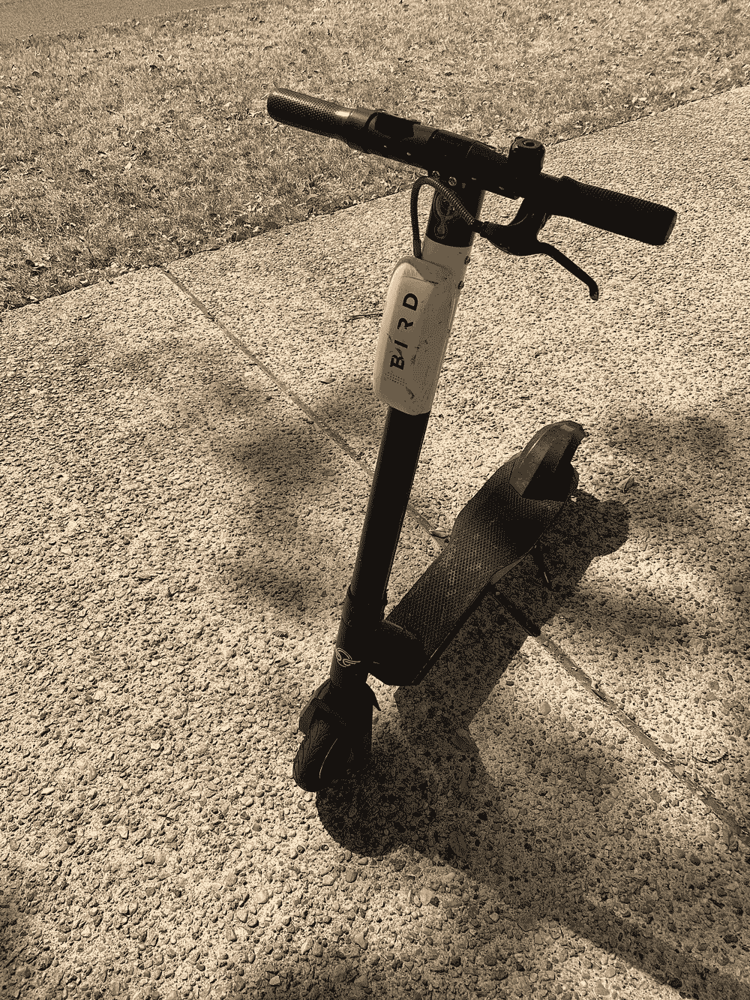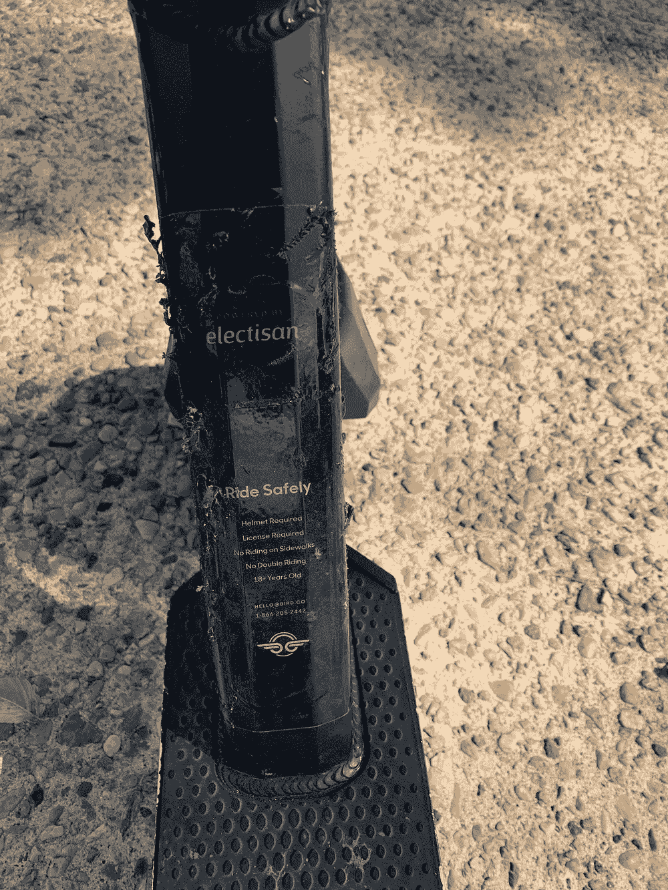

使用数据发现的踏板车型号“bd”。(厂商网址:[http://www.electisan.com/](http://www.electisan.com/))

有一些空的和多余的字段，它们没有用，因此我的分析没有考虑它们。

# 分析策略:

以下是我回答上述问题的方法概述。

我已经在帖子的末尾浏览了结果。

1.  数据清理。
2.  从收集的数据中创建踏板车出行数据集，并使用它来研究使用和活动，同时也有助于进一步分析。
3.  定义检测踏板车何时静止和何时移动的规则，以便分析和比较使用活动。
4.  使用上述规则的特征工程和对踏板车位置的聚类来跟踪聚类中心。

为了这篇博文，我将更多地关注方法和结果，而不会过多地探究背后的代码。如果需要，我会展示某些代码部分。完整的代码可以在我的 GitHub [这里](https://github.com/himanshu20792/BirdProject)找到。

## 1.数据清理

双重:

A.修复数据类型。

B.创建一个 datetime 功能，以允许对数据进行切片和切块。

我创建了一个助手函数来为我们完成上述工作..

```
def fix_dtypes(df):
 int_cols = [‘battery_level’, ‘estimated_range’]
 float_cols = [‘latitude’, ‘longitude’]
 df = df.astype({col: ‘int32’ for col in int_cols})
 df = df.astype({col: ‘float32’ for col in float_cols})
 #Combining date, time column to datetime
 df[‘date_time’] = df[‘Date’].map(str) + “ “ + df[“Time”].map(str)
 df[‘date_time’] = pd.to_datetime(df[‘date_time’])
 return dfdf_scootsbydate = df_multiple_days.groupby(‘Date’ [‘id’].nunique()
df_scootsbydate.mean()[Out]: 5337.555555555556So, on any given day, there are about 5338 scooters spread throughout the D.C. region.
```

## 2.踏板车旅行:

原始数据实际上是每次 ping API 时拍摄的一系列快照。每次 ping 都会返回当时所有可用指示器的数据。

在一个非常简单的层面上，人们可以想到一本翻书动画。就像每个页面是一个快照，所有页面放在一起向我们显示从开始到结束的整个序列，第一页显示序列的开始，最后一页显示序列的结束。类似地，第一个 API 调用将显示一天开始时踏板车的时间和位置，最后一个 API 调用将显示一天结束时的时间和位置。

下面是结果数据的一个片段，以及我是如何完成的。

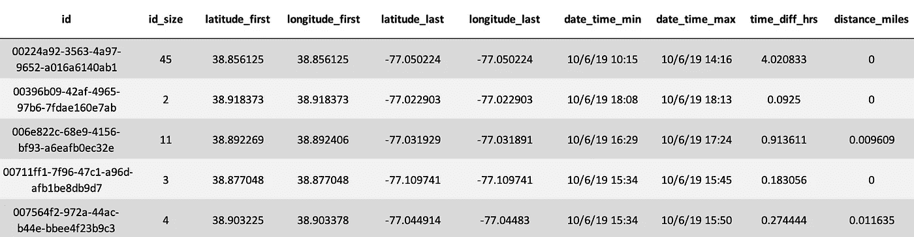

在不涉及太多技术细节的情况下，`(‘latitude_first, longitude_first)`是在`‘date_time_min’`日期&时间投入运行时的坐标，`(‘latitude_last, longitude_last)`是在`‘date_time_max’`日期&时间停止运行时的坐标。

`‘time_diff_hrs’`:滑板车一天的总运行时间。其被计算为仅仅`‘date_time_max’ — ‘date_time_min’`。

**计算行驶距离(** `**‘distance_miles')**` ***:***

`‘distance_miles’`:滑板车一天行驶的距离(英里)。

从上面，我们有`(‘latitude_first’, ‘longitude_first’)`和`(‘latitude_last’, ‘longitude_last’)`为每辆踏板车。现在我们需要计算这两个位置之间的距离。有几种方法可以计算两点之间的距离。但是在这里，由于我们处理的是 GPS 坐标，我们使用 ***哈弗森距离*** 进行计算。[哈弗辛](https://community.esri.com/groups/coordinate-reference-systems/blog/2017/10/05/haversine-formula)考虑了地球的球形，而像*欧几里德距离*这样的公式却没有考虑，这就是为什么哈弗辛适合在这种情况下使用*。*

有一些好的 Python 包可以做到这一点。我使用[这个](https://stackoverflow.com/questions/25767596/vectorised-haversine-formula-with-a-pandas-dataframe)资源来构建一个助手函数来为我完成这项工作。

## 3.平稳性和非平稳性的定义规则。

在这一点上，我们有了收集数据的 1.5 个月中每天的踏板车出行数据集。我们现在可以分析踏板车的用法和运动。但是这并不像仅仅根据距离特征过滤指示器那么简单，换句话说，子集化数据以只选择那些`‘distance_miles’`是`0`的指示器。

`**Stationary**`:当满足*【Cond _ 1】**和****【Cond _ 2】*时，认为 Scooter 是静止的。
`**Non-stationary**`:如果*不满足**'*Cond _ 2】但满足【Cond _ 3】*，则认为 Scooter 是非静止的(或在行程中)。也就是说，如果`‘distance_miles’`大于 0.5 英里并且`‘battery_diff’`小于 50 英里(下面给出解释)。***

***有一些挑战，我解释了我用来识别踏板车是否静止的三个条件:***

***1.*Cond _ 1*:`‘time_diff’`应该大于 4 小时。有很多情况下，滑板车会在白天出现一小段时间，然后消失几天。可能是由于各种原因，如维修、保养等。这篇文章在某种程度上证实了这一点。滑板车的消失并不真正算作滑板车的使用活动，因此没有计入我们的分析。这一规则使得重点放在“肯定”是静止的踏板车上。
2
2。 *Cond_2* : `‘distance_miles’`应该小于 0.5 英里。人们可能会猜测，要将小型摩托车视为静止，您所需要的就是距离特征为零，对吗？好吧，数据有一些不一致的地方，我们注意到有些情况下滑板车移动了很小的距离，不到几码左右。几码并不真正算作“旅行”，所以我们将阈值保持在 0.5，以避免在我们的分析中采取这些滑板车运动。***

***3. *Cond_3* : `‘battery_diff’`应该小于 50。这是一个偷偷摸摸的方法，因为这是在分析的几次迭代之后实现的。有时候，滑板车被拿出来充电后，会被放回一个完全不同的地方。我们最初的分析认为这是踏板车运动，但在认识到这种不规则性后，使用这种条件有助于我们避免犯这种错误。50 是一个很好的阈值，因为在这种情况下，电池电量会急剧变化，例如，电池电量为 10 的小型摩托车被拿出来充电，然后电池电量为 100 时再放回去。在这种情况下，电池电量的差值将为 90。这种情况会正确地认识到这种不规则性，并且不会将这种踏板车计入我们的分析中。***

***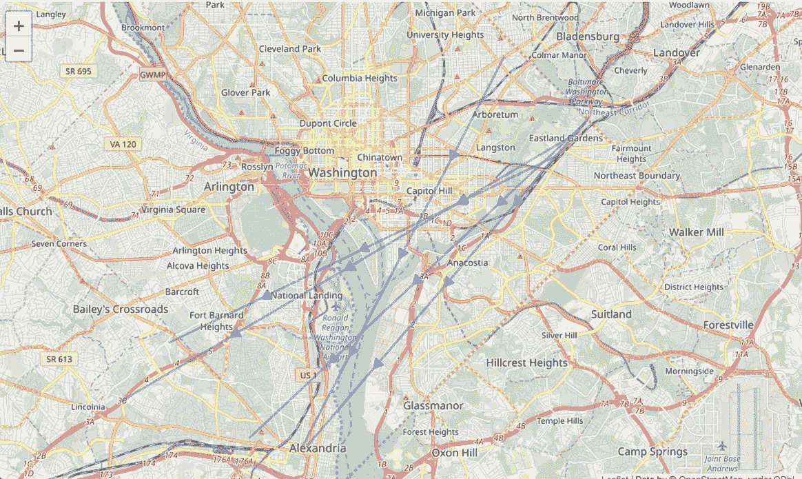******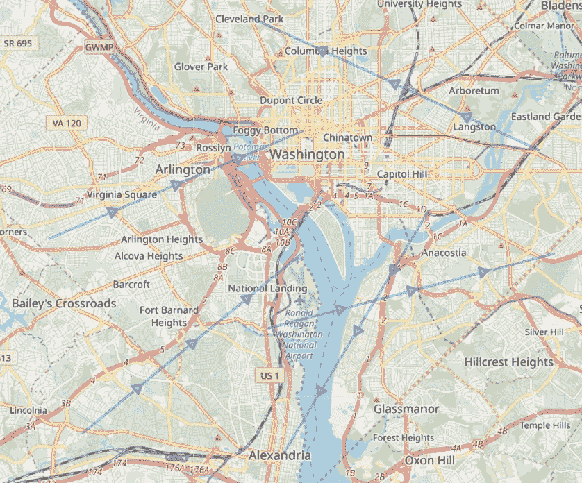***

***工作日(左)和周末(右)出行最多的五种滑板车***

## ***4.特征工程和聚类。***

***Feature 使用上述规则将原始数据集设计成固定/非固定以及工作日/周末组合的子集。***

***下面是静态踏板车的一些统计数据..***

***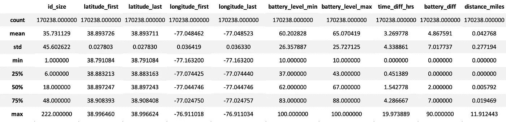***

***平日的固定滑板车***

***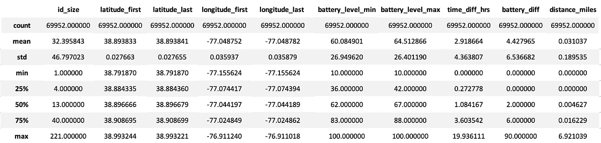***

***周末的固定滑板车***

***正如你从上面所看到的，在某个特定的点上有一系列的滑板车。为了产生洞察力，我们需要了解踏板车的整体运动，而不是关注个人。我们使用 K-Means 和 HDBSCAN 聚类方法来实现这一点。***

# ***结果和结论:***

***我们已经做好了所有的准备工作，现在是公布结果的时候了…***

## ***1.滑板车在华盛顿特区的普及程度如何？***

***当然，踏板车的数量会随着时间的推移而变化，但我在这里的目的只是为了更好地了解 Bird 在该地区部署踏板车的程度。***

***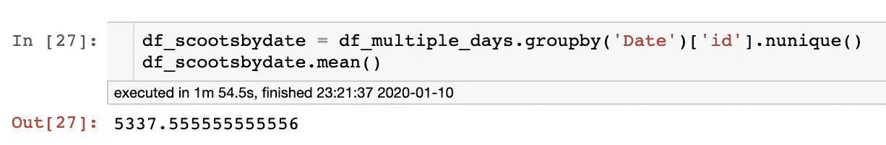***

***所以，平均来说，整个华盛顿大约有 5338 辆小型摩托车，这比我最初预计的要多得多。***

## ***2.平均行程距离是多少？一周中的哪一天对使用有影响吗？***

***回答问题的第一部分..平均行程距离约为 1.88 英里***

***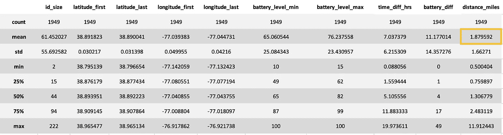***

***出于对验证我的发现的好奇，我开始在网上搜索任何报告或文章，结果发现，我的发现与网上发表的这篇报告非常接近(下面的*链接)****

> ***[“鸟类旅行的平均长度是 1.6 英里”](https://qz.com/1325064/scooters-might-actually-have-good-unit-economics/)***

***考虑到这只是基于 1.5 个月的数据，这是非常接近的。***

*****第二部分** …比较不同日期的使用活动…***

***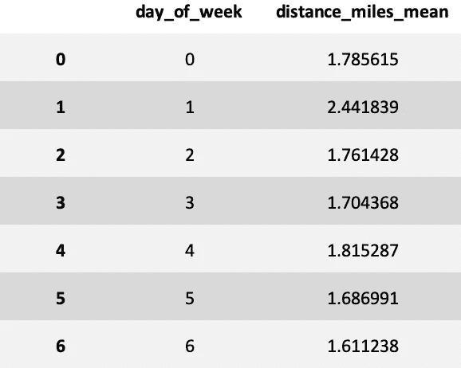***

***其中 0 —周一，1 —周二，以此类推。***

***正如我们从上面看到的，工作日的使用量似乎比周末多一点。***

***老实说，这让我很惊讶，因为我以为滑板车更多地是用于娱乐目的，因此在周末会有更多的活动。***

***但是从我上面的结果来看，工作日的活动似乎比周末多。这表明人们可能更多地使用滑板车作为通勤工具。也许上下班的时候。***

***考虑到华盛顿地区的交通状况，这是有道理的。走出地铁/公交车站后，人们可能会使用滑板车来覆盖他们的“最后一英里”。***

***当我看到伯德发表的关于其在华盛顿使用滑板车的报告时，我能够验证我的理论***

> ***[“……50%的骑行者表示他们使用 Bird 上下班。但是乘客们也在使用公共交通工具——29%的乘客使用 Bird 来连接华盛顿地铁和公交车……”——Bird](https://www.bird.co/blog/birds-positive-impact-on-d-c/)***

## ***3.我能从使用模式中学到什么？***

***有什么比想象更好的理解事物的方法呢？我在 Python 中使用了一个很酷的包，叫做“叶子”,通过它你可以在真实世界的地图上构建自定义的可视化效果。***

***由于存在大量的滑板车和它们的运动，绘制单个滑板车和它们的运动只会使地图拥挤，难以解释。为了实现这一点，我使用了叶子上很酷的*热图和时间*插件来绘制热图。你们可能都很了解热图，颜色越深，浓度越高，在这个例子中是指踏板车。***

***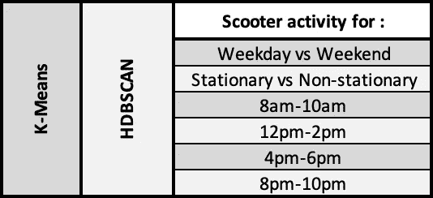***

***可视化策略***

***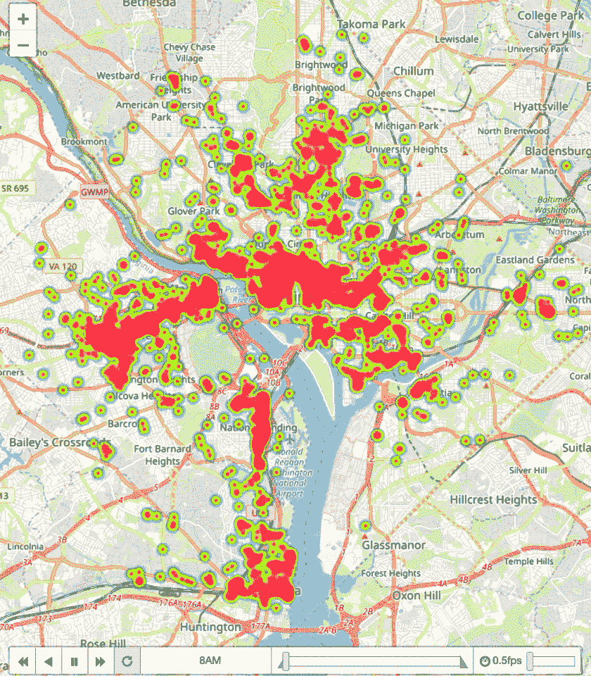******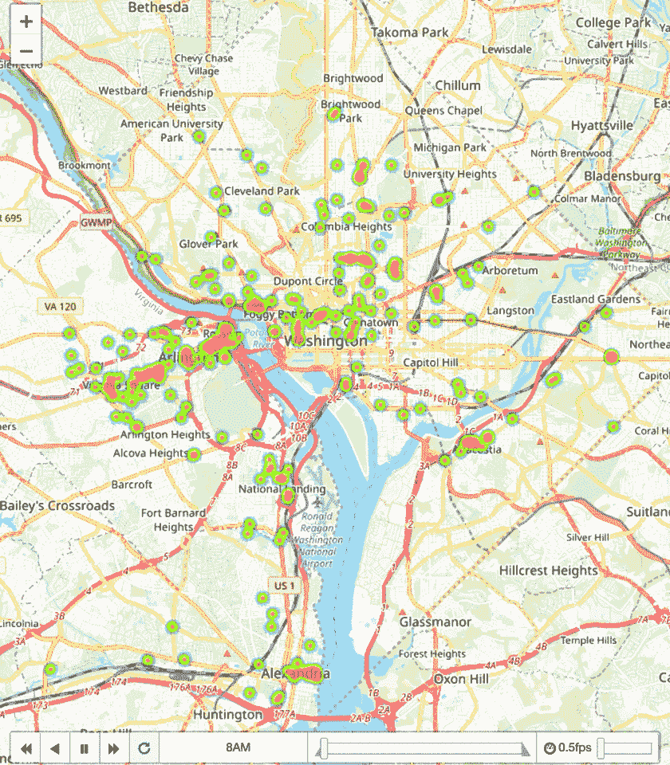***

***平日(左)与周末(右)的固定滑板车活动***

*********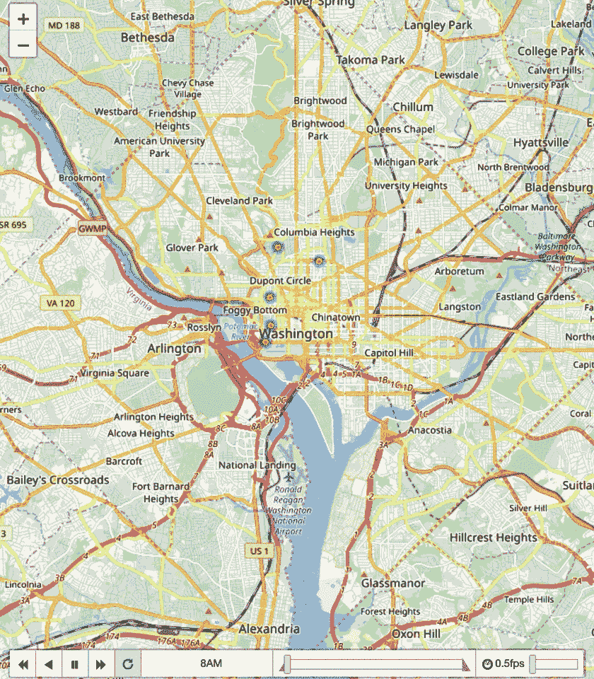***

***工作日(左)与周末(右)的非固定踏板车活动***

************

***非固定(左)，固定(右)周末***

## ***4.我能利用上述问题的发现并产生见解吗？***

***为了做到这一点，我根据地理坐标将踏板车分组，然后通过不同的时间段将这些分组可视化。这将使我对整体动作有一个很好的理解。我使用 K-Means 和 HDBSCAN 聚类算法来实现这一点，然后我比较了不同情况下的结果，如下所示。***

***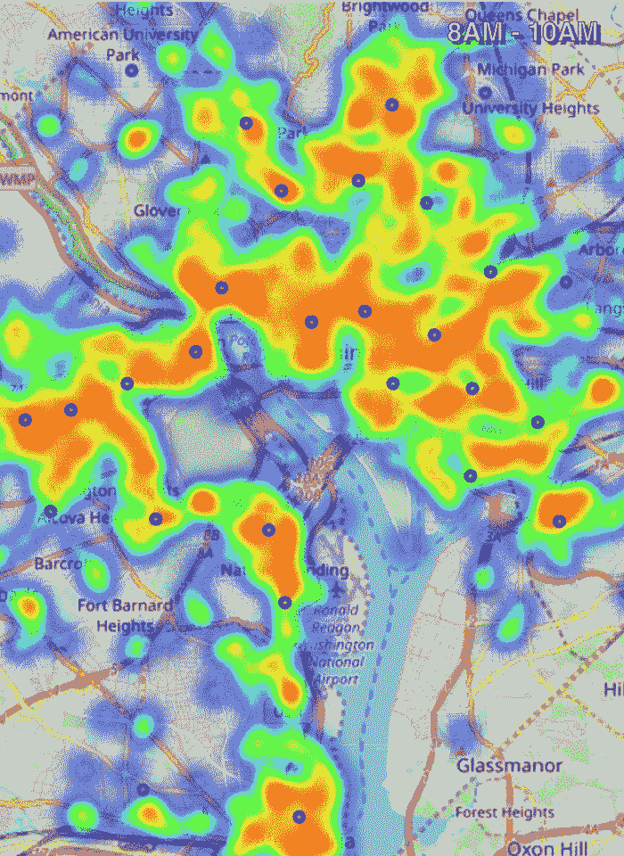******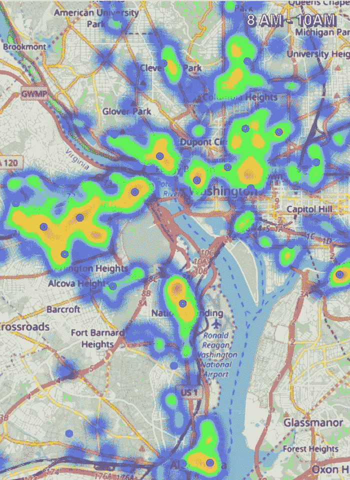***

***平日(左)与周末(右)的固定滑板车活动***

***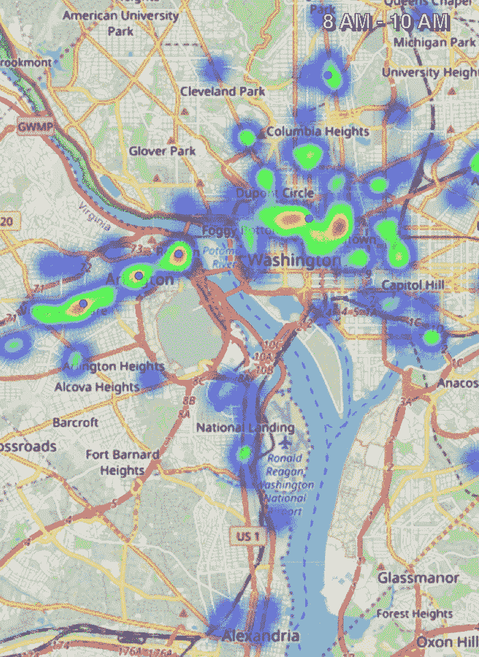******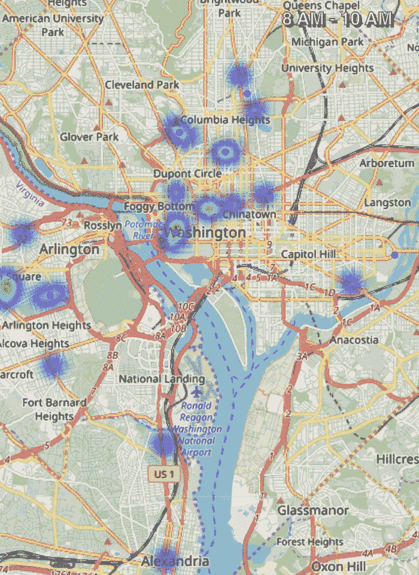***

***工作日(左)与周末(右)的非固定踏板车活动***

# ***结论:***

*   ***上面的图像代表了华盛顿的心跳模式。***
*   ***工作日的上午 8 点至 10 点时段显示出较高的使用率，接近中午时段时有所下降，但在下午 4 点至 6 点时段又有所回升。***
*   ***周末的活动比平日少，但使用模式与平日相似。***
*   ***在任何一天，活动在一天的早些时候集中在市中心区域，在一天的晚些时候扩散到市中心周围的区域。代表用户的通勤行为。***

***来自上面的使用数据和见解可用于找到最常用的路线，并使用该路线，公共交通服务，如公共汽车、地铁等。可以改进。可以对路线进行聚类，然后根据受欢迎程度进行排名。***

***使用密度可以与基于人口统计的人口密度相互参照，并且资源可以集中于在这两个方面排名靠前的人。***

******评论或提问？请发邮件至:himanshu.agarwal20792@gmail.com 或联系***[***LinkedIn***](https://www.linkedin.com/in/walh/)***